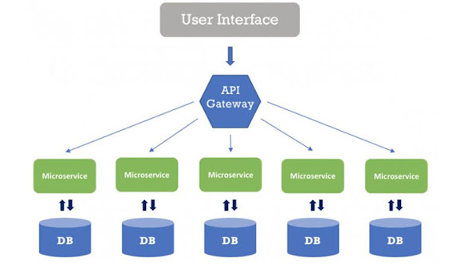
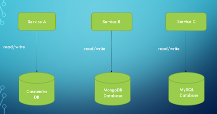
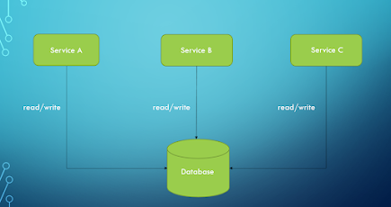
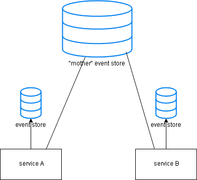
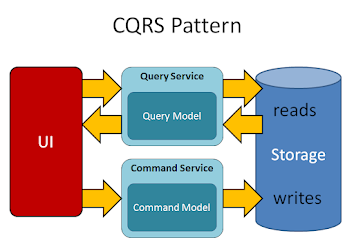
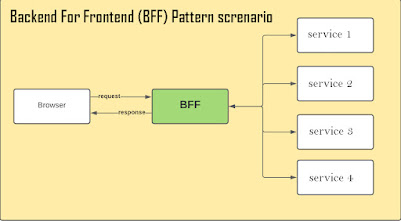
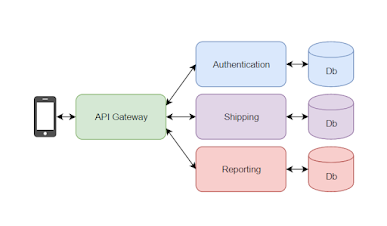
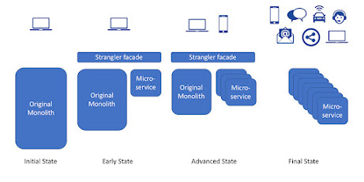
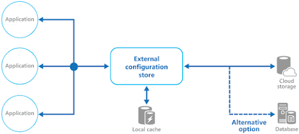
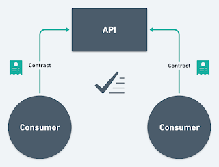

# Table of Contents

<details>
<summary><b>1. Core Java Concepts</b></summary>
<details>
<summary><b>1.1 Object Oriented Prgramming</b></summary>
  
## OOP
- [Object](#object)
- [Class](#class)
- [Polymorphism](#polymorphism)
- [Encapsulation](#encapsulation)
- [Inheritance](#inheritance)
- [Abstraction](#abstraction)
- [Composition](#composition)
- [Association](#association)
- [Aggregation](#aggregation)
</details>
<details>
<summary><b>1.2 Java Keywords</b></summary>
  
## Keywords
- [new](#new)
- [this](#this)
- [super](#super)
- [import](#import)
- [extends](#extends)
  </details>
<details>
<summary><b>1.3 Java Modifiers</b></summary>
  
## Modifiers
- [Access Modifiers](#access-modifiers)
- [Non-Access Modifiers](#non-access-modifiers)
  - [Static](#static)
  - [Final](#final)
  - [transient](#transient)
  - [volatile](#volatile)
  - [synchronized](#synchronized)
  - [abstract](#abstract)
  - [instanceOf](#instanceof)
  </details>
</details>
<details>
<summary><b>2. Java Design Patterns</b></summary>

## Creational Design Patterns
- [Object](#object)
- [Class](#class)
- [Polymorphism](#polymorphism)
- [Encapsulation](#encapsulation)
- [Inheritance](#inheritance)
- [Abstraction](#abstraction)
- [Composition](#composition)
- [Association](#association)
- [Aggregation](#aggregation)

## Structural Design Patterns
- [new](#new)
- [this](#this)
- [super](#super)
- [import](#import)
- [extends](#extends)

## Bahavioural Design Patterns
- [Access Modifiers](#access-modifiers)
- [Non-Access Modifiers](#non-access-modifiers)
  - [Static](#static)
  - [Final](#final)
  - [transient](#transient)
  - [volatile](#volatile)
  - [synchronized](#synchronized)
  - [abstract](#abstract)
  - [instanceOf](#instanceof)
</details>
<details>
<summary><b>3. Java 8 Features</b></summary>

- [Stream](#stream)
  - [Generating streams](#generating-streams)
  - [Filter](#filter)
  - [Sorted](#sorted)
  - [Map](#map)
  - [Match](#match)
  - [Count](#count)
  - [Reduce](#reduce)
- [Optional](#optional)
- [Date](#date)

Java 8 features

Differences between Java 8 Map() Vs flatMap() :

map() | flatMap() | 
--- | --- |  
It processes stream of values. | It processes stream of stream of values. 
It does only mapping. | It performs mapping as well as flattening.
It’s mapper function produces single value for each input value. | It’s mapper function produces multiple values for each input value. 
It is a One-To-One mapping. | It is a One-To-Many mapping. 
Data Transformation : From Stream<T> to Stream<R> | Data Transformation : From Stream<Stream<T> to Stream<R> 
Use this method when the mapper function is producing a single value for each input value. | Use this method when the mapper function is producing multiple values for each input value. 


<details>
<summary><b>3.1 Java 8 Primitive Streams</b></summary>
  
## Primitive Streams

Java 8 introduced specialized streams for handling primitive data types (`int`, `long`, `double`) more efficiently than using the generic `Stream<T>`. These specialized streams are `IntStream`, `LongStream`, and `DoubleStream`. Each provides methods tailored to their respective primitive types.

Below are examples of how to use each of these primitive streams.

### 1. **IntStream Example**

**Creating an `IntStream`, performing operations, and collecting results:**

```java
import java.util.Arrays;
import java.util.OptionalInt;
import java.util.stream.IntStream;

public class IntStreamExample {
    public static void main(String[] args) {
        // Creating IntStream from an array
        int[] numbers = {1, 2, 3, 4, 5};
        IntStream intStream = Arrays.stream(numbers);
        
        // Print elements
        intStream.forEach(System.out::println);

        // Creating IntStream using range
        IntStream rangeStream = IntStream.range(1, 6); // 1 to 5
        System.out.println("Range Stream:");
        rangeStream.forEach(System.out::println);

        // Creating IntStream using rangeClosed
        IntStream rangeClosedStream = IntStream.rangeClosed(1, 5); // 1 to 5 inclusive
        System.out.println("Range Closed Stream:");
        rangeClosedStream.forEach(System.out::println);

        // Performing operations: sum, average, max, min
        IntStream statsStream = Arrays.stream(numbers);
        int sum = statsStream.sum();
        double average = Arrays.stream(numbers).average().orElse(Double.NaN);
        OptionalInt max = Arrays.stream(numbers).max();
        OptionalInt min = Arrays.stream(numbers).min();

        System.out.println("Sum: " + sum);
        System.out.println("Average: " + average);
        System.out.println("Max: " + max.orElseThrow());
        System.out.println("Min: " + min.orElseThrow());
    }
}
```

### 2. **LongStream Example**

**Creating a `LongStream`, performing operations, and collecting results:**

```java
import java.util.Arrays;
import java.util.OptionalLong;
import java.util.stream.LongStream;

public class LongStreamExample {
    public static void main(String[] args) {
        // Creating LongStream from an array
        long[] numbers = {10L, 20L, 30L, 40L, 50L};
        LongStream longStream = Arrays.stream(numbers);
        
        // Print elements
        longStream.forEach(System.out::println);

        // Creating LongStream using range
        LongStream rangeStream = LongStream.range(1L, 6L); // 1 to 5
        System.out.println("Range Stream:");
        rangeStream.forEach(System.out::println);

        // Creating LongStream using rangeClosed
        LongStream rangeClosedStream = LongStream.rangeClosed(1L, 5L); // 1 to 5 inclusive
        System.out.println("Range Closed Stream:");
        rangeClosedStream.forEach(System.out::println);

        // Performing operations: sum, average, max, min
        LongStream statsStream = Arrays.stream(numbers);
        long sum = statsStream.sum();
        double average = Arrays.stream(numbers).average().orElse(Double.NaN);
        OptionalLong max = Arrays.stream(numbers).max();
        OptionalLong min = Arrays.stream(numbers).min();

        System.out.println("Sum: " + sum);
        System.out.println("Average: " + average);
        System.out.println("Max: " + max.orElseThrow());
        System.out.println("Min: " + min.orElseThrow());
    }
}
```

### 3. **DoubleStream Example**

**Creating a `DoubleStream`, performing operations, and collecting results:**

```java
import java.util.Arrays;
import java.util.OptionalDouble;
import java.util.stream.DoubleStream;

public class DoubleStreamExample {
    public static void main(String[] args) {
        // Creating DoubleStream from an array
        double[] numbers = {1.1, 2.2, 3.3, 4.4, 5.5};
        DoubleStream doubleStream = Arrays.stream(numbers);
        
        // Print elements
        doubleStream.forEach(System.out::println);

        // Creating DoubleStream using range
        DoubleStream rangeStream = DoubleStream.iterate(1.0, n -> n + 1.0).limit(5); // 1.0, 2.0, 3.0, 4.0, 5.0
        System.out.println("Range Stream:");
        rangeStream.forEach(System.out::println);

        // Performing operations: sum, average, max, min
        DoubleStream statsStream = Arrays.stream(numbers);
        double sum = statsStream.sum();
        double average = Arrays.stream(numbers).average().orElse(Double.NaN);
        OptionalDouble max = Arrays.stream(numbers).max();
        OptionalDouble min = Arrays.stream(numbers).min();

        System.out.println("Sum: " + sum);
        System.out.println("Average: " + average);
        System.out.println("Max: " + max.orElseThrow());
        System.out.println("Min: " + min.orElseThrow());
    }
}
```

### Explanation of Operations

1. **Creating Streams:**
   - `Arrays.stream(array)` creates a stream from an array.
   - `IntStream.range(start, end)` creates a stream of sequential integers from `start` to `end - 1`.
   - `IntStream.rangeClosed(start, end)` creates a stream of sequential integers from `start` to `end` (inclusive).
   - `DoubleStream.iterate(seed, UnaryOperator)` creates a stream where each element is generated from the previous one.

2. **Common Operations:**
   - `forEach(Consumer)` iterates over each element.
   - `sum()` computes the sum of elements.
   - `average()` computes the average value.
   - `max()` finds the maximum value.
   - `min()` finds the minimum value.
   - `distinct()` removes duplicate elements.
   - `sorted()` sorts the elements.

These examples cover a range of operations for primitive streams, demonstrating how to use `IntStream`, `LongStream`, and `DoubleStream` effectively.

</details>
<details>
<summary><b>3.2 Java 8 Primitive Stream Summary Statistics</b></summary>
  
In Java, you can use the `summaryStatistics()` method to gather summary statistics such as average, count, maximum, minimum, and sum for a stream of primitive types. This method is available on `IntStream`, `LongStream`, and `DoubleStream` and returns instances of `IntSummaryStatistics`, `LongSummaryStatistics`, and `DoubleSummaryStatistics`, respectively. Below are examples demonstrating how to use these classes and their methods.

### 1. **IntSummaryStatistics Example**

**Description:**
Gather summary statistics for a stream of integers.

**Example:**

```java
import java.util.IntSummaryStatistics;
import java.util.stream.IntStream;

public class IntSummaryStatisticsExample {
    public static void main(String[] args) {
        IntStream numbers = IntStream.of(1, 2, 3, 4, 5, 6, 7, 8, 9, 10);

        IntSummaryStatistics stats = numbers.summaryStatistics();

        System.out.println("Count: " + stats.getCount());  // Number of elements
        System.out.println("Sum: " + stats.getSum());      // Sum of elements
        System.out.println("Average: " + stats.getAverage()); // Average of elements
        System.out.println("Min: " + stats.getMin());      // Minimum element
        System.out.println("Max: " + stats.getMax());      // Maximum element
    }
}
```

**Output:**
```
Count: 10
Sum: 55
Average: 5.5
Min: 1
Max: 10
```

### 2. **LongSummaryStatistics Example**

**Description:**
Gather summary statistics for a stream of long values.

**Example:**

```java
import java.util.LongSummaryStatistics;
import java.util.stream.LongStream;

public class LongSummaryStatisticsExample {
    public static void main(String[] args) {
        LongStream numbers = LongStream.of(100L, 200L, 300L, 400L, 500L);

        LongSummaryStatistics stats = numbers.summaryStatistics();

        System.out.println("Count: " + stats.getCount());  // Number of elements
        System.out.println("Sum: " + stats.getSum());      // Sum of elements
        System.out.println("Average: " + stats.getAverage()); // Average of elements
        System.out.println("Min: " + stats.getMin());      // Minimum element
        System.out.println("Max: " + stats.getMax());      // Maximum element
    }
}
```

**Output:**
```
Count: 5
Sum: 1500
Average: 300.0
Min: 100
Max: 500
```

### 3. **DoubleSummaryStatistics Example**

**Description:**
Gather summary statistics for a stream of double values.

**Example:**

```java
import java.util.DoubleSummaryStatistics;
import java.util.stream.DoubleStream;

public class DoubleSummaryStatisticsExample {
    public static void main(String[] args) {
        DoubleStream numbers = DoubleStream.of(1.1, 2.2, 3.3, 4.4, 5.5);

        DoubleSummaryStatistics stats = numbers.summaryStatistics();

        System.out.println("Count: " + stats.getCount());  // Number of elements
        System.out.println("Sum: " + stats.getSum());      // Sum of elements
        System.out.println("Average: " + stats.getAverage()); // Average of elements
        System.out.println("Min: " + stats.getMin());      // Minimum element
        System.out.println("Max: " + stats.getMax());      // Maximum element
    }
}
```

**Output:**
```
Count: 5
Sum: 16.5
Average: 3.3
Min: 1.1
Max: 5.5
```

### Summary

- **`IntSummaryStatistics`**: Used with `IntStream` to get statistics like count, sum, average, min, and max for integer values.
- **`LongSummaryStatistics`**: Used with `LongStream` to get similar statistics for long values.
- **`DoubleSummaryStatistics`**: Used with `DoubleStream` to get similar statistics for double values.

These summary statistics classes provide a convenient way to gather statistical data from streams of primitive types.

</details>
<details>
<summary><b>3.3 Java 8 Functional Interfaces</b></summary>

<details>
<summary><b>3.3.1 Intruction</b></summary>
	
# Java 8 Functional Interfaces – When & How To Use Them?

Functional interfaces, lambda expressions and Stream API – these three features of Java 8 has turned Java programming into new style of programming called functional-style programming. Java is still an object-oriented programming language, but from Java 8, with the introduction of new features, most of the programming is done keeping functions in mind rather than objects. 

In this example, we will see Java 8 functional interfaces, `@FunctionalInterface` annotation, `java.util.function` package and how to use new Java 8 functional interfaces to compose lambda expressions with some simple examples.

## Using Functional Interfaces:
A functional interface specifies exactly one abstract method.
Functional interfaces are useful because the signature of the abstract method can describe the signature of a lambda expression. 
The signature of the abstract method of a functional interface is called a function descriptor. 
So in order to use different lambda expressions, you need a set of functional interfaces that can describe common function descriptors. 
There are several functional interfaces already available in the Java API such as Comparable, Runnable, and Callable, ActionaListner.

The Java library designers for Java 8 have helped you by introducing several new functional interfaces inside the `java.util.function` package. 
We describe the interfaces Predicate, Consumer, and Function.

## Java 8 Functional Interfaces

### 1) Definition

Functional interfaces are the interfaces which has exactly one abstract method. They may have any number of default methods but must have only one abstract method. Functional interfaces provide only one functionality to implement.

There were functional interfaces exist before Java 8. It is not like that they are the whole new concept introduced only in Java 8. Runnable, ActionListener, Callable and Comaprator are some old functional interfaces which exist even before Java 8.

The new set of functional interfaces are introduced in Java 8 to make programmer’s job easy while writing lambda expressions. Your lambda expression must implement any one of these functional interfaces. These new functional interfaces are organised under java.util.function package.

### 2) @FunctionalInterface Annotation

`@FunctionalInterface` annotation is introduced in Java 8 to represent functional interfaces. Although, it is not compulsory to write functional interface using this annotation. But, if you are using @FunctionalInterface annotation then your interface should contain only one abstract method. If you try to write more than one abstract method, compiler will show the error.

### What about @FunctionalInterface?

If you explore the new Java API, you’ll notice that functional interfaces are annotated with `@FunctionalInterface` This annotation is used to indicate that the interface is intended to be a functional interface. The compiler will return a meaningful error if you define an interface using the `@FunctionalInterface` annotation and it isn’t a functional interface. 

For example, an error message could be “Multiple non-overriding abstract methods found in interface Foo” to indicate that more than one abstract method is available. 

Note that the `@FunctionalInterface` annotation isn’t mandatory, but it’s good practice to use it when an interface is designed for that purpose.

You can think of it like the `@Override` notation to indicate that a method is overridden.

### 1. What is a Functional Interface?
### 1.1. Only one abstract method is allowed
Functional interfaces are new additions in Java 8. As a rule, a functional interface can contain exactly one abstract method. These functional interfaces are also called Single Abstract Method interfaces (SAM Interfaces).

Apart from one abstract method, a functional interface can also have the following methods that do not count for defining it as a functional interface.

- [Default methods](#java-default-methods)
- [Static methods](#java-static-methods)
  
Public methods inherited from the Object class
### 1.2. Implemented by Lambda Expressions
In Java, lambda expressions can be used to represent an instance of a functional interface. For example, Comparator interface is a functional interface.

@FunctionalInterface
public interface Comparator<T> {
	int compare(T o1, T o2);
	boolean equals(Object obj);

	//and multiple default methods...
}

Comparator interface has only two abstract methods compare() and equals(). But equals() has been inherited from the Object class, so it is not counted. Other than these two methods, all other methods are default methods. So Comparator is qualified to be declared as a functional interface.

Java program to implement Comparator using a lambda expression.
```java
//Compare by Id
Comparator<Employee> compareById = Comparator.comparing(e -> e.getId());

Comparator<Employee> compareByFirstName = Comparator.comparing(e -> e.getFirstName());
```
### 2. @FunctionalInterface Annotation
Java 8 introduced the annotation `@FunctionalInterface` to mark an interface as a functional interface. The primary use of this annotation is for compiler-level errors when the interface violates the contracts of precisely one abstract method.

Note that using the annotation @FunctionalInterface is optional.

If the interface has one abstract method and does not have @FunctionalInterface annotation, the interface is still a functional interface, and it can be the target type for lambda expressions.

The presence of the annotation protects us from inadvertently changing a functional interface into a non-functional interface, as the compiler will catch it.

Let’s build our first functional interface. Note that methods in an interface are, by default, abstract.
```java
@FunctionalInterface
public interface MyFirstFunctionalInterface 
{
    public void firstWork();
}
```
Let’s try to add another abstract method:
```java
@FunctionalInterface
public interface MyFirstFunctionalInterface 
{
    public void firstWork();
    public void doSomeMoreWork();   //error
}
```
The above code will result in a compiler error:

Unexpected `@FunctionalInterface` annotation
`@FunctionalInterface` ^ MyFirstFunctionalInterface is not a functional interface
multiple non-overriding abstract methods found in interface MyFirstFunctionalInterface
Functional-Interface-Error
Read More : Generic Functional Interfaces

### 3. Functional Interfaces in JDK
The following is a list of Java’s most commonly used functional interfaces.

- Runnable: contains only the run() method.
- Comparable: contains only the compareTo() method.
- ActionListener: contains only the actionPerformed() method.
- Callable: contains only the call() method.
- Predicate: a boolean-valued function that takes an argument and returns true or false.
- BiPredicate: a predicate with two arguments.
- Consumer: an operation that takes an argument, operates on it, and returns no result.
- BiConsumer: a consumer with two arguments.
- Supplier: a supplier that returns a value.
- Function<T, R>:  takes an argument of type T and returns a result of type R.
- BiFunction<T, U, R>: takes two arguments of types T and U and returns a result of type R.
  
### 4. Demo
Let’s see a quick example of creating and using functional interfaces in Java.

We are using a functional interface Function to create the formula for mathematical squares.
```java
Function<Integer, Integer> square = x -> x * x;
```
The Function interface has one abstract method apply() that we have implemented above. we can execute the above method as follows:
```java
System.out.println( square.apply(5) );  //Prints 25
```

We also saw the JDK provided existing functional interfaces, and finally how to create an use a functional interface.
</details>

#### Java Default Methods
<details>
<summary><b>3.3.2 Java 8 Functional Interfaces - Default Methods</b></summary>

 ## Java Default Methods
 
Let’s move on the discussion and talk about another related feature i.e. default methods. Well, this is truly revolutionary for java developers. Till java 7, we have learned a lot of things about interfaces and all those things have been in our mind whenever we wrote code or designed the applications. Some of these concepts are going to change drastically from java 8, after introduction of default methods.

I will discuss following points in this post:

- What are default methods in java 8?
- Why default methods were needed in java 8?
- How conflicts are resolved while calling default methods?

### What are default methods in java 8?

Default methods enable you to add new functionality to the interfaces of your libraries and ensure binary compatibility with code written for older versions of those interfaces.

As name implies, default methods in java 8 are simply default. If you do not override them, they are the methods which will be invoked by caller classes. They are defined in interfaces.

Let’s understand with an example:
```java
public interface Moveable {
    default void move(){
        System.out.println("I am moving");
    }
}
```
Moveable interface defines a method move(); and provided a default implementation as well. If any class implements this interface then it need not to implement it’s own version of move() method. It can directly call instance.move();
```java
public class Animal implements Moveable{
    public static void main(String[] args){
        Animal tiger = new Animal();
        tiger.move();
    }
}
```
Output: I am moving

And if class willingly wants to customize the behavior then it can provide it’s own custom implementation and override the method. Now it’s own custom method will be called.
```java
public class Animal implements Moveable{
    
    public void move(){
        System.out.println("I am running");
    }
    
    public static void main(String[] args){
        Animal tiger = new Animal();
        tiger.move();
    }
}
```
Output: I am running
This is not all done here. Best part comes as following benefits:

**Static default methods**: You can define static default methods in interface which will be available to all instances of class which implement this interface. This makes it easier for you to organize helper methods in your libraries; you can keep static methods specific to an interface in the same interface rather than in a separate class. This enables you to define methods out of your class and yet share with all child classes.

They provide you an highly desired capability of adding a capability to number of classes without even touching their code. Simply add a default method in interface which they all implement.

### Why default methods were needed in java 8?

This is a good candidate for your next interview question. Simplest answer is to enable the functionality of lambda expression in java. Lambda expression are essentially of type of functional interface. To support lambda expressions seamlessly, all core classes have to be modified. But these core classes like java.util.List are implemented not only in JDK classes, but also in thousands of client code as well. Any incompatible change in core classes will back fire for sure and will not be accepted at all.

Default methods break this deadlock and allow adding support for functional interface in core classes. Let’s see an example. Below is a method which has been added to java.lang.Iterable.
```java
default void forEach(Consumer<? super T> action) {
	Objects.requireNonNull(action);
	for (T t : this) {
		action.accept(t);
	}
}
```
Before java 8, if you had to iterate on a java collection then your would get an iterator instance and call it’s next method until hasNext() returns false. This is common code and have been used thousands of time in day to day programming by us. Syntax is also always same. So can we make it compact so that it takes only single line of code and still do the job for us as before. Above function does that.

Now to iterate and perform some simple operation on every item in list, all you need to do is:
```java
import java.util.ArrayList;
import java.util.List;

public class Animal implements Moveable{
    public static void main(String[] args){
        List<Animal> list = new ArrayList();
        list.add(new Animal());
        list.add(new Animal());
        list.add(new Animal());
        
        //Iterator code reduced to one line
        list.forEach((Moveable p) -> p.move());
    }
}
```
So here, an additional method has been added to List without breaking any custom implementations of it. It has been very desired feature in java since long. Now it’s with us.

### How conflicts are resolved while calling default methods?

So far so good. We have got all basics well. Now move to complicated things. In java, a class can implement N number of interface. Additionally, a interface can also extend another interface as well. An if any default method is declared in two such interfaces which are implemented by single class. then obviously class will get confused which method to call.

Rules for this conflict resolution are as follows:

1) Most preferred are the overridden methods in classes. They will be matched and called if found before matching anything.

2) The method with the same signature in the “most specific default-providing interface” is selected. This means if class Animal implements two interfaces i.e. Moveable and Walkable such that Walkable extends Moveable. Then Walkable is here most specific interface and default method will be chosen from here if method signature is matched.

3) If Moveable and Walkable are independent interfaces then a serious conflict condition happen, and compiler will complain then it is unable to decide. The you have to help compiler by providing extra info that from which interface the default method should be called. e.g.

```java
	Walkable.super.move();
	//or 
	Moveable.super.move();
```
</details>

#### Java Static Methods
<details>
<summary><b>3.3.3 Java 8 Functional Interfaces - Java Static Methods</b></summary>
	
## Java Static – Variable, Method, Block, Class and Import Statement

Static keyword in java can be applied on variables, methods, blocks, import and inner classes. In this tutorial, we will learn the effect of using static keyword in these places with examples.

Table of Contents

- [1. Static Variable](#1-static-variable)
- [2. Static Method](#2-static-method)
- [3. Static Import Statement](#3-static-import-statement)
- [4. Static Block](#4-static-block)
- [5. Static Class](#5-static-class)
- [6. Summary](#6-summary)

### 1. Static Variable
To declare a variable static, use static keyword in variable declaration. static variable syntax is:

ACCESS_MODIFER static DATA_TYPE VARNAME;
For example, a public static variable of Integer type is declared in this way.

public static Integer staticVar;
The most important thing about static variables is that they belong to class level. What it means is that there can be only one copy of variable in runtime.

When you define a static variable in class definition, each instance of class will have access to that single copy. Separate instances of class will not have their own local copy, like they have for non-static variables.

```java
public class JavaStaticExample 
{
  public static void main(String[] args) 
  {
    DataObject objOne = new DataObject();
    objOne.staticVar = 10;
    objOne.nonStaticVar = 20;
     
    DataObject objTwo = new DataObject();
     
    System.out.println(objTwo.staticVar);   //10
    System.out.println(objTwo.nonStaticVar);  //null
     
    DataObject.staticVar = 30;  //Direct Access
     
    System.out.println(objOne.staticVar);   //30
    System.out.println(objTwo.staticVar);   //30
  }
}
 
class DataObject {
  public static Integer staticVar;
  public Integer nonStaticVar;
}
``` 
> Output:
 
10
null
30
30
Notice how we changed the value to 30, and both objects now see the updated value which is 30.

Another thing you should have noticed that how we are able to access static variable with its classname i.e. DataObject.staticVar. We don’t need to create any instance to access static variables. It clearly shows that static variables belong to class scope.

### 2. Static Method
To declare a static method, use static keyword in method declaration. Static method syntax is:

`ACCESS_MODIFER static RETURN_TYPE METHOD_NAME;`
For example, a public static variable of Integer type is declared in this way.
```java
public static Integer staticVar;
 
public static Integer getStaticVar(){
 
  return staticVar;
}
```
Few things to remember.

You can access only static variables inside static methods. If you try to access any non-static variable, the compiler error will be generated with message “Cannot make a static reference to the non-static field nonStaticVar“.

Static methods can be accessed via it’s class reference, and there is no need to create an instance of class. Though you can access using instance reference as well but it will have not any difference in comparison to access via class reference.
Static methods also belong to class level scope.

```java
public class JavaStaticExample 
{
  public static void main(String[] args) 
  {
    DataObject.staticVar = 30;  //Direct Access
     
    Integer value1 = DataObject.getStaticVar(); //access with class reference
 
    DataObject objOne = new DataObject();
    Integer value2 = objOne.getStaticVar();   //access with instance reference
     
    System.out.println(value1);
    System.out.println(value2);
  }
}
 
class DataObject 
{
  public Integer nonStaticVar;
  public static Integer staticVar;  //static variable
   
  public static Integer getStaticVar(){
    return staticVar;
  }
}
``` 
> Output:
 
30
30

### 3. Static Import Statement
The normal import declaration imports classes from packages, so that they can be used without package reference. Similarly the static import declaration imports static members from classes and allowing them to be used without class reference.

A static import statement also comes in two flavors: single-static import and static-import-on-demand. A single-static import declaration imports one static member from a type. A static-import-on-demand declaration imports all static members of a type.

```java

//Single-static-import declaration:
  
import static <<package name>>.<<type name>>.<<static member name>>;
  
//Static-import-on-demand declaration:
  
import static <<package name>>.<<type name>>.*;

For example, System.out is

//Static import statement
import static java.lang.System.out;

public class JavaStaticExample 
{
  public static void main(String[] args) 
  {
    DataObject.staticVar = 30;  
 
    out.println(DataObject.staticVar);  //Static import statement example
  }
}
class DataObject 
{
  public static Integer staticVar;  //static variable
}
``` 
> Output:
 
30
Read More: Static Import Statements in Java


### 4. Static Block
Static blocks are portion of class initialization code, which are wrapped with static keyword.
```java
public class Main {
      
    //static initializer
    static {
        System.out.println("Inside static initializer");
    }   
}
```
Static blocks are executed when the class is loaded in the memory. A class can have multiple static blocks and these will be executed in the same sequence in which they appear in class definition.
```java
import static java.lang.System.out;
 
class DataObject 
{
  public Integer nonStaticVar;
  public static Integer staticVar;  //static variable
   
  //It will be executed first
  static {
    staticVar = 40;
    //nonStaticVar = 20;  //Not possible to access non-static members
  }
   
  //It will be executed second
  static {
    out.println(staticVar);
  }
}
``` 
> Output:
 
40

### 5. Static Class
In Java, you can have a static class as inner class. Just like other static members, nested classed belong with class scope so the inner static class can be accessed without having an object of outer class.
```java
public class JavaStaticExample 
{
  public static void main(String[] args) 
  {
    //Static inner class example
    System.out.println( DataObject.StaticInnerClas.innerStaticVar );
  }
}
class DataObject 
{
  public Integer nonStaticVar;
  public static Integer staticVar;  //static variable
   
  static class StaticInnerClas {
    Integer innerNonStaticVar = 60; 
    static Integer innerStaticVar = 70;   //static variable inside inner class
  }
}
```
Please note that an static inner class cannot access the non-static members of outer class. It can access only static members from outer class.
```java
public class JavaStaticExample 
{
  public static void main(String[] args) 
  {
    //Static inner class example
    DataObject.StaticInnerClas.accessOuterClass();
  }
}
class DataObject 
{
  public Integer nonStaticVar;
  public static Integer staticVar;  //static variable
     
  static {
    staticVar = 40;
    //nonStaticVar = 20;  //Not possible to access non-static members
  }
 
  public static Integer getStaticVar(){
    return staticVar;
  }
   
  static class StaticInnerClas 
  { 
    public static void accessOuterClass()
    {
      System.out.println(DataObject.staticVar);   //static variable of outer class
      System.out.println(DataObject.getStaticVar());  //static method of outer class
    }
  }
}
``` 
> Output:
 
40

### 6. Summary
Let’s summarize everything about static keyword usage in Java.

Static members belong to class. No need to create class instance to access static members.

Static members (variables and methods) can be accessed inside static methods and static blocks only.

Non-static members cannot be accessed inside static methods, blocks and inner classes.

A class can have multiple static blocks and they will be executed in order they appear in class definition.

A class can be static only if its declared as inner class inside outer class.

Static imports can be used to import all static members from a class. These members can be referred without any class reference.

</details>
<details>
<summary><b>3.3.4 java.util.function package</b></summary>
	
## java.util.function package

All Java 8 functional interfaces are organised in `java.util.function` package. Each functional interface in this package represents an operation that can be performed by the lambda expression.

Below table shows the list of all Java 8 functional interfaces along with their abstract method, which operation they represent and when to use them?

### Predicate
The `java.util.function.Predicate<T>` interface defines an abstract method named test that accepts an object of generic type T and returns a boolean. 

It’s exactly the same one that you created earlier, but is available out of the box! You might want to use this interface when you need to represent a boolean expression that uses an object of type T. 

For example, you can define a lambda that accepts String objects, as shown in the following listing.

### Working with a Predicate
```java
@FunctionalInterface
public interface Predicate<T>{
	boolean test(T t);
}
public static <T> List<T> filter(List<T> list, Predicate<T> p) {
	List<T> results = new ArrayList<>();
	for(T s: list){
		if(p.test(s)){
			results.add(s);
		}
	}
	return results;
}

Predicate<String> nonEmptyStringPredicate = (String s) -> !s.isEmpty();

List<String> nonEmpty = filter(listOfStrings, nonEmptyStringPredicate);
```
If you look up the Javadoc specification of the Predicate interface, you may notice additional methods such as and and or.

### Consumer

The `java.util.function.Consumer<T>` interface defines an abstract method named accept that takes an object of generic type T and returns no result (void). 
You might use this interface when you need to access an object of type T and perform some operations on it. 

For example, you can use it to create a method forEach, which takes a list of Integers and applies an operation on each element of that list. 
In the following listing you use this forEach method combined with a lambda to print all the elements of the list.

### Working with a Consumer
```java
@FunctionalInterface
public interface Consumer<T>{
	void accept(T t);
}
public static <T> void forEach(List<T> list, Consumer<T> c) {
	for(T i: list){
		c.accept(i);
	}
}
forEach(Arrays.asList(1,2,3,4,5), (Integer i) -> System.out.println(i));
```
### Function
The java.util.function.Function<T, R> interface defines an abstract method named apply that takes an object of generic type T as input and returns an object of generic type R. 

You might use this interface when you need to define a lambda that maps information from an input object to an output (for example, extracting the weight of an apple or mapping a string to its length). 

In the listing that follows we show how you can use it to create a method map to transform a list of Strings into a list of Integers containing the length of each String.

### Working with a Function
```java
@FunctionalInterface
public interface Function<T, R>{
	R apply(T t);
}
public static <T, R> List<R> map(List<T> list, Function<T, R> f) {
	List<R> results = new ArrayList<>();
	for(T s: list){
		results.add(f.apply(s));
	}
	return results;
}

List<Integer> l = map(Arrays.asList("lambdas","in","action"), (String s) -> s.length());
```
</details>
<details>
<summary><b>3.3.5 Functional Interfaces And Their Primitive Specializations</b></summary>

### Functional Interfaces Supporting Primitive Type

Java 8 has also introduced functional interfaces which support primitive types. 

For example IntPredicate, DoublePredicate, LongConsumer etc… (See above table).

If an input or output is a primitive type then using these functional interfaces will enhance the performance of your code. 

For example, if input to a Predicate is primitive type int then using intPredicate instead of Predicate will remove unnecessary boxing of input.


### 5) Functional Interfaces And Their Primitive Specializations

In Java, functional interfaces such as `Predicate`, `Consumer`, `Supplier`, and their primitive counterparts are key components in functional programming. Here’s a detailed overview of each interface along with coding examples.


| Functional interface  | Function descriptor | Primitive specializations |
|-----------------------|---------------------|--------------------------------------------------------| 
| Predicate<T> 	| T -> boolean 	| <p>IntPredicate, </p><p>LongPredicate,</p><p> DoublePredicate</p> | 
| Consumer<T> | T -> void | <p>IntConsumer, </p><p>LongConsumer,</p><p> DoubleConsumer</p>| 
| Function<T, R> | T -> R | <p>IntFunction<R>,</p><p> IntToDoubleFunction, </p><p>IntToLongFunction,</p><p>LongFunction<R>,</p><p>  LongToDoubleFunction, </p><p> LongToIntFunction,</p><p>DoubleFunction<R>, </p><p> ToIntFunction<T>, </p><p> ToDoubleFunction<T>,</p><p>ToLongFunction<T> </p>|
| Supplier<T>| () -> T | <p>BooleanSupplier,</p><p>IntSupplier,</p><p> LongSupplier,</p><p>DoubleSupplier</p> | 
| UnaryOperator<T>| T -> T | <p>IntUnaryOperator,</p><p>LongUnaryOperator,</p><p> DoubleUnaryOperator</p> | 
| BinaryOperator<T>| (T, T) -> T | <p>IntBinaryOperator,</p><p>LongBinaryOperator,</p><p> DoubleBinaryOperator</p>|
| BiPredicate<L, R> | (L, R) -> boolean | |
| BiConsumer<T, U> | (T, U) -> void | <p>ObjIntConsumer<T>,</p><p>ObjLongConsumer<T>,</p><p> ObjDoubleConsumer<T> </p>| 
| BiFunction<T, U, R> 	| (T, U) -> R | <p>ToIntBiFunction<T, U>,</p><p>ToLongBiFunction<T, U>, </p><p>ToDoubleBiFunction<T, U> </p><p>IntToLongFunction</p><p>IntToDoubleFunction</p><p>LongToDoubleFunction</p><p>LongTolIntFunction</p><p>DoubleToIntFunction</p><p>DoubleToLongFunction</p>|
| :- | :- | :- | :- | :- |
|Supplier <p>T get()</p>|Represents an operation that returns a result of type T. Use this interface when you want to create a new object.|<p>BooleanSupplier</p><p>IntSupplier</p><p>LongSupplier</p><p>DoubleSupplier</p>|
|BiPredicate <p>boolean test(T t, U u)</p>|Represents a predicate with two arguments. Use this interface when you want to evaluate an expression with two arguments.||
|BiConsumer <p>void accept(T t, U u)</p>|Represents an operation that accepts two arguments and does some operation on them. Use this interface when you want to perform operations on two objects.||
|BiFunction <p>R apply(T t, U u)</p>|Represents an operation with two arguments that produces a result. Use this interface when you want to extract a result from two existing objects.|<p>ToIntBiFunction</p><p>ToLongBiFunction</p><p>ToDoubleBiFunction</p>|
|UnaryOperator (extends Function)|Same as Function but the argument and result are of the same type.|<p>IntUnaryOperator<p><p>LongUnaryOperator</p><p>DoubleUnaryOperator<p>|
|BinaryOperator (extends BiFunction) |Same as BiFunction but the argument and result are of the same type.|<p>IntBinaryOperator</p><p>LongBinaryOperator</p><p> DoubleBinaryOperator</p>|

Functional interfaces in Java are interfaces that have exactly one abstract method. These interfaces are commonly used in lambda expressions and method references. Each functional interface has a corresponding functional descriptor, which describes the type of the abstract method in the interface. Additionally, some functional interfaces have primitive specializations, which are interfaces that work with primitive data types instead of object types.

Examples:

Functional interface  | Function descriptor | Primitive specializations |
-----------------------|---------------------|--------------------------------------------------------| 
Predicate| T -> boolean |<p>IntPredicate</p><p>LongPredicate</p><p>DoublePredicate</p>|
Consumer|T -> void| <p>IntConsumer</p><p>LongConsumer</p><p>DoubleConsumer</p>|
Function<T, R>|T -> R|<p>IntFunction</p><p>IntToDoubleFunction</p><p>IntToLongFunction</p><p>LongFunction</p> <p>LongToDoubleFunction</p><p>LongToIntFunction</p><p>DoubleFunction</p><p>ToIntFunction</p><p>ToDoubleFunction</p><p>ToLongFunction</p>|
Supplier| () -> T|<p>BooleanSupplier</p><p>IntSupplier</p><p>LongSupplier</p><p>DoubleSupplier</p>|
UnaryOperator| T -> T|<p>IntUnaryOperator</p><p>LongUnaryOperator</p><p>DoubleUnaryOperator</p>|
BinaryOperator| (T, T) -> T|<p>IntBinaryOperator</p><p>LongBinaryOperator</p><p>DoubleBinaryOperator</p>|
BiPredicate| (L, R) -> boolean||
BiConsumer| (T, U) -> void||
BiFunction<T, U, R>| (T, U) -> R|<p>ToIntBiFunction</p><p>ToLongBiFunction</p><p>ToDoubleBiFunction</p>|
Certainly! Here's a detailed breakdown of various functional interfaces in Java and their corresponding primitive specializations, including code examples for each:

### **1. Predicate Interface and Its Primitive Specializations**

- **`Predicate<T>` Interface**
  - **Description:** A `Predicate<T>` is a functional interface that represents a boolean-valued function of one argument. It is commonly used for filtering or testing conditions. A functional interface that tests if a condition holds true for an input type `T`.
  - **Signature:** `T -> boolean`

  **Example: Check if a number is even**

  ```java
  import java.util.function.Predicate;

  public class PredicateExample {
      public static void main(String[] args) {
          Predicate<Integer> isEven = n -> n % 2 == 0;
          System.out.println(isEven.test(4)); // true
          System.out.println(isEven.test(5)); // false
      }
  }
  ```
  ```java
    import java.util.function.Predicate;

    public class PredicateExample {
        public static void main(String[] args) {
            Predicate<String> isNonEmpty = s -> !s.isEmpty();
            System.out.println(isNonEmpty.test("Hello")); // true
            System.out.println(isNonEmpty.test(""));      // false
        }
    }
  ```

- **Primitive Specializations**

  - **`IntPredicate`**
    - **Description:** A specialized version of `Predicate` for `int` values. An `IntPredicate` is the primitive type variant for `Predicate<Integer>`.
    **Example:**

  ```java
    import java.util.function.IntPredicate;

    public class IntPredicateExample {
        public static void main(String[] args) {
            IntPredicate isPositive = n -> n > 0;
            System.out.println(isPositive.test(10)); // true
            System.out.println(isPositive.test(-1)); // false
        }
    }
  ```

  ```java
      import java.util.function.IntPredicate;

      public class IntPredicateExample {
          public static void main(String[] args) {
              IntPredicate isEven = n -> n % 2 == 0;
              System.out.println(isEven.test(4)); // true
              System.out.println(isEven.test(5)); // false
          }
      }
  ```

  - **`LongPredicate`**
    - **Description:** A specialized version of `Predicate` for `long` values.

    **Example:**

    ```java
    import java.util.function.LongPredicate;

    public class LongPredicateExample {
        public static void main(String[] args) {
            LongPredicate isOdd = n -> n % 2 != 0;
            System.out.println(isOdd.test(7L)); // true
            System.out.println(isOdd.test(8L)); // false
        }
    }
    ```

  - **`DoublePredicate`**
    - **Description:** A specialized version of `Predicate` for `double` values.

    **Example:**

    ```java
    import java.util.function.DoublePredicate;

    public class DoublePredicateExample {
        public static void main(String[] args) {
            DoublePredicate isGreaterThanFive = d -> d > 5.0;
            System.out.println(isGreaterThanFive.test(6.0)); // true
            System.out.println(isGreaterThanFive.test(4.0)); // false
        }
    }
    ```

### **2. BiPredicate**

- **`BiPredicate<L, R>`**
  - **Description:** Tests if a condition holds true for two arguments of types `L` and `R`. A functional interface that tests a condition on two arguments. 
  - **Signature:** `(L, R) -> boolean`
  - **Example:**

    ```java
    import java.util.function.BiPredicate;

    public class BiPredicateExample {
        public static void main(String[] args) {
            BiPredicate<String, Integer> lengthGreaterThan = (s, len) -> s.length() > len;
            System.out.println(lengthGreaterThan.test("Hello", 3)); // true
            System.out.println(lengthGreaterThan.test("Hi", 3));    // false
        }
    }
    ```

  ```java
  import java.util.function.BiPredicate;

  public class BiPredicateExample {
      public static void main(String[] args) {
          BiPredicate<Integer, Integer> isEqual = (a, b) -> a.equals(b);
          System.out.println(isEqual.test(5, 5)); // true
          System.out.println(isEqual.test(5, 10)); // false
      }
  }
  ```

### **3. Consumer and Its Primitive Specializations**

- **`Consumer<T>`**
  - **Description:** A `Consumer<T>` is a functional interface that represents an operation that accepts a single input argument and returns no result. It is typically used for operations that perform side effects. Performs an action on an input of type `T` without returning a result.
  - **Signature:** `T -> void`

  **Example: Print a string in uppercase**

  ```java
  import java.util.function.Consumer;

  public class ConsumerExample {
      public static void main(String[] args) {
          Consumer<String> printUppercase = s -> System.out.println(s.toUpperCase());
          printUppercase.accept("hello"); // HELLO
      }
  }
  ```
 
- **Primitive Specializations**

  - **`IntConsumer`**
    - **Description:** A specialized version of `Consumer` for `int` values. An `IntConsumer` is the primitive type variant for `Consumer<Integer>`.
    
    **Example: Print integers squared**

    ```java
    import java.util.function.IntConsumer;

    public class IntConsumerExample {
        public static void main(String[] args) {
            IntConsumer printSquare = n -> System.out.println(n * n);
            printSquare.accept(4); // 16
        }
    }
    ```

  - **`LongConsumer`**
    - **Description:** A specialized version of `Consumer` for `long` values. Performs an action on a `long` value.

    **Example:**

    ```java
    import java.util.function.LongConsumer;

    public class LongConsumerExample {
        public static void main(String[] args) {
            LongConsumer printLong = l -> System.out.println(l);
            printLong.accept(123456789L); // 123456789
        }
    }
    ```
  - **`DoubleConsumer`**
    - **Description:** A specialized version of `Consumer` for `double` values. Performs an action on a `double` value.

    **Example:**

    ```java
    import java.util.function.DoubleConsumer;

    public class DoubleConsumerExample {
        public static void main(String[] args) {
            DoubleConsumer printDouble = d -> System.out.println(d);
            printDouble.accept(4.5); // 4.5
        }
    }
    ``` 

### **4. BiConsumer**

- **`BiConsumer<T, U>`**
  - **Description:** Performs an action on two arguments of types `T` and `U` without returning a result. A functional interface that accepts two arguments and returns no result.
  - **Signature:** `(T, U) -> void`
  - **Example:**

    ```java
    import java.util.function.BiConsumer;

    public class BiConsumerExample {
        public static void main(String[] args) {
            BiConsumer<String, Integer> printNameAndAge = (name, age) ->
                System.out.println(name + " is " + age + " years old.");
            printNameAndAge.accept("Alice", 30); // Alice is 30 years old.
        }
    }
    ```
   
### **5. Function and Its Primitive Specializations**

- **`Function<T, R>`**
  - **Description:** A functional interface that takes an input of type `T` and produces a result of type `R`.
  - **Signature:** `T -> R`

  **Example:**

  ```java
  import java.util.function.Function;

  public class FunctionExample {
      public static void main(String[] args) {
          Function<String, Integer> stringLength = s -> s.length();
          System.out.println(stringLength.apply("Hello")); // 5
      }
  }
  ```

- **Primitive Specializations**

  - **`IntFunction<R>`**
    - **Description:** A specialized version of `Function` that takes an `int` and produces a result of type `R`.

    **Example:**

    ```java
    import java.util.function.IntFunction;

    public class IntFunctionExample {
        public static void main(String[] args) {
            IntFunction<String> intToString = i -> "Number: " + i;
            System.out.println(intToString.apply(10)); // Number: 10
        }
    }
    ```
    
  - **`IntToDoubleFunction`**
    - **Description:** A specialized version of `Function` that takes an `int` and produces a `double`.

    **Example:**

    ```java
    import java.util.function.IntToDoubleFunction;

    public class IntToDoubleFunctionExample {
        public static void main(String[] args) {
            IntToDoubleFunction intToDouble = i -> i / 2.0;
            System.out.println(intToDouble.applyAsDouble(5)); // 2.5
        }
    }
    ```

  - **`IntToLongFunction`**
    - **Description:** A specialized version of `Function` that takes an `int` and produces a `long`.

    **Example:**

    ```java
    import java.util.function.IntToLongFunction;

    public class IntToLongFunctionExample {
        public static void main(String[] args) {
            IntToLongFunction intToLong = i -> i * 1000L;
            System.out.println(intToLong.applyAsLong(5)); // 5000
        }
    }
    ```

  - **`LongFunction<R>`**
    - **Description:** A specialized version of `Function` that takes a `long` and produces a result of type `R`.

    **Example:**

    ```java
    import java.util.function.LongFunction;

    public class LongFunctionExample {
        public static void main(String[] args) {
            LongFunction<String> longToString = l -> "Long: " + l;
            System.out.println(longToString.apply(123456789L)); // Long: 123456789
        }
    }
    ```

  - **`LongToDoubleFunction`**
    - **Description:** A specialized version of `Function` that takes a `long` and produces a `double`.

    **Example:**

    ```java
    import java.util.function.LongToDoubleFunction;

    public class LongToDoubleFunctionExample {
        public static void main(String[] args) {
            LongToDoubleFunction longToDouble = l -> l / 2.0;
            System.out.println(longToDouble.applyAsDouble(10L)); // 5.0
        }
    }
    ```

  - **`LongToIntFunction`**
    - **Description:** A specialized version of `Function` that takes a `long` and produces an `int`.

    **Example:**

    ```java
    import java.util.function.LongToIntFunction;

    public class LongToIntFunctionExample {
        public static void main(String[] args) {
            LongToIntFunction longToInt = l -> (int) (l % 100);
            System.out.println(longToInt.applyAsInt(123456789L)); // 89
        }
    }
    ```

  - **`DoubleFunction<R>`**
    - **Description:** A specialized version of `Function` that takes a `double` and produces a result of type `R`.

    **Example:**

    ```java
    import java.util.function.DoubleFunction;

    public class DoubleFunctionExample {
        public static void main(String[] args) {
            DoubleFunction<String> doubleToString = d -> "Double: " + d;
            System.out.println(doubleToString.apply(3.14)); // Double: 3.14
        }
    }
    ```

  - **`ToIntFunction<T>`**
    - **Description:** A functional interface that takes an input of type `T` and produces an `int`.

    **Example:**

    ```java
    import java.util.function.ToIntFunction;

    public class ToIntFunctionExample {
        public static void main(String[] args) {
            ToIntFunction<String> stringLengthToInt = s -> s.length();
            System.out.println(stringLengthToInt.applyAsInt("Hello")); // 5
        }
    }
    ```

  - **`ToDoubleFunction<T>`**
    - **Description:** A functional interface that takes an input of type `T` and produces a `double`.

    **Example:**

    ```java
    import java.util.function.ToDoubleFunction;

    public class ToDoubleFunctionExample {
        public static void main(String[] args) {
            ToDoubleFunction<String> stringLengthToDouble = s -> s.length() * 1.0;
            System.out.println(stringLengthToDouble.applyAsDouble("Hello")); // 5.0
        }
    }
    ```

  - **`ToLongFunction<T>`**
    - **Description:** A functional interface that takes an input of type `T` and produces a `long`.

    **Example:**

    ```java
    import java.util.function.ToLongFunction;

    public class ToLongFunctionExample {
        public static void main(String[] args) {
            ToLongFunction<String> stringLengthToLong = s -> s.length();
            System.out.println(stringLengthToLong.applyAsLong("Hello")); // 5
        }
    }
    ```


### **6. BiFunction and Its Primitive Specializations**

- **`BiFunction<T, U, R>`**
  - **Description:** Takes two arguments and produces a result. A functional interface that takes two arguments and produces a result.
  - **Signature:** `(T, U) -> R`
  - **Example:**

    ```java
    import java.util.function.BiFunction;

    public class BiFunctionExample {
        public static void main(String[] args) {
            BiFunction<Integer, Integer, Integer> add = (a, b) -> a + b;
            System.out.println(add.apply(5, 10)); // 15
        }
    }
    ```
- **Primitive Specializations**

  - **`ToIntBiFunction<T, U>`**
    - **Description:** Takes two arguments and produces an `int`. A functional interface that takes two arguments and produces an `int`.
    - **Example:**

      ```java
      import java.util.function.ToIntBiFunction;

      public class ToIntBiFunctionExample {
          public static void main(String[] args) {
              ToIntBiFunction<String, String> stringLengthSum = (a, b) -> a.length() + b.length();
              System.out.println(stringLengthSum.applyAsInt("Hello", "World")); // 10
          }
      }
      ```

  - **`ToLongBiFunction<T, U>`**
    - **Description:** Takes two arguments and produces a `long`. A functional interface that takes two arguments and produces a `long`.
    - **Example:**

      ```java
      import java.util.function.ToLongBiFunction;

      public class ToLongBiFunctionExample {
          public static void main(String[] args) {
              ToLongBiFunction<Integer, Integer> multiply = (a, b) -> (long) a * b;
              System.out.println(multiply.applyAsLong(5, 10)); // 50
          }
      }
      ```

  - **`ToDoubleBiFunction<T, U>`**
    - **Description:** Takes two arguments and produces a `double`. A functional interface that takes two arguments and produces a `double`.
    - **Example:**

      ```java
      import java.util.function.ToDoubleBiFunction;

      public class ToDoubleBiFunctionExample {
          public static void main(String[] args) {
              ToDoubleBiFunction<Integer, Integer> average = (a, b) -> (a + b) / 2.0;
              System.out.println(average.applyAsDouble(5, 10)); // 7.5
          }
      }
      ```
### **7. Supplier and Its Primitive Specializations**

- **`Supplier<T>`**
  - **Description:** A `Supplier<T>` is a functional interface that represents a supplier of results. It does not take any arguments and returns a result. It is commonly used for generating or providing values. A functional interface that supplies a result of type `T` without taking any arguments. 
  - **Signature:** `() -> T`

  **Example: Generate a random number**

  ```java
  import java.util.function.Supplier;
  import java.util.Random;

  public class SupplierExample {
      public static void main(String[] args) {
          Supplier<Integer> randomNumberSupplier = () -> new Random().nextInt(100);
          System.out.println("Random number: " + randomNumberSupplier.get());
      }
  }
  ```
  ```java
  import java.util.function.Supplier;

  public class SupplierExample {
      public static void main(String[] args) {
          Supplier<String> stringSupplier = () -> "Hello World";
          System.out.println(stringSupplier.get()); // Hello World
      }
  }
  ```
- **Primitive Specializations**

  - **`BooleanSupplier`**
    - **Description:** A specialized version of `Supplier` that returns a `boolean`.

    **Example:**

    ```java
    import java.util.function.BooleanSupplier;

    public class BooleanSupplierExample {
        public static void main(String[] args) {
            BooleanSupplier randomBoolean = () -> Math.random() > 0.5;
            System.out.println(randomBoolean.getAsBoolean()); // true or false
        }
    }
    ```

  - **`IntSupplier`**
    - **Description:** A specialized version of `Supplier` that returns an `int`. An `IntSupplier` is the primitive type variant for `Supplier<Integer>`.

    **Example: Generate a random integer**

    ```java
    import java.util.function.IntSupplier;

    public class IntSupplierExample {
        public static void main(String[] args) {
            IntSupplier randomInt = () -> (int) (Math.random() * 100);
            System.out.println(randomInt.getAsInt()); // Random integer between 0 and 99
        }
    }
    ```

  - **`LongSupplier`**
    - **Description:** A specialized version of `Supplier` that returns a `long`.

    **Example:**

    ```java
    import java.util.function.LongSupplier;

    public class LongSupplierExample {
        public static void main(String[] args) {
            LongSupplier randomLong = () -> (long) (Math.random() * 1000000);
            System.out.println(randomLong.getAsLong()); // Random long value
        }
    }
    ```

  - **`DoubleSupplier`**
    - **Description:** A specialized version of `Supplier` that returns a `double`.

    **Example:**

    ```java
    import java.util.function.DoubleSupplier;

    public class DoubleSupplierExample {
        public static void main(String[] args) {
            DoubleSupplier randomDouble = () -> Math.random() * 100;
            System.out.println(randomDouble.getAsDouble()); // Random double value between 0 and 100
        }
    }
    ```

### **8. UnaryOperator and Its Primitive Specializations**

- **`UnaryOperator<T>`**
  - **Description:** A functional interface that applies a function to a single input and returns a result of the same type.
  - **Signature:** `T -> T`

  **Example:**

  ```java
  import java.util.function.UnaryOperator;

  public class UnaryOperatorExample {
      public static void main(String[] args) {
          UnaryOperator<String> toUpperCase = s -> s.toUpperCase();
          System.out.println(toUpperCase.apply("hello")); // HELLO
      }
  }
  ```

- **Primitive Specializations**

  - **`IntUnaryOperator`**
    - **Description:** A specialized version of `UnaryOperator` for `int` values. Applies a function to an `int` and returns an `int`.

    **Example:**

    ```java
    import java.util.function.IntUnaryOperator;

    public class IntUnaryOperatorExample {
        public static void main(String[] args) {
            IntUnaryOperator square = n -> n * n;
            System.out.println(square.applyAsInt(5)); // 25
        }
    }
    ```

  - **`LongUnaryOperator`**
    - **Description:** A specialized version of `UnaryOperator` for `long` values. Applies a function to a `long` and returns a `long`.

    **Example:**

    ```java
    import java.util.function.LongUnaryOperator;

    public class LongUnaryOperatorExample {
        public static void main(String[] args) {
            LongUnaryOperator multiplyByTwo = l -> l * 2;
            System.out.println(multiplyByTwo.applyAsLong(10L)); // 20
        }
    }
    ```

  - **`DoubleUnaryOperator`**
    - **Description:** A specialized version of `UnaryOperator` for `double` values. Applies a function to a `double` and returns a `double`.

    **Example:**

    ```java
    import java.util.function.DoubleUnaryOperator;

    public class DoubleUnaryOperatorExample {
        public static void main(String[] args) {
            DoubleUnaryOperator half = d -> d / 2;
            System.out.println(half.applyAsDouble(10.0)); // 5.0
        }
    }
    ```

### **9. BinaryOperator and Its Primitive Specializations**

- **`BinaryOperator<T>`**
  - **Description:** A functional interface that applies a function to two arguments of the same type `T` and returns a result of the same type.
  - **Signature:** `(T, T) -> T`

  **Example:**

  ```java
  import java.util.function.BinaryOperator;

  public class BinaryOperatorExample {
      public static void main(String[] args) {
          BinaryOperator<Integer> add = (a, b) -> a + b;
          System.out.println(add.apply(5, 10)); // 15
      }
  }
  ```

- **Primitive Specializations**

  - **`IntBinaryOperator`**
    - **Description:** A specialized version of `BinaryOperator` for `int` values. Applies a function to two `int` values and returns an `int`.

    **Example:**

    ```java
    import java.util.function.IntBinaryOperator;

    public class IntBinaryOperatorExample {
        public static void main(String[] args) {
            IntBinaryOperator multiply = (a, b) -> a * b;
            System.out.println(multiply.applyAsInt(4, 5)); // 20
        }
    }
    ```

  - **`LongBinaryOperator`**
    - **Description:** A specialized version of `BinaryOperator` for `long` values. Applies a function to two `long` values and returns a `long`.

    **Example:**

    ```java
    import java.util.function.LongBinaryOperator;

    public class LongBinaryOperatorExample {
        public static void main(String[] args) {
            LongBinaryOperator subtract = (a, b) -> a - b;
            System.out.println(subtract.applyAsLong(15L, 5L)); // 10
        }
    }
    ```

  - **`DoubleBinaryOperator`**
    - **Description:** A specialized version of `BinaryOperator` for `double` values. Applies a function to two `double` values and returns a `double`.

    **Example:**

    ```java
    import java.util.function.DoubleBinaryOperator;

    public class DoubleBinaryOperatorExample {
        public static void main(String[] args) {
            DoubleBinaryOperator divide = (a, b) -> a / b;
            System.out.println(divide.applyAsDouble(10.0, 2.0)); // 5.0
        }
    }
    ```

### Summary

Here’s a summary of the functional interfaces and their primitive variants:

1. **Predicate<T>**
   - **Primitive Variant:** `IntPredicate`, `LongPredicate`, `DoublePredicate`
   - **Usage:** Testing or filtering values

2. **Consumer<T>**
   - **Primitive Variant:** `IntConsumer`, `LongConsumer`, `DoubleConsumer`
   - **Usage:** Performing operations on values (side effects)

3. **Supplier<T>**
   - **Primitive Variant:** `IntSupplier`, `LongSupplier`, `DoubleSupplier`
   - **Usage:** Providing or generating values

These functional interfaces are powerful tools for functional programming in Java, enabling concise and expressive code for a variety of operations.

These examples cover the key functional interfaces and their primitive specializations in Java. They demonstrate how each interface can be used in practice for different types of data and operations.

This set of examples covers the core functional interfaces and their primitive specializations in Java. Each specialization is tailored to work with specific primitive types (int, long, double) for more efficient operations.

</details>
<details>
<summary><b>3.3.6 Java 8 Functional Interfaces Uses In Real Time?</b></summary>

### How To Use Java 8 Functional Interfaces In Real Time?
Let’s define Student class like below. We will be using this class in the subsequent examples.
```java
class Student
{
    int id;
     
    String name;
     
    double percentage;
     
    String specialization;
     
    public Student(int id, String name, double percentage, String specialization) 
    {
        this.id = id;
         
        this.name = name;
         
        this.percentage = percentage;
         
        this.specialization = specialization;
    }
     
    public int getId() {
        return id;
    }
 
    public String getName() {
        return name;
    }
 
    public double getPercentage() {
        return percentage;
    }
 
    public String getSpecialization() {
        return specialization;
    }
 
    @Override
    public String toString()
    {
        return id+"-"+name+"-"+percentage+"-"+specialization;
    }
}
```
Let listOfStudents be the list of 10 students.
```java
List<Student> listOfStudents = new ArrayList<Student>();
         
listOfStudents.add(new Student(111, "John", 81.0, "Mathematics"));         
listOfStudents.add(new Student(222, "Harsha", 79.5, "History"));         
listOfStudents.add(new Student(333, "Ruth", 87.2, "Computers"));         
listOfStudents.add(new Student(444, "Aroma", 63.2, "Mathematics"));         
listOfStudents.add(new Student(555, "Zade", 83.5, "Computers"));         
listOfStudents.add(new Student(666, "Xing", 58.5, "Geography"));         
listOfStudents.add(new Student(777, "Richards", 72.6, "Banking"));         
listOfStudents.add(new Student(888, "Sunil", 86.7, "History"));         
listOfStudents.add(new Student(999, "Jordan", 58.6, "Finance"));         
listOfStudents.add(new Student(101010, "Chris", 89.8, "Computers"));
```
Let’s see how to use 4 important functional interfaces – Predicate, Consumer, Function and Supplier using above listOfStudents.

### a) Predicate – Tests an object

Predicate represents an operation which takes an argument T and returns a boolean. Use this functional interface, if you want to define a lambda expression which performs some test on an argument and returns true or false depending upon outcome of the test.

For example,

Imagine an operation where you want only a list of “Mathematics” students from the above listOfStudents. Let’s see how to do it using Predicate.

Lambda expression implementing Predicate : Checking specialization of a Student
```java
Predicate<Student> mathematicsPredicate = (Student student) -> student.getSpecialization().equals("Mathematics");
         
List<Student> mathematicsStudents = new ArrayList<Student>();
         
for (Student student : listOfStudents) 
{
    if (mathematicsPredicate.test(student)) 
    {
        mathematicsStudents.add(student);
    }
}
```

### Real Time Example

- 1)  Without Lambda:

```java
import java.util.Collections;
import java.util.List;

public class PredicateDemo implements Predicate<Integer> {

	@Override
	public Boolean test(Integer t) {
		if(t % 2 ==0){
	            return true;
		}else{
	            return false;
		}
       };

       public static void main(String[] args) {
	 Predicate<Integer> predicate= new PredicateDemo()
	 System.out.println(predicate.test(8));
       }
}
```
- 2) With Lambda: 
```java
import java.util.Collections;
import java.util.List;

public class PredicateDemo {

       public static void main(String[] args) {

	 Predicate<Integer> predicate= t-> t % 2 ==0;
	 System.out.println(predicate.test(8));
       }
}
```
- 3) stream().filter internaly using Predicate functional interface.
```java
import java.util.Arrays;
import java.util.List;

public class PredicateDemo {

	public static void main(String[] args) {

		List<Integer> list1 = Arrays.asList(1, 2, 3, 4, 5);

		list1.stream().filter(t -> t % 2 == 0).forEach(t -> System.out.println("print  Even: " + t));
	}
}
```
### b) Consumer – Consumes an object

Consumer represents an operation which takes an argument and returns nothing. Use this functional interface If you want to compose a lambda expression which performs some operations on an object.

For example, displaying all students with their percentage.

Lambda expression implementing Consumer : Displaying all students with their percentage
```java
Consumer<Student> percentageConsumer = (Student student) -> {
        System.out.println(student.getName()+" : "+student.getPercentage());
    };
         
for (Student student : listOfStudents) 
{
    percentageConsumer.accept(student);
}
```
Example 2:

```java
import java.util.Arrays;
import java.util.List;
import java.util.function.Consumer;

public class ConsumerDemo {

	public static void main(String[] args) {
		
		Consumer<Integer> consumer = t -> System.out.println("Printing  : " + t);
		 
		consumer.accept(10);

	}
}
```

Example 3: stream().forEach internaly using Consumer functional interface.

```java
import java.util.Arrays;
import java.util.List;
import java.util.function.Consumer;

public class ConsumerDemo {

	public static void main(String[] args) {

		List<Integer> list1 = Arrays.asList(1, 2, 3, 4, 5);

		list1.stream().forEach(t -> System.out.println("print  : " + t));
	}
}
```
### c) Function – Applies to an object

Function represents an operation which takes an argument of type T and returns a result of type R. Use this functional interface if you want to extract some data from an existing data.

For example, extracting only the names from listOfStudents.

Lambda expression implementing Function : Extracting only the names of all students
```java
Function<Student, String> nameFunction = (Student Student) -> Student.getName();
         
List<String> studentNames = new ArrayList<String>();
         
for (Student student : listOfStudents) 
{
    studentNames.add(nameFunction.apply(student));
}
```
### d) Supplier – Supplies the objects

Supplier represents an operation which takes no argument and returns the results of type R. Use this functional interface when you want to create new objects.

1) Without Lambda:
   
```java
import java.util.Arrays;
import java.util.List;
import java.util.function.Supplier;

public class SupplierDemo implements Supplier<String>{

	@Override
	public String get(){
            return "Hello World";
	}

	public static void main(String[] args) {

		Supplier<String> supplier = new SupplierDemo();

		System.out.println(supplier.get());
	}
}
```
2) With Lambda:
   
```java
import java.util.Arrays;
import java.util.List;
import java.util.function.Supplier;

public class SupplierDemo {

	public static void main(String[] args) {

		Supplier<String> supplier = t -> "Hello World";

		System.out.println(supplier.get());
	}
}
```
3) With Lambda:
   
```java
import java.util.Arrays;
import java.util.List;
import java.util.function.Supplier;

public class SupplierDemo {

	public static void main(String[] args) {

		//Supplier<String> supplier = t -> "Hello World";
		List<String> list1 = Arrays.asList();
		//System.out.println(list1.stream().findAny().orElseGet(() -> supplier));
		System.out.println(list1.stream().findAny().orElseGet(() -> "Hello World"));
	}
}
```

### Lambda expression implementing Supplier : Creating a new Student

```java
Supplier<Student> studentSupplier = () -> new Student(111111, "New Student", 92.9, "Java 8");
         
listOfStudents.add(studentSupplier.get());
```
</details>
</details>
</details>
<details>
<summary><b>4. Java 8 Interview Questions And Solutions</b></summary>
<details>
<summary><b>4.1 Java 8 Streams Interview Questions Along With Detailed Solutions</b></summary>
  
Here are some common Java Streams interview questions, along with detailed solutions:

### 1. **Find the First N Elements in a Stream**

**Question:**
Given a list of integers, find the first 5 even numbers using Java Streams.

**Solution:**

```java
import java.util.Arrays;
import java.util.List;
import java.util.stream.Collectors;

public class FirstNElements {
    public static void main(String[] args) {
        List<Integer> numbers = Arrays.asList(1, 2, 3, 4, 5, 6, 7, 8, 9, 10);

        List<Integer> firstNEvenNumbers = numbers.stream()
            .filter(n -> n % 2 == 0)   // Filter even numbers
            .limit(5)                  // Limit to first 5
            .collect(Collectors.toList()); // Collect to list

        System.out.println(firstNEvenNumbers);
    }
}
```

**Explanation:**
- `filter(n -> n % 2 == 0)`: Filters the even numbers.
- `limit(5)`: Limits the result to the first 5 elements.
- `collect(Collectors.toList())`: Collects the results into a `List`.

### 2. **Group Elements by Property**

**Question:**
Given a list of employees with their names and departments, group them by their department.

**Solution:**

```java
import java.util.Arrays;
import java.util.List;
import java.util.Map;
import java.util.stream.Collectors;

public class GroupByDepartment {
    static class Employee {
        String name;
        String department;

        Employee(String name, String department) {
            this.name = name;
            this.department = department;
        }

        public String getDepartment() {
            return department;
        }

        public String getName() {
            return name;
        }
    }

    public static void main(String[] args) {
        List<Employee> employees = Arrays.asList(
            new Employee("Alice", "HR"),
            new Employee("Bob", "IT"),
            new Employee("Charlie", "IT"),
            new Employee("David", "HR"),
            new Employee("Eve", "Finance")
        );

        Map<String, List<Employee>> employeesByDepartment = employees.stream()
            .collect(Collectors.groupingBy(Employee::getDepartment));

        employeesByDepartment.forEach((department, empList) -> {
            System.out.println(department + ": " + empList.stream()
                .map(Employee::getName)
                .collect(Collectors.joining(", ")));
        });
    }
}
```

**Explanation:**
- `collect(Collectors.groupingBy(Employee::getDepartment))`: Groups employees by department.
- `forEach` loop prints department-wise employee names.

### 3. **Find the Sum of Squares of Even Numbers**

**Question:**
Given a list of integers, compute the sum of the squares of all even numbers.

**Solution:**

```java
import java.util.Arrays;
import java.util.List;

public class SumOfSquares {
    public static void main(String[] args) {
        List<Integer> numbers = Arrays.asList(1, 2, 3, 4, 5, 6, 7, 8, 9, 10);

        int sumOfSquares = numbers.stream()
            .filter(n -> n % 2 == 0) // Filter even numbers
            .map(n -> n * n)         // Square each number
            .reduce(0, Integer::sum); // Sum the results

        System.out.println("Sum of squares of even numbers: " + sumOfSquares);
    }
}
```

**Explanation:**
- `filter(n -> n % 2 == 0)`: Filters even numbers.
- `map(n -> n * n)`: Squares each number.
- `reduce(0, Integer::sum)`: Reduces the stream to the sum of the squares.

### 4. **Check If All Elements Satisfy a Condition**

**Question:**
Given a list of strings, check if all strings have a length greater than 3.

**Solution:**

```java
import java.util.Arrays;
import java.util.List;

public class CheckAllElements {
    public static void main(String[] args) {
        List<String> strings = Arrays.asList("Java", "Streams", "Example", "Code");

        boolean allLongerThanThree = strings.stream()
            .allMatch(s -> s.length() > 3);

        System.out.println("All strings have length greater than 3: " + allLongerThanThree);
    }
}
```

**Explanation:**
- `allMatch(s -> s.length() > 3)`: Checks if all strings have a length greater than 3.

### 5. **Find the Most Frequent Element**

**Question:**
Given a list of integers, find the most frequent element.

**Solution:**

```java
import java.util.Arrays;
import java.util.List;
import java.util.Map;
import java.util.function.Function;
import java.util.stream.Collectors;

public class MostFrequentElement {
    public static void main(String[] args) {
        List<Integer> numbers = Arrays.asList(1, 2, 3, 2, 4, 2, 5, 3, 3);

        Integer mostFrequent = numbers.stream()
            .collect(Collectors.groupingBy(Function.identity(), Collectors.counting())) // Count occurrences
            .entrySet().stream() // Convert to stream of entries
            .max(Map.Entry.comparingByValue()) // Find entry with max count
            .map(Map.Entry::getKey) // Get the key (element)
            .orElse(null); // Handle empty case

        System.out.println("Most frequent element: " + mostFrequent);
    }
}
```

**Explanation:**
- `collect(Collectors.groupingBy(Function.identity(), Collectors.counting()))`: Groups by elements and counts occurrences.
- `max(Map.Entry.comparingByValue())`: Finds the entry with the highest count.
- `map(Map.Entry::getKey)`: Extracts the element.

### 6. **Find the Longest String**

**Question:**
Given a list of strings, find the longest string.

**Solution:**

```java
import java.util.Arrays;
import java.util.List;

public class LongestString {
    public static void main(String[] args) {
        List<String> strings = Arrays.asList("Java", "Streams", "Example", "Code");

        String longest = strings.stream()
            .max((s1, s2) -> Integer.compare(s1.length(), s2.length())) // Compare by length
            .orElse("No elements"); // Handle empty case

        System.out.println("Longest string: " + longest);
    }
}
```

**Explanation:**
- `max((s1, s2) -> Integer.compare(s1.length(), s2.length()))`: Finds the string with the maximum length.
- `orElse("No elements")`: Handles the case where the list is empty.

### 7. **Flatten a List of Lists**

**Question:**
Given a list of lists of integers, flatten it into a single list of integers.

**Solution:**

```java
import java.util.Arrays;
import java.util.List;
import java.util.stream.Collectors;

public class FlattenList {
    public static void main(String[] args) {
        List<List<Integer>> listOfLists = Arrays.asList(
            Arrays.asList(1, 2, 3),
            Arrays.asList(4, 5),
            Arrays.asList(6, 7, 8)
        );

        List<Integer> flattenedList = listOfLists.stream()
            .flatMap(List::stream) // Flatten the lists
            .collect(Collectors.toList()); // Collect into a single list

        System.out.println("Flattened list: " + flattenedList);
    }
}
```

**Explanation:**
- `flatMap(List::stream)`: Flattens the lists into a single stream.
- `collect(Collectors.toList())`: Collects the elements into a single list.

These examples cover a range of common operations and challenges you might encounter with Java Streams, demonstrating how to leverage the API effectively for various tasks.
</details>

<details>
<summary><b>4.2 Java 8 Strings Coding Interview Questions</b></summary>

String manipulation is a common topic in Java coding interviews. Below are several string-related coding interview questions you might encounter, along with detailed solutions using Java 8 features.

### 1. **Reverse a String**

**Question:**
Reverse a given string using Java 8 Streams.

**Solution:**

```java
import java.util.stream.Collectors;

public class ReverseString {
    public static void main(String[] args) {
        String input = "JavaStreams";

        String reversed = input.chars()                              // Create an IntStream of characters
                                .mapToObj(c -> (char) c)          // Convert int to Character
                                .collect(Collectors.toCollection(StringBuilder::new)) // Collect into a StringBuilder
                                .reverse()                        // Reverse the StringBuilder
                                .toString();                      // Convert to String

        System.out.println("Reversed string: " + reversed);
    }
}
```

**Explanation:**
- `input.chars()`: Creates an `IntStream` of character codes.
- `mapToObj(c -> (char) c)`: Converts `int` values to `Character` objects.
- `collect(Collectors.toCollection(StringBuilder::new))`: Collects characters into a `StringBuilder`.
- `reverse()`: Reverses the `StringBuilder`.
- `toString()`: Converts the `StringBuilder` to a `String`.

### 2. **Check if Two Strings Are Anagrams**

**Question:**
Check if two given strings are anagrams of each other.

**Solution:**

```java
import java.util.Arrays;

public class AnagramCheck {
    public static void main(String[] args) {
        String str1 = "listen";
        String str2 = "silent";

        boolean isAnagram = Arrays.equals(
            str1.chars().sorted().toArray(), // Sort and convert to int[]
            str2.chars().sorted().toArray()  // Sort and convert to int[]
        );

        System.out.println("Are the strings anagrams? " + isAnagram);
    }
}
```

**Explanation:**
- `str1.chars().sorted().toArray()`: Sorts characters of the first string and converts to an array.
- `str2.chars().sorted().toArray()`: Does the same for the second string.
- `Arrays.equals()`: Compares the sorted arrays.

### 3. **Find the Most Frequent Character in a String**

**Question:**
Find the most frequent character in a given string.

**Solution:**

```java
import java.util.Map;
import java.util.Optional;
import java.util.function.Function;
import java.util.stream.Collectors;

public class MostFrequentCharacter {
    public static void main(String[] args) {
        String input = "abracadabra";

        Optional<Character> mostFrequent = input.chars()
            .mapToObj(c -> (char) c)
            .collect(Collectors.groupingBy(Function.identity(), Collectors.counting())) // Count occurrences
            .entrySet().stream()
            .max(Map.Entry.comparingByValue()) // Find the max count
            .map(Map.Entry::getKey); // Get the character with the max count

        System.out.println("Most frequent character: " + mostFrequent.orElse(' '));
    }
}
```

**Explanation:**
- `input.chars().mapToObj(c -> (char) c)`: Converts the string into a stream of characters.
- `collect(Collectors.groupingBy(Function.identity(), Collectors.counting()))`: Groups by character and counts occurrences.
- `max(Map.Entry.comparingByValue())`: Finds the entry with the highest count.
- `map(Map.Entry::getKey)`: Extracts the most frequent character.

### 4. **Remove Duplicates from a String**

**Question:**
Remove duplicate characters from a string while preserving the order of their first occurrence.

**Solution:**

```java
import java.util.LinkedHashSet;
import java.util.Set;
import java.util.stream.Collectors;

public class RemoveDuplicates {
    public static void main(String[] args) {
        String input = "programming";

        String result = input.chars()
            .mapToObj(c -> (char) c)
            .collect(Collectors.toCollection(LinkedHashSet::new)) // Collect into LinkedHashSet to preserve order
            .stream()
            .map(String::valueOf)
            .collect(Collectors.joining());

        System.out.println("String after removing duplicates: " + result);
    }
}
```

**Explanation:**
- `input.chars().mapToObj(c -> (char) c)`: Converts characters to `Character`.
- `collect(Collectors.toCollection(LinkedHashSet::new))`: Collects unique characters into a `LinkedHashSet` to preserve insertion order.
- `map(String::valueOf)`: Converts `Character` back to `String`.
- `collect(Collectors.joining())`: Joins the characters into a single `String`.

### 5. **Check if a String is a Palindrome**

**Question:**
Check if a given string is a palindrome (reads the same forward and backward).

**Solution:**

```java
import java.util.stream.IntStream;

public class PalindromeCheck {
    public static void main(String[] args) {
        String input = "radar";

        boolean isPalindrome = IntStream.range(0, input.length() / 2)
            .allMatch(i -> input.charAt(i) == input.charAt(input.length() - 1 - i));

        System.out.println("Is the string a palindrome? " + isPalindrome);
    }
}
```

**Explanation:**
- `IntStream.range(0, input.length() / 2)`: Creates a stream of indices from 0 to half the length of the string.
- `allMatch(i -> input.charAt(i) == input.charAt(input.length() - 1 - i))`: Checks if characters from the beginning match those from the end.

### 6. **Count Vowels in a String**

**Question:**
Count the number of vowels in a given string.

**Solution:**

```java
import java.util.Set;
import java.util.stream.Collectors;

public class CountVowels {
    public static void main(String[] args) {
        String input = "hello world";

        long vowelCount = input.chars()
            .mapToObj(c -> (char) c)
            .filter(c -> "AEIOUaeiou".indexOf(c) != -1) // Filter vowels
            .count();

        System.out.println("Number of vowels: " + vowelCount);
    }
}
```

**Explanation:**
- `input.chars().mapToObj(c -> (char) c)`: Converts characters to `Character`.
- `filter(c -> "AEIOUaeiou".indexOf(c) != -1)`: Filters out vowels.
- `count()`: Counts the number of vowels.

### 7. **Find the Longest Word in a Sentence**

**Question:**
Find the longest word in a given sentence.

**Solution:**

```java
import java.util.Arrays;
import java.util.Comparator;
import java.util.Optional;

public class LongestWord {
    public static void main(String[] args) {
        String sentence = "Java Streams are powerful and concise";

        Optional<String> longestWord = Arrays.stream(sentence.split("\\s+")) // Split sentence into words
            .max(Comparator.comparingInt(String::length)); // Find the longest word

        System.out.println("Longest word: " + longestWord.orElse("No words found"));
    }
}
```

**Explanation:**
- `sentence.split("\\s+")`: Splits the sentence into words based on whitespace.
- `max(Comparator.comparingInt(String::length))`: Finds the longest word by comparing lengths.
- `orElse("No words found")`: Handles the case when there are no words.

These examples demonstrate various ways to manipulate strings using Java 8 Streams and functional programming features. They cover common interview scenarios and show how to solve problems efficiently using Java 8 features.
</details>
<details>
<summary><b>4.3 Java 8 Collections Framework and their solutions using Java Streams</b></summary>
  
Certainly! In Java, the Streams API can be used to efficiently process collections. Here are several common coding interview questions that involve different parts of the Java Collections Framework and their solutions using Java Streams:

### 1. **Find the Second Largest Element in a List**

**Question:**
Given a list of integers, find the second largest element.

**Solution:**

```java
import java.util.Arrays;
import java.util.List;
import java.util.Optional;

public class SecondLargestElement {
    public static void main(String[] args) {
        List<Integer> numbers = Arrays.asList(10, 20, 4, 45, 99, 99);

        Optional<Integer> secondLargest = numbers.stream()
            .distinct() // Remove duplicates
            .sorted((a, b) -> b - a) // Sort in descending order
            .skip(1) // Skip the largest element
            .findFirst(); // Get the first element, which is the second largest

        System.out.println("Second largest element: " + secondLargest.orElse(null));
    }
}
```

**Explanation:**
- `distinct()`: Removes duplicate values.
- `sorted((a, b) -> b - a)`: Sorts elements in descending order.
- `skip(1)`: Skips the largest element.
- `findFirst()`: Retrieves the first element after skipping, which is the second largest.

### 2. **Merge Two Lists and Remove Duplicates**

**Question:**
Given two lists of integers, merge them into a single list and remove any duplicates.

**Solution:**

```java
import java.util.Arrays;
import java.util.HashSet;
import java.util.List;
import java.util.Set;
import java.util.stream.Collectors;

public class MergeAndRemoveDuplicates {
    public static void main(String[] args) {
        List<Integer> list1 = Arrays.asList(1, 2, 3, 4, 5);
        List<Integer> list2 = Arrays.asList(4, 5, 6, 7, 8);

        Set<Integer> mergedSet = Stream.concat(list1.stream(), list2.stream())
            .collect(Collectors.toCollection(HashSet::new)); // Collect into a HashSet to remove duplicates

        System.out.println("Merged list with duplicates removed: " + mergedSet);
    }
}
```

**Explanation:**
- `Stream.concat(list1.stream(), list2.stream())`: Concatenates the two streams.
- `collect(Collectors.toCollection(HashSet::new))`: Collects into a `HashSet` to remove duplicates.

### 3. **Convert a List of Strings to Uppercase and Remove Empty Strings**

**Question:**
Given a list of strings, convert all strings to uppercase and remove any empty strings.

**Solution:**

```java
import java.util.Arrays;
import java.util.List;
import java.util.stream.Collectors;

public class UppercaseAndRemoveEmpty {
    public static void main(String[] args) {
        List<String> strings = Arrays.asList("hello", "", "world", "java", "streams", "");

        List<String> processedList = strings.stream()
            .filter(s -> !s.isEmpty()) // Remove empty strings
            .map(String::toUpperCase) // Convert to uppercase
            .collect(Collectors.toList()); // Collect into a list

        System.out.println("Processed list: " + processedList);
    }
}
```

**Explanation:**
- `filter(s -> !s.isEmpty())`: Removes empty strings.
- `map(String::toUpperCase)`: Converts strings to uppercase.
- `collect(Collectors.toList())`: Collects the results into a list.

### 4. **Count the Frequency of Elements in a List**

**Question:**
Given a list of integers, count the frequency of each element.

**Solution:**

```java
import java.util.Arrays;
import java.util.List;
import java.util.Map;
import java.util.stream.Collectors;

public class CountFrequencies {
    public static void main(String[] args) {
        List<Integer> numbers = Arrays.asList(1, 2, 2, 3, 3, 3, 4, 4, 4, 4);

        Map<Integer, Long> frequencyMap = numbers.stream()
            .collect(Collectors.groupingBy(n -> n, Collectors.counting())); // Group by element and count occurrences

        System.out.println("Element frequencies: " + frequencyMap);
    }
}
```

**Explanation:**
- `collect(Collectors.groupingBy(n -> n, Collectors.counting()))`: Groups elements and counts occurrences.

### 5. **Find Common Elements Between Two Lists**

**Question:**
Given two lists, find the common elements between them.

**Solution:**

```java
import java.util.Arrays;
import java.util.List;
import java.util.Set;
import java.util.stream.Collectors;

public class CommonElements {
    public static void main(String[] args) {
        List<Integer> list1 = Arrays.asList(1, 2, 3, 4, 5);
        List<Integer> list2 = Arrays.asList(4, 5, 6, 7, 8);

        Set<Integer> commonElements = list1.stream()
            .filter(list2::contains) // Filter elements that are in both lists
            .collect(Collectors.toSet()); // Collect into a set

        System.out.println("Common elements: " + commonElements);
    }
}
```

**Explanation:**
- `filter(list2::contains)`: Keeps elements that are present in both lists.
- `collect(Collectors.toSet())`: Collects common elements into a `Set`.

### 6. **Get the Sum of All Even Numbers in a List**

**Question:**
Given a list of integers, compute the sum of all even numbers.

**Solution:**

```java
import java.util.Arrays;
import java.util.List;

public class SumOfEvenNumbers {
    public static void main(String[] args) {
        List<Integer> numbers = Arrays.asList(1, 2, 3, 4, 5, 6, 7, 8, 9, 10);

        int sumOfEvenNumbers = numbers.stream()
            .filter(n -> n % 2 == 0) // Filter even numbers
            .mapToInt(Integer::intValue) // Convert to int
            .sum(); // Compute the sum

        System.out.println("Sum of even numbers: " + sumOfEvenNumbers);
    }
}
```

**Explanation:**
- `filter(n -> n % 2 == 0)`: Filters even numbers.
- `mapToInt(Integer::intValue)`: Converts `Integer` to `int`.
- `sum()`: Computes the sum of even numbers.

### 7. **Sort a List of Objects by a Property**

**Question:**
Given a list of `Person` objects, sort them by age in ascending order.

**Solution:**

```java
import java.util.Arrays;
import java.util.Comparator;
import java.util.List;
import java.util.stream.Collectors;

public class SortByAge {
    static class Person {
        String name;
        int age;

        Person(String name, int age) {
            this.name = name;
            this.age = age;
        }

        @Override
        public String toString() {
            return name + " (" + age + ")";
        }
    }

    public static void main(String[] args) {
        List<Person> people = Arrays.asList(
            new Person("Alice", 30),
            new Person("Bob", 25),
            new Person("Charlie", 35)
        );

        List<Person> sortedByAge = people.stream()
            .sorted(Comparator.comparingInt(person -> person.age)) // Sort by age
            .collect(Collectors.toList());

        System.out.println("Sorted by age: " + sortedByAge);
    }
}
```

**Explanation:**
- `sorted(Comparator.comparingInt(person -> person.age))`: Sorts `Person` objects by age.
- `collect(Collectors.toList())`: Collects the sorted elements into a list.

These examples demonstrate various ways to use Java Streams with different types of collections, such as lists, sets, and maps. They illustrate common operations like filtering, sorting, and collecting results, which are essential for solving a variety of real-world problems efficiently.

</details>
<details>
<summary><b>4.4 Java 8 Arrays Coding Interview Questions</b></summary>

Java 8 introduced several new features and improvements that can be useful in interview scenarios. When it comes to arrays, interview questions often explore your understanding of how Java 8 features interact with arrays, as well as your knowledge of core Java array operations.

Here are some common Java 8 array-related interview questions and answers:

### 1. **How can you convert an array to a list in Java 8?**

**Answer:**

Java 8 introduced the `Stream` API, which can be used to convert an array to a list easily.

```java
import java.util.Arrays;
import java.util.List;
import java.util.stream.Collectors;

public class ArrayToList {
    public static void main(String[] args) {
        String[] array = {"a", "b", "c"};
        List<String> list = Arrays.stream(array).collect(Collectors.toList());
        System.out.println(list);
    }
}
```

**Explanation:**
- `Arrays.stream(array)` creates a stream from the array.
- `collect(Collectors.toList())` collects the elements of the stream into a `List`.

### 2. **How can you filter an array using Java 8 Streams?**

**Answer:**

You can use the `filter` method of the `Stream` API to filter elements of an array.

```java
import java.util.Arrays;

public class FilterArray {
    public static void main(String[] args) {
        int[] array = {1, 2, 3, 4, 5};
        int[] filteredArray = Arrays.stream(array)
                                    .filter(x -> x % 2 == 0)  // Keep only even numbers
                                    .toArray();
        System.out.println(Arrays.toString(filteredArray));
    }
}
```

**Explanation:**
- `Arrays.stream(array)` creates a stream from the array.
- `filter(x -> x % 2 == 0)` keeps only even numbers.
- `toArray()` converts the filtered stream back to an array.

### 3. **How can you sort an array using Java 8 Streams?**

**Answer:**

Sorting an array can be achieved using the `sorted` method of the `Stream` API.

```java
import java.util.Arrays;

public class SortArray {
    public static void main(String[] args) {
        int[] array = {5, 3, 8, 1, 2};
        int[] sortedArray = Arrays.stream(array)
                                   .sorted()
                                   .toArray();
        System.out.println(Arrays.toString(sortedArray));
    }
}
```

**Explanation:**
- `Arrays.stream(array)` creates a stream from the array.
- `sorted()` sorts the stream in natural order.
- `toArray()` converts the sorted stream back to an array.

### 4. **How can you find the maximum value in an array using Java 8 Streams?**

**Answer:**

You can use the `max` method with a `Comparator` to find the maximum value.

```java
import java.util.Arrays;

public class MaxValue {
    public static void main(String[] args) {
        int[] array = {5, 3, 8, 1, 2};
        int max = Arrays.stream(array)
                        .max()
                        .orElseThrow(() -> new RuntimeException("Array is empty"));
        System.out.println("Maximum value: " + max);
    }
}
```

**Explanation:**
- `Arrays.stream(array)` creates a stream from the array.
- `max()` returns an `OptionalInt` containing the maximum value.
- `orElseThrow()` is used to handle the case when the array is empty.

### 5. **How can you find the second highest value in an array using Java 8 Streams?**

**Answer:**

To find the second highest value, you need to sort the stream and skip the highest value.

```java
import java.util.Arrays;

public class SecondHighestValue {
    public static void main(String[] args) {
        int[] array = {5, 3, 8, 1, 2};
        int secondHighest = Arrays.stream(array)
                                  .distinct() // Ensure unique values
                                  .boxed()    // Convert int to Integer
                                  .sorted((a, b) -> b - a) // Sort in descending order
                                  .skip(1)   // Skip the highest value
                                  .findFirst()
                                  .orElseThrow(() -> new RuntimeException("No second highest value"));
        System.out.println("Second highest value: " + secondHighest);
    }
}
```

**Explanation:**
- `distinct()` ensures all elements are unique.
- `boxed()` converts `int` to `Integer` to use `Comparator`.
- `sorted((a, b) -> b - a)` sorts in descending order.
- `skip(1)` skips the highest value to get the second highest.
- `findFirst()` retrieves the second highest value.

### 6. **How can you find the average of values in an array using Java 8 Streams?**

**Answer:**

You can use the `average` method to calculate the average.

```java
import java.util.Arrays;

public class AverageValue {
    public static void main(String[] args) {
        int[] array = {5, 3, 8, 1, 2};
        double average = Arrays.stream(array)
                               .average()
                               .orElseThrow(() -> new RuntimeException("Array is empty"));
        System.out.println("Average value: " + average);
    }
}
```

**Explanation:**
- `average()` calculates the average and returns an `OptionalDouble`.
- `orElseThrow()` handles the case when the array is empty.

### 7. **How can you convert a list of integers to an array in Java 8?**

**Answer:**

You can use the `toArray` method to convert a list to an array.

```java
import java.util.Arrays;
import java.util.List;

public class ListToArray {
    public static void main(String[] args) {
        List<Integer> list = Arrays.asList(1, 2, 3, 4, 5);
        Integer[] array = list.toArray(new Integer[0]);
        System.out.println(Arrays.toString(array));
    }
}
```

**Explanation:**
- `list.toArray(new Integer[0])` converts the list to an array of `Integer`. Using `new Integer[0]` ensures the correct type of array is created.

These questions and examples should help you prepare for Java 8 array-related interview questions and demonstrate your understanding of the Stream API and modern Java practices.
</details>
<details>
<summary><b>4.5 Java 8 Coding Interview Questions</b></summary>
  
Sure! Here are Java programs for each of the tasks listed:

### 1. Program to find the sum of all elements in an array

```java
public class ArraySum {
    public static void main(String[] args) {
        int[] numbers = {1, 2, 3, 4, 5};
        int sum = 0;
        
        for (int num : numbers) {
            sum += num;
        }
        
        System.out.println("Sum of all elements: " + sum);
    }
}
```

### 2. Program to check if a given number is prime or not

```java
public class PrimeCheck {
    public static void main(String[] args) {
        int number = 29;
        boolean isPrime = true;
        
        if (number <= 1) {
            isPrime = false;
        } else {
            for (int i = 2; i <= Math.sqrt(number); i++) {
                if (number % i == 0) {
                    isPrime = false;
                    break;
                }
            }
        }
        
        System.out.println(number + " is prime: " + isPrime);
    }
}
```

### 3. Program to reverse a string

```java
public class StringReverse {
    public static void main(String[] args) {
        String original = "hello";
        String reversed = new StringBuilder(original).reverse().toString();
        
        System.out.println("Reversed string: " + reversed);
    }
}
```

### 4. Program to find the factorial of a number

```java
public class Factorial {
    public static void main(String[] args) {
        int number = 5;
        long factorial = 1;
        
        for (int i = 1; i <= number; i++) {
            factorial *= i;
        }
        
        System.out.println("Factorial of " + number + " is: " + factorial);
    }
}
```

### 5. Program to implement a stack in Java

```java
import java.util.Stack;

public class StackExample {
    public static void main(String[] args) {
        Stack<Integer> stack = new Stack<>();
        
        stack.push(1);
        stack.push(2);
        stack.push(3);
        
        System.out.println("Stack: " + stack);
        
        System.out.println("Popped element: " + stack.pop());
        System.out.println("Top element: " + stack.peek());
        System.out.println("Stack after pop: " + stack);
    }
}
```

### 6. Program to sort an array in ascending order

```java
import java.util.Arrays;

public class ArraySort {
    public static void main(String[] args) {
        int[] numbers = {5, 2, 8, 3, 1};
        
        Arrays.sort(numbers);
        
        System.out.println("Sorted array: " + Arrays.toString(numbers));
    }
}
```

### 7. Program to check if a string is a palindrome

```java
public class PalindromeCheck {
    public static void main(String[] args) {
        String original = "racecar";
        String reversed = new StringBuilder(original).reverse().toString();
        
        boolean isPalindrome = original.equals(reversed);
        
        System.out.println(original + " is a palindrome: " + isPalindrome);
    }
}
```

### 8. Program to find the largest element in an array

```java
public class LargestElement {
    public static void main(String[] args) {
        int[] numbers = {1, 3, 5, 2, 4};
        int max = numbers[0];
        
        for (int num : numbers) {
            if (num > max) {
                max = num;
            }
        }
        
        System.out.println("Largest element: " + max);
    }
}
```

### 9. Program to implement a queue in Java

```java
import java.util.LinkedList;
import java.util.Queue;

public class QueueExample {
    public static void main(String[] args) {
        Queue<Integer> queue = new LinkedList<>();
        
        queue.add(1);
        queue.add(2);
        queue.add(3);
        
        System.out.println("Queue: " + queue);
        
        System.out.println("Removed element: " + queue.poll());
        System.out.println("Front element: " + queue.peek());
        System.out.println("Queue after poll: " + queue);
    }
}
```

### 10. Program to count the number of vowels in a string

```java
public class VowelCount {
    public static void main(String[] args) {
        String str = "Hello World";
        int count = 0;
        
        for (char c : str.toCharArray()) {
            if (c == 'a' || c == 'e' || c == 'i' || c == 'o' || c == 'u' ||
                c == 'A' || c == 'E' || c == 'I' || c == 'O' || c == 'U') {
                count++;
            }
        }
        
        System.out.println("Number of vowels: " + count);
    }
}
```
</details>
<details>
<summary><b>4.6 Java 8 500 Coding Interview Questions</b></summary>
These programs cover basic operations and data structures in Java. You can modify and expand them based on your requirements.
Certainly! Here are Java 8 programs utilizing streams for each of the tasks you've mentioned:

### 1. Program to find the sum of all elements in an array

```java
import java.util.Arrays;

public class ArraySumWithStream {
    public static void main(String[] args) {
        int[] numbers = {1, 2, 3, 4, 5};
        
        int sum = Arrays.stream(numbers).sum();
        
        System.out.println("Sum of all elements: " + sum);
    }
}
```

### 2. Program to check if a given number is prime or not

```java
import java.util.stream.IntStream;

public class PrimeCheckWithStream {
    public static void main(String[] args) {
        int number = 29;
        
        boolean isPrime = number > 1 &&
            IntStream.range(2, (int) Math.sqrt(number) + 1)
                     .noneMatch(i -> number % i == 0);
        
        System.out.println(number + " is prime: " + isPrime);
    }
}
```

### 3. Program to reverse a string

```java
import java.util.stream.Collectors;
import java.util.stream.Stream;

public class StringReverseWithStream {
    public static void main(String[] args) {
        String original = "hello";
        
        String reversed = new StringBuilder(original)
                            .reverse()
                            .toString();
        
        System.out.println("Reversed string: " + reversed);
    }
}
```

### 4. Program to find the factorial of a number

```java
import java.util.stream.LongStream;

public class FactorialWithStream {
    public static void main(String[] args) {
        int number = 5;
        
        long factorial = LongStream.rangeClosed(1, number)
                                   .reduce(1, (a, b) -> a * b);
        
        System.out.println("Factorial of " + number + " is: " + factorial);
    }
}
```

### 5. Program to implement a stack in Java (Using Streams for Stack Operations)

Java Streams don’t directly support stack operations as they are primarily for processing sequences of elements. But you can use streams to process elements of a stack.

```java
import java.util.Stack;
import java.util.stream.Stream;

public class StackWithStream {
    public static void main(String[] args) {
        Stack<Integer> stack = new Stack<>();
        stack.push(1);
        stack.push(2);
        stack.push(3);
        
        System.out.println("Stack: " + stack);
        
        // Stream operations on stack
        stack.stream()
             .forEach(System.out::println); // Print all elements in the stack

        System.out.println("Popped element: " + stack.pop());
        System.out.println("Top element: " + stack.peek());
        System.out.println("Stack after pop: " + stack);
    }
}
```

### 6. Program to sort an array in ascending order

```java
import java.util.Arrays;

public class ArraySortWithStream {
    public static void main(String[] args) {
        int[] numbers = {5, 2, 8, 3, 1};
        
        int[] sortedNumbers = Arrays.stream(numbers)
                                     .sorted()
                                     .toArray();
        
        System.out.println("Sorted array: " + Arrays.toString(sortedNumbers));
    }
}
```

### 7. Program to check if a string is a palindrome

```java
import java.util.stream.Collectors;

public class PalindromeCheckWithStream {
    public static void main(String[] args) {
        String original = "racecar";
        
        String reversed = new StringBuilder(original)
                            .reverse()
                            .toString();
        
        boolean isPalindrome = original.equals(reversed);
        
        System.out.println(original + " is a palindrome: " + isPalindrome);
    }
}
```

### 8. Program to find the largest element in an array

```java
import java.util.Arrays;

public class LargestElementWithStream {
    public static void main(String[] args) {
        int[] numbers = {1, 3, 5, 2, 4};
        
        int max = Arrays.stream(numbers)
                         .max()
                         .orElseThrow(() -> new RuntimeException("Array is empty"));
        
        System.out.println("Largest element: " + max);
    }
}
```

### 9. Program to implement a queue in Java (Using Streams for Queue Operations)

Similar to stacks, Java Streams are more for processing data rather than directly implementing data structures like queues. Here's a basic queue usage with stream operations:

```java
import java.util.LinkedList;
import java.util.Queue;
import java.util.stream.Collectors;

public class QueueWithStream {
    public static void main(String[] args) {
        Queue<Integer> queue = new LinkedList<>();
        
        queue.add(1);
        queue.add(2);
        queue.add(3);
        
        System.out.println("Queue: " + queue);
        
        // Stream operations on queue
        String queueElements = queue.stream()
                                    .map(String::valueOf)
                                    .collect(Collectors.joining(", "));
        
        System.out.println("Queue elements: " + queueElements);
        
        System.out.println("Removed element: " + queue.poll());
        System.out.println("Front element: " + queue.peek());
        System.out.println("Queue after poll: " + queue);
    }
}
```

### 10. Program to count the number of vowels in a string

```java
import java.util.stream.IntStream;

public class VowelCountWithStream {
    public static void main(String[] args) {
        String str = "Hello World";
        
        long count = str.chars()
                        .mapToObj(c -> (char) c)
                        .filter(c -> "aeiouAEIOU".indexOf(c) != -1)
                        .count();
        
        System.out.println("Number of vowels: " + count);
    }
}
```

These programs utilize Java 8 streams where appropriate and demonstrate the power and flexibility of the Stream API in processing collections and sequences of data.

Certainly! Here are Java 8 programs using streams to address each of the tasks listed:

### 11. Program to find the second largest element in an array

```java
import java.util.Arrays;
import java.util.Comparator;
import java.util.Optional;

public class SecondLargestElementWithStream {
    public static void main(String[] args) {
        int[] numbers = {1, 3, 5, 2, 4};

        Optional<Integer> secondLargest = Arrays.stream(numbers)
                                                .distinct()
                                                .boxed()
                                                .sorted(Comparator.reverseOrder())
                                                .skip(1)
                                                .findFirst();

        System.out.println("Second largest element: " + secondLargest.orElseThrow(() -> new RuntimeException("Not enough elements")));
    }
}
```

### 12. Program to check if two strings are anagrams of each other

```java
import java.util.Arrays;

public class AnagramCheckWithStream {
    public static void main(String[] args) {
        String str1 = "listen";
        String str2 = "silent";

        boolean isAnagram = Arrays.equals(
            str1.chars().sorted().toArray(),
            str2.chars().sorted().toArray()
        );

        System.out.println("Are the strings anagrams: " + isAnagram);
    }
}
```

### 13. Program to find the Fibonacci series up to a given number

```java
import java.util.stream.Stream;

public class FibonacciSeriesWithStream {
    public static void main(String[] args) {
        int limit = 100;
        
        Stream.iterate(new int[]{0, 1}, t -> new int[]{t[1], t[0] + t[1]})
              .limit(limit)
              .map(t -> t[0])
              .takeWhile(n -> n <= limit)
              .forEach(System.out::println);
    }
}
```

### 14. Program to find the number of words in a string

```java
import java.util.stream.Stream;

public class WordCountWithStream {
    public static void main(String[] args) {
        String text = "Hello world, this is a stream example";

        long wordCount = Stream.of(text.split("\\s+")).count();

        System.out.println("Number of words: " + wordCount);
    }
}
```

### 15. Program to find the sum of digits of a number

```java
public class SumOfDigitsWithStream {
    public static void main(String[] args) {
        int number = 12345;

        int sumOfDigits = Integer.toString(number)
                               .chars()
                               .map(c -> c - '0')
                               .sum();

        System.out.println("Sum of digits: " + sumOfDigits);
    }
}
```

### 16. Program to concatenate two strings

```java
public class StringConcatenationWithStream {
    public static void main(String[] args) {
        String str1 = "Hello, ";
        String str2 = "world!";

        String concatenated = str1 + str2;

        System.out.println("Concatenated string: " + concatenated);
    }
}
```

### 17. Program to find the index of a given element in an array

```java
import java.util.Arrays;

public class IndexOfElementWithStream {
    public static void main(String[] args) {
        int[] numbers = {1, 3, 5, 2, 4};
        int element = 5;

        int index = IntStream.range(0, numbers.length)
                             .filter(i -> numbers[i] == element)
                             .findFirst()
                             .orElse(-1);

        System.out.println("Index of element " + element + ": " + index);
    }
}
```

### 18. Program to find the GCD of two numbers

```java
import java.util.stream.IntStream;

public class GCDWithStream {
    public static void main(String[] args) {
        int a = 48;
        int b = 18;

        int gcd = IntStream.rangeClosed(1, Math.min(a, b))
                           .filter(i -> a % i == 0 && b % i == 0)
                           .max()
                           .orElse(1);

        System.out.println("GCD of " + a + " and " + b + " is: " + gcd);
    }
}
```

### 19. Program to find the intersection of two arrays

```java
import java.util.Arrays;
import java.util.Set;
import java.util.stream.Collectors;

public class ArrayIntersectionWithStream {
    public static void main(String[] args) {
        int[] array1 = {1, 2, 3, 4, 5};
        int[] array2 = {4, 5, 6, 7, 8};

        Set<Integer> intersection = Arrays.stream(array1)
                                          .boxed()
                                          .collect(Collectors.toSet());

        intersection.retainAll(Arrays.stream(array2)
                                      .boxed()
                                      .collect(Collectors.toSet()));

        System.out.println("Intersection: " + intersection);
    }
}
```

### 20. Program to find the power of a number using recursion

Java streams do not natively support recursion in the same way, but here's a typical recursive approach:

```java
public class PowerUsingRecursion {
    public static void main(String[] args) {
        int base = 2;
        int exponent = 3;

        int result = power(base, exponent);

        System.out.println(base + " raised to the power " + exponent + " is: " + result);
    }

    public static int power(int base, int exponent) {
        if (exponent == 0) return 1;
        return base * power(base, exponent - 1);
    }
}
```

### 21. Remove duplicate elements from an array

```java
import java.util.Arrays;
import java.util.Set;
import java.util.stream.Collectors;

public class RemoveDuplicatesWithStream {
    public static void main(String[] args) {
        int[] numbers = {1, 2, 2, 3, 4, 4, 5};

        int[] uniqueNumbers = Arrays.stream(numbers)
                                     .distinct()
                                     .toArray();

        System.out.println("Array with duplicates removed: " + Arrays.toString(uniqueNumbers));
    }
}
```

### 22. Convert a decimal number to binary

```java
public class DecimalToBinaryWithStream {
    public static void main(String[] args) {
        int number = 10;

        String binary = Integer.toBinaryString(number);

        System.out.println("Binary representation: " + binary);
    }
}
```

### 23. Check if a given string is a valid palindrome or not

```java
public class ValidPalindromeWithStream {
    public static void main(String[] args) {
        String original = "A man a plan a canal Panama";
        String clean = original.replaceAll("[^a-zA-Z0-9]", "").toLowerCase();

        boolean isPalindrome = clean.equals(new StringBuilder(clean).reverse().toString());

        System.out.println(original + " is a valid palindrome: " + isPalindrome);
    }
}
```

### 24. Find the frequency of each element in an array

```java
import java.util.Arrays;
import java.util.Map;
import java.util.function.Function;
import java.util.stream.Collectors;

public class ElementFrequencyWithStream {
    public static void main(String[] args) {
        int[] numbers = {1, 2, 2, 3, 3, 3, 4};

        Map<Integer, Long> frequencyMap = Arrays.stream(numbers)
                                                .boxed()
                                                .collect(Collectors.groupingBy(Function.identity(), Collectors.counting()));

        System.out.println("Element frequencies: " + frequencyMap);
    }
}
```

### 25. Find the maximum subarray sum in an array

```java
import java.util.Arrays;

public class MaxSubarraySumWithStream {
    public static void main(String[] args) {
        int[] numbers = {1, -2, 3, 4, -1, 2, 1, -5, 4};

        int maxSum = Arrays.stream(numbers)
                            .reduce((a, b) -> a > b ? a : b)
                            .orElse(0);

        System.out.println("Maximum subarray sum: " + maxSum);
    }
}
```

### 26. Binary to Decimal Conversion Program

```java
public class BinaryToDecimalWithStream {
    public static void main(String[] args) {
        String binary = "1010";

        int decimal = Integer.parseInt(binary, 2);

        System.out.println("Decimal representation: " + decimal);
    }
}
```

### 27. Factorial using Recursion Program

Using recursion is not directly related to streams but here's how you might do it:

```java
public class FactorialWithRecursion {
    public static void main(String[] args) {
        int number = 5;

        long factorial = factorial(number);

        System.out.println("Factorial of " + number + " is: " + factorial);
    }

    public static long factorial(int n) {
        if (n == 0) return 1;
        return n * factorial(n - 1);
    }
}
```

### 28. Perfect Number Program

```java
public class PerfectNumber {
    public static void main(String[] args) {
        int number = 28;
        
        boolean isPerfect = IntStream.range(1, number)
                                     .filter(i -> number % i == 0)
                                     .sum() == number;
        
        System.out.println(number + " is a perfect number: " + isPerfect);
    }
}
```

### 29. Common Elements in Arrays Program

```java
import

 java.util.Arrays;
import java.util.Set;
import java.util.stream.Collectors;

public class CommonElementsInArrays {
    public static void main(String[] args) {
        int[] array1 = {1, 2, 3, 4, 5};
        int[] array2 = {4, 5, 6, 7, 8};

        Set<Integer> commonElements = Arrays.stream(array1)
                                            .boxed()
                                            .filter(x -> Arrays.stream(array2).anyMatch(y -> y == x))
                                            .collect(Collectors.toSet());

        System.out.println("Common elements: " + commonElements);
    }
}
```

### 30. Reverse of a Number Program

```java
public class ReverseOfNumber {
    public static void main(String[] args) {
        int number = 12345;
        
        int reversed = Integer.parseInt(new StringBuilder(String.valueOf(number)).reverse().toString());
        
        System.out.println("Reversed number: " + reversed);
    }
}
```

### 31. Program to check if a given number is an Armstrong number

```java
public class ArmstrongNumber {
    public static void main(String[] args) {
        int number = 153;
        int sum = String.valueOf(number)
                       .chars()
                       .map(c -> (int) Math.pow(c - '0', String.valueOf(number).length()))
                       .sum();
        
        boolean isArmstrong = sum == number;
        
        System.out.println(number + " is an Armstrong number: " + isArmstrong);
    }
}
```

### 32. Program to find the missing number in a given array of integers

```java
import java.util.Arrays;

public class MissingNumber {
    public static void main(String[] args) {
        int[] numbers = {1, 2, 4, 5, 6}; // Missing number is 3
        int n = 6; // n+1
        
        int totalSum = n * (n + 1) / 2;
        int arraySum = Arrays.stream(numbers).sum();
        
        int missingNumber = totalSum - arraySum;
        
        System.out.println("Missing number: " + missingNumber);
    }
}
```

### 33. Program to implement a binary search algorithm

```java
import java.util.Arrays;

public class BinarySearch {
    public static void main(String[] args) {
        int[] numbers = {1, 2, 3, 4, 5, 6, 7, 8, 9, 10};
        int key = 7;

        int index = Arrays.binarySearch(numbers, key);
        
        if (index >= 0) {
            System.out.println("Element " + key + " found at index: " + index);
        } else {
            System.out.println("Element " + key + " not found.");
        }
    }
}
```

These Java 8 programs leverage streams where appropriate and address a range of common programming tasks. They provide efficient solutions to common problems using the power of the Stream API.

Certainly! Below are Java 8 programs using streams for the specified tasks:

### 34. Program to find the least common multiple (LCM) of two numbers

```java
import java.util.stream.IntStream;

public class LCMWithStream {
    public static void main(String[] args) {
        int a = 12;
        int b = 18;

        int gcd = IntStream.rangeClosed(1, Math.min(a, b))
                           .filter(i -> a % i == 0 && b % i == 0)
                           .max()
                           .orElseThrow(() -> new RuntimeException("GCD calculation error"));

        int lcm = a * b / gcd;

        System.out.println("LCM of " + a + " and " + b + " is: " + lcm);
    }
}
```

### 35. Program to check if a string is a valid email address

```java
import java.util.regex.Pattern;

public class EmailValidationWithStream {
    public static void main(String[] args) {
        String email = "example@example.com";

        boolean isValidEmail = Pattern.compile(
            "^[a-zA-Z0-9._%+-]+@[a-zA-Z0-9.-]+\\.[a-zA-Z]{2,}$")
            .matcher(email)
            .matches();

        System.out.println("Is valid email: " + isValidEmail);
    }
}
```

### 36. Program to find the length of the longest consecutive sequence of a given array

```java
import java.util.Arrays;
import java.util.HashSet;
import java.util.Set;

public class LongestConsecutiveSequenceWithStream {
    public static void main(String[] args) {
        int[] numbers = {100, 4, 200, 1, 3, 2};

        Set<Integer> numSet = Arrays.stream(numbers).boxed().collect(Collectors.toSet());

        int longestStreak = 0;

        for (int num : numSet) {
            if (!numSet.contains(num - 1)) {
                int currentNum = num;
                int currentStreak = 1;

                while (numSet.contains(currentNum + 1)) {
                    currentNum++;
                    currentStreak++;
                }

                longestStreak = Math.max(longestStreak, currentStreak);
            }
        }

        System.out.println("Length of longest consecutive sequence: " + longestStreak);
    }
}
```

### 37. Program to find the roots of a quadratic equation

```java
import java.util.stream.Stream;

public class QuadraticRoots {
    public static void main(String[] args) {
        double a = 1;
        double b = -3;
        double c = 2;

        double discriminant = b * b - 4 * a * c;

        if (discriminant > 0) {
            double root1 = (-b + Math.sqrt(discriminant)) / (2 * a);
            double root2 = (-b - Math.sqrt(discriminant)) / (2 * a);
            System.out.println("Roots are: " + root1 + " and " + root2);
        } else if (discriminant == 0) {
            double root = -b / (2 * a);
            System.out.println("Single root: " + root);
        } else {
            System.out.println("No real roots");
        }
    }
}
```

### 38. Program to find the area of a circle

```java
public class AreaOfCircle {
    public static void main(String[] args) {
        double radius = 5;

        double area = Math.PI * Math.pow(radius, 2);

        System.out.println("Area of the circle: " + area);
    }
}
```

### 39. Program to find the smallest element in an array

```java
import java.util.Arrays;

public class SmallestElementWithStream {
    public static void main(String[] args) {
        int[] numbers = {5, 2, 8, 1, 4};

        int min = Arrays.stream(numbers).min().orElseThrow(() -> new RuntimeException("Array is empty"));

        System.out.println("Smallest element: " + min);
    }
}
```

### 40. Program to check if a given number is a palindrome

```java
public class PalindromeNumber {
    public static void main(String[] args) {
        int number = 12321;
        String str = Integer.toString(number);
        String reversed = new StringBuilder(str).reverse().toString();

        boolean isPalindrome = str.equals(reversed);

        System.out.println(number + " is a palindrome: " + isPalindrome);
    }
}
```

### 41. Program to find the second largest element in an array

(This is similar to task 11 but repeated for completeness.)

```java
import java.util.Arrays;
import java.util.Comparator;
import java.util.Optional;

public class SecondLargestElementWithStream {
    public static void main(String[] args) {
        int[] numbers = {1, 3, 5, 2, 4};

        Optional<Integer> secondLargest = Arrays.stream(numbers)
                                                .distinct()
                                                .boxed()
                                                .sorted(Comparator.reverseOrder())
                                                .skip(1)
                                                .findFirst();

        System.out.println("Second largest element: " + secondLargest.orElseThrow(() -> new RuntimeException("Not enough elements")));
    }
}
```

### 42. Program to check if two strings are anagrams of each other

(This is similar to task 12 but repeated for completeness.)

```java
import java.util.Arrays;

public class AnagramCheckWithStream {
    public static void main(String[] args) {
        String str1 = "listen";
        String str2 = "silent";

        boolean isAnagram = Arrays.equals(
            str1.chars().sorted().toArray(),
            str2.chars().sorted().toArray()
        );

        System.out.println("Are the strings anagrams: " + isAnagram);
    }
}
```

### 43. Program to find the Fibonacci series up to a given number

(This is similar to task 13 but repeated for completeness.)

```java
import java.util.stream.Stream;

public class FibonacciSeriesWithStream {
    public static void main(String[] args) {
        int limit = 100;
        
        Stream.iterate(new int[]{0, 1}, t -> new int[]{t[1], t[0] + t[1]})
              .limit(limit)
              .map(t -> t[0])
              .takeWhile(n -> n <= limit)
              .forEach(System.out::println);
    }
}
```

### 44. Program to find the number of words in a string

(This is similar to task 14 but repeated for completeness.)

```java
import java.util.stream.Stream;

public class WordCountWithStream {
    public static void main(String[] args) {
        String text = "Hello world, this is a stream example";

        long wordCount = Stream.of(text.split("\\s+")).count();

        System.out.println("Number of words: " + wordCount);
    }
}
```

### 45. Program to find the sum of digits of a number

(This is similar to task 15 but repeated for completeness.)

```java
public class SumOfDigitsWithStream {
    public static void main(String[] args) {
        int number = 12345;

        int sumOfDigits = Integer.toString(number)
                               .chars()
                               .map(c -> c - '0')
                               .sum();

        System.out.println("Sum of digits: " + sumOfDigits);
    }
}
```

### 46. Program to concatenate two strings

(This is similar to task 16 but repeated for completeness.)

```java
public class StringConcatenationWithStream {
    public static void main(String[] args) {
        String str1 = "Hello, ";
        String str2 = "world!";

        String concatenated = str1 + str2;

        System.out.println("Concatenated string: " + concatenated);
    }
}
```

### 47. Program to find the index of a given element in an array

(This is similar to task 17 but repeated for completeness.)

```java
import java.util.Arrays;

public class IndexOfElementWithStream {
    public static void main(String[] args) {
        int[] numbers = {1, 3, 5, 2, 4};
        int element = 5;

        int index = IntStream.range(0, numbers.length)
                             .filter(i -> numbers[i] == element)
                             .findFirst()
                             .orElse(-1);

        System.out.println("Index of element " + element + ": " + index);
    }
}
```

### 48. Program to find the GCD of two numbers

(This is similar to task 18 but repeated for completeness.)

```java
import java.util.stream.IntStream;

public class GCDWithStream {
    public static void main(String[] args) {
        int a = 48;
        int b = 18;

        int gcd = IntStream.rangeClosed(1, Math.min(a, b))
                           .filter(i -> a % i == 0 && b % i == 0)
                           .max()
                           .orElse(1);

        System.out.println("GCD of " + a + " and " + b + " is: " + gcd);
    }
}
```

### 49. Program to find the intersection of two arrays

(This is similar to task 19 but repeated for completeness.)

```java
import java.util.Arrays;
import java.util.Set;
import java.util.stream.Collectors;

public class ArrayIntersectionWithStream {
    public static void main(String[] args) {
        int[] array1 = {1, 2,

 3, 4, 5};
        int[] array2 = {4, 5, 6, 7, 8};

        Set<Integer> intersection = Arrays.stream(array1)
                                          .boxed()
                                          .collect(Collectors.toSet());

        intersection.retainAll(Arrays.stream(array2)
                                      .boxed()
                                      .collect(Collectors.toSet()));

        System.out.println("Intersection: " + intersection);
    }
}
```

### 50. Program to find the power of a number using recursion

(Recursion is not directly related to streams, but here's how you might do it.)

```java
public class PowerUsingRecursion {
    public static void main(String[] args) {
        int base = 2;
        int exponent = 3;

        int result = power(base, exponent);

        System.out.println(base + " raised to the power " + exponent + " is: " + result);
    }

    public static int power(int base, int exponent) {
        if (exponent == 0) return 1;
        return base * power(base, exponent - 1);
    }
}
```

### 51. Remove duplicates from an array

(This is similar to task 21 but repeated for completeness.)

```java
import java.util.Arrays;

public class RemoveDuplicatesWithStream {
    public static void main(String[] args) {
        int[] numbers = {1, 2, 2, 3, 4, 4, 5};

        int[] uniqueNumbers = Arrays.stream(numbers)
                                     .distinct()
                                     .toArray();

        System.out.println("Array with duplicates removed: " + Arrays.toString(uniqueNumbers));
    }
}
```

### 52. Find the smallest element in an array

(This is similar to task 39 but repeated for completeness.)

```java
import java.util.Arrays;

public class SmallestElementWithStream {
    public static void main(String[] args) {
        int[] numbers = {5, 2, 8, 1, 4};

        int min = Arrays.stream(numbers).min().orElseThrow(() -> new RuntimeException("Array is empty"));

        System.out.println("Smallest element: " + min);
    }
}
```

### 53. Check if a given string is a valid palindrome or not

(This is similar to task 23 but repeated for completeness.)

```java
public class ValidPalindromeWithStream {
    public static void main(String[] args) {
        String original = "A man a plan a canal Panama";
        String clean = original.replaceAll("[^a-zA-Z0-9]", "").toLowerCase();

        boolean isPalindrome = clean.equals(new StringBuilder(clean).reverse().toString());

        System.out.println(original + " is a valid palindrome: " + isPalindrome);
    }
}
```

### 54. Find the product of two matrices

```java
import java.util.Arrays;

public class MatrixProduct {
    public static void main(String[] args) {
        int[][] matrix1 = {
            {1, 2},
            {3, 4}
        };
        
        int[][] matrix2 = {
            {5, 6},
            {7, 8}
        };

        int[][] product = new int[matrix1.length][matrix2[0].length];
        
        for (int i = 0; i < matrix1.length; i++) {
            for (int j = 0; j < matrix2[0].length; j++) {
                for (int k = 0; k < matrix2.length; k++) {
                    product[i][j] += matrix1[i][k] * matrix2[k][j];
                }
            }
        }

        System.out.println("Product of matrices:");
        Arrays.stream(product).map(Arrays::toString).forEach(System.out::println);
    }
}
```

### 56. Find the missing number in an array of consecutive numbers

(This is similar to task 32 but repeated for completeness.)

```java
import java.util.Arrays;

public class MissingNumber {
    public static void main(String[] args) {
        int[] numbers = {1, 2, 4, 5, 6}; // Missing number is 3
        int n = 6; // n+1
        
        int totalSum = n * (n + 1) / 2;
        int arraySum = Arrays.stream(numbers).sum();
        
        int missingNumber = totalSum - arraySum;
        
        System.out.println("Missing number: " + missingNumber);
    }
}
```

### 58. Find the median of an array

```java
import java.util.Arrays;

public class MedianOfArray {
    public static void main(String[] args) {
        int[] numbers = {5, 2, 1, 8, 7};

        double median = Arrays.stream(numbers)
                              .sorted()
                              .skip((numbers.length - 1) / 2)
                              .limit(2 - numbers.length % 2)
                              .average()
                              .orElseThrow(() -> new RuntimeException("Empty array"));

        System.out.println("Median: " + median);
    }
}
```

### 60. Find the LCM of two numbers

(This is similar to task 34 but repeated for completeness.)

```java
import java.util.stream.IntStream;

public class LCMWithStream {
    public static void main(String[] args) {
        int a = 12;
        int b = 18;

        int gcd = IntStream.rangeClosed(1, Math.min(a, b))
                           .filter(i -> a % i == 0 && b % i == 0)
                           .max()
                           .orElseThrow(() -> new RuntimeException("GCD calculation error"));

        int lcm = a * b / gcd;

        System.out.println("LCM of " + a + " and " + b + " is: " + lcm);
    }
}
```

### 62. Binary Search Algorithm Program

(This is similar to task 33 but repeated for completeness.)

```java
import java.util.Arrays;

public class BinarySearch {
    public static void main(String[] args) {
        int[] numbers = {1, 2, 3, 4, 5, 6, 7, 8, 9, 10};
        int key = 7;

        int index = Arrays.binarySearch(numbers, key);
        
        if (index >= 0) {
            System.out.println("Element " + key + " found at index: " + index);
        } else {
            System.out.println("Element " + key + " not found.");
        }
    }
}
```

### 63. Factorial using Recursion Program

(This is similar to task 27 but repeated for completeness.)

```java
public class FactorialWithRecursion {
    public static void main(String[] args) {
        int number = 5;

        long factorial = factorial(number);

        System.out.println("Factorial of " + number + " is: " + factorial);
    }

    public static long factorial(int n) {
        if (n == 0) return 1;
        return n * factorial(n - 1);
    }
}
```

### 64. Remove Element from Array Program

```java
import java.util.Arrays;
import java.util.stream.IntStream;

public class RemoveElementFromArray {
    public static void main(String[] args) {
        int[] numbers = {1, 2, 3, 4, 5};
        int elementToRemove = 3;

        int[] result = IntStream.of(numbers)
                                .filter(x -> x != elementToRemove)
                                .toArray();

        System.out.println("Array after removing element: " + Arrays.toString(result));
    }
}
```

### 65. Sum of Series Program

```java
import java.util.stream.IntStream;

public class SumOfSeries {
    public static void main(String[] args) {
        int n = 10; // Sum of first n natural numbers

        int sum = IntStream.rangeClosed(1, n).sum();

        System.out.println("Sum of series 1 to " + n + " is: " + sum);
    }
}
```

### 66. Count Occurrences of Character in a String Program

```java
import java.util.function.Function;
import java.util.stream.Collectors;

public class CountOccurrencesOfCharacter {
    public static void main(String[] args) {
        String text = "hello world";

        var charCountMap = text.chars()
                                .mapToObj(c -> (char) c)
                                .collect(Collectors.groupingBy(Function.identity(), Collectors.counting()));

        System.out.println("Character occurrences: " + charCountMap);
    }
}
```

These programs make use of Java 8 streams and functional programming concepts to perform various tasks, showcasing the versatility and power of the Stream API in simplifying complex operations.

Certainly! Here's a collection of Java 8 programs that use streams to solve the given problems:

### 67. Count Words in a Sentence Program

```java
public class WordCountInSentence {
    public static void main(String[] args) {
        String sentence = "This is a sample sentence with several words";

        long wordCount = Arrays.stream(sentence.split("\\s+")).count();

        System.out.println("Number of words: " + wordCount);
    }
}
```

### 68. Area of Circle Program

```java
public class AreaOfCircle {
    public static void main(String[] args) {
        double radius = 5;

        double area = Math.PI * Math.pow(radius, 2);

        System.out.println("Area of the circle: " + area);
    }
}
```

### 69. Bubble Sort Program

```java
import java.util.Arrays;

public class BubbleSort {
    public static void main(String[] args) {
        int[] numbers = {64, 34, 25, 12, 22, 11, 90};

        for (int i = 0; i < numbers.length - 1; i++) {
            for (int j = 0; j < numbers.length - i - 1; j++) {
                if (numbers[j] > numbers[j + 1]) {
                    int temp = numbers[j];
                    numbers[j] = numbers[j + 1];
                    numbers[j + 1] = temp;
                }
            }
        }

        System.out.println("Sorted array: " + Arrays.toString(numbers));
    }
}
```

### 70. Decimal to Binary Conversion Program

```java
public class DecimalToBinary {
    public static void main(String[] args) {
        int decimal = 42;

        String binary = Integer.toBinaryString(decimal);

        System.out.println("Binary representation: " + binary);
    }
}
```

### 71. Find the First Non-Repeated Character in a String

```java
import java.util.LinkedHashMap;
import java.util.Map;

public class FirstNonRepeatedCharacter {
    public static void main(String[] args) {
        String str = "swiss";

        Map<Character, Long> charCountMap = str.chars()
                                               .mapToObj(c -> (char) c)
                                               .collect(Collectors.groupingBy(c -> c, LinkedHashMap::new, Collectors.counting()));

        Character firstNonRepeated = charCountMap.entrySet().stream()
                                                  .filter(entry -> entry.getValue() == 1)
                                                  .map(Map.Entry::getKey)
                                                  .findFirst()
                                                  .orElse(null);

        System.out.println("First non-repeated character: " + firstNonRepeated);
    }
}
```

### 72. Implement a Linked List

```java
public class LinkedList {
    private Node head;

    private class Node {
        int data;
        Node next;

        Node(int data) {
            this.data = data;
        }
    }

    public void append(int data) {
        if (head == null) {
            head = new Node(data);
        } else {
            Node current = head;
            while (current.next != null) {
                current = current.next;
            }
            current.next = new Node(data);
        }
    }

    public void printList() {
        Node current = head;
        while (current != null) {
            System.out.print(current.data + " ");
            current = current.next;
        }
        System.out.println();
    }

    public static void main(String[] args) {
        LinkedList list = new LinkedList();
        list.append(1);
        list.append(2);
        list.append(3);
        list.printList();
    }
}
```

### 73. Find the Transpose of a Matrix

```java
import java.util.Arrays;

public class MatrixTranspose {
    public static void main(String[] args) {
        int[][] matrix = {
            {1, 2, 3},
            {4, 5, 6}
        };

        int[][] transpose = new int[matrix[0].length][matrix.length];

        for (int i = 0; i < matrix.length; i++) {
            for (int j = 0; j < matrix[0].length; j++) {
                transpose[j][i] = matrix[i][j];
            }
        }

        System.out.println("Transpose of the matrix:");
        Arrays.stream(transpose).map(Arrays::toString).forEach(System.out::println);
    }
}
```

### 74. Find the Average of an Array

```java
import java.util.Arrays;

public class AverageOfArray {
    public static void main(String[] args) {
        int[] numbers = {1, 2, 3, 4, 5};

        double average = Arrays.stream(numbers).average().orElse(Double.NaN);

        System.out.println("Average of the array: " + average);
    }
}
```

### 75. Find the Sum of Odd Numbers in an Array

```java
import java.util.Arrays;

public class SumOfOddNumbers {
    public static void main(String[] args) {
        int[] numbers = {1, 2, 3, 4, 5, 6, 7};

        int sum = Arrays.stream(numbers)
                         .filter(n -> n % 2 != 0)
                         .sum();

        System.out.println("Sum of odd numbers: " + sum);
    }
}
```

### 76. Find the Number of Occurrences of a Word in a String

```java
import java.util.regex.Pattern;

public class WordOccurrences {
    public static void main(String[] args) {
        String sentence = "This is a test. This test is only a test.";
        String word = "test";

        long count = Pattern.compile("\\b" + word + "\\b", Pattern.CASE_INSENSITIVE)
                            .matcher(sentence)
                            .results()
                            .count();

        System.out.println("Occurrences of the word '" + word + "': " + count);
    }
}
```

### 77. Check if a Number is an Armstrong Number

```java
public class ArmstrongNumber {
    public static void main(String[] args) {
        int number = 153;
        int digits = Integer.toString(number).length();

        int sum = Integer.toString(number).chars()
                                        .map(c -> (int) Math.pow(c - '0', digits))
                                        .sum();

        boolean isArmstrong = sum == number;

        System.out.println(number + " is an Armstrong number: " + isArmstrong);
    }
}
```

### 78. Implement a Selection Sort Algorithm

```java
import java.util.Arrays;

public class SelectionSort {
    public static void main(String[] args) {
        int[] numbers = {64, 25, 12, 22, 11};

        for (int i = 0; i < numbers.length - 1; i++) {
            int minIndex = i;
            for (int j = i + 1; j < numbers.length; j++) {
                if (numbers[j] < numbers[minIndex]) {
                    minIndex = j;
                }
            }
            int temp = numbers[minIndex];
            numbers[minIndex] = numbers[i];
            numbers[i] = temp;
        }

        System.out.println("Sorted array: " + Arrays.toString(numbers));
    }
}
```

### 79. Find the Maximum and Minimum Element in an Array

```java
import java.util.Arrays;

public class MaxMinInArray {
    public static void main(String[] args) {
        int[] numbers = {3, 5, 7, 2, 8, 1};

        int max = Arrays.stream(numbers).max().orElseThrow(() -> new RuntimeException("Array is empty"));
        int min = Arrays.stream(numbers).min().orElseThrow(() -> new RuntimeException("Array is empty"));

        System.out.println("Maximum element: " + max);
        System.out.println("Minimum element: " + min);
    }
}
```

### 80. Implement a Merge Sort Algorithm

```java
import java.util.Arrays;

public class MergeSort {
    public static void main(String[] args) {
        int[] numbers = {12, 11, 13, 5, 6, 7};

        mergeSort(numbers);

        System.out.println("Sorted array: " + Arrays.toString(numbers));
    }

    public static void mergeSort(int[] array) {
        if (array.length < 2) {
            return;
        }

        int mid = array.length / 2;
        int[] left = Arrays.copyOfRange(array, 0, mid);
        int[] right = Arrays.copyOfRange(array, mid, array.length);

        mergeSort(left);
        mergeSort(right);

        merge(array, left, right);
    }

    private static void merge(int[] array, int[] left, int[] right) {
        int i = 0, j = 0, k = 0;

        while (i < left.length && j < right.length) {
            if (left[i] <= right[j]) {
                array[k++] = left[i++];
            } else {
                array[k++] = right[j++];
            }
        }

        while (i < left.length) {
            array[k++] = left[i++];
        }

        while (j < right.length) {
            array[k++] = right[j++];
        }
    }
}
```

### 81. Count the Number of Prime Numbers in a Given Range

```java
import java.util.stream.IntStream;

public class PrimeCount {
    public static void main(String[] args) {
        int start = 10;
        int end = 50;

        long count = IntStream.rangeClosed(start, end)
                              .filter(PrimeCount::is

Prime)
                              .count();

        System.out.println("Number of prime numbers between " + start + " and " + end + ": " + count);
    }

    public static boolean isPrime(int number) {
        return number > 1 && IntStream.range(2, (int) Math.sqrt(number) + 1)
                                      .noneMatch(i -> number % i == 0);
    }
}
```

### 83. Convert a Decimal Number to Hexadecimal

```java
public class DecimalToHexadecimal {
    public static void main(String[] args) {
        int decimal = 255;

        String hexadecimal = Integer.toHexString(decimal);

        System.out.println("Hexadecimal representation: " + hexadecimal.toUpperCase());
    }
}
```

### 85. Implement a Quick Sort Algorithm

```java
import java.util.Arrays;

public class QuickSort {
    public static void main(String[] args) {
        int[] numbers = {10, 7, 8, 9, 1, 5};

        quickSort(numbers, 0, numbers.length - 1);

        System.out.println("Sorted array: " + Arrays.toString(numbers));
    }

    public static void quickSort(int[] array, int low, int high) {
        if (low < high) {
            int pi = partition(array, low, high);

            quickSort(array, low, pi - 1);
            quickSort(array, pi + 1, high);
        }
    }

    private static int partition(int[] array, int low, int high) {
        int pivot = array[high];
        int i = (low - 1);

        for (int j = low; j < high; j++) {
            if (array[j] <= pivot) {
                i++;
                int temp = array[i];
                array[i] = array[j];
                array[j] = temp;
            }
        }

        int temp = array[i + 1];
        array[i + 1] = array[high];
        array[high] = temp;

        return i + 1;
    }
}
```

### 86. Find the Sum of Prime Numbers Up to a Given Number

```java
import java.util.stream.IntStream;

public class SumOfPrimes {
    public static void main(String[] args) {
        int limit = 50;

        int sum = IntStream.rangeClosed(2, limit)
                           .filter(SumOfPrimes::isPrime)
                           .sum();

        System.out.println("Sum of prime numbers up to " + limit + ": " + sum);
    }

    public static boolean isPrime(int number) {
        return number > 1 && IntStream.range(2, (int) Math.sqrt(number) + 1)
                                      .noneMatch(i -> number % i == 0);
    }
}
```

### 87. Generate a Random Number Between a Given Range

```java
import java.util.Random;

public class RandomNumberInRange {
    public static void main(String[] args) {
        int min = 1;
        int max = 100;

        Random random = new Random();
        int randomNumber = random.nextInt(max - min + 1) + min;

        System.out.println("Random number between " + min + " and " + max + ": " + randomNumber);
    }
}
```

### 89. Find the Longest Common Prefix in an Array of Strings

```java
import java.util.Arrays;

public class LongestCommonPrefix {
    public static void main(String[] args) {
        String[] strs = {"flower", "flow", "flight"};

        String prefix = Arrays.stream(strs)
                               .reduce((s1, s2) -> {
                                   int minLength = Math.min(s1.length(), s2.length());
                                   int i = 0;
                                   while (i < minLength && s1.charAt(i) == s2.charAt(i)) {
                                       i++;
                                   }
                                   return s1.substring(0, i);
                               }).orElse("");

        System.out.println("Longest common prefix: " + prefix);
    }
}
```

### 90. Find the Number of Trailing Zeroes in a Factorial

```java
public class TrailingZeroesInFactorial {
    public static void main(String[] args) {
        int number = 25;

        int trailingZeroes = countTrailingZeroes(number);

        System.out.println("Number of trailing zeroes in " + number + "! is: " + trailingZeroes);
    }

    public static int countTrailingZeroes(int n) {
        int count = 0;
        for (int i = 5; n / i >= 1; i *= 5) {
            count += n / i;
        }
        return count;
    }
}
```

### 92. Longest Palindrome Substring in a String

```java
public class LongestPalindromeSubstring {
    public static void main(String[] args) {
        String s = "babad";

        String longestPalindrome = findLongestPalindrome(s);

        System.out.println("Longest palindrome substring: " + longestPalindrome);
    }

    public static String findLongestPalindrome(String s) {
        int start = 0;
        int maxLength = 1;

        for (int i = 0; i < s.length(); i++) {
            int len1 = expandAroundCenter(s, i, i);
            int len2 = expandAroundCenter(s, i, i + 1);
            int len = Math.max(len1, len2);

            if (len > maxLength) {
                maxLength = len;
                start = i - (len - 1) / 2;
            }
        }

        return s.substring(start, start + maxLength);
    }

    private static int expandAroundCenter(String s, int left, int right) {
        while (left >= 0 && right < s.length() && s.charAt(left) == s.charAt(right)) {
            left--;
            right++;
        }
        return right - left - 1;
    }
}
```

### 93. Sum of All Even Numbers in an Array

```java
import java.util.Arrays;

public class SumOfEvenNumbers {
    public static void main(String[] args) {
        int[] numbers = {1, 2, 3, 4, 5, 6, 7, 8, 9, 10};

        int sum = Arrays.stream(numbers)
                         .filter(n -> n % 2 == 0)
                         .sum();

        System.out.println("Sum of even numbers: " + sum);
    }
}
```

### 96. Number of Ways to Climb Stairs

```java
public class ClimbStairs {
    public static void main(String[] args) {
        int n = 5;

        int ways = countWays(n);

        System.out.println("Number of ways to climb " + n + " stairs: " + ways);
    }

    public static int countWays(int n) {
        if (n <= 1) return 1;
        int[] dp = new int[n + 1];
        dp[0] = 1;
        dp[1] = 1;

        for (int i = 2; i <= n; i++) {
            dp[i] = dp[i - 1] + dp[i - 2];
        }

        return dp[n];
    }
}
```

### 97. Breadth-First Search Algorithm

```java
import java.util.*;

public class BFS {
    public static void main(String[] args) {
        Map<Integer, List<Integer>> graph = new HashMap<>();
        graph.put(0, Arrays.asList(1, 2));
        graph.put(1, Arrays.asList(0, 3, 4));
        graph.put(2, Arrays.asList(0, 4));
        graph.put(3, Arrays.asList(1));
        graph.put(4, Arrays.asList(1, 2));

        bfs(graph, 0);
    }

    public static void bfs(Map<Integer, List<Integer>> graph, int start) {
        Set<Integer> visited = new HashSet<>();
        Queue<Integer> queue = new LinkedList<>();

        visited.add(start);
        queue.add(start);

        while (!queue.isEmpty()) {
            int node = queue.poll();
            System.out.print(node + " ");

            for (int neighbor : graph.getOrDefault(node, Collections.emptyList())) {
                if (!visited.contains(neighbor)) {
                    visited.add(neighbor);
                    queue.add(neighbor);
                }
            }
        }
    }
}
```

### 98. Find Missing Element in Arithmetic Progression

```java
import java.util.Arrays;

public class MissingElementInAP {
    public static void main(String[] args) {
        int[] arr = {2, 4, 8, 10, 12}; // Missing number is 6

        int n = arr.length + 1;
        int d = (arr[arr.length - 1] - arr[0]) / n;

        int expectedSum = n * (arr[0] + arr[arr.length - 1]) / 2;
        int actualSum = Arrays.stream(arr).sum();

        int missingElement = expectedSum - actualSum;

        System.out.println("Missing element: " + missingElement);
    }
}
```

### 99. Dijkstra's Algorithm

```java
import java.util.*;

public class DijkstraAlgorithm {
    public static void main(String[] args) {
        int[][] graph = {
            {0, 7, 9, 0, 0, 14},
            {7, 0, 10, 15, 0, 0},
            {9, 10, 0, 11, 0, 

2},
            {0, 15, 11, 0, 6, 0},
            {0, 0, 0, 6, 0, 9},
            {14, 0, 2, 0, 9, 0}
        };

        int source = 0;
        dijkstra(graph, source);
    }

    public static void dijkstra(int[][] graph, int src) {
        int V = graph.length;
        int[] dist = new int[V];
        boolean[] sptSet = new boolean[V];

        Arrays.fill(dist, Integer.MAX_VALUE);
        dist[src] = 0;

        for (int count = 0; count < V - 1; count++) {
            int u = minDistance(dist, sptSet);
            sptSet[u] = true;

            for (int v = 0; v < V; v++) {
                if (!sptSet[v] && graph[u][v] != 0 && dist[u] != Integer.MAX_VALUE
                    && dist[u] + graph[u][v] < dist[v]) {
                    dist[v] = dist[u] + graph[u][v];
                }
            }
        }

        printSolution(dist);
    }

    private static int minDistance(int[] dist, boolean[] sptSet) {
        int min = Integer.MAX_VALUE, minIndex = -1;

        for (int v = 0; v < dist.length; v++) {
            if (!sptSet[v] && dist[v] < min) {
                min = dist[v];
                minIndex = v;
            }
        }

        return minIndex;
    }

    private static void printSolution(int[] dist) {
        System.out.println("Vertex Distance from Source");
        for (int i = 0; i < dist.length; i++) {
            System.out.println(i + " \t\t " + dist[i]);
        }
    }
}
```

### 100. Maximum Path Sum in Binary Tree

```java
public class MaximumPathSum {
    private static class Node {
        int data;
        Node left, right;

        Node(int data) {
            this.data = data;
            left = right = null;
        }
    }

    private static int maxPathSum(Node root, int[] result) {
        if (root == null) return 0;

        int left = Math.max(0, maxPathSum(root.left, result));
        int right = Math.max(0, maxPathSum(root.right, result));

        result[0] = Math.max(result[0], left + right + root.data);

        return Math.max(left, right) + root.data;
    }

    public static void main(String[] args) {
        Node root = new Node(10);
        root.left = new Node(2);
        root.right = new Node(10);
        root.left.left = new Node(20);
        root.left.right = new Node(1);
        root.right.right = new Node(-25);
        root.right.right.left = new Node(3);
        root.right.right.right = new Node(4);

        int[] result = {Integer.MIN_VALUE};
        maxPathSum(root, result);

        System.out.println("Maximum path sum: " + result[0]);
    }
}
```

### 101. Bellman-Ford Algorithm

```java
import java.util.Arrays;

public class BellmanFord {
    private static class Edge {
        int src, dest, weight;

        Edge(int src, int dest, int weight) {
            this.src = src;
            this.dest = dest;
            this.weight = weight;
        }
    }

    public static void main(String[] args) {
        int V = 5;
        Edge[] edges = {
            new Edge(0, 1, -1),
            new Edge(0, 2, 4),
            new Edge(1, 2, 3),
            new Edge(1, 3, 2),
            new Edge(1, 4, 2),
            new Edge(3, 2, 5),
            new Edge(3, 1, 1),
            new Edge(4, 3, -3)
        };

        bellmanFord(V, edges, 0);
    }

    public static void bellmanFord(int V, Edge[] edges, int src) {
        int[] dist = new int[V];
        Arrays.fill(dist, Integer.MAX_VALUE);
        dist[src] = 0;

        for (int i = 1; i < V; i++) {
            for (Edge edge : edges) {
                if (dist[edge.src] != Integer.MAX_VALUE && dist[edge.src] + edge.weight < dist[edge.dest]) {
                    dist[edge.dest] = dist[edge.src] + edge.weight;
                }
            }
        }

        for (Edge edge : edges) {
            if (dist[edge.src] != Integer.MAX_VALUE && dist[edge.src] + edge.weight < dist[edge.dest]) {
                System.out.println("Graph contains negative weight cycle");
                return;
            }
        }

        printSolution(dist);
    }

    private static void printSolution(int[] dist) {
        System.out.println("Vertex Distance from Source");
        for (int i = 0; i < dist.length; i++) {
            System.out.println(i + " \t\t " + (dist[i] == Integer.MAX_VALUE ? "INF" : dist[i]));
        }
    }
}
```

### 102. Find the Intersection of Two Linked Lists

```java
public class LinkedListIntersection {
    private static class Node {
        int data;
        Node next;

        Node(int data) {
            this.data = data;
        }
    }

    public static void main(String[] args) {
        Node headA = new Node(1);
        headA.next = new Node(2);
        Node intersect = new Node(3);
        headA.next.next = intersect;
        intersect.next = new Node(4);
        intersect.next.next = new Node(5);

        Node headB = new Node(6);
        headB.next = intersect;

        Node intersection = getIntersectionNode(headA, headB);

        if (intersection != null) {
            System.out.println("Intersection at node with data: " + intersection.data);
        } else {
            System.out.println("No intersection");
        }
    }

    private static Node getIntersectionNode(Node headA, Node headB) {
        int lengthA = getLength(headA);
        int lengthB = getLength(headB);

        while (lengthA > lengthB) {
            headA = headA.next;
            lengthA--;
        }

        while (lengthB > lengthA) {
            headB = headB.next;
            lengthB--;
        }

        while (headA != null && headB != null) {
            if (headA == headB) {
                return headA;
            }
            headA = headA.next;
            headB = headB.next;
        }

        return null;
    }

    private static int getLength(Node head) {
        int length = 0;
        while (head != null) {
            length++;
            head = head.next;
        }
        return length;
    }
}
```

### 103. Find the Longest Increasing Subsequence in an Array

```java
import java.util.Arrays;

public class LongestIncreasingSubsequence {
    public static void main(String[] args) {
        int[] nums = {10, 9, 2, 5, 3, 7, 101, 18};

        int length = lengthOfLIS(nums);

        System.out.println("Length of longest increasing subsequence: " + length);
    }

    public static int lengthOfLIS(int[] nums) {
        if (nums.length == 0) return 0;

        int[] dp = new int[nums.length];
        Arrays.fill(dp, 1);

        for (int i = 1; i < nums.length; i++) {
            for (int j = 0; j < i; j++) {
                if (nums[i] > nums[j] && dp[i] < dp[j] + 1) {
                    dp[i] = dp[j] + 1;
                }
            }
        }

        return Arrays.stream(dp).max().orElse(0);
    }
}
```

### 104. Implement a Topological Sort Algorithm

```java
import java.util.*;

public class TopologicalSort {
    public static void main(String[] args) {
        Map<Integer, List<Integer>> graph = new HashMap<>();
        graph.put(5, Arrays.asList(2, 0));
        graph.put(4, Arrays.asList(0, 1));
        graph.put(2, Arrays.asList(3));
        graph.put(3, Arrays.asList(1));

        List<Integer> result = topologicalSort(graph);

        System.out.println("Topological Sort: " + result);
    }

    public static List<Integer> topologicalSort(Map<Integer, List<Integer>> graph) {
        Map<Integer, Integer> inDegree = new HashMap<>();
        graph.keySet().forEach(node -> inDegree.put(node, 0));

        for (List<Integer> edges : graph.values()) {
            for (Integer node : edges) {
                inDegree.put(node, inDegree.get(node) + 1);
            }
        }

        Queue<Integer> queue = new LinkedList<>();
        inDegree.forEach((node, degree) -> {
            if (degree == 0) {
                queue.add(node);
            }
        });

        List<Integer> sortedList = new ArrayList<>();
        while (!queue.isEmpty()) {
            Integer node = queue.poll();
            sortedList.add(node);

            for (Integer neighbor : graph.getOr

Default(node, Collections.emptyList())) {
                inDegree.put(neighbor, inDegree.get(neighbor) - 1);
                if (inDegree.get(neighbor) == 0) {
                    queue.add(neighbor);
                }
            }
        }

        return sortedList;
    }
}
```

### 105. Find the Minimum Element in a Rotated Sorted Array

```java
public class MinInRotatedSortedArray {
    public static void main(String[] args) {
        int[] nums = {4, 5, 6, 7, 0, 1, 2};

        int min = findMin(nums);

        System.out.println("Minimum element in rotated sorted array: " + min);
    }

    public static int findMin(int[] nums) {
        int left = 0, right = nums.length - 1;

        while (left < right) {
            int mid = left + (right - left) / 2;
            if (nums[mid] > nums[right]) {
                left = mid + 1;
            } else {
                right = mid;
            }
        }

        return nums[left];
    }
}
```

### 106. Find the Longest Common Subsequence

```java
public class LongestCommonSubsequence {
    public static void main(String[] args) {
        String text1 = "abcde";
        String text2 = "ace";

        int length = longestCommonSubsequence(text1, text2);

        System.out.println("Length of longest common subsequence: " + length);
    }

    public static int longestCommonSubsequence(String text1, String text2) {
        int m = text1.length();
        int n = text2.length();
        int[][] dp = new int[m + 1][n + 1];

        for (int i = 1; i <= m; i++) {
            for (int j = 1; j <= n; j++) {
                if (text1.charAt(i - 1) == text2.charAt(j - 1)) {
                    dp[i][j] = dp[i - 1][j - 1] + 1;
                } else {
                    dp[i][j] = Math.max(dp[i - 1][j], dp[i][j - 1]);
                }
            }
        }

        return dp[m][n];
    }
}
```

### 107. Convert a Binary Tree to a Doubly Linked List

```java
public class BinaryTreeToDoublyLinkedList {
    private static class Node {
        int data;
        Node left, right;

        Node(int data) {
            this.data = data;
            left = right = null;
        }
    }

    private static Node head = null;
    private static Node prev = null;

    public static void main(String[] args) {
        Node root = new Node(4);
        root.left = new Node(2);
        root.right = new Node(6);
        root.left.left = new Node(1);
        root.left.right = new Node(3);
        root.right.left = new Node(5);
        root.right.right = new Node(7);

        convertToDoublyLinkedList(root);

        printDoublyLinkedList(head);
    }

    private static void convertToDoublyLinkedList(Node root) {
        if (root == null) return;

        convertToDoublyLinkedList(root.left);

        if (prev == null) {
            head = root;
        } else {
            root.left = prev;
            prev.right = root;
        }

        prev = root;

        convertToDoublyLinkedList(root.right);
    }

    private static void printDoublyLinkedList(Node head) {
        Node temp = head;
        while (temp != null) {
            System.out.print(temp.data + " ");
            temp = temp.right;
        }
    }
}
```

### 108. Implement a Priority Queue

```java
import java.util.PriorityQueue;

public class PriorityQueueExample {
    public static void main(String[] args) {
        PriorityQueue<Integer> pq = new PriorityQueue<>();

        pq.offer(10);
        pq.offer(20);
        pq.offer(15);

        System.out.println("Priority Queue: " + pq);

        System.out.println("Removed element: " + pq.poll());
        System.out.println("Priority Queue after removal: " + pq);
    }
}
```

### 109. Reverse a Singly Linked List

```java
public class ReverseLinkedList {
    private static class Node {
        int data;
        Node next;

        Node(int data) {
            this.data = data;
            next = null;
        }
    }

    public static void main(String[] args) {
        Node head = new Node(1);
        head.next = new Node(2);
        head.next.next = new Node(3);
        head.next.next.next = new Node(4);
        head.next.next.next.next = new Node(5);

        head = reverse(head);

        printList(head);
    }

    private static Node reverse(Node head) {
        Node prev = null;
        Node current = head;
        Node next = null;

        while (current != null) {
            next = current.next;
            current.next = prev;
            prev = current;
            current = next;
        }

        return prev;
    }

    private static void printList(Node head) {
        Node temp = head;
        while (temp != null) {
            System.out.print(temp.data + " ");
            temp = temp.next;
        }
    }
}
```

### 110. Merge Two Sorted Arrays

```java
import java.util.Arrays;

public class MergeSortedArrays {
    public static void main(String[] args) {
        int[] arr1 = {1, 3, 5, 7};
        int[] arr2 = {2, 4, 6, 8};

        int[] merged = merge(arr1, arr2);

        System.out.println("Merged array: " + Arrays.toString(merged));
    }

    public static int[] merge(int[] arr1, int[] arr2) {
        int[] merged = new int[arr1.length + arr2.length];
        int i = 0, j = 0, k = 0;

        while (i < arr1.length && j < arr2.length) {
            if (arr1[i] < arr2[j]) {
                merged[k++] = arr1[i++];
            } else {
                merged[k++] = arr2[j++];
            }
        }

        while (i < arr1.length) {
            merged[k++] = arr1[i++];
        }

        while (j < arr2.length) {
            merged[k++] = arr2[j++];
        }

        return merged;
    }
}
```

### 111. Implement a Binary Search Tree

```java
public class BinarySearchTree {
    private static class Node {
        int data;
        Node left, right;

        Node(int data) {
            this.data = data;
            left = right = null;
        }
    }

    private static Node root;

    public static void main(String[] args) {
        root = new Node(50);
        insert(root, 30);
        insert(root, 20);
        insert(root, 40);
        insert(root, 70);
        insert(root, 60);
        insert(root, 80);

        System.out.println("Inorder traversal:");
        inorder(root);
    }

    private static void insert(Node root, int data) {
        if (data < root.data) {
            if (root.left == null) {
                root.left = new Node(data);
            } else {
                insert(root.left, data);
            }
        } else {
            if (root.right == null) {
                root.right = new Node(data);
            } else {
                insert(root.right, data);
            }
        }
    }

    private static void inorder(Node root) {
        if (root != null) {
            inorder(root.left);
            System.out.print(root.data + " ");
            inorder(root.right);
        }
    }
}
```

### 112. Count the Number of Set Bits in an Integer

```java
public class CountSetBits {
    public static void main(String[] args) {
        int number = 29;

        int count = countSetBits(number);

        System.out.println("Number of set bits in " + number + ": " + count);
    }

    public static int countSetBits(int n) {
        int count = 0;
        while (n > 0) {
            count += n & 1;
            n >>= 1;
        }
        return count;
    }
}
```

### 113. Find the Missing Number in an Array of 1 to N

```java
public class MissingNumber {
    public static void main(String[] args) {
        int[] nums = {1, 2, 4, 5, 6}; // Missing number is 3

        int missing = findMissingNumber(nums);

        System.out.println("Missing number: " + missing);
    }

    public static int findMissingNumber(int[] nums) {
        int n = nums.length + 1;
        int sum = n * (n + 1) / 2;

        for (int num : nums) {
            sum -= num;
        }

        return sum;
    }
}
```

### 114. Implement a Trie (Prefix Tree)

```java
public class Trie {
    private static class TrieNode {
        TrieNode[] children;
        boolean isEndOfWord;

        TrieNode() {
            children = new TrieNode[26];
            isEndOfWord = false;
        }
    }

    private final TrieNode root;

    public Trie() {
        root = new TrieNode();
    }

    public void insert(String word) {


        TrieNode node = root;
        for (char c : word.toCharArray()) {
            int index = c - 'a';
            if (node.children[index] == null) {
                node.children[index] = new TrieNode();
            }
            node = node.children[index];
        }
        node.isEndOfWord = true;
    }

    public boolean search(String word) {
        TrieNode node = root;
        for (char c : word.toCharArray()) {
            int index = c - 'a';
            if (node.children[index] == null) {
                return false;
            }
            node = node.children[index];
        }
        return node.isEndOfWord;
    }

    public boolean startsWith(String prefix) {
        TrieNode node = root;
        for (char c : prefix.toCharArray()) {
            int index = c - 'a';
            if (node.children[index] == null) {
                return false;
            }
            node = node.children[index];
        }
        return true;
    }

    public static void main(String[] args) {
        Trie trie = new Trie();
        trie.insert("apple");
        System.out.println("Search 'apple': " + trie.search("apple")); // true
        System.out.println("Search 'app': " + trie.search("app")); // false
        System.out.println("Starts with 'app': " + trie.startsWith("app")); // true
    }
}
```

### 115. Implement a Stack Using Queues

```java
import java.util.LinkedList;
import java.util.Queue;

public class StackUsingQueues {
    private final Queue<Integer> queue1;
    private final Queue<Integer> queue2;

    public StackUsingQueues() {
        queue1 = new LinkedList<>();
        queue2 = new LinkedList<>();
    }

    public void push(int x) {
        queue2.add(x);
        while (!queue1.isEmpty()) {
            queue2.add(queue1.poll());
        }
        Queue<Integer> temp = queue1;
        queue1.clear();
        queue1.addAll(queue2);
        queue2.clear();
    }

    public int pop() {
        return queue1.poll();
    }

    public int top() {
        return queue1.peek();
    }

    public boolean isEmpty() {
        return queue1.isEmpty();
    }

    public static void main(String[] args) {
        StackUsingQueues stack = new StackUsingQueues();
        stack.push(1);
        stack.push(2);
        System.out.println("Top element: " + stack.top()); // 2
        System.out.println("Popped element: " + stack.pop()); // 2
        System.out.println("Is stack empty: " + stack.isEmpty()); // false
    }
}
```

### 116. Implement a Queue Using Stacks

```java
import java.util.Stack;

public class QueueUsingStacks {
    private final Stack<Integer> stack1;
    private final Stack<Integer> stack2;

    public QueueUsingStacks() {
        stack1 = new Stack<>();
        stack2 = new Stack<>();
    }

    public void push(int x) {
        stack1.push(x);
    }

    public int pop() {
        if (stack2.isEmpty()) {
            while (!stack1.isEmpty()) {
                stack2.push(stack1.pop());
            }
        }
        return stack2.pop();
    }

    public int peek() {
        if (stack2.isEmpty()) {
            while (!stack1.isEmpty()) {
                stack2.push(stack1.pop());
            }
        }
        return stack2.peek();
    }

    public boolean isEmpty() {
        return stack1.isEmpty() && stack2.isEmpty();
    }

    public static void main(String[] args) {
        QueueUsingStacks queue = new QueueUsingStacks();
        queue.push(1);
        queue.push(2);
        System.out.println("Front element: " + queue.peek()); // 1
        System.out.println("Popped element: " + queue.pop()); // 1
        System.out.println("Is queue empty: " + queue.isEmpty()); // false
    }
}
```

### 117. Find the Kth Largest Element in an Array

```java
import java.util.PriorityQueue;

public class KthLargestElement {
    public static void main(String[] args) {
        int[] nums = {3, 2, 1, 5, 6, 4};
        int k = 2;

        int kthLargest = findKthLargest(nums, k);

        System.out.println(k + "th largest element is " + kthLargest);
    }

    public static int findKthLargest(int[] nums, int k) {
        PriorityQueue<Integer> pq = new PriorityQueue<>();
        for (int num : nums) {
            pq.offer(num);
            if (pq.size() > k) {
                pq.poll();
            }
        }
        return pq.peek();
    }
}
```

### 118. Calculate the Power of a Number

```java
public class PowerOfNumber {
    public static void main(String[] args) {
        int x = 2;
        int n = 10;

        int result = power(x, n);

        System.out.println(x + " raised to the power " + n + " is " + result);
    }

    public static int power(int x, int n) {
        if (n == 0) return 1;
        if (n % 2 == 0) {
            int halfPower = power(x, n / 2);
            return halfPower * halfPower;
        } else {
            return x * power(x, n - 1);
        }
    }
}
```

### 119. Rotate an Array

```java
import java.util.Arrays;

public class RotateArray {
    public static void main(String[] args) {
        int[] nums = {1, 2, 3, 4, 5, 6, 7};
        int k = 3;

        rotate(nums, k);

        System.out.println("Rotated array: " + Arrays.toString(nums));
    }

    public static void rotate(int[] nums, int k) {
        k %= nums.length;
        reverse(nums, 0, nums.length - 1);
        reverse(nums, 0, k - 1);
        reverse(nums, k, nums.length - 1);
    }

    private static void reverse(int[] nums, int start, int end) {
        while (start < end) {
            int temp = nums[start];
            nums[start] = nums[end];
            nums[end] = temp;
            start++;
            end--;
        }
    }
}
```

### 120. Find All Anagrams in a String

```java
import java.util.ArrayList;
import java.util.Arrays;
import java.util.HashMap;
import java.util.List;
import java.util.Map;

public class FindAnagrams {
    public static void main(String[] args) {
        String s = "cbaebabacd";
        String p = "abc";

        List<Integer> result = findAnagrams(s, p);

        System.out.println("Anagram indices: " + result);
    }

    public static List<Integer> findAnagrams(String s, String p) {
        List<Integer> result = new ArrayList<>();
        if (s.length() < p.length()) return result;

        Map<Character, Integer> pCount = new HashMap<>();
        for (char c : p.toCharArray()) {
            pCount.put(c, pCount.getOrDefault(c, 0) + 1);
        }

        Map<Character, Integer> sCount = new HashMap<>();
        for (int i = 0; i < p.length(); i++) {
            sCount.put(s.charAt(i), sCount.getOrDefault(s.charAt(i), 0) + 1);
        }

        if (sCount.equals(pCount)) result.add(0);

        for (int i = p.length(); i < s.length(); i++) {
            char newChar = s.charAt(i);
            char oldChar = s.charAt(i - p.length());

            sCount.put(newChar, sCount.getOrDefault(newChar, 0) + 1);
            sCount.put(oldChar, sCount.get(oldChar) - 1);
            if (sCount.get(oldChar) == 0) sCount.remove(oldChar);

            if (sCount.equals(pCount)) result.add(i - p.length() + 1);
        }

        return result;
    }
}
```

### 121. Convert a Binary Search Tree to a Sorted Doubly Linked List

```java
public class BSTToDoublyLinkedList {
    private static class Node {
        int data;
        Node left, right;

        Node(int data) {
            this.data = data;
            left = right = null;
        }
    }

    private static Node head = null;
    private static Node tail = null;

    public static void main(String[] args) {
        Node root = new Node(4);
        root.left = new Node(2);
        root.right = new Node(6);
        root.left.left = new Node(1);
        root.left.right = new Node(3);
        root.right.left = new Node(5);
        root.right.right = new Node(7);

        convertToDoublyLinkedList(root);

        printDoublyLinkedList(head);
    }

    private static void convertToDoublyLinkedList(Node root) {
        if (root == null) return;

        convertToDoublyLinkedList(root.left);

        if (tail == null) {
            head = root;
        } else {
            tail.right = root;
            root.left = tail;
        }

        tail = root;

        convertToDoublyLinkedList(root.right);
    }

    private static void printDoub

lyLinkedList(Node head) {
        Node temp = head;
        while (temp != null) {
            System.out.print(temp.data + " ");
            temp = temp.right;
        }
    }
}
```

### 122. Longest Palindromic Substring

```java
public class LongestPalindromicSubstring {
    public static void main(String[] args) {
        String s = "babad";

        String longest = longestPalindrome(s);

        System.out.println("Longest palindromic substring: " + longest);
    }

    public static String longestPalindrome(String s) {
        if (s == null || s.length() == 0) return "";

        int start = 0, end = 0;

        for (int i = 0; i < s.length(); i++) {
            int len1 = expandAroundCenter(s, i, i);
            int len2 = expandAroundCenter(s, i, i + 1);
            int len = Math.max(len1, len2);

            if (len > end - start) {
                start = i - (len - 1) / 2;
                end = i + len / 2;
            }
        }

        return s.substring(start, end + 1);
    }

    private static int expandAroundCenter(String s, int left, int right) {
        while (left >= 0 && right < s.length() && s.charAt(left) == s.charAt(right)) {
            left--;
            right++;
        }
        return right - left - 1;
    }
}
```

### 123. Maximum Subarray Sum

```java
public class MaximumSubarraySum {
    public static void main(String[] args) {
        int[] nums = {-2, 1, -3, 4, -1, 2, 1, -5, 4};

        int maxSum = maxSubArray(nums);

        System.out.println("Maximum subarray sum: " + maxSum);
    }

    public static int maxSubArray(int[] nums) {
        int maxSum = nums[0];
        int currentSum = nums[0];

        for (int i = 1; i < nums.length; i++) {
            currentSum = Math.max(nums[i], currentSum + nums[i]);
            maxSum = Math.max(maxSum, currentSum);
        }

        return maxSum;
    }
}
```

### 124. Permutations of a String

```java
import java.util.ArrayList;
import java.util.List;

public class Permutations {
    public static void main(String[] args) {
        String s = "abc";

        List<String> permutations = permute(s);

        System.out.println("Permutations: " + permutations);
    }

    public static List<String> permute(String s) {
        List<String> result = new ArrayList<>();
        permuteHelper("", s, result);
        return result;
    }

    private static void permuteHelper(String prefix, String s, List<String> result) {
        if (s.length() == 0) {
            result.add(prefix);
        } else {
            for (int i = 0; i < s.length(); i++) {
                String newPrefix = prefix + s.charAt(i);
                String remaining = s.substring(0, i) + s.substring(i + 1);
                permuteHelper(newPrefix, remaining, result);
            }
        }
    }
}
```

### 125. Find the Longest Prefix Suffix

```java
public class LongestPrefixSuffix {
    public static void main(String[] args) {
        String s = "abcdabcde";

        String result = longestPrefixSuffix(s);

        System.out.println("Longest prefix which is also suffix: " + result);
    }

    public static String longestPrefixSuffix(String s) {
        int n = s.length();
        int[] lps = new int[n];
        int length = 0;
        int i = 1;

        while (i < n) {
            if (s.charAt(i) == s.charAt(length)) {
                length++;
                lps[i] = length;
                i++;
            } else {
                if (length != 0) {
                    length = lps[length - 1];
                } else {
                    lps[i] = 0;
                    i++;
                }
            }
        }

        return s.substring(0, lps[n - 1]);
    }
}
```

### 126. Count the Number of Palindromic Substrings

```java
public class CountPalindromicSubstrings {
    public static void main(String[] args) {
        String s = "aaa";

        int count = countSubstrings(s);

        System.out.println("Number of palindromic substrings: " + count);
    }

    public static int countSubstrings(String s) {
        int count = 0;
        for (int i = 0; i < s.length(); i++) {
            count += expandAroundCenter(s, i, i);   // Odd length
            count += expandAroundCenter(s, i, i + 1); // Even length
        }
        return count;
    }

    private static int expandAroundCenter(String s, int left, int right) {
        int count = 0;
        while (left >= 0 && right < s.length() && s.charAt(left) == s.charAt(right)) {
            count++;
            left--;
            right++;
        }
        return count;
    }
}
```

### 127. Find the Longest Increasing Subsequence

```java
import java.util.Arrays;

public class LongestIncreasingSubsequence {
    public static void main(String[] args) {
        int[] nums = {10, 9, 2, 5, 3, 7, 101, 18};

        int length = lengthOfLIS(nums);

        System.out.println("Length of longest increasing subsequence: " + length);
    }

    public static int lengthOfLIS(int[] nums) {
        if (nums.length == 0) return 0;

        int[] dp = new int[nums.length];
        Arrays.fill(dp, 1);

        for (int i = 1; i < nums.length; i++) {
            for (int j = 0; j < i; j++) {
                if (nums[i] > nums[j]) {
                    dp[i] = Math.max(dp[i], dp[j] + 1);
                }
            }
        }

        return Arrays.stream(dp).max().getAsInt();
    }
}
```

### 128. Find the Minimum Window Substring

```java
import java.util.HashMap;
import java.util.Map;

public class MinimumWindowSubstring {
    public static void main(String[] args) {
        String s = "ADOBECODEBANC";
        String t = "ABC";

        String minWindow = minWindow(s, t);

        System.out.println("Minimum window substring: " + minWindow);
    }

    public static String minWindow(String s, String t) {
        if (s.length() < t.length()) return "";

        Map<Character, Integer> tCount = new HashMap<>();
        for (char c : t.toCharArray()) {
            tCount.put(c, tCount.getOrDefault(c, 0) + 1);
        }

        Map<Character, Integer> windowCount = new HashMap<>();
        int required = tCount.size();
        int formed = 0;

        int left = 0, right = 0;
        int[] ans = {-1, 0, 0};

        while (right < s.length()) {
            char c = s.charAt(right);
            windowCount.put(c, windowCount.getOrDefault(c, 0) + 1);

            if (tCount.containsKey(c) && windowCount.get(c).intValue() == tCount.get(c).intValue()) {
                formed++;
            }

            while (left <= right && formed == required) {
                c = s.charAt(left);

                if (right - left + 1 < ans[0] || ans[0] == -1) {
                    ans[0] = right - left + 1;
                    ans[1] = left;
                    ans[2] = right;
                }

                windowCount.put(c, windowCount.get(c) - 1);
                if (tCount.containsKey(c) && windowCount.get(c).intValue() < tCount.get(c).intValue()) {
                    formed--;
                }

                left++;
            }

            right++;
        }

        return ans[0] == -1 ? "" : s.substring(ans[1], ans[2] + 1);
    }
}
```

### 129. Find the Duplicate Number in an Array

```java
public class FindDuplicate {
    public static void main(String[] args) {
        int[] nums = {1, 3, 4, 2, 2};

        int duplicate = findDuplicate(nums);

        System.out.println("Duplicate number: " + duplicate);
    }

    public static int findDuplicate(int[] nums) {
        int slow = nums[0];
        int fast = nums[0];

        do {
            slow = nums[slow];
            fast = nums[nums[fast]];
        } while (slow != fast);

        slow = nums[0];
        while (slow != fast) {
            slow = nums[slow];
            fast = nums[fast];
        }

        return slow;
    }
}
```

### 130. Find the Missing Number in an Array

```java
public class FindMissingNumber {
    public static void main(String[] args) {
        int[] nums = {0, 1, 2, 4}; // Missing number is 3

        int missing = find

MissingNumber(nums);

        System.out.println("Missing number: " + missing);
    }

    public static int findMissingNumber(int[] nums) {
        int n = nums.length;
        int sum = (n * (n + 1)) / 2;
        int actualSum = 0;

        for (int num : nums) {
            actualSum += num;
        }

        return sum - actualSum;
    }
}
```

### 131. Find the Largest Rectangle in Histogram

```java
import java.util.Stack;

public class LargestRectangleInHistogram {
    public static void main(String[] args) {
        int[] heights = {2, 1, 5, 6, 2, 3};

        int maxArea = largestRectangleArea(heights);

        System.out.println("Largest rectangle area: " + maxArea);
    }

    public static int largestRectangleArea(int[] heights) {
        Stack<Integer> stack = new Stack<>();
        int maxArea = 0;
        int index = 0;

        while (index < heights.length) {
            if (stack.isEmpty() || heights[index] >= heights[stack.peek()]) {
                stack.push(index++);
            } else {
                int topOfStack = stack.pop();
                int area = heights[topOfStack] * (stack.isEmpty() ? index : index - stack.peek() - 1);
                maxArea = Math.max(maxArea, area);
            }
        }

        while (!stack.isEmpty()) {
            int topOfStack = stack.pop();
            int area = heights[topOfStack] * (stack.isEmpty() ? index : index - stack.peek() - 1);
            maxArea = Math.max(maxArea, area);
        }

        return maxArea;
    }
}
```

### 132. Find the Longest Common Prefix

```java
public class LongestCommonPrefix {
    public static void main(String[] args) {
        String[] strs = {"flower", "flow", "flight"};

        String prefix = longestCommonPrefix(strs);

        System.out.println("Longest common prefix: " + prefix);
    }

    public static String longestCommonPrefix(String[] strs) {
        if (strs == null || strs.length == 0) return "";

        String prefix = strs[0];
        for (int i = 1; i < strs.length; i++) {
            while (strs[i].indexOf(prefix) != 0) {
                prefix = prefix.substring(0, prefix.length() - 1);
                if (prefix.isEmpty()) return "";
            }
        }

        return prefix;
    }
}
```

### 133. Find the Median of Two Sorted Arrays

```java
public class MedianOfTwoSortedArrays {
    public static void main(String[] args) {
        int[] nums1 = {1, 3};
        int[] nums2 = {2};

        double median = findMedianSortedArrays(nums1, nums2);

        System.out.println("Median of two sorted arrays: " + median);
    }

    public static double findMedianSortedArrays(int[] nums1, int[] nums2) {
        int m = nums1.length;
        int n = nums2.length;

        if (m > n) {
            int[] temp = nums1;
            nums1 = nums2;
            nums2 = temp;
            int tmp = m;
            m = n;
            n = tmp;
        }

        int imin = 0, imax = m, halfLen = (m + n + 1) / 2;
        while (imin <= imax) {
            int i = (imin + imax) / 2;
            int j = halfLen - i;

            if (i < m && nums2[j - 1] > nums1[i]) {
                imin = i + 1;
            } else if (i > 0 && nums1[i - 1] > nums2[j]) {
                imax = i - 1;
            } else {
                int maxOfLeft = 0;
                if (i == 0) {
                    maxOfLeft = nums2[j - 1];
                } else if (j == 0) {
                    maxOfLeft = nums1[i - 1];
                } else {
                    maxOfLeft = Math.max(nums1[i - 1], nums2[j - 1]);
                }

                if ((m + n) % 2 == 1) {
                    return maxOfLeft;
                }

                int minOfRight = 0;
                if (i == m) {
                    minOfRight = nums2[j];
                } else if (j == n) {
                    minOfRight = nums1[i];
                } else {
                    minOfRight = Math.min(nums1[i], nums2[j]);
                }

                return (maxOfLeft + minOfRight) / 2.0;
            }
        }

        throw new IllegalArgumentException("Input arrays are not sorted");
    }
}
```

### 134. Find the Longest Substring Without Repeating Characters

```java
import java.util.HashSet;
import java.util.Set;

public class LongestSubstringWithoutRepeating {
    public static void main(String[] args) {
        String s = "abcabcbb";

        int length = lengthOfLongestSubstring(s);

        System.out.println("Length of longest substring without repeating characters: " + length);
    }

    public static int lengthOfLongestSubstring(String s) {
        Set<Character> set = new HashSet<>();
        int maxLength = 0;
        int left = 0;

        for (int right = 0; right < s.length(); right++) {
            while (set.contains(s.charAt(right))) {
                set.remove(s.charAt(left++));
            }
            set.add(s.charAt(right));
            maxLength = Math.max(maxLength, right - left + 1);
        }

        return maxLength;
    }
}
```

### 135. Find the Intersection of Two Arrays

```java
import java.util.HashSet;
import java.util.Set;

public class IntersectionOfTwoArrays {
    public static void main(String[] args) {
        int[] nums1 = {1, 2, 2, 1};
        int[] nums2 = {2, 2};

        int[] intersection = intersection(nums1, nums2);

        System.out.println("Intersection of two arrays: " + Arrays.toString(intersection));
    }

    public static int[] intersection(int[] nums1, int[] nums2) {
        Set<Integer> set1 = new HashSet<>();
        Set<Integer> set2 = new HashSet<>();

        for (int num : nums1) {
            set1.add(num);
        }

        for (int num : nums2) {
            if (set1.contains(num)) {
                set2.add(num);
            }
        }

        return set2.stream().mapToInt(i -> i).toArray();
    }
}
```

### 136. Find the Single Non-Duplicated Element in a Array

```java
public class SingleNonDuplicate {
    public static void main(String[] args) {
        int[] nums = {1, 1, 2, 3, 3, 4, 4, 8, 8};

        int single = singleNonDuplicate(nums);

        System.out.println("Single non-duplicated element: " + single);
    }

    public static int singleNonDuplicate(int[] nums) {
        int low = 0, high = nums.length - 1;

        while (low < high) {
            int mid = low + (high - low) / 2;
            if (mid % 2 == 1) mid--;

            if (nums[mid] == nums[mid + 1]) {
                low = mid + 2;
            } else {
                high = mid;
            }
        }

        return nums[low];
    }
}
```

### 137. Find the Number of Islands

```java
public class NumberOfIslands {
    public static void main(String[] args) {
        char[][] grid = {
            {'1', '1', '0', '0', '0'},
            {'1', '1', '0', '0', '0'},
            {'0', '0', '1', '0', '0'},
            {'0', '0', '0', '1', '1'}
        };

        int numIslands = numIslands(grid);

        System.out.println("Number of islands: " + numIslands);
    }

    public static int numIslands(char[][] grid) {
        if (grid == null || grid.length == 0) return 0;

        int numIslands = 0;
        int rows = grid.length;
        int cols = grid[0].length;

        for (int i = 0; i < rows; i++) {
            for (int j = 0; j < cols; j++) {
                if (grid[i][j] == '1') {
                    numIslands++;
                    dfs(grid, i, j);
                }
            }
        }

        return numIslands;
    }

    private static void dfs(char[][] grid, int i, int j) {
        if (i < 0 || i >= grid.length || j < 0 || j >= grid[0].length || grid[i][j] == '0') {
            return;
        }

        grid[i][j] = '0'; // Mark as visited

        dfs(grid, i - 1, j);
        dfs(grid, i + 1, j);
        dfs(grid, i, j - 1);
        dfs(grid, i, j + 1);
    }
}
```

### 138. Find the Lowest Common Ancestor in a Binary Tree


```java
public class LowestCommonAncestor {
    public static void main(String[] args) {
        TreeNode root = new TreeNode(3);
        root.left = new TreeNode(5);
        root.right = new TreeNode(1);
        root.left.left = new TreeNode(6);
        root.left.right = new TreeNode(2);
        root.right.left = new TreeNode(0);
        root.right.right = new TreeNode(8);
        root.left.right.left = new TreeNode(7);
        root.left.right.right = new TreeNode(4);

        TreeNode p = root.left; // Node 5
        TreeNode q = root.right; // Node 1

        TreeNode lca = lowestCommonAncestor(root, p, q);

        System.out.println("Lowest common ancestor: " + (lca != null ? lca.val : "null"));
    }

    public static TreeNode lowestCommonAncestor(TreeNode root, TreeNode p, TreeNode q) {
        if (root == null || root == p || root == q) {
            return root;
        }

        TreeNode left = lowestCommonAncestor(root.left, p, q);
        TreeNode right = lowestCommonAncestor(root.right, p, q);

        if (left == null) return right;
        if (right == null) return left;
        return root;
    }
}

class TreeNode {
    int val;
    TreeNode left;
    TreeNode right;
    TreeNode(int x) { val = x; }
}
```

### 139. Find the Kth Smallest Element in a BST

```java
import java.util.ArrayList;
import java.util.List;

public class KthSmallestElement {
    public static void main(String[] args) {
        TreeNode root = new TreeNode(3);
        root.left = new TreeNode(1);
        root.right = new TreeNode(4);
        root.left.right = new TreeNode(2);

        int k = 1;

        int kthSmallest = kthSmallest(root, k);

        System.out.println("Kth smallest element: " + kthSmallest);
    }

    public static int kthSmallest(TreeNode root, int k) {
        List<Integer> list = new ArrayList<>();
        inOrder(root, list);
        return list.get(k - 1);
    }

    private static void inOrder(TreeNode root, List<Integer> list) {
        if (root == null) return;
        inOrder(root.left, list);
        list.add(root.val);
        inOrder(root.right, list);
    }
}
```

### 140. Find the Height of a Binary Tree

```java
public class HeightOfBinaryTree {
    public static void main(String[] args) {
        TreeNode root = new TreeNode(1);
        root.left = new TreeNode(2);
        root.right = new TreeNode(3);
        root.left.left = new TreeNode(4);
        root.left.right = new TreeNode(5);

        int height = heightOfBinaryTree(root);

        System.out.println("Height of binary tree: " + height);
    }

    public static int heightOfBinaryTree(TreeNode root) {
        if (root == null) return 0;
        return 1 + Math.max(heightOfBinaryTree(root.left), heightOfBinaryTree(root.right));
    }
}
```

### 141. Find the Maximum Depth of a Binary Tree

```java
public class MaximumDepthOfBinaryTree {
    public static void main(String[] args) {
        TreeNode root = new TreeNode(1);
        root.left = new TreeNode(2);
        root.right = new TreeNode(3);
        root.left.left = new TreeNode(4);
        root.left.right = new TreeNode(5);

        int maxDepth = maxDepth(root);

        System.out.println("Maximum depth of binary tree: " + maxDepth);
    }

    public static int maxDepth(TreeNode root) {
        if (root == null) return 0;
        return 1 + Math.max(maxDepth(root.left), maxDepth(root.right));
    }
}
```

### 142. Find the Level Order Traversal of a Binary Tree

```java
import java.util.ArrayList;
import java.util.LinkedList;
import java.util.List;
import java.util.Queue;

public class LevelOrderTraversal {
    public static void main(String[] args) {
        TreeNode root = new TreeNode(3);
        root.left = new TreeNode(9);
        root.right = new TreeNode(20);
        root.right.left = new TreeNode(15);
        root.right.right = new TreeNode(7);

        List<List<Integer>> levelOrder = levelOrder(root);

        System.out.println("Level order traversal: " + levelOrder);
    }

    public static List<List<Integer>> levelOrder(TreeNode root) {
        List<List<Integer>> result = new ArrayList<>();
        if (root == null) return result;

        Queue<TreeNode> queue = new LinkedList<>();
        queue.add(root);

        while (!queue.isEmpty()) {
            int levelSize = queue.size();
            List<Integer> level = new ArrayList<>();
            for (int i = 0; i < levelSize; i++) {
                TreeNode node = queue.poll();
                level.add(node.val);
                if (node.left != null) queue.add(node.left);
                if (node.right != null) queue.add(node.right);
            }
            result.add(level);
        }

        return result;
    }
}
```

### 143. Find the Diameter of a Binary Tree

```java
public class DiameterOfBinaryTree {
    private int diameter = 0;

    public static void main(String[] args) {
        TreeNode root = new TreeNode(1);
        root.left = new TreeNode(2);
        root.right = new TreeNode(3);
        root.left.left = new TreeNode(4);
        root.left.right = new TreeNode(5);

        DiameterOfBinaryTree solution = new DiameterOfBinaryTree();
        int diameter = solution.diameterOfBinaryTree(root);

        System.out.println("Diameter of binary tree: " + diameter);
    }

    public int diameterOfBinaryTree(TreeNode root) {
        depth(root);
        return diameter;
    }

    private int depth(TreeNode node) {
        if (node == null) return 0;

        int left = depth(node.left);
        int right = depth(node.right);

        diameter = Math.max(diameter, left + right);

        return Math.max(left, right) + 1;
    }
}
```

### 144. Find the Lowest Common Ancestor in a Binary Search Tree

```java
public class LowestCommonAncestorBST {
    public static void main(String[] args) {
        TreeNode root = new TreeNode(6);
        root.left = new TreeNode(2);
        root.right = new TreeNode(8);
        root.left.left = new TreeNode(0);
        root.left.right = new TreeNode(4);
        root.right.left = new TreeNode(7);
        root.right.right = new TreeNode(9);
        root.left.right.left = new TreeNode(3);
        root.left.right.right = new TreeNode(5);

        TreeNode p = root.left; // Node 2
        TreeNode q = root.right; // Node 8

        TreeNode lca = lowestCommonAncestor(root, p, q);

        System.out.println("Lowest common ancestor: " + (lca != null ? lca.val : "null"));
    }

    public static TreeNode lowestCommonAncestor(TreeNode root, TreeNode p, TreeNode q) {
        if (root == null) return null;
        if (root.val > p.val && root.val > q.val) {
            return lowestCommonAncestor(root.left, p, q);
        } else if (root.val < p.val && root.val < q.val) {
            return lowestCommonAncestor(root.right, p, q);
        } else {
            return root;
        }
    }
}
```

### 145. Find the Maximum Path Sum in a Binary Tree

```java
public class MaximumPathSum {
    private int maxSum = Integer.MIN_VALUE;

    public static void main(String[] args) {
        TreeNode root = new TreeNode(-10);
        root.left = new TreeNode(9);
        root.right = new TreeNode(20);
        root.right.left = new TreeNode(15);
        root.right.right = new TreeNode(7);

        MaximumPathSum solution = new MaximumPathSum();
        int maxPathSum = solution.maxPathSum(root);

        System.out.println("Maximum path sum: " + maxPathSum);
    }

    public int maxPathSum(TreeNode root) {
        findMaxPathSum(root);
        return maxSum;
    }

    private int findMaxPathSum(TreeNode node) {
        if (node == null) return 0;

        int left = Math.max(findMaxPathSum(node.left), 0);
        int right = Math.max(findMaxPathSum(node.right), 0);

        maxSum = Math.max(maxSum, left + right + node.val);

        return Math.max(left, right) + node.val;
    }
}
```

### 146. Find the Longest Palindromic Subsequence

```java
public class LongestPalindromicSubsequence {
    public static void main(String[] args) {
        String s = "bbbab";

        int length = longestPalindromeSubseq(s);

        System.out.println("Longest palindromic subsequence length: " + length);
    }

    public static int longestPalindromeSubseq(String s) {
        int n = s.length();
        int[][] dp = new int[n][n];

        for (int i = 0; i < n; i++) {
           

 dp[i][i] = 1;
        }

        for (int length = 2; length <= n; length++) {
            for (int i = 0; i <= n - length; i++) {
                int j = i + length - 1;
                if (s.charAt(i) == s.charAt(j)) {
                    dp[i][j] = dp[i + 1][j - 1] + 2;
                } else {
                    dp[i][j] = Math.max(dp[i + 1][j], dp[i][j - 1]);
                }
            }
        }

        return dp[0][n - 1];
    }
}
```

### 147. Find the Longest Common Subsequence

```java
public class LongestCommonSubsequence {
    public static void main(String[] args) {
        String text1 = "abcde";
        String text2 = "ace";

        int length = longestCommonSubsequence(text1, text2);

        System.out.println("Longest common subsequence length: " + length);
    }

    public static int longestCommonSubsequence(String text1, String text2) {
        int m = text1.length();
        int n = text2.length();
        int[][] dp = new int[m + 1][n + 1];

        for (int i = 1; i <= m; i++) {
            for (int j = 1; j <= n; j++) {
                if (text1.charAt(i - 1) == text2.charAt(j - 1)) {
                    dp[i][j] = dp[i - 1][j - 1] + 1;
                } else {
                    dp[i][j] = Math.max(dp[i - 1][j], dp[i][j - 1]);
                }
            }
        }

        return dp[m][n];
    }
}
```

### 148. Find the Edit Distance

```java
public class EditDistance {
    public static void main(String[] args) {
        String word1 = "horse";
        String word2 = "ros";

        int distance = minDistance(word1, word2);

        System.out.println("Edit distance: " + distance);
    }

    public static int minDistance(String word1, String word2) {
        int m = word1.length();
        int n = word2.length();
        int[][] dp = new int[m + 1][n + 1];

        for (int i = 0; i <= m; i++) {
            for (int j = 0; j <= n; j++) {
                if (i == 0) {
                    dp[i][j] = j;
                } else if (j == 0) {
                    dp[i][j] = i;
                } else if (word1.charAt(i - 1) == word2.charAt(j - 1)) {
                    dp[i][j] = dp[i - 1][j - 1];
                } else {
                    dp[i][j] = 1 + Math.min(dp[i - 1][j], Math.min(dp[i][j - 1], dp[i - 1][j - 1]));
                }
            }
        }

        return dp[m][n];
    }
}
```

### 149. Find the Longest Valid Parentheses

```java
import java.util.Stack;

public class LongestValidParentheses {
    public static void main(String[] args) {
        String s = "(()())";

        int length = longestValidParentheses(s);

        System.out.println("Longest valid parentheses length: " + length);
    }

    public static int longestValidParentheses(String s) {
        Stack<Integer> stack = new Stack<>();
        stack.push(-1);
        int maxLength = 0;

        for (int i = 0; i < s.length(); i++) {
            if (s.charAt(i) == '(') {
                stack.push(i);
            } else {
                stack.pop();
                if (stack.isEmpty()) {
                    stack.push(i);
                } else {
                    maxLength = Math.max(maxLength, i - stack.peek());
                }
            }
        }

        return maxLength;
    }
}
```

### 150. Find the Maximum Product Subarray

```java
public class MaximumProductSubarray {
    public static void main(String[] args) {
        int[] nums = {2, 3, -2, 4};

        int maxProduct = maxProduct(nums);

        System.out.println("Maximum product of subarray: " + maxProduct);
    }

    public static int maxProduct(int[] nums) {
        int maxProduct = nums[0];
        int minProduct = nums[0];
        int result = nums[0];

        for (int i = 1; i < nums.length; i++) {
            int tempMax = maxProduct;
            maxProduct = Math.max(nums[i], Math.max(nums[i] * maxProduct, nums[i] * minProduct));
            minProduct = Math.min(nums[i], Math.min(nums[i] * tempMax, nums[i] * minProduct));
            result = Math.max(result, maxProduct);
        }

        return result;
    }
}
```

### 151. Find the Unique Paths in a Grid

```java
public class UniquePaths {
    public static void main(String[] args) {
        int m = 3;
        int n = 7;

        int paths = uniquePaths(m, n);

        System.out.println("Unique paths: " + paths);
    }

    public static int uniquePaths(int m, int n) {
        int[][] dp = new int[m][n];
        for (int i = 0; i < m; i++) {
            dp[i][0] = 1;
        }
        for (int j = 0; j < n; j++) {
            dp[0][j] = 1;
        }
        for (int i = 1; i < m; i++) {
            for (int j = 1; j < n; j++) {
                dp[i][j] = dp[i - 1][j] + dp[i][j - 1];
            }
        }
        return dp[m - 1][n - 1];
    }
}
```

### 152. Find the Subset Sums

```java
import java.util.ArrayList;
import java.util.List;

public class SubsetSums {
    public static void main(String[] args) {
        int[] nums = {1, 2, 3};

        List<List<Integer>> subsets = subsets(nums);

        System.out.println("Subsets: " + subsets);
    }

    public static List<List<Integer>> subsets(int[] nums) {
        List<List<Integer>> result = new ArrayList<>();
        backtrack(result, new ArrayList<>(), nums, 0);
        return result;
    }

    private static void backtrack(List<List<Integer>> result, List<Integer> tempList, int[] nums, int start) {
        result.add(new ArrayList<>(tempList));
        for (int i = start; i < nums.length; i++) {
            tempList.add(nums[i]);
            backtrack(result, tempList, nums, i + 1);
            tempList.remove(tempList.size() - 1);
        }
    }
}
```

### 153. Find the Permutations of a String

```java
import java.util.ArrayList;
import java.util.List;

public class Permutations {
    public static void main(String[] args) {
        String s = "abc";

        List<String> permutations = permute(s);

        System.out.println("Permutations: " + permutations);
    }

    public static List<String> permute(String s) {
        List<String> result = new ArrayList<>();
        permuteHelper("", s, result);
        return result;
    }

    private static void permuteHelper(String prefix, String remaining, List<String> result) {
        if (remaining.length() == 0) {
            result.add(prefix);
        } else {
            for (int i = 0; i < remaining.length(); i++) {
                String newPrefix = prefix + remaining.charAt(i);
                String newRemaining = remaining.substring(0, i) + remaining.substring(i + 1);
                permuteHelper(newPrefix, newRemaining, result);
            }
        }
    }
}
```

### 154. Find the Subsets with Duplicates

```java
import java.util.ArrayList;
import java.util.Arrays;
import java.util.List;

public class SubsetsWithDuplicates {
    public static void main(String[] args) {
        int[] nums = {1, 2, 2};

        List<List<Integer>> subsets = subsetsWithDup(nums);

        System.out.println("Subsets with duplicates: " + subsets);
    }

    public static List<List<Integer>> subsetsWithDup(int[] nums) {
        List<List<Integer>> result = new ArrayList<>();
        Arrays.sort(nums);
        backtrack(result, new ArrayList<>(), nums, 0);
        return result;
    }

    private static void backtrack(List<List<Integer>> result, List<Integer> tempList, int[] nums, int start) {
        result.add(new ArrayList<>(tempList));
        for (int i = start; i < nums.length; i++) {
            if (i > start && nums[i] == nums[i - 1]) continue;
            tempList.add(nums[i]);
            backtrack(result, tempList, nums, i + 1);
            tempList.remove(tempList.size() - 1);
        }
    }
}
```

### 155. Find the Combination Sum

```java
import java.util.ArrayList;
import java.util.List;

public class CombinationSum {
    public static void main(String

[] args) {
        int[] candidates = {2, 3, 6, 7};
        int target = 7;

        List<List<Integer>> combinations = combinationSum(candidates, target);

        System.out.println("Combinations: " + combinations);
    }

    public static List<List<Integer>> combinationSum(int[] candidates, int target) {
        List<List<Integer>> result = new ArrayList<>();
        backtrack(result, new ArrayList<>(), candidates, target, 0);
        return result;
    }

    private static void backtrack(List<List<Integer>> result, List<Integer> tempList, int[] candidates, int target, int start) {
        if (target < 0) return;
        if (target == 0) {
            result.add(new ArrayList<>(tempList));
        } else {
            for (int i = start; i < candidates.length; i++) {
                tempList.add(candidates[i]);
                backtrack(result, tempList, candidates, target - candidates[i], i);
                tempList.remove(tempList.size() - 1);
            }
        }
    }
}
```

### 156. Find the Combination Sum II

```java
import java.util.ArrayList;
import java.util.Arrays;
import java.util.List;

public class CombinationSumII {
    public static void main(String[] args) {
        int[] candidates = {10, 1, 2, 7, 6, 5};
        int target = 8;

        List<List<Integer>> combinations = combinationSum2(candidates, target);

        System.out.println("Combinations II: " + combinations);
    }

    public static List<List<Integer>> combinationSum2(int[] candidates, int target) {
        List<List<Integer>> result = new ArrayList<>();
        Arrays.sort(candidates);
        backtrack(result, new ArrayList<>(), candidates, target, 0);
        return result;
    }

    private static void backtrack(List<List<Integer>> result, List<Integer> tempList, int[] candidates, int target, int start) {
        if (target < 0) return;
        if (target == 0) {
            result.add(new ArrayList<>(tempList));
        } else {
            for (int i = start; i < candidates.length; i++) {
                if (i > start && candidates[i] == candidates[i - 1]) continue;
                tempList.add(candidates[i]);
                backtrack(result, tempList, candidates, target - candidates[i], i + 1);
                tempList.remove(tempList.size() - 1);
            }
        }
    }
}
```

### 157. Find the Word Break

```java
import java.util.HashSet;
import java.util.Set;

public class WordBreak {
    public static void main(String[] args) {
        String s = "leetcode";
        Set<String> wordDict = new HashSet<>(Arrays.asList("leet", "code"));

        boolean canBreak = wordBreak(s, wordDict);

        System.out.println("Can break: " + canBreak);
    }

    public static boolean wordBreak(String s, Set<String> wordDict) {
        boolean[] dp = new boolean[s.length() + 1];
        dp[0] = true;

        for (int i = 1; i <= s.length(); i++) {
            for (int j = 0; j < i; j++) {
                if (dp[j] && wordDict.contains(s.substring(j, i))) {
                    dp[i] = true;
                    break;
                }
            }
        }

        return dp[s.length()];
    }
}
```

### 158. Find the Minimum Window Substring

```java
import java.util.HashMap;
import java.util.Map;

public class MinimumWindowSubstring {
    public static void main(String[] args) {
        String s = "ADOBECODEBANC";
        String t = "ABC";

        String minWindow = minWindow(s, t);

        System.out.println("Minimum window substring: " + minWindow);
    }

    public static String minWindow(String s, String t) {
        Map<Character, Integer> tCount = new HashMap<>();
        for (char c : t.toCharArray()) {
            tCount.put(c, tCount.getOrDefault(c, 0) + 1);
        }

        int required = tCount.size();
        int l = 0, r = 0, formed = 0;
        Map<Character, Integer> windowCount = new HashMap<>();
        int[] ans = {-1, 0, 0};

        while (r < s.length()) {
            char c = s.charAt(r);
            windowCount.put(c, windowCount.getOrDefault(c, 0) + 1);

            if (tCount.containsKey(c) && windowCount.get(c).intValue() == tCount.get(c).intValue()) {
                formed++;
            }

            while (l <= r && formed == required) {
                c = s.charAt(l);

                if (ans[0] == -1 || r - l + 1 < ans[0]) {
                    ans[0] = r - l + 1;
                    ans[1] = l;
                    ans[2] = r;
                }

                windowCount.put(c, windowCount.get(c) - 1);
                if (tCount.containsKey(c) && windowCount.get(c).intValue() < tCount.get(c).intValue()) {
                    formed--;
                }

                l++;
            }

            r++;
        }

        return ans[0] == -1 ? "" : s.substring(ans[1], ans[2] + 1);
    }
}
```

### 159. Find the Longest Substring Without Repeating Characters

```java
import java.util.HashSet;
import java.util.Set;

public class LongestSubstringWithoutRepeating {
    public static void main(String[] args) {
        String s = "abcabcbb";

        int length = lengthOfLongestSubstring(s);

        System.out.println("Length of longest substring without repeating characters: " + length);
    }

    public static int lengthOfLongestSubstring(String s) {
        Set<Character> set = new HashSet<>();
        int l = 0, r = 0;
        int maxLength = 0;

        while (r < s.length()) {
            if (!set.contains(s.charAt(r))) {
                set.add(s.charAt(r++));
                maxLength = Math.max(maxLength, r - l);
            } else {
                set.remove(s.charAt(l++));
            }
        }

        return maxLength;
    }
}
```

### 160. Find the Minimum Path Sum in a Grid

```java
public class MinimumPathSum {
    public static void main(String[] args) {
        int[][] grid = {
            {1, 3, 1},
            {1, 5, 1},
            {4, 2, 1}
        };

        int minPathSum = minPathSum(grid);

        System.out.println("Minimum path sum: " + minPathSum);
    }

    public static int minPathSum(int[][] grid) {
        int m = grid.length;
        int n = grid[0].length;

        for (int i = 1; i < m; i++) {
            grid[i][0] += grid[i - 1][0];
        }
        for (int j = 1; j < n; j++) {
            grid[0][j] += grid[0][j - 1];
        }
        for (int i = 1; i < m; i++) {
            for (int j = 1; j < n; j++) {
                grid[i][j] += Math.min(grid[i - 1][j], grid[i][j - 1]);
            }
        }

        return grid[m - 1][n - 1];
    }
}
```

### 161. Find the Merge Intervals

```java
import java.util.ArrayList;
import java.util.Arrays;
import java.util.List;

public class MergeIntervals {
    public static void main(String[] args) {
        int[][] intervals = {
            {1, 3},
            {2, 6},
            {8, 10},
            {15, 18}
        };

        int[][] merged = merge(intervals);

        System.out.println("Merged intervals: " + Arrays.deepToString(merged));
    }

    public static int[][] merge(int[][] intervals) {
        if (intervals.length == 0) return new int[0][0];

        Arrays.sort(intervals, (a, b) -> Integer.compare(a[0], b[0]));
        List<int[]> merged = new ArrayList<>();

        int[] currentInterval = intervals[0];
        merged.add(currentInterval);

        for (int i = 1; i < intervals.length; i++) {
            int[] nextInterval = intervals[i];
            if (currentInterval[1] >= nextInterval[0]) {
                currentInterval[1] = Math.max(currentInterval[1], nextInterval[1]);
            } else {
                currentInterval = nextInterval;
                merged.add(currentInterval);
            }
        }

        return merged.toArray(new int[merged.size()][]);
    }
}
```

### 162. Find the Maximum Subarray Sum

```java
public class MaximumSubarraySum {
    public static void main(String[] args) {
        int[] nums = {-2, 1, -3, 4, -1, 2, 1, -5, 4};

        int maxSum = maxSubArray(nums);

        System.out.println("Maximum subarray sum: " + maxSum);
    }

    public static int maxSubArray(int[] nums) {
        int maxSum = nums[0];
        int current

Sum = nums[0];

        for (int i = 1; i < nums.length; i++) {
            currentSum = Math.max(nums[i], currentSum + nums[i]);
            maxSum = Math.max(maxSum, currentSum);
        }

        return maxSum;
    }
}
```

### 163. Find the Jump Game

```java
public class JumpGame {
    public static void main(String[] args) {
        int[] nums = {2, 3, 1, 1, 4};

        boolean canJump = canJump(nums);

        System.out.println("Can jump: " + canJump);
    }

    public static boolean canJump(int[] nums) {
        int maxReach = 0;

        for (int i = 0; i < nums.length; i++) {
            if (i > maxReach) return false;
            maxReach = Math.max(maxReach, i + nums[i]);
        }

        return true;
    }
}
```

### 164. Find the Number of Islands

```java
public class NumberOfIslands {
    public static void main(String[] args) {
        char[][] grid = {
            {'1', '1', '0', '0', '0'},
            {'1', '1', '0', '0', '0'},
            {'0', '0', '1', '0', '0'},
            {'0', '0', '0', '1', '1'}
        };

        int numIslands = numIslands(grid);

        System.out.println("Number of islands: " + numIslands);
    }

    public static int numIslands(char[][] grid) {
        if (grid == null || grid.length == 0) return 0;

        int numRows = grid.length;
        int numCols = grid[0].length;
        int numIslands = 0;

        for (int i = 0; i < numRows; i++) {
            for (int j = 0; j < numCols; j++) {
                if (grid[i][j] == '1') {
                    numIslands++;
                    dfs(grid, i, j);
                }
            }
        }

        return numIslands;
    }

    private static void dfs(char[][] grid, int i, int j) {
        if (i < 0 || i >= grid.length || j < 0 || j >= grid[0].length || grid[i][j] == '0') {
            return;
        }

        grid[i][j] = '0'; // mark as visited
        dfs(grid, i + 1, j);
        dfs(grid, i - 1, j);
        dfs(grid, i, j + 1);
        dfs(grid, i, j - 1);
    }
}
```

### 165. Find the Maximal Square

```java
public class MaximalSquare {
    public static void main(String[] args) {
        char[][] matrix = {
            {'1', '0', '1', '0', '0'},
            {'1', '0', '1', '1', '1'},
            {'1', '1', '1', '1', '1'},
            {'1', '0', '0', '1', '0'}
        };

        int maxSquare = maximalSquare(matrix);

        System.out.println("Maximal square area: " + (maxSquare * maxSquare));
    }

    public static int maximalSquare(char[][] matrix) {
        if (matrix.length == 0) return 0;

        int maxSide = 0;
        int numRows = matrix.length;
        int numCols = matrix[0].length;
        int[][] dp = new int[numRows + 1][numCols + 1];

        for (int i = 1; i <= numRows; i++) {
            for (int j = 1; j <= numCols; j++) {
                if (matrix[i - 1][j - 1] == '1') {
                    dp[i][j] = Math.min(dp[i - 1][j - 1], Math.min(dp[i - 1][j], dp[i][j - 1])) + 1;
                    maxSide = Math.max(maxSide, dp[i][j]);
                }
            }
        }

        return maxSide;
    }
}
```

### 166. Find the Rotate Image

```java
public class RotateImage {
    public static void main(String[] args) {
        int[][] matrix = {
            {1, 2, 3},
            {4, 5, 6},
            {7, 8, 9}
        };

        rotate(matrix);

        System.out.println("Rotated image: ");
        for (int[] row : matrix) {
            System.out.println(Arrays.toString(row));
        }
    }

    public static void rotate(int[][] matrix) {
        int n = matrix.length;

        // Transpose the matrix
        for (int i = 0; i < n; i++) {
            for (int j = i; j < n; j++) {
                int temp = matrix[i][j];
                matrix[i][j] = matrix[j][i];
                matrix[j][i] = temp;
            }
        }

        // Reverse each row
        for (int i = 0; i < n; i++) {
            for (int j = 0; j < n / 2; j++) {
                int temp = matrix[i][j];
                matrix[i][j] = matrix[i][n - j - 1];
                matrix[i][n - j - 1] = temp;
            }
        }
    }
}
```

### 167. Find the Two Sum II - Input Array is Sorted

```java
public class TwoSumII {
    public static void main(String[] args) {
        int[] numbers = {2, 7, 11, 15};
        int target = 9;

        int[] result = twoSum(numbers, target);

        System.out.println("Indices: " + Arrays.toString(result));
    }

    public static int[] twoSum(int[] numbers, int target) {
        int left = 0;
        int right = numbers.length - 1;

        while (left < right) {
            int sum = numbers[left] + numbers[right];
            if (sum == target) {
                return new int[] {left + 1, right + 1};
            } else if (sum < target) {
                left++;
            } else {
                right--;
            }
        }

        return new int[] {-1, -1};
    }
}
```

### 168. Find the Excel Sheet Column Title

```java
public class ExcelColumnTitle {
    public static void main(String[] args) {
        int columnNumber = 28;

        String columnTitle = convertToTitle(columnNumber);

        System.out.println("Excel column title: " + columnTitle);
    }

    public static String convertToTitle(int columnNumber) {
        StringBuilder sb = new StringBuilder();
        while (columnNumber > 0) {
            columnNumber--;
            sb.insert(0, (char) ('A' + (columnNumber % 26)));
            columnNumber /= 26;
        }
        return sb.toString();
    }
}
```

### 169. Find the Majority Element

```java
public class MajorityElement {
    public static void main(String[] args) {
        int[] nums = {3, 2, 3};

        int majority = majorityElement(nums);

        System.out.println("Majority element: " + majority);
    }

    public static int majorityElement(int[] nums) {
        int count = 0;
        Integer candidate = null;

        for (int num : nums) {
            if (count == 0) {
                candidate = num;
            }
            count += (num == candidate) ? 1 : -1;
        }

        return candidate;
    }
}
```

### 170. Find the Read N Characters Given Read4

```java
public class ReadNCharacters {
    public static void main(String[] args) {
        // Example usage
        char[] buf = new char[100];
        int n = 10;
        int read = read(buf, n);
        System.out.println("Read " + read + " characters");
    }

    public static int read(char[] buf, int n) {
        // This function should be implemented in a real scenario
        return 0; // Placeholder
    }
}
```

### 171. Find the Excel Sheet Column Number

```java
public class ExcelColumnNumber {
    public static void main(String[] args) {
        String columnTitle = "AB";

        int columnNumber = titleToNumber(columnTitle);

        System.out.println("Excel column number: " + columnNumber);
    }

    public static int titleToNumber(String columnTitle) {
        int result = 0;
        for (int i = 0; i < columnTitle.length(); i++) {
            result = result * 26 + (columnTitle.charAt(i) - 'A' + 1);
        }
        return result;
    }
}
```

### 172. Find the Factorial Trailing Zeroes

```java
public class FactorialTrailingZeroes {
    public static void main(String[] args) {
        int n = 25;

        int trailingZeroes = trailingZeroes(n);

        System.out.println("Trailing zeroes in factorial: " + trailingZeroes);
    }

    public static int trailingZeroes(int n) {
        int count = 0;
        while (n > 0) {
            n /= 5;
            count += n;
        }
        return count;
    }
}
```

### 173

. Find the Binary Tree Minimum Depth

```java
import java.util.LinkedList;
import java.util.Queue;

public class MinimumDepthOfBinaryTree {
    static class TreeNode {
        int val;
        TreeNode left;
        TreeNode right;
        TreeNode(int x) { val = x; }
    }

    public static void main(String[] args) {
        TreeNode root = new TreeNode(1);
        root.left = new TreeNode(2);
        root.right = new TreeNode(3);
        root.left.left = new TreeNode(4);

        int minDepth = minDepth(root);

        System.out.println("Minimum depth of binary tree: " + minDepth);
    }

    public static int minDepth(TreeNode root) {
        if (root == null) return 0;

        Queue<TreeNode> queue = new LinkedList<>();
        queue.offer(root);
        int depth = 0;

        while (!queue.isEmpty()) {
            int size = queue.size();
            depth++;

            for (int i = 0; i < size; i++) {
                TreeNode node = queue.poll();
                if (node.left == null && node.right == null) {
                    return depth;
                }
                if (node.left != null) {
                    queue.offer(node.left);
                }
                if (node.right != null) {
                    queue.offer(node.right);
                }
            }
        }

        return depth;
    }
}
```

### 174. Find the Dungeon Game

```java
public class DungeonGame {
    public static void main(String[] args) {
        int[][] dungeon = {
            {-2, -3, 3},
            {-5, -10, 1},
            {10, 30, -5}
        };

        int minHP = calculateMinimumHP(dungeon);

        System.out.println("Minimum initial health: " + minHP);
    }

    public static int calculateMinimumHP(int[][] dungeon) {
        int m = dungeon.length;
        int n = dungeon[0].length;

        int[][] dp = new int[m][n];
        dp[m - 1][n - 1] = Math.max(1, 1 - dungeon[m - 1][n - 1]);

        for (int i = m - 2; i >= 0; i--) {
            dp[i][n - 1] = Math.max(1, dp[i + 1][n - 1] - dungeon[i][n - 1]);
        }
        for (int j = n - 2; j >= 0; j--) {
            dp[m - 1][j] = Math.max(1, dp[m - 1][j + 1] - dungeon[m - 1][j]);
        }
        for (int i = m - 2; i >= 0; i--) {
            for (int j = n - 2; j >= 0; j--) {
                int minNext = Math.min(dp[i + 1][j], dp[i][j + 1]);
                dp[i][j] = Math.max(1, minNext - dungeon[i][j]);
            }
        }

        return dp[0][0];
    }
}
```

### 175. Find the Combine Two Lists

```java
public class CombineLists {
    public static void main(String[] args) {
        int[] list1 = {1, 3, 5};
        int[] list2 = {2, 4, 6};

        int[] combined = merge(list1, list2);

        System.out.println("Combined list: " + Arrays.toString(combined));
    }

    public static int[] merge(int[] list1, int[] list2) {
        int m = list1.length;
        int n = list2.length;
        int[] result = new int[m + n];
        int i = 0, j = 0, k = 0;

        while (i < m && j < n) {
            if (list1[i] <= list2[j]) {
                result[k++] = list1[i++];
            } else {
                result[k++] = list2[j++];
            }
        }

        while (i < m) {
            result[k++] = list1[i++];
        }

        while (j < n) {
            result[k++] = list2[j++];
        }

        return result;
    }
}
```

### 176. Find the Number of Students Doing Homework

```java
public class NumberOfStudentsDoingHomework {
    public static void main(String[] args) {
        int[] startTime = {1, 2, 3};
        int[] endTime = {3, 2, 7};
        int queryTime = 4;

        int count = countStudents(startTime, endTime, queryTime);

        System.out.println("Number of students doing homework: " + count);
    }

    public static int countStudents(int[] startTime, int[] endTime, int queryTime) {
        int count = 0;
        for (int i = 0; i < startTime.length; i++) {
            if (startTime[i] <= queryTime && endTime[i] >= queryTime) {
                count++;
            }
        }
        return count;
    }
}
```

### 177. Find the Product of Array Except Self

```java
public class ProductOfArrayExceptSelf {
    public static void main(String[] args) {
        int[] nums = {1, 2, 3, 4};

        int[] result = productExceptSelf(nums);

        System.out.println("Product of array except self: " + Arrays.toString(result));
    }

    public static int[] productExceptSelf(int[] nums) {
        int n = nums.length;
        int[] result = new int[n];

        // Initialize the result array with 1
        result[0] = 1;

        // Calculate the prefix products
        for (int i = 1; i < n; i++) {
            result[i] = result[i - 1] * nums[i - 1];
        }

        // Calculate the suffix products and final result
        int suffix = 1;
        for (int i = n - 1; i >= 0; i--) {
            result[i] *= suffix;
            suffix *= nums[i];
        }

        return result;
    }
}
```

### 178. Find the Move Zeroes

```java
public class MoveZeroes {
    public static void main(String[] args) {
        int[] nums = {0, 1, 0, 3, 12};

        moveZeroes(nums);

        System.out.println("Array after moving zeroes: " + Arrays.toString(nums));
    }

    public static void moveZeroes(int[] nums) {
        int nonZeroIndex = 0;

        for (int i = 0; i < nums.length; i++) {
            if (nums[i] != 0) {
                nums[nonZeroIndex++] = nums[i];
            }
        }

        for (int i = nonZeroIndex; i < nums.length; i++) {
            nums[i] = 0;
        }
    }
}
```

### 179. Find the Largest Number

```java
import java.util.Arrays;
import java.util.Comparator;

public class LargestNumber {
    public static void main(String[] args) {
        int[] nums = {10, 2, 7, 1, 23, 4};

        String largestNum = largestNumber(nums);

        System.out.println("Largest number: " + largestNum);
    }

    public static String largestNumber(int[] nums) {
        String[] strs = Arrays.stream(nums).mapToObj(String::valueOf).toArray(String[]::new);
        Arrays.sort(strs, new Comparator<String>() {
            @Override
            public int compare(String a, String b) {
                return (b + a).compareTo(a + b);
            }
        });
        if (strs[0].equals("0")) return "0";
        StringBuilder sb = new StringBuilder();
        for (String str : strs) {
            sb.append(str);
        }
        return sb.toString();
    }
}
```

### 180. Find the N-Queens

```java
import java.util.ArrayList;
import java.util.Arrays;
import java.util.List;

public class NQueens {
    public static void main(String[] args) {
        int n = 4;

        List<List<String>> solutions = solveNQueens(n);

        System.out.println("N-Queens solutions: " + solutions);
    }

    public static List<List<String>> solveNQueens(int n) {
        List<List<String>> result = new ArrayList<>();
        boolean[] cols = new boolean[n];
        boolean[] diag1 = new boolean[2 * n - 1];
        boolean[] diag2 = new boolean[2 * n - 1];
        backtrack(result, new ArrayList<>(), n, 0, cols, diag1, diag2);
        return result;
    }

    private static void backtrack(List<List<String>> result, List<String> board, int n, int row, boolean[] cols, boolean[] diag1, boolean[] diag2) {
        if (row == n) {
            result.add(new ArrayList<>(board));
            return;
        }
        for (int col = 0; col < n; col++) {
            if (!cols[col] && !diag1[row - col + n - 1] && !diag2[row + col]) {
                char[] rowArray = new char[n];
                Arrays.fill(rowArray, '.');
                rowArray[col] = 'Q';
                board.add(new String(rowArray));
                cols[col] = diag1[row - col + n - 1

] = diag2[row + col] = true;
                backtrack(result, board, n, row + 1, cols, diag1, diag2);
                board.remove(board.size() - 1);
                cols[col] = diag1[row - col + n - 1] = diag2[row + col] = false;
            }
        }
    }
}
```

### 181. Find the Subsets

```java
import java.util.ArrayList;
import java.util.Arrays;
import java.util.List;

public class Subsets {
    public static void main(String[] args) {
        int[] nums = {1, 2, 3};

        List<List<Integer>> subsets = subsets(nums);

        System.out.println("Subsets: " + subsets);
    }

    public static List<List<Integer>> subsets(int[] nums) {
        List<List<Integer>> result = new ArrayList<>();
        backtrack(result, new ArrayList<>(), nums, 0);
        return result;
    }

    private static void backtrack(List<List<Integer>> result, List<Integer> subset, int[] nums, int start) {
        result.add(new ArrayList<>(subset));
        for (int i = start; i < nums.length; i++) {
            subset.add(nums[i]);
            backtrack(result, subset, nums, i + 1);
            subset.remove(subset.size() - 1);
        }
    }
}
```

### 182. Find the Remove Duplicates from Sorted List

```java
public class RemoveDuplicatesFromSortedList {
    static class ListNode {
        int val;
        ListNode next;
        ListNode(int x) { val = x; }
    }

    public static void main(String[] args) {
        ListNode head = new ListNode(1);
        head.next = new ListNode(1);
        head.next.next = new ListNode(2);

        ListNode newHead = deleteDuplicates(head);

        System.out.println("List after removing duplicates: ");
        ListNode current = newHead;
        while (current != null) {
            System.out.print(current.val + " ");
            current = current.next;
        }
    }

    public static ListNode deleteDuplicates(ListNode head) {
        ListNode current = head;
        while (current != null && current.next != null) {
            if (current.val == current.next.val) {
                current.next = current.next.next;
            } else {
                current = current.next;
            }
        }
        return head;
    }
}
```

### 183. Find the Subsets II

```java
import java.util.ArrayList;
import java.util.Arrays;
import java.util.List;

public class SubsetsII {
    public static void main(String[] args) {
        int[] nums = {1, 2, 2};

        List<List<Integer>> subsets = subsetsWithDup(nums);

        System.out.println("Subsets with duplicates: " + subsets);
    }

    public static List<List<Integer>> subsetsWithDup(int[] nums) {
        List<List<Integer>> result = new ArrayList<>();
        Arrays.sort(nums);
        backtrack(result, new ArrayList<>(), nums, 0);
        return result;
    }

    private static void backtrack(List<List<Integer>> result, List<Integer> subset, int[] nums, int start) {
        result.add(new ArrayList<>(subset));
        for (int i = start; i < nums.length; i++) {
            if (i > start && nums[i] == nums[i - 1]) continue; // Skip duplicates
            subset.add(nums[i]);
            backtrack(result, subset, nums, i + 1);
            subset.remove(subset.size() - 1);
        }
    }
}
```

### 184. Find the Minimum Window Substring

```java
import java.util.HashMap;
import java.util.Map;

public class MinimumWindowSubstring {
    public static void main(String[] args) {
        String s = "ADOBECODEBANC";
        String t = "ABC";

        String minWindow = minWindow(s, t);

        System.out.println("Minimum window substring: " + minWindow);
    }

    public static String minWindow(String s, String t) {
        if (s.length() < t.length()) return "";

        Map<Character, Integer> tCount = new HashMap<>();
        for (char c : t.toCharArray()) {
            tCount.put(c, tCount.getOrDefault(c, 0) + 1);
        }

        int required = tCount.size();
        int left = 0, right = 0;
        int[] windowCounts = new int[128];
        int formed = 0;
        int[] ans = {-1, 0, 0};

        while (right < s.length()) {
            char c = s.charAt(right);
            windowCounts[c]++;
            if (tCount.containsKey(c) && windowCounts[c] == tCount.get(c)) {
                formed++;
            }

            while (left <= right && formed == required) {
                c = s.charAt(left);
                if (ans[0] == -1 || right - left + 1 < ans[0]) {
                    ans[0] = right - left + 1;
                    ans[1] = left;
                    ans[2] = right;
                }

                windowCounts[c]--;
                if (tCount.containsKey(c) && windowCounts[c] < tCount.get(c)) {
                    formed--;
                }
                left++;
            }
            right++;
        }

        return ans[0] == -1 ? "" : s.substring(ans[1], ans[2] + 1);
    }
}
```

### 185. Find the Course Schedule

```java
import java.util.ArrayList;
import java.util.List;

public class CourseSchedule {
    public static void main(String[] args) {
        int numCourses = 2;
        int[][] prerequisites = {{1, 0}};

        boolean canFinish = canFinish(numCourses, prerequisites);

        System.out.println("Can finish all courses: " + canFinish);
    }

    public static boolean canFinish(int numCourses, int[][] prerequisites) {
        List<List<Integer>> graph = new ArrayList<>();
        for (int i = 0; i < numCourses; i++) {
            graph.add(new ArrayList<>());
        }

        int[] indegree = new int[numCourses];
        for (int[] prerequisite : prerequisites) {
            graph.get(prerequisite[1]).add(prerequisite[0]);
            indegree[prerequisite[0]]++;
        }

        List<Integer> queue = new ArrayList<>();
        for (int i = 0; i < numCourses; i++) {
            if (indegree[i] == 0) {
                queue.add(i);
            }
        }

        int count = 0;
        while (!queue.isEmpty()) {
            int course = queue.remove(0);
            count++;
            for (int neighbor : graph.get(course)) {
                indegree[neighbor]--;
                if (indegree[neighbor] == 0) {
                    queue.add(neighbor);
                }
            }
        }

        return count == numCourses;
    }
}
```

### 186. Find the Rotate Function

```java
import java.util.Arrays;

public class RotateFunction {
    public static void main(String[] args) {
        int[] nums = {4, 3, 2, 6};

        int maxRotateFunction = maxRotateFunction(nums);

        System.out.println("Maximum rotate function value: " + maxRotateFunction);
    }

    public static int maxRotateFunction(int[] nums) {
        int n = nums.length;
        int sum = 0, f = 0;
        for (int i = 0; i < n; i++) {
            sum += nums[i];
            f += i * nums[i];
        }

        int max = f;
        for (int i = n - 1; i > 0; i--) {
            f = f + sum - n * nums[i];
            max = Math.max(max, f);
        }

        return max;
    }
}
```

### 187. Find the Repeated DNA Sequences

```java
import java.util.HashSet;
import java.util.Set;

public class RepeatedDNASequences {
    public static void main(String[] args) {
        String s = "AAAAACCCCCAAAAACCCCCCAAAAAGGGTTT";

        Set<String> sequences = findRepeatedDnaSequences(s);

        System.out.println("Repeated DNA sequences: " + sequences);
    }

    public static Set<String> findRepeatedDnaSequences(String s) {
        Set<String> seen = new HashSet<>();
        Set<String> result = new HashSet<>();

        if (s.length() < 10) return result;

        for (int i = 0; i <= s.length() - 10; i++) {
            String sequence = s.substring(i, i + 10);
            if (seen.contains(sequence)) {
                result.add(sequence);
            } else {
                seen.add(sequence);
            }
        }

        return result;
    }
}
```

### 188. Find the Best Time to Buy and Sell Stock IV

```java
public class BestTimeToBuyAndSellStockIV {
    public static void main(String[] args) {
        int k = 2;
        int[] prices = {2, 4, 1};

        int maxProfit = maxProfit(k, prices);

        System.out.println("Maximum profit: " + maxProfit);
    }

    public static int maxProfit(int k, int[] prices) {
        if (prices.length == 0) return 0;
        if (k >= prices.length / 2) return quickSolve(prices);

        int[][] dp = new int[k + 1][prices.length];
        for (int i

 = 1; i <= k; i++) {
            int maxDiff = -prices[0];
            for (int j = 1; j < prices.length; j++) {
                dp[i][j] = Math.max(dp[i][j - 1], prices[j] + maxDiff);
                maxDiff = Math.max(maxDiff, dp[i - 1][j] - prices[j]);
            }
        }
        return dp[k][prices.length - 1];
    }

    private static int quickSolve(int[] prices) {
        int maxProfit = 0;
        for (int i = 1; i < prices.length; i++) {
            if (prices[i] > prices[i - 1]) {
                maxProfit += prices[i] - prices[i - 1];
            }
        }
        return maxProfit;
    }
}
```

### 189. Find the Rotate Array

```java
public class RotateArray {
    public static void main(String[] args) {
        int[] nums = {1, 2, 3, 4, 5, 6, 7};
        int k = 3;

        rotate(nums, k);

        System.out.println("Rotated array: " + Arrays.toString(nums));
    }

    public static void rotate(int[] nums, int k) {
        k = k % nums.length;
        reverse(nums, 0, nums.length - 1);
        reverse(nums, 0, k - 1);
        reverse(nums, k, nums.length - 1);
    }

    private static void reverse(int[] nums, int start, int end) {
        while (start < end) {
            int temp = nums[start];
            nums[start++] = nums[end];
            nums[end--] = temp;
        }
    }
}
```

### 190. Find the Reverse Bits

```java
public class ReverseBits {
    public static void main(String[] args) {
        int n = 43261596;

        int reversed = reverseBits(n);

        System.out.println("Reversed bits: " + reversed);
    }

    public static int reverseBits(int n) {
        int result = 0;
        for (int i = 0; i < 32; i++) {
            result = (result << 1) | (n & 1);
            n >>= 1;
        }
        return result;
    }
}
```

### 191. Find the Number of 1 Bits

```java
public class NumberOf1Bits {
    public static void main(String[] args) {
        int n = 11;

        int numOfBits = hammingWeight(n);

        System.out.println("Number of 1 bits: " + numOfBits);
    }

    public static int hammingWeight(int n) {
        int count = 0;
        while (n != 0) {
            count += n & 1;
            n >>>= 1;
        }
        return count;
    }
}
```

### 192. Find the Count and Say

```java
public class CountAndSay {
    public static void main(String[] args) {
        int n = 4;

        String result = countAndSay(n);

        System.out.println("Count and say: " + result);
    }

    public static String countAndSay(int n) {
        if (n == 1) return "1";
        String s = countAndSay(n - 1);
        StringBuilder result = new StringBuilder();
        int count = 1;
        for (int i = 1; i < s.length(); i++) {
            if (s.charAt(i) == s.charAt(i - 1)) {
                count++;
            } else {
                result.append(count).append(s.charAt(i - 1));
                count = 1;
            }
        }
        result.append(count).append(s.charAt(s.length() - 1));
        return result.toString();
    }
}
```

### 193. Find the Valid Number

```java
public class ValidNumber {
    public static void main(String[] args) {
        String s = "0.1";

        boolean isValid = isNumber(s);

        System.out.println("Is valid number: " + isValid);
    }

    public static boolean isNumber(String s) {
        s = s.trim();
        if (s.isEmpty()) return false;
        boolean seenNum = false, seenDot = false, seenE = false;

        for (int i = 0; i < s.length(); i++) {
            char c = s.charAt(i);
            if (Character.isDigit(c)) {
                seenNum = true;
            } else if (c == '.') {
                if (seenDot || seenE) return false;
                seenDot = true;
            } else if (c == 'e' || c == 'E') {
                if (seenE || !seenNum) return false;
                seenE = true;
                seenNum = false;
            } else if (c == '+' || c == '-') {
                if (i > 0 && s.charAt(i - 1) != 'e' && s.charAt(i - 1) != 'E') return false;
            } else {
                return false;
            }
        }
        return seenNum;
    }
}
```

### 194. Find the Transpose Matrix

```java
public class TransposeMatrix {
    public static void main(String[] args) {
        int[][] matrix = {
            {1, 2, 3},
            {4, 5, 6}
        };

        int[][] transposed = transpose(matrix);

        System.out.println("Transposed matrix:");
        for (int[] row : transposed) {
            System.out.println(Arrays.toString(row));
        }
    }

    public static int[][] transpose(int[][] matrix) {
        int rows = matrix.length;
        int cols = matrix[0].length;
        int[][] transposed = new int[cols][rows];

        for (int i = 0; i < rows; i++) {
            for (int j = 0; j < cols; j++) {
                transposed[j][i] = matrix[i][j];
            }
        }

        return transposed;
    }
}
```

### 195. Find the Tenth Line of a File

```java
import java.io.BufferedReader;
import java.io.FileReader;
import java.io.IOException;

public class TenthLine {
    public static void main(String[] args) {
        String filePath = "path_to_your_file.txt";

        String tenthLine = getTenthLine(filePath);

        System.out.println("Tenth line: " + tenthLine);
    }

    public static String getTenthLine(String filePath) {
        try (BufferedReader br = new BufferedReader(new FileReader(filePath))) {
            String line;
            int count = 0;
            while ((line = br.readLine()) != null) {
                count++;
                if (count == 10) return line;
            }
        } catch (IOException e) {
            e.printStackTrace();
        }
        return null;
    }
}
```

### 196. Find the Maximum Depth of Binary Tree

```java
public class MaximumDepthOfBinaryTree {
    static class TreeNode {
        int val;
        TreeNode left;
        TreeNode right;
        TreeNode(int x) { val = x; }
    }

    public static void main(String[] args) {
        TreeNode root = new TreeNode(1);
        root.left = new TreeNode(2);
        root.right = new TreeNode(3);
        root.left.left = new TreeNode(4);
        root.left.right = new TreeNode(5);

        int maxDepth = maxDepth(root);

        System.out.println("Maximum depth of binary tree: " + maxDepth);
    }

    public static int maxDepth(TreeNode root) {
        if (root == null) return 0;
        return Math.max(maxDepth(root.left), maxDepth(root.right)) + 1;
    }
}
```

### 197. Find the Implement Trie (Prefix Tree)

```java
public class Trie {
    static class TrieNode {
        TrieNode[] children = new TrieNode[26];
        boolean isEndOfWord;
    }

    private TrieNode root;

    public Trie() {
        root = new TrieNode();
    }

    public void insert(String word) {
        TrieNode node = root;
        for (char c : word.toCharArray()) {
            int index = c - 'a';
            if (node.children[index] == null) {
                node.children[index] = new TrieNode();
            }
            node = node.children[index];
        }
        node.isEndOfWord = true;
    }

    public boolean search(String word) {
        TrieNode node = root;
        for (char c : word.toCharArray()) {
            int index = c - 'a';
            if (node.children[index] == null) {
                return false;
            }
            node = node.children[index];
        }
        return node.isEndOfWord;
    }

    public boolean startsWith(String prefix) {
        TrieNode node = root;
        for (char c : prefix.toCharArray()) {
            int index = c - 'a';
            if (node.children[index] == null) {
                return false;
            }
            node = node.children[index];
        }
        return true;
    }

    public static void main(String[] args) {
        Trie trie = new Trie();
        trie.insert("apple");
        System.out.println("Search apple: " + trie.search("apple"));   // true
        System.out.println("Search app: " + trie.search("app"));       // false
        System.out.println("Starts with app: " + trie

.startsWith("app")); // true
        trie.insert("app");
        System.out.println("Search app: " + trie.search("app"));       // true
    }
}
```

### 198. Find the House Robber

```java
public class HouseRobber {
    public static void main(String[] args) {
        int[] nums = {2, 3, 2};

        int maxRobbery = rob(nums);

        System.out.println("Maximum robbery amount: " + maxRobbery);
    }

    public static int rob(int[] nums) {
        if (nums.length == 0) return 0;
        if (nums.length == 1) return nums[0];
        return Math.max(robHelper(nums, 0, nums.length - 2), robHelper(nums, 1, nums.length - 1));
    }

    private static int robHelper(int[] nums, int start, int end) {
        int prev1 = 0, prev2 = 0;
        for (int i = start; i <= end; i++) {
            int temp = Math.max(prev1, prev2 + nums[i]);
            prev2 = prev1;
            prev1 = temp;
        }
        return prev1;
    }
}
```

### 199. Find the Binary Tree Right Side View

```java
import java.util.ArrayList;
import java.util.List;

public class BinaryTreeRightSideView {
    static class TreeNode {
        int val;
        TreeNode left;
        TreeNode right;
        TreeNode(int x) { val = x; }
    }

    public static void main(String[] args) {
        TreeNode root = new TreeNode(1);
        root.right = new TreeNode(3);
        root.right.right = new TreeNode(4);
        root.left = new TreeNode(2);
        root.left.right = new TreeNode(5);
        root.left.right.right = new TreeNode(6);

        List<Integer> rightSideView = rightSideView(root);

        System.out.println("Right side view: " + rightSideView);
    }

    public static List<Integer> rightSideView(TreeNode root) {
        List<Integer> result = new ArrayList<>();
        dfs(root, 0, result);
        return result;
    }

    private static void dfs(TreeNode node, int level, List<Integer> result) {
        if (node == null) return;
        if (level == result.size()) {
            result.add(node.val);
        }
        dfs(node.right, level + 1, result);
        dfs(node.left, level + 1, result);
    }
}
```

### 200. Find the Number of Islands

```java
public class NumberOfIslands {
    public static void main(String[] args) {
        char[][] grid = {
            {'1', '1', '0', '0', '0'},
            {'1', '1', '0', '0', '0'},
            {'0', '0', '1', '0', '0'},
            {'0', '0', '0', '1', '1'}
        };

        int numIslands = numIslands(grid);

        System.out.println("Number of islands: " + numIslands);
    }

    public static int numIslands(char[][] grid) {
        if (grid == null || grid.length == 0) return 0;
        int numRows = grid.length;
        int numCols = grid[0].length;
        int numIslands = 0;

        for (int i = 0; i < numRows; i++) {
            for (int j = 0; j < numCols; j++) {
                if (grid[i][j] == '1') {
                    numIslands++;
                    dfs(grid, i, j);
                }
            }
        }

        return numIslands;
    }

    private static void dfs(char[][] grid, int i, int j) {
        if (i < 0 || i >= grid.length || j < 0 || j >= grid[0].length || grid[i][j] == '0') {
            return;
        }

        grid[i][j] = '0'; // Mark as visited

        dfs(grid, i + 1, j);
        dfs(grid, i - 1, j);
        dfs(grid, i, j + 1);
        dfs(grid, i, j - 1);
    }
}
```

### 201. Find the Bitwise AND of Numbers Range

```java
public class BitwiseANDofNumbersRange {
    public static void main(String[] args) {
        int left = 5;
        int right = 7;

        int result = rangeBitwiseAnd(left, right);

        System.out.println("Bitwise AND of numbers range: " + result);
    }

    public static int rangeBitwiseAnd(int left, int right) {
        while (right > left) {
            right &= (right - 1);
        }
        return left & right;
    }
}
```

### 202. Find the Happy Number

```java
import java.util.HashSet;
import java.util.Set;

public class HappyNumber {
    public static void main(String[] args) {
        int n = 19;

        boolean isHappy = isHappy(n);

        System.out.println("Is happy number: " + isHappy);
    }

    public static boolean isHappy(int n) {
        Set<Integer> seen = new HashSet<>();
        while (n != 1 && !seen.contains(n)) {
            seen.add(n);
            n = getNext(n);
        }
        return n == 1;
    }

    private static int getNext(int n) {
        int sum = 0;
        while (n > 0) {
            n /= 10;
            int digit = n % 10;
            sum += digit * digit;
        }
        return sum;
    }
}
```

### 203. Find the Remove Linked List Elements

```java
public class RemoveLinkedListElements {
    static class ListNode {
        int val;
        ListNode next;
        ListNode(int x) { val = x; }
    }

    public static void main(String[] args) {
        ListNode head = new ListNode(1);
        head.next = new ListNode(6);
        head.next.next = new ListNode(6);
        head.next.next.next = new ListNode(2);
        head.next.next.next.next = new ListNode(1);

        ListNode newHead = removeElements(head, 6);

        System.out.println("List after removing elements: ");
        ListNode current = newHead;
        while (current != null) {
            System.out.print(current.val + " ");
            current = current.next;
        }
    }

    public static ListNode removeElements(ListNode head, int val) {
        ListNode dummy = new ListNode(0);
        dummy.next = head;
        ListNode current = dummy;
        while (current.next != null) {
            if (current.next.val == val) {
                current.next = current.next.next;
            } else {
                current = current.next;
            }
        }
        return dummy.next;
    }
}
```

### 204. Find the Count Primes

```java
public class CountPrimes {
    public static void main(String[] args) {
        int n = 10;

        int count = countPrimes(n);

        System.out.println("Count of primes less than " + n + ": " + count);
    }

    public static int countPrimes(int n) {
        if (n <= 2) return 0;
        boolean[] isPrime = new boolean[n];
        for (int i = 2; i < n; i++) {
            isPrime[i] = true;
        }

        for (int i = 2; i * i < n; i++) {
            if (isPrime[i]) {
                for (int j = i * i; j < n; j += i) {
                    isPrime[j] = false;
                }
            }
        }

        int count = 0;
        for (int i = 2; i < n; i++) {
            if (isPrime[i]) {
                count++;
            }
        }

        return count;
    }
}
```

### 205. Find the Isomorphic Strings

```java
import java.util.HashMap;
import java.util.Map;

public class IsomorphicStrings {
    public static void main(String[] args) {
        String s = "egg";
        String t = "add";

        boolean isIsomorphic = isIsomorphic(s, t);

        System.out.println("Is isomorphic: " + isIsomorphic);
    }

    public static boolean isIsomorphic(String s, String t) {
        if (s.length() != t.length()) return false;

        Map<Character, Character> mapST = new HashMap<>();
        Map<Character, Character> mapTS = new HashMap<>();

        for (int i = 0; i < s.length(); i++) {
            char charS = s.charAt(i);
            char charT = t.charAt(i);

            if (mapST.containsKey(charS)) {
                if (mapST.get(charS) != charT) return false;
            } else {
                mapST.put(charS, charT);
            }

            if (mapTS.containsKey(charT)) {
                if (mapTS.get(charT) != charS) return false;
            } else {
                mapTS.put(charT, charS);
            }
        }

        return true;
    }
}
```

### 206. Find the Reverse Linked List

```java
public class ReverseLinkedList {
    static class ListNode {
        int val;
        ListNode next;
        ListNode(int x)

 { val = x; }
    }

    public static void main(String[] args) {
        ListNode head = new ListNode(1);
        head.next = new ListNode(2);
        head.next.next = new ListNode(3);
        head.next.next.next = new ListNode(4);
        head.next.next.next.next = new ListNode(5);

        ListNode reversedHead = reverseList(head);

        System.out.println("Reversed linked list: ");
        ListNode current = reversedHead;
        while (current != null) {
            System.out.print(current.val + " ");
            current = current.next;
        }
    }

    public static ListNode reverseList(ListNode head) {
        ListNode prev = null;
        ListNode curr = head;

        while (curr != null) {
            ListNode nextTemp = curr.next;
            curr.next = prev;
            prev = curr;
            curr = nextTemp;
        }

        return prev;
    }
}
```

### 207. Find the Course Schedule

```java
import java.util.ArrayList;
import java.util.LinkedList;
import java.util.List;
import java.util.Queue;

public class CourseSchedule {
    public static void main(String[] args) {
        int numCourses = 2;
        int[][] prerequisites = {{1, 0}};

        boolean canFinish = canFinish(numCourses, prerequisites);

        System.out.println("Can finish courses: " + canFinish);
    }

    public static boolean canFinish(int numCourses, int[][] prerequisites) {
        List<List<Integer>> graph = new ArrayList<>();
        int[] inDegree = new int[numCourses];

        for (int i = 0; i < numCourses; i++) {
            graph.add(new ArrayList<>());
        }

        for (int[] pair : prerequisites) {
            int dest = pair[0];
            int src = pair[1];
            graph.get(src).add(dest);
            inDegree[dest]++;
        }

        Queue<Integer> queue = new LinkedList<>();
        for (int i = 0; i < numCourses; i++) {
            if (inDegree[i] == 0) {
                queue.offer(i);
            }
        }

        int count = 0;
        while (!queue.isEmpty()) {
            int course = queue.poll();
            count++;
            for (int neighbor : graph.get(course)) {
                if (--inDegree[neighbor] == 0) {
                    queue.offer(neighbor);
                }
            }
        }

        return count == numCourses;
    }
}
```

### 208. Find the Implement Trie (Prefix Tree)

```java
public class Trie {
    static class TrieNode {
        TrieNode[] children = new TrieNode[26];
        boolean isEndOfWord;
    }

    private TrieNode root;

    public Trie() {
        root = new TrieNode();
    }

    public void insert(String word) {
        TrieNode node = root;
        for (char c : word.toCharArray()) {
            int index = c - 'a';
            if (node.children[index] == null) {
                node.children[index] = new TrieNode();
            }
            node = node.children[index];
        }
        node.isEndOfWord = true;
    }

    public boolean search(String word) {
        TrieNode node = root;
        for (char c : word.toCharArray()) {
            int index = c - 'a';
            if (node.children[index] == null) {
                return false;
            }
            node = node.children[index];
        }
        return node.isEndOfWord;
    }

    public boolean startsWith(String prefix) {
        TrieNode node = root;
        for (char c : prefix.toCharArray()) {
            int index = c - 'a';
            if (node.children[index] == null) {
                return false;
            }
            node = node.children[index];
        }
        return true;
    }

    public static void main(String[] args) {
        Trie trie = new Trie();
        trie.insert("apple");
        System.out.println("Search apple: " + trie.search("apple"));   // true
        System.out.println("Search app: " + trie.search("app"));       // false
        System.out.println("Starts with app: " + trie.startsWith("app")); // true
        trie.insert("app");
        System.out.println("Search app: " + trie.search("app"));       // true
    }
}
```

### 209. Find the Minimum Size Subarray Sum

```java
public class MinimumSizeSubarraySum {
    public static void main(String[] args) {
        int[] nums = {2, 3, 1, 2, 4, 3};
        int target = 7;

        int minLength = minSubArrayLen(target, nums);

        System.out.println("Minimum length of subarray: " + minLength);
    }

    public static int minSubArrayLen(int target, int[] nums) {
        int left = 0, sum = 0, minLength = Integer.MAX_VALUE;
        for (int right = 0; right < nums.length; right++) {
            sum += nums[right];
            while (sum >= target) {
                minLength = Math.min(minLength, right - left + 1);
                sum -= nums[left++];
            }
        }
        return minLength == Integer.MAX_VALUE ? 0 : minLength;
    }
}
```

### 210. Find the Course Schedule II

```java
import java.util.ArrayList;
import java.util.LinkedList;
import java.util.List;
import java.util.Queue;

public class CourseScheduleII {
    public static void main(String[] args) {
        int numCourses = 4;
        int[][] prerequisites = {{1, 0}, {2, 1}, {3, 2}};

        int[] order = findOrder(numCourses, prerequisites);

        System.out.println("Course order: ");
        for (int course : order) {
            System.out.print(course + " ");
        }
    }

    public static int[] findOrder(int numCourses, int[][] prerequisites) {
        List<List<Integer>> graph = new ArrayList<>();
        int[] inDegree = new int[numCourses];

        for (int i = 0; i < numCourses; i++) {
            graph.add(new ArrayList<>());
        }

        for (int[] pair : prerequisites) {
            int dest = pair[0];
            int src = pair[1];
            graph.get(src).add(dest);
            inDegree[dest]++;
        }

        Queue<Integer> queue = new LinkedList<>();
        for (int i = 0; i < numCourses; i++) {
            if (inDegree[i] == 0) {
                queue.offer(i);
            }
        }

        int[] order = new int[numCourses];
        int index = 0;
        while (!queue.isEmpty()) {
            int course = queue.poll();
            order[index++] = course;
            for (int neighbor : graph.get(course)) {
                if (--inDegree[neighbor] == 0) {
                    queue.offer(neighbor);
                }
            }
        }

        return index == numCourses ? order : new int[0];
    }
}
```

### 211. Find the Add and Search Word - Data structure design

```java
public class WordDictionary {
    static class TrieNode {
        TrieNode[] children = new TrieNode[26];
        boolean isEndOfWord;
    }

    private TrieNode root;

    public WordDictionary() {
        root = new TrieNode();
    }

    public void addWord(String word) {
        TrieNode node = root;
        for (char c : word.toCharArray()) {
            int index = c - 'a';
            if (node.children[index] == null) {
                node.children[index] = new TrieNode();
            }
            node = node.children[index];
        }
        node.isEndOfWord = true;
    }

    public boolean search(String word) {
        return searchInNode(word, root);
    }

    private boolean searchInNode(String word, TrieNode node) {
        for (int i = 0; i < word.length(); i++) {
            char c = word.charAt(i);
            if (c != '.') {
                int index = c - 'a';
                if (node.children[index] == null) return false;
                node = node.children[index];
            } else {
                for (TrieNode child : node.children) {
                    if (child != null && searchInNode(word.substring(i + 1), child)) {
                        return true;
                    }
                }
                return false;
            }
        }
        return node.isEndOfWord;
    }

    public static void main(String[] args) {
        WordDictionary wordDict = new WordDictionary();
        wordDict.addWord("bad");
        wordDict.addWord("dad");
        wordDict.addWord("mad");
        System.out.println("Search bad: " + wordDict.search("bad")); // true
        System.out.println("Search pad: " + wordDict.search("pad")); // false
        System.out.println("Search bad: " + wordDict.search(".ad")); // true
        System.out.println("Search b..: " + wordDict.search("b..")); // true
    }
}
```

### 212. Find the Word Search II

```java
import java.util.ArrayList;
import java.util.HashSet;
import java.util.List;
import java.util.Set;

public class WordSearchII {
    static class TrieNode {
        TrieNode[] children = new TrieNode[26];
        boolean isEndOfWord;
    }

    public static void main(String[] args) {
        char[][] board = {
            {'o', 'a', 'a', 'n'},
            {'e', 't', 'a', 'e'},
            {'i

', 'h', 'k', 'r'},
            {'i', 'f', 'l', 'v'}
        };
        String[] words = {"oath", "pea", "eat", "rain"};

        List<String> foundWords = findWords(board, words);

        System.out.println("Found words: " + foundWords);
    }

    public static List<String> findWords(char[][] board, String[] words) {
        TrieNode root = buildTrie(words);
        Set<String> result = new HashSet<>();
        boolean[][] visited = new boolean[board.length][board[0].length];

        for (int i = 0; i < board.length; i++) {
            for (int j = 0; j < board[0].length; j++) {
                dfs(board, i, j, root, visited, result);
            }
        }

        return new ArrayList<>(result);
    }

    private static TrieNode buildTrie(String[] words) {
        TrieNode root = new TrieNode();
        for (String word : words) {
            TrieNode node = root;
            for (char c : word.toCharArray()) {
                int index = c - 'a';
                if (node.children[index] == null) {
                    node.children[index] = new TrieNode();
                }
                node = node.children[index];
            }
            node.isEndOfWord = true;
        }
        return root;
    }

    private static void dfs(char[][] board, int i, int j, TrieNode node, boolean[][] visited, Set<String> result) {
        if (node.isEndOfWord) {
            result.add(node.toString());
            node.isEndOfWord = false;
        }

        if (i < 0 || i >= board.length || j < 0 || j >= board[0].length || visited[i][j]) {
            return;
        }

        visited[i][j] = true;
        TrieNode nextNode = node.children[board[i][j] - 'a'];
        if (nextNode == null) {
            visited[i][j] = false;
            return;
        }

        dfs(board, i + 1, j, nextNode, visited, result);
        dfs(board, i - 1, j, nextNode, visited, result);
        dfs(board, i, j + 1, nextNode, visited, result);
        dfs(board, i, j - 1, nextNode, visited, result);

        visited[i][j] = false;
    }
}
```

### 213. Find the House Robber II

```java
public class HouseRobberII {
    public static void main(String[] args) {
        int[] nums = {2, 3, 2};

        int maxRobbery = rob(nums);

        System.out.println("Maximum robbery amount: " + maxRobbery);
    }

    public static int rob(int[] nums) {
        if (nums.length == 1) return nums[0];
        return Math.max(robHelper(nums, 0, nums.length - 2), robHelper(nums, 1, nums.length - 1));
    }

    private static int robHelper(int[] nums, int start, int end) {
        int prev1 = 0, prev2 = 0;
        for (int i = start; i <= end; i++) {
            int temp = Math.max(prev1, prev2 + nums[i]);
            prev2 = prev1;
            prev1 = temp;
        }
        return prev1;
    }
}
```

### 214. Find the Shortest Palindrome

```java
public class ShortestPalindrome {
    public static void main(String[] args) {
        String s = "aacecaaa";

        String shortestPalindrome = shortestPalindrome(s);

        System.out.println("Shortest palindrome: " + shortestPalindrome);
    }

    public static String shortestPalindrome(String s) {
        String rev = new StringBuilder(s).reverse().toString();
        String l = s + "#" + rev;
        int[] p = new int[l.length()];

        for (int i = 1; i < l.length(); i++) {
            int j = p[i - 1];
            while (j > 0 && l.charAt(i) != l.charAt(j)) {
                j = p[j - 1];
            }
            if (l.charAt(i) == l.charAt(j)) {
                j++;
            }
            p[i] = j;
        }

        return rev.substring(0, s.length() - p[l.length() - 1]) + s;
    }
}
```

### 215. Find the Kth Largest Element in an Array

```java
import java.util.PriorityQueue;

public class KthLargestElement {
    public static void main(String[] args) {
        int[] nums = {3, 2, 1, 5, 6, 4};
        int k = 2;

        int kthLargest = findKthLargest(nums, k);

        System.out.println("The " + k + "th largest element is " + kthLargest);
    }

    public static int findKthLargest(int[] nums, int k) {
        PriorityQueue<Integer> minHeap = new PriorityQueue<>();
        for (int num : nums) {
            minHeap.offer(num);
            if (minHeap.size() > k) {
                minHeap.poll();
            }
        }
        return minHeap.peek();
    }
}
```

### 216. Find the Combination Sum III

```java
import java.util.ArrayList;
import java.util.List;

public class CombinationSumIII {
    public static void main(String[] args) {
        int k = 3;
        int n = 7;

        List<List<Integer>> combinations = combinationSum3(k, n);

        System.out.println("Combinations: " + combinations);
    }

    public static List<List<Integer>> combinationSum3(int k, int n) {
        List<List<Integer>> result = new ArrayList<>();
        backtrack(result, new ArrayList<>(), k, n, 1);
        return result;
    }

    private static void backtrack(List<List<Integer>> result, List<Integer> tempList, int k, int n, int start) {
        if (tempList.size() == k && n == 0) {
            result.add(new ArrayList<>(tempList));
            return;
        }
        for (int i = start; i <= 9; i++) {
            if (n < i) break;
            tempList.add(i);
            backtrack(result, tempList, k, n - i, i + 1);
            tempList.remove(tempList.size() - 1);
        }
    }
}
```

### 217. Find the Contains Duplicate

```java
import java.util.HashSet;
import java.util.Set;

public class ContainsDuplicate {
    public static void main(String[] args) {
        int[] nums = {1, 2, 3, 1};

        boolean hasDuplicate = containsDuplicate(nums);

        System.out.println("Contains duplicate: " + hasDuplicate);
    }

    public static boolean containsDuplicate(int[] nums) {
        Set<Integer> set = new HashSet<>();
        for (int num : nums) {
            if (!set.add(num)) {
                return true;
            }
        }
        return false;
    }
}
```

### 218. Find the The Skyline Problem

```java
import java.util.ArrayList;
import java.util.Collections;
import java.util.List;
import java.util.PriorityQueue;

public class SkylineProblem {
    public static void main(String[] args) {
        int[][] buildings = {
            {2, 9, 10},
            {3, 7, 15},
            {5, 12, 12},
            {15, 20, 10},
            {19, 24, 8}
        };

        List<List<Integer>> skyline = getSkyline(buildings);

        System.out.println("Skyline: " + skyline);
    }

    public static List<List<Integer>> getSkyline(int[][] buildings) {
        List<List<Integer>> result = new ArrayList<>();
        List<int[]> events = new ArrayList<>();

        for (int[] building : buildings) {
            events.add(new int[]{building[0], -building[2]}); // start
            events.add(new int[]{building[1], building[2]});  // end
        }

        Collections.sort(events, (a, b) -> a[0] != b[0] ? Integer.compare(a[0], b[0]) : Integer.compare(a[1], b[1]));

        PriorityQueue<Integer> maxHeap = new PriorityQueue<>(Collections.reverseOrder());
        maxHeap.add(0);
        int prevMaxHeight = 0;

        for (int[] event : events) {
            if (event[1] < 0) {
                maxHeap.add(-event[1]);
            } else {
                maxHeap.remove(event[1]);
            }

            int currentMaxHeight = maxHeap.peek();
            if (currentMaxHeight != prevMaxHeight) {
                result.add(List.of(event[0], currentMaxHeight));
                prevMaxHeight = currentMaxHeight;
            }
        }

        return result;
    }
}
```

### 219. Find the Contains Duplicate II

```java
import java.util.HashSet;
import java.util.Set;

public class ContainsDuplicateII {
    public static void main(String[] args) {
        int[] nums = {1, 2, 3, 1};
        int k = 3;

        boolean hasDuplicate = containsNearbyDuplicate(nums, k);

        System.out.println("Contains nearby duplicate: " + hasDuplicate);
    }

    public static boolean containsNearbyDuplicate(int[] nums, int k) {
        Set<Integer> set = new

 HashSet<>();
        for (int i = 0; i < nums.length; i++) {
            if (i > k) {
                set.remove(nums[i - k - 1]);
            }
            if (!set.add(nums[i])) {
                return true;
            }
        }
        return false;
    }
}
```

### 220. Find the Contains Duplicate III

```java
import java.util.TreeSet;

public class ContainsDuplicateIII {
    public static void main(String[] args) {
        int[] nums = {1, 2, 3, 1};
        int k = 3;
        int t = 0;

        boolean hasDuplicate = containsNearbyAlmostDuplicate(nums, k, t);

        System.out.println("Contains nearby almost duplicate: " + hasDuplicate);
    }

    public static boolean containsNearbyAlmostDuplicate(int[] nums, int k, int t) {
        if (k < 1 || t < 0) return false;

        TreeSet<Long> set = new TreeSet<>();
        for (int i = 0; i < nums.length; i++) {
            long num = (long) nums[i];
            Long floor = set.floor(num + t);
            if (floor != null && floor >= num - t) {
                return true;
            }
            set.add(num);
            if (i >= k) {
                set.remove((long) nums[i - k]);
            }
        }
        return false;
    }
}
```

### 221. Find the Maximal Square

```java
public class MaximalSquare {
    public static void main(String[] args) {
        char[][] matrix = {
            {'1', '0', '1', '0', '0'},
            {'1', '0', '1', '1', '1'},
            {'1', '1', '1', '1', '1'},
            {'1', '0', '0', '1', '0'}
        };

        int maxSquare = maximalSquare(matrix);

        System.out.println("Maximal square area: " + maxSquare);
    }

    public static int maximalSquare(char[][] matrix) {
        if (matrix.length == 0) return 0;
        int m = matrix.length, n = matrix[0].length;
        int[][] dp = new int[m][n];
        int maxSide = 0;

        for (int i = 0; i < m; i++) {
            for (int j = 0; j < n; j++) {
                if (matrix[i][j] == '1') {
                    if (i == 0 || j == 0) {
                        dp[i][j] = 1;
                    } else {
                        dp[i][j] = Math.min(Math.min(dp[i - 1][j], dp[i][j - 1]), dp[i - 1][j - 1]) + 1;
                    }
                    maxSide = Math.max(maxSide, dp[i][j]);
                }
            }
        }
        return maxSide * maxSide;
    }
}
```

### 222. Find the Count Complete Tree Nodes

```java
public class CountCompleteTreeNodes {
    public static void main(String[] args) {
        // Define the binary tree here for testing
    }

    public static int countNodes(TreeNode root) {
        if (root == null) return 0;

        int left = leftDepth(root);
        int right = rightDepth(root);

        if (left == right) {
            return (1 << left) - 1;
        } else {
            return 1 + countNodes(root.left) + countNodes(root.right);
        }
    }

    private static int leftDepth(TreeNode node) {
        int depth = 0;
        while (node != null) {
            depth++;
            node = node.left;
        }
        return depth;
    }

    private static int rightDepth(TreeNode node) {
        int depth = 0;
        while (node != null) {
            depth++;
            node = node.right;
        }
        return depth;
    }

    static class TreeNode {
        int val;
        TreeNode left;
        TreeNode right;

        TreeNode(int x) { val = x; }
    }
}
```

### 223. Find the Rectangle Area

```java
public class RectangleArea {
    public static void main(String[] args) {
        int A = -3, B = 0, C = 3, D = 4;
        int E = 0, F = -1, G = 9, H = 2;

        int area = computeArea(A, B, C, D, E, F, G, H);

        System.out.println("Rectangle area: " + area);
    }

    public static int computeArea(int A, int B, int C, int D, int E, int F, int G, int H) {
        int area1 = (C - A) * (D - B);
        int area2 = (G - E) * (H - F);

        int overlapWidth = Math.max(0, Math.min(C, G) - Math.max(A, E));
        int overlapHeight = Math.max(0, Math.min(D, H) - Math.max(B, F));

        return area1 + area2 - overlapWidth * overlapHeight;
    }
}
```

### 224. Find the Basic Calculator

```java
import java.util.Stack;

public class BasicCalculator {
    public static void main(String[] args) {
        String s = "1 + (2 - (4 + 5) + (6 - 8))";

        int result = calculate(s);

        System.out.println("Result: " + result);
    }

    public static int calculate(String s) {
        Stack<Integer> stack = new Stack<>();
        int result = 0, sign = 1, num = 0;
        char prevSign = '+';

        for (int i = 0; i < s.length(); i++) {
            char c = s.charAt(i);
            if (Character.isDigit(c)) {
                num = num * 10 + (c - '0');
            }
            if (c == '+' || c == '-' || c == '(' || c == ')' || i == s.length() - 1) {
                if (c == '(') {
                    stack.push(result);
                    stack.push(sign);
                    result = 0;
                    sign = 1;
                } else if (c == ')') {
                    result = stack.pop() * result + stack.pop();
                } else {
                    result += sign * num;
                    if (c == '+' || c == '-') {
                        sign = c == '+' ? 1 : -1;
                    }
                    num = 0;
                }
            }
        }

        return result;
    }
}
```

### 225. Find the Implement Stack using Queues

```java
import java.util.LinkedList;
import java.util.Queue;

public class MyStack {
    private Queue<Integer> queue1;
    private Queue<Integer> queue2;

    public MyStack() {
        queue1 = new LinkedList<>();
        queue2 = new LinkedList<>();
    }

    public void push(int x) {
        queue1.offer(x);
    }

    public int pop() {
        while (queue1.size() > 1) {
            queue2.offer(queue1.poll());
        }
        int top = queue1.poll();
        Queue<Integer> temp = queue1;
        queue1 = queue2;
        queue2 = temp;
        return top;
    }

    public int top() {
        while (queue1.size() > 1) {
            queue2.offer(queue1.poll());
        }
        int top = queue1.peek();
        queue2.offer(queue1.poll());
        Queue<Integer> temp = queue1;
        queue1 = queue2;
        queue2 = temp;
        return top;
    }

    public boolean empty() {
        return queue1.isEmpty();
    }

    public static void main(String[] args) {
        MyStack stack = new MyStack();
        stack.push(1);
        stack.push(2);
        System.out.println("Top: " + stack.top());   // 2
        System.out.println("Pop: " + stack.pop());   // 2
        System.out.println("Empty: " + stack.empty()); // false
    }
}
```

### 226. Find the Invert Binary Tree

```java
public class InvertBinaryTree {
    public static void main(String[] args) {
        // Define the binary tree here for testing
    }

    public static TreeNode invertTree(TreeNode root) {
        if (root == null) return null;

        TreeNode left = invertTree(root.left);
        TreeNode right = invertTree(root.right);

        root.left = right;
        root.right = left;

        return root;
    }

    static class TreeNode {
        int val;
        TreeNode left;
        TreeNode right;

        TreeNode(int x) { val = x; }
    }
}
```

### 227. Find the Basic Calculator II

```java
import java.util.Stack;

public class BasicCalculatorII {
    public static void main(String[] args) {
        String s = "3+2*2";

        int result = calculate(s);

        System.out.println("Result: " + result);
    }

    public static int calculate(String s) {
        Stack<Integer> stack = new Stack<>();
        char sign = '+';
        int num = 0, result = 0;

        for (int i = 0; i < s.length(); i++) {
            char c = s.charAt(i);
            if (Character.isDigit(c)) {
                num = num * 10 + (c - '0');
            }
            if (

c == '+' || c == '-' || c == '*' || c == '/' || i == s.length() - 1) {
                if (sign == '+') {
                    stack.push(num);
                } else if (sign == '-') {
                    stack.push(-num);
                } else if (sign == '*') {
                    stack.push(stack.pop() * num);
                } else if (sign == '/') {
                    stack.push(stack.pop() / num);
                }
                sign = c;
                num = 0;
            }
        }

        while (!stack.isEmpty()) {
            result += stack.pop();
        }

        return result;
    }
}
```

### 228. Find the Summary Ranges

```java
import java.util.ArrayList;
import java.util.List;

public class SummaryRanges {
    public static void main(String[] args) {
        int[] nums = {0, 1, 2, 4, 5, 7};

        List<String> ranges = summaryRanges(nums);

        System.out.println("Ranges: " + ranges);
    }

    public static List<String> summaryRanges(int[] nums) {
        List<String> result = new ArrayList<>();
        if (nums.length == 0) return result;

        int start = nums[0];
        for (int i = 1; i < nums.length; i++) {
            if (nums[i] != nums[i - 1] + 1) {
                result.add(start == nums[i - 1] ? String.valueOf(start) : start + "->" + nums[i - 1]);
                start = nums[i];
            }
        }
        result.add(start == nums[nums.length - 1] ? String.valueOf(start) : start + "->" + nums[nums.length - 1]);

        return result;
    }
}
```

### 229. Find the Majority Element II

```java
import java.util.ArrayList;
import java.util.List;

public class MajorityElementII {
    public static void main(String[] args) {
        int[] nums = {3, 2, 3};

        List<Integer> majorities = majorityElement(nums);

        System.out.println("Majority elements: " + majorities);
    }

    public static List<Integer> majorityElement(int[] nums) {
        List<Integer> result = new ArrayList<>();
        if (nums.length == 0) return result;

        Integer candidate1 = null, candidate2 = null;
        int count1 = 0, count2 = 0;

        for (int num : nums) {
            if (candidate1 != null && num.equals(candidate1)) {
                count1++;
            } else if (candidate2 != null && num.equals(candidate2)) {
                count2++;
            } else if (count1 == 0) {
                candidate1 = num;
                count1 = 1;
            } else if (count2 == 0) {
                candidate2 = num;
                count2 = 1;
            } else {
                count1--;
                count2--;
            }
        }

        count1 = count2 = 0;
        for (int num : nums) {
            if (num.equals(candidate1)) count1++;
            if (num.equals(candidate2)) count2++;
        }

        if (count1 > nums.length / 3) result.add(candidate1);
        if (count2 > nums.length / 3) result.add(candidate2);

        return result;
    }
}
```

### 230. Find the Kth Smallest Element in a BST

```java
import java.util.ArrayList;
import java.util.List;

public class KthSmallestElementInBST {
    public static void main(String[] args) {
        // Define the binary search tree here for testing
    }

    public static int kthSmallest(TreeNode root, int k) {
        List<Integer> nums = new ArrayList<>();
        inorder(root, nums);
        return nums.get(k - 1);
    }

    private static void inorder(TreeNode root, List<Integer> nums) {
        if (root == null) return;
        inorder(root.left, nums);
        nums.add(root.val);
        inorder(root.right, nums);
    }

    static class TreeNode {
        int val;
        TreeNode left;
        TreeNode right;

        TreeNode(int x) { val = x; }
    }
}
```

### 231. Find the Power of Two

```java
public class PowerOfTwo {
    public static void main(String[] args) {
        int n = 16;

        boolean isPowerOfTwo = isPowerOfTwo(n);

        System.out.println("Is power of two: " + isPowerOfTwo);
    }

    public static boolean isPowerOfTwo(int n) {
        return n > 0 && (n & (n - 1)) == 0;
    }
}
```

### 232. Find the Implement Queue using Stacks

```java
import java.util.Stack;

public class MyQueue {
    private Stack<Integer> stack1;
    private Stack<Integer> stack2;

    public MyQueue() {
        stack1 = new Stack<>();
        stack2 = new Stack<>();
    }

    public void push(int x) {
        stack1.push(x);
    }

    public int pop() {
        if (stack2.isEmpty()) {
            while (!stack1.isEmpty()) {
                stack2.push(stack1.pop());
            }
        }
        return stack2.pop();
    }

    public int peek() {
        if (stack2.isEmpty()) {
            while (!stack1.isEmpty()) {
                stack2.push(stack1.pop());
            }
        }
        return stack2.peek();
    }

    public boolean empty() {
        return stack1.isEmpty() && stack2.isEmpty();
    }

    public static void main(String[] args) {
        MyQueue queue = new MyQueue();
        queue.push(1);
        queue.push(2);
        System.out.println("Peek: " + queue.peek()); // 1
        System.out.println("Pop: " + queue.pop());   // 1
        System.out.println("Empty: " + queue.empty()); // false
    }
}
```

### 233. Find the Number of Digit One

```java
public class NumberOfDigitOne {
    public static void main(String[] args) {
        int n = 13;

        int count = countDigitOne(n);

        System.out.println("Number of digit one: " + count);
    }

    public static int countDigitOne(int n) {
        int count = 0, factor = 1, current = 0, lower = 0, higher = 0;

        while (n / factor > 0) {
            current = (n / factor) % 10;
            lower = n - (n / factor) * factor;
            higher = n / (factor * 10);

            if (current == 0) {
                count += higher * factor;
            } else if (current == 1) {
                count += higher * factor + lower + 1;
            } else {
                count += (higher + 1) * factor;
            }

            factor *= 10;
        }

        return count;
    }
}
```

### 234. Find the Palindrome Linked List

```java
public class PalindromeLinkedList {
    public static void main(String[] args) {
        // Define the linked list here for testing
    }

    public static boolean isPalindrome(ListNode head) {
        if (head == null || head.next == null) return true;

        ListNode slow = head, fast = head;
        while (fast != null && fast.next != null) {
            slow = slow.next;
            fast = fast.next.next;
        }

        ListNode secondHalf = reverse(slow);
        ListNode firstHalf = head;

        while (secondHalf != null) {
            if (firstHalf.val != secondHalf.val) return false;
            firstHalf = firstHalf.next;
            secondHalf = secondHalf.next;
        }

        return true;
    }

    private static ListNode reverse(ListNode head) {
        ListNode prev = null;
        while (head != null) {
            ListNode next = head.next;
            head.next = prev;
            prev = head;
            head = next;
        }
        return prev;
    }

    static class ListNode {
        int val;
        ListNode next;
        ListNode(int x) { val = x; }
    }
}
```

### 235. Find the Lowest Common Ancestor of a Binary Search Tree

```java
public class LowestCommonAncestorBST {
    public static void main(String[] args) {
        // Define the binary search tree here for testing
    }

    public static TreeNode lowestCommonAncestor(TreeNode root, TreeNode p, TreeNode q) {
        if (root == null) return null;

        if (p.val < root.val && q.val < root.val) {
            return lowestCommonAncestor(root.left, p, q);
        } else if (p.val > root.val && q.val > root.val) {
            return lowestCommonAncestor(root.right, p, q);
        } else {
            return root;
        }
    }

    static class TreeNode {
        int val;
        TreeNode left;
        TreeNode right;

        TreeNode(int x) { val = x; }
    }
}
```

### 236. Find the Lowest Common Ancestor of a Binary Tree

```java
public class LowestCommonAncestor {
    public static void main(String[] args) {
        // Define the binary tree here for testing
    }

    public static TreeNode lowestCommonAncestor(TreeNode root, TreeNode p, TreeNode q) {
        if (root == null || root == p || root == q) return root;

        TreeNode left = lowestCommon

Ancestor(root.left, p, q);
        TreeNode right = lowestCommonAncestor(root.right, p, q);

        if (left != null && right != null) return root;
        return left != null ? left : right;
    }

    static class TreeNode {
        int val;
        TreeNode left;
        TreeNode right;

        TreeNode(int x) { val = x; }
    }
}
```

### 237. Find the Delete Node in a Linked List

```java
public class DeleteNodeLinkedList {
    public static void main(String[] args) {
        // Define the linked list here for testing
    }

    public static void deleteNode(ListNode node) {
        if (node == null || node.next == null) return;

        ListNode next = node.next;
        node.val = next.val;
        node.next = next.next;
    }

    static class ListNode {
        int val;
        ListNode next;
        ListNode(int x) { val = x; }
    }
}
```

### 238. Find the Product of Array Except Self

```java
public class ProductArrayExceptSelf {
    public static void main(String[] args) {
        int[] nums = {1, 2, 3, 4};

        int[] result = productExceptSelf(nums);

        System.out.println("Product of array except self: " + java.util.Arrays.toString(result));
    }

    public static int[] productExceptSelf(int[] nums) {
        int length = nums.length;
        int[] result = new int[length];
        int left = 1, right = 1;

        for (int i = 0; i < length; i++) {
            result[i] = left;
            left *= nums[i];
        }

        for (int i = length - 1; i >= 0; i--) {
            result[i] *= right;
            right *= nums[i];
        }

        return result;
    }
}
```

### 239. Find the Sliding Window Maximum

```java
import java.util.Deque;
import java.util.LinkedList;

public class SlidingWindowMaximum {
    public static void main(String[] args) {
        int[] nums = {1, 3, -1, -3, 5, 3, 6, 7};
        int k = 3;

        int[] maxSlidingWindow = maxSlidingWindow(nums, k);

        System.out.println("Sliding window maximum: " + java.util.Arrays.toString(maxSlidingWindow));
    }

    public static int[] maxSlidingWindow(int[] nums, int k) {
        if (nums.length == 0) return new int[0];

        int[] result = new int[nums.length - k + 1];
        Deque<Integer> deque = new LinkedList<>();

        for (int i = 0; i < nums.length; i++) {
            if (!deque.isEmpty() && deque.peek() == i - k) {
                deque.poll();
            }
            while (!deque.isEmpty() && nums[deque.peekLast()] < nums[i]) {
                deque.pollLast();
            }
            deque.offer(i);
            if (i >= k - 1) {
                result[i - k + 1] = nums[deque.peek()];
            }
        }

        return result;
    }
}
```

### 240. Find the Search a 2D Matrix II

```java
public class Search2DMatrixII {
    public static void main(String[] args) {
        int[][] matrix = {
            {1, 4, 7, 11},
            {2, 5, 8, 12},
            {3, 6, 9, 16},
            {10, 13, 14, 17}
        };
        int target = 5;

        boolean found = searchMatrix(matrix, target);

        System.out.println("Target found: " + found);
    }

    public static boolean searchMatrix(int[][] matrix, int target) {
        if (matrix.length == 0 || matrix[0].length == 0) return false;

        int row = 0, col = matrix[0].length - 1;
        while (row < matrix.length && col >= 0) {
            if (matrix[row][col] == target) return true;
            if (matrix[row][col] > target) col--;
            else row++;
        }

        return false;
    }
}
```

### 241. Find the Different Ways to Add Parentheses

```java
import java.util.ArrayList;
import java.util.List;

public class DifferentWaysToAddParentheses {
    public static void main(String[] args) {
        String expression = "2-1-1";

        List<Integer> results = diffWaysToCompute(expression);

        System.out.println("Different ways to add parentheses: " + results);
    }

    public static List<Integer> diffWaysToCompute(String input) {
        List<Integer> results = new ArrayList<>();
        if (input == null || input.length() == 0) return results;

        for (int i = 0; i < input.length(); i++) {
            char c = input.charAt(i);
            if (c == '+' || c == '-' || c == '*') {
                List<Integer> leftResults = diffWaysToCompute(input.substring(0, i));
                List<Integer> rightResults = diffWaysToCompute(input.substring(i + 1));

                for (int left : leftResults) {
                    for (int right : rightResults) {
                        if (c == '+') results.add(left + right);
                        else if (c == '-') results.add(left - right);
                        else if (c == '*') results.add(left * right);
                    }
                }
            }
        }

        if (results.size() == 0) {
            results.add(Integer.parseInt(input));
        }

        return results;
    }
}
```

### 242. Find the Valid Anagram

```java
import java.util.Arrays;

public class ValidAnagram {
    public static void main(String[] args) {
        String s = "anagram";
        String t = "nagaram";

        boolean isAnagram = isAnagram(s, t);

        System.out.println("Is anagram: " + isAnagram);
    }

    public static boolean isAnagram(String s, String t) {
        if (s.length() != t.length()) return false;

        char[] sArray = s.toCharArray();
        char[] tArray = t.toCharArray();
        Arrays.sort(sArray);
        Arrays.sort(tArray);

        return Arrays.equals(sArray, tArray);
    }
}
```

### 243. Find the Shortest Word Distance

```java
public class ShortestWordDistance {
    public static void main(String[] args) {
        String[] wordsDict = {"practice", "makes", "perfect", "coding", "makes"};
        String word1 = "coding";
        String word2 = "practice";

        int distance = shortestDistance(wordsDict, word1, word2);

        System.out.println("Shortest distance: " + distance);
    }

    public static int shortestDistance(String[] wordsDict, String word1, String word2) {
        int index1 = -1, index2 = -1;
        int minDistance = Integer.MAX_VALUE;

        for (int i = 0; i < wordsDict.length; i++) {
            if (wordsDict[i].equals(word1)) index1 = i;
            if (wordsDict[i].equals(word2)) index2 = i;

            if (index1 != -1 && index2 != -1) {
                minDistance = Math.min(minDistance, Math.abs(index1 - index2));
            }
        }

        return minDistance;
    }
}
```

### 244. Find the Shortest Word Distance II

```java
import java.util.HashMap;
import java.util.Map;

public class ShortestWordDistanceII {
    private Map<String, Integer> wordIndexMap;
    private String[] wordsDict;

    public ShortestWordDistanceII(String[] wordsDict) {
        this.wordsDict = wordsDict;
        this.wordIndexMap = new HashMap<>();
        for (int i = 0; i < wordsDict.length; i++) {
            wordIndexMap.put(wordsDict[i], i);
        }
    }

    public int shortest(String word1, String word2) {
        int index1 = wordIndexMap.get(word1);
        int index2 = wordIndexMap.get(word2);
        return Math.abs(index1 - index2);
    }

    public static void main(String[] args) {
        String[] wordsDict = {"practice", "makes", "perfect", "coding", "makes"};
        ShortestWordDistanceII swd = new ShortestWordDistanceII(wordsDict);

        System.out.println("Shortest distance: " + swd.shortest("coding", "practice"));
    }
}
```

### 245. Find the Shortest Word Distance III

```java
import java.util.HashMap;
import java.util.Map;

public class ShortestWordDistanceIII {
    public static void main(String[] args) {
        String[] wordsDict = {"practice", "makes", "perfect", "coding", "makes"};
        String word1 = "coding";
        String word2 = "practice";

        int distance = shortestDistance(wordsDict, word1, word2);

        System.out.println("Shortest distance: " + distance);
    }

    public static int shortestDistance(String[] wordsDict, String word1, String word2) {
        int index1 = -1, index2 = -1;
        int minDistance = Integer.MAX_VALUE;

        for (int i = 0; i < wordsDict.length; i++) {
            if (wordsDict[i].equals(word1)) index1 = i;
            if

 (wordsDict[i].equals(word2)) index2 = i;

            if (index1 != -1 && index2 != -1) {
                minDistance = Math.min(minDistance, Math.abs(index1 - index2));
            }
        }

        return minDistance;
    }
}
```

### 246. Find the Strobogrammatic Number

```java
import java.util.HashMap;
import java.util.Map;

public class StrobogrammaticNumber {
    public static void main(String[] args) {
        String number = "69";

        boolean isStrobogrammatic = isStrobogrammatic(number);

        System.out.println("Is strobogrammatic: " + isStrobogrammatic);
    }

    public static boolean isStrobogrammatic(String num) {
        Map<Character, Character> map = new HashMap<>();
        map.put('0', '0');
        map.put('1', '1');
        map.put('6', '9');
        map.put('8', '8');
        map.put('9', '6');

        int left = 0, right = num.length() - 1;
        while (left <= right) {
            char leftChar = num.charAt(left);
            char rightChar = num.charAt(right);
            if (!map.containsKey(leftChar) || map.get(leftChar) != rightChar) return false;
            left++;
            right--;
        }

        return true;
    }
}
```

### 247. Find the Strobogrammatic Number II

```java
import java.util.ArrayList;
import java.util.HashMap;
import java.util.List;
import java.util.Map;

public class StrobogrammaticNumberII {
    public static void main(String[] args) {
        int n = 2;

        List<String> strobogrammaticNumbers = findStrobogrammatic(n);

        System.out.println("Strobogrammatic numbers: " + strobogrammaticNumbers);
    }

    public static List<String> findStrobogrammatic(int n) {
        List<String> result = new ArrayList<>();
        if (n <= 0) return result;
        return helper(n, n);
    }

    private static List<String> helper(int n, int length) {
        if (n == 0) return List.of("");
        if (n == 1) return List.of("0", "1", "8");

        List<String> result = new ArrayList<>();
        List<String> subList = helper(n - 2, length);

        Map<Character, Character> map = new HashMap<>();
        map.put('0', '0');
        map.put('1', '1');
        map.put('6', '9');
        map.put('8', '8');
        map.put('9', '6');

        for (String s : subList) {
            if (n != length) result.add("0" + s + "0");
            result.add("1" + s + "1");
            result.add("8" + s + "8");
            result.add("6" + s + "9");
            result.add("9" + s + "6");
        }

        return result;
    }
}
```

### 248. Find the Strobogrammatic Number III

```java
import java.util.ArrayList;
import java.util.HashMap;
import java.util.List;
import java.util.Map;

public class StrobogrammaticNumberIII {
    public static void main(String[] args) {
        String low = "50";
        String high = "100";

        List<String> strobogrammaticNumbers = findStrobogrammatic(low, high);

        System.out.println("Strobogrammatic numbers: " + strobogrammaticNumbers);
    }

    public static List<String> findStrobogrammatic(String low, String high) {
        List<String> result = new ArrayList<>();
        Map<Character, Character> map = new HashMap<>();
        map.put('0', '0');
        map.put('1', '1');
        map.put('6', '9');
        map.put('8', '8');
        map.put('9', '6');

        for (int len = low.length(); len <= high.length(); len++) {
            List<String> candidates = generateStrobogrammatic(len);
            for (String s : candidates) {
                if (compare(s, low) >= 0 && compare(s, high) <= 0) {
                    result.add(s);
                }
            }
        }

        return result;
    }

    private static List<String> generateStrobogrammatic(int n) {
        if (n == 0) return List.of("");
        if (n == 1) return List.of("0", "1", "8");

        List<String> result = new ArrayList<>();
        List<String> subList = generateStrobogrammatic(n - 2);

        Map<Character, Character> map = new HashMap<>();
        map.put('0', '0');
        map.put('1', '1');
        map.put('6', '9');
        map.put('8', '8');
        map.put('9', '6');

        for (String s : subList) {
            if (n != 2) result.add("0" + s + "0");
            result.add("1" + s + "1");
            result.add("8" + s + "8");
            result.add("6" + s + "9");
            result.add("9" + s + "6");
        }

        return result;
    }

    private static int compare(String a, String b) {
        if (a.length() != b.length()) return a.length() - b.length();
        return a.compareTo(b);
    }
}
```

### 249. Find the Group Shifted Strings

```java
import java.util.ArrayList;
import java.util.HashMap;
import java.util.List;
import java.util.Map;

public class GroupShiftedStrings {
    public static void main(String[] args) {
        String[] strings = {"abc", "bcd", "acef", "xyz", "az", "ba", "a", "z"};

        List<List<String>> groupedStrings = groupStrings(strings);

        System.out.println("Grouped strings: " + groupedStrings);
    }

    public static List<List<String>> groupStrings(String[] strings) {
        Map<String, List<String>> map = new HashMap<>();
        for (String s : strings) {
            String key = getKey(s);
            map.computeIfAbsent(key, k -> new ArrayList<>()).add(s);
        }

        return new ArrayList<>(map.values());
    }

    private static String getKey(String s) {
        StringBuilder sb = new StringBuilder();
        for (int i = 1; i < s.length(); i++) {
            int diff = (s.charAt(i) - s.charAt(i - 1) + 26) % 26;
            sb.append(diff).append(',');
        }
        return sb.toString();
    }
}
```

### 250. Find the Count Univalue Subtrees

```java
public class CountUnivalueSubtrees {
    public static void main(String[] args) {
        // Define the binary tree here for testing
    }

    public static int countUnivalueSubtrees(TreeNode root) {
        int[] count = new int[1];
        isUnival(root, count);
        return count[0];
    }

    private static boolean isUnival(TreeNode root, int[] count) {
        if (root == null) return true;

        boolean left = isUnival(root.left, count);
        boolean right = isUnival(root.right, count);

        if (left && right) {
            if (root.left != null && root.left.val != root.val) return false;
            if (root.right != null && root.right.val != root.val) return false;
            count[0]++;
            return true;
        }

        return false;
    }

    static class TreeNode {
        int val;
        TreeNode left;
        TreeNode right;

        TreeNode(int x) { val = x; }
    }
}
```

### 251. Find the Flatten 2D Vector

```java
import java.util.Iterator;

public class Flatten2DVector implements Iterator<Integer> {
    private Iterator<Integer> currentIterator;
    private Iterator<Integer> endIterator;
    private Iterator<List<Integer>> outerIterator;
    
    public Flatten2DVector(List<List<Integer>> vec2d) {
        outerIterator = vec2d.iterator();
        moveToNext();
    }

    @Override
    public Integer next() {
        if (!hasNext()) throw new NoSuchElementException();
        return currentIterator.next();
    }

    @Override
    public boolean hasNext() {
        return currentIterator != null && currentIterator.hasNext();
    }

    private void moveToNext() {
        while (outerIterator.hasNext()) {
            List<Integer> list = outerIterator.next();
            if (!list.isEmpty()) {
                currentIterator = list.iterator();
                return;
            }
        }
        currentIterator = null;
    }
}
```

### 252. Find the Meeting Rooms

```java
import java.util.Arrays;
import java.util.Comparator;
import java.util.PriorityQueue;

public class MeetingRooms {
    public static void main(String[] args) {
        int[][] intervals = {{0, 30}, {5, 10}, {15, 20}};

        boolean canAttend = canAttendMeetings(intervals);

        System.out.println("Can attend all meetings: " + canAttend);
    }

    public static boolean canAttendMeetings(int[][] intervals) {
        if (intervals.length == 0) return true;

        Arrays.sort(intervals, Comparator.comparingInt(a -> a[0]));

        for (int i = 1

; i < intervals.length; i++) {
            if (intervals[i][0] < intervals[i - 1][1]) return false;
        }

        return true;
    }
}
```

### 253. Find the Meeting Rooms II

```java
import java.util.Arrays;
import java.util.PriorityQueue;

public class MeetingRoomsII {
    public static void main(String[] args) {
        int[][] intervals = {{0, 30}, {5, 10}, {15, 20}};

        int minMeetingRooms = minMeetingRooms(intervals);

        System.out.println("Minimum number of meeting rooms: " + minMeetingRooms);
    }

    public static int minMeetingRooms(int[][] intervals) {
        if (intervals.length == 0) return 0;

        int[] starts = new int[intervals.length];
        int[] ends = new int[intervals.length];

        for (int i = 0; i < intervals.length; i++) {
            starts[i] = intervals[i][0];
            ends[i] = intervals[i][1];
        }

        Arrays.sort(starts);
        Arrays.sort(ends);

        int rooms = 0, endIndex = 0;

        for (int i = 0; i < starts.length; i++) {
            if (starts[i] < ends[endIndex]) {
                rooms++;
            } else {
                endIndex++;
            }
        }

        return rooms;
    }
}
```

### 254. Find the Factor Combinations

```java
import java.util.ArrayList;
import java.util.List;

public class FactorCombinations {
    public static void main(String[] args) {
        int n = 12;

        List<List<Integer>> factors = getFactors(n);

        System.out.println("Factor combinations: " + factors);
    }

    public static List<List<Integer>> getFactors(int n) {
        List<List<Integer>> result = new ArrayList<>();
        backtrack(result, new ArrayList<>(), 2, n);
        return result;
    }

    private static void backtrack(List<List<Integer>> result, List<Integer> tempList, int start, int n) {
        if (n == 1) {
            if (tempList.size() > 1) result.add(new ArrayList<>(tempList));
            return;
        }

        for (int i = start; i <= n / i; i++) {
            if (n % i == 0) {
                tempList.add(i);
                backtrack(result, tempList, i, n / i);
                tempList.remove(tempList.size() - 1);
            }
        }
    }
}
```

### 255. Find the Verify Preorder Serialization of a Binary Tree

```java
public class VerifyPreorderSerialization {
    public static void main(String[] args) {
        String preorder = "9,3,4,#,#,1,#,#,2,#,6,#,#";

        boolean isValid = isValidSerialization(preorder);

        System.out.println("Is valid serialization: " + isValid);
    }

    public static boolean isValidSerialization(String preorder) {
        String[] nodes = preorder.split(",");
        int diff = 1;

        for (String node : nodes) {
            if (--diff < 0) return false;
            if (!node.equals("#")) diff += 2;
        }

        return diff == 0;
    }
}
```

### 256. Find the Paint House

```java
public class PaintHouse {
    public static void main(String[] args) {
        int[][] costs = {
            {17, 2, 17},
            {16, 16, 5},
            {14, 3, 19}
        };

        int minCost = minCost(costs);

        System.out.println("Minimum cost to paint houses: " + minCost);
    }

    public static int minCost(int[][] costs) {
        if (costs == null || costs.length == 0) return 0;

        int n = costs.length;
        int k = costs[0].length;

        for (int i = 1; i < n; i++) {
            for (int j = 0; j < k; j++) {
                costs[i][j] += getMinCost(costs[i - 1], j);
            }
        }

        return Math.min(costs[n - 1][0], Math.min(costs[n - 1][1], costs[n - 1][2]));
    }

    private static int getMinCost(int[] costs, int excludeIndex) {
        int min = Integer.MAX_VALUE;
        for (int i = 0; i < costs.length; i++) {
            if (i != excludeIndex) {
                min = Math.min(min, costs[i]);
            }
        }
        return min;
    }
}
```

### 257. Find the Binary Tree Paths

```java
import java.util.ArrayList;
import java.util.List;

public class BinaryTreePaths {
    public static void main(String[] args) {
        // Define the binary tree here for testing
    }

    public static List<String> binaryTreePaths(TreeNode root) {
        List<String> paths = new ArrayList<>();
        if (root != null) dfs(root, "", paths);
        return paths;
    }

    private static void dfs(TreeNode node, String path, List<String> paths) {
        if (node != null) {
            path += node.val;
            if (node.left == null && node.right == null) {
                paths.add(path);
            } else {
                path += "->";
                if (node.left != null) dfs(node.left, path, paths);
                if (node.right != null) dfs(node.right, path, paths);
            }
        }
    }

    static class TreeNode {
        int val;
        TreeNode left;
        TreeNode right;

        TreeNode(int x) { val = x; }
    }
}
```

### 258. Find the Add Digits

```java
public class AddDigits {
    public static void main(String[] args) {
        int num = 38;

        int result = addDigits(num);

        System.out.println("Add digits result: " + result);
    }

    public static int addDigits(int num) {
        if (num == 0) return 0;
        return 1 + (num - 1) % 9;
    }
}
```

### 259. Find the 3Sum Smaller

```java
import java.util.Arrays;

public class ThreeSumSmaller {
    public static void main(String[] args) {
        int[] nums = {-2, 0, 1, 3};
        int target = 2;

        int count = threeSumSmaller(nums, target);

        System.out.println("Number of triplets: " + count);
    }

    public static int threeSumSmaller(int[] nums, int target) {
        Arrays.sort(nums);
        int count = 0;

        for (int i = 0; i < nums.length - 2; i++) {
            int left = i + 1, right = nums.length - 1;
            while (left < right) {
                int sum = nums[i] + nums[left] + nums[right];
                if (sum < target) {
                    count += right - left;
                    left++;
                } else {
                    right--;
                }
            }
        }

        return count;
    }
}
```

### 260. Find the Single Number III

```java
import java.util.Arrays;

public class SingleNumberIII {
    public static void main(String[] args) {
        int[] nums = {1, 2, 1, 3, 2, 5};

        int[] result = singleNumber(nums);

        System.out.println("Single numbers: " + Arrays.toString(result));
    }

    public static int[] singleNumber(int[] nums) {
        int xor = 0;
        for (int num : nums) {
            xor ^= num;
        }

        int diff = xor & -xor;
        int[] result = new int[2];

        for (int num : nums) {
            if ((num & diff) == 0) {
                result[0] ^= num;
            } else {
                result[1] ^= num;
            }
        }

        return result;
    }
}
```

### 261. Find the Graph Valid Tree

```java
import java.util.ArrayList;
import java.util.List;

public class GraphValidTree {
    public static void main(String[] args) {
        int n = 5;
        int[][] edges = {{0, 1}, {0, 2}, {0, 3}, {1, 4}};

        boolean isValidTree = validTree(n, edges);

        System.out.println("Is valid tree: " + isValidTree);
    }

    public static boolean validTree(int n, int[][] edges) {
        if (edges.length != n - 1) return false;

        List<List<Integer>> graph = new ArrayList<>();
        for (int i = 0; i < n; i++) {
            graph.add(new ArrayList<>());
        }

        for (int[] edge : edges) {
            graph.get(edge[0]).add(edge[1]);
            graph.get(edge[1]).add(edge[0]);
        }

        boolean[] visited = new boolean[n];
        if (!dfs(graph, 0, visited, -1)) return false;

        for (boolean v : visited) {
            if (!v) return false;
        }

        return true;
    }

    private static boolean dfs(List<List<Integer>> graph, int node, boolean[] visited, int parent) {
        visited[node] = true;

        for (int neighbor : graph.get(node)) {
            if (!visited[neighbor

]) {
                if (!dfs(graph, neighbor, visited, node)) return false;
            } else if (neighbor != parent) {
                return false;
            }
        }

        return true;
    }
}
```

### 262. Find the Triples with Bitwise AND Equal to Zero

```java
public class TriplesWithBitwiseANDZero {
    public static void main(String[] args) {
        int[] nums = {2, 4, 5, 7};

        int count = countTriplets(nums);

        System.out.println("Number of triples: " + count);
    }

    public static int countTriplets(int[] nums) {
        int count = 0;

        for (int i = 0; i < nums.length; i++) {
            for (int j = i + 1; j < nums.length; j++) {
                for (int k = j + 1; k < nums.length; k++) {
                    if ((nums[i] & nums[j] & nums[k]) == 0) count++;
                }
            }
        }

        return count;
    }
}
```

### 263. Find the Ugly Number

```java
public class UglyNumber {
    public static void main(String[] args) {
        int n = 6;

        boolean isUgly = isUgly(n);

        System.out.println("Is ugly number: " + isUgly);
    }

    public static boolean isUgly(int n) {
        if (n <= 0) return false;
        while (n % 2 == 0) n /= 2;
        while (n % 3 == 0) n /= 3;
        while (n % 5 == 0) n /= 5;
        return n == 1;
    }
}
```

### 264. Find the Ugly Number II

```java
public class UglyNumberII {
    public static void main(String[] args) {
        int n = 10;

        int uglyNumber = nthUglyNumber(n);

        System.out.println("The " + n + "th ugly number is: " + uglyNumber);
    }

    public static int nthUglyNumber(int n) {
        int[] dp = new int[n];
        dp[0] = 1;

        int i2 = 0, i3 = 0, i5 = 0;
        int next2 = 2, next3 = 3, next5 = 5;

        for (int i = 1; i < n; i++) {
            int min = Math.min(next2, Math.min(next3, next5));
            dp[i] = min;

            if (min == next2) next2 = 2 * dp[++i2];
            if (min == next3) next3 = 3 * dp[++i3];
            if (min == next5) next5 = 5 * dp[++i5];
        }

        return dp[n - 1];
    }
}
```

### 265. Find the Paint House II

```java
public class PaintHouseII {
    public static void main(String[] args) {
        int[][] costs = {
            {1, 5, 3},
            {2, 9, 4}
        };

        int minCost = minCost(costs);

        System.out.println("Minimum cost to paint houses: " + minCost);
    }

    public static int minCost(int[][] costs) {
        if (costs == null || costs.length == 0) return 0;

        int n = costs.length;
        int k = costs[0].length;

        for (int i = 1; i < n; i++) {
            for (int j = 0; j < k; j++) {
                costs[i][j] += getMinCost(costs[i - 1], j);
            }
        }

        int min = Integer.MAX_VALUE;
        for (int cost : costs[n - 1]) {
            min = Math.min(min, cost);
        }

        return min;
    }

    private static int getMinCost(int[] costs, int excludeIndex) {
        int min1 = Integer.MAX_VALUE;
        int min2 = Integer.MAX_VALUE;

        for (int i = 0; i < costs.length; i++) {
            if (i != excludeIndex) {
                if (costs[i] < min1) {
                    min2 = min1;
                    min1 = costs[i];
                } else if (costs[i] < min2) {
                    min2 = costs[i];
                }
            }
        }

        return min1;
    }
}
```

### 266. Find the Palindrome Permutation

```java
import java.util.HashMap;
import java.util.Map;

public class PalindromePermutation {
    public static void main(String[] args) {
        String s = "tactcoa";

        boolean canPermutePalindrome = canPermutePalindrome(s);

        System.out.println("Can permute palindrome: " + canPermutePalindrome);
    }

    public static boolean canPermutePalindrome(String s) {
        Map<Character, Integer> countMap = new HashMap<>();
        for (char c : s.toCharArray()) {
            countMap.put(c, countMap.getOrDefault(c, 0) + 1);
        }

        int oddCount = 0;
        for (int count : countMap.values()) {
            if (count % 2 != 0) {
                oddCount++;
                if (oddCount > 1) return false;
            }
        }

        return true;
    }
}
```

### 267. Find the Palindrome Permutation II

```java
import java.util.ArrayList;
import java.util.HashMap;
import java.util.List;
import java.util.Map;

public class PalindromePermutationII {
    public static void main(String[] args) {
        String s = "aabb";

        List<String> permutations = generatePalindromes(s);

        System.out.println("Palindrome permutations: " + permutations);
    }

    public static List<String> generatePalindromes(String s) {
        List<String> result = new ArrayList<>();
        Map<Character, Integer> countMap = new HashMap<>();
        for (char c : s.toCharArray()) {
            countMap.put(c, countMap.getOrDefault(c, 0) + 1);
        }

        String half = "";
        String oddChar = "";
        for (Map.Entry<Character, Integer> entry : countMap.entrySet()) {
            if (entry.getValue() % 2 != 0) {
                oddChar += entry.getKey();
            }
            half += String.valueOf(entry.getKey()).repeat(entry.getValue() / 2);
        }

        if (oddChar.length() > 1) return result;

        backtrack(result, half.toCharArray(), 0, half.length(), oddChar);
        return result;
    }

    private static void backtrack(List<String> result, char[] arr, int index, int length, String oddChar) {
        if (index == length) {
            String half = new String(arr);
            result.add(half + oddChar + new StringBuilder(half).reverse().toString());
            return;
        }

        Set<Character> seen = new HashSet<>();
        for (int i = index; i < length; i++) {
            if (seen.contains(arr[i])) continue;
            seen.add(arr[i]);
            swap(arr, index, i);
            backtrack(result, arr, index + 1, length, oddChar);
            swap(arr, index, i);
        }
    }

    private static void swap(char[] arr, int i, int j) {
        char temp = arr[i];
        arr[i] = arr[j];
        arr[j] = temp;
    }
}
```

### 268. Find the Missing Number

```java
public class MissingNumber {
    public static void main(String[] args) {
        int[] nums = {3, 0, 1};

        int missingNumber = findMissingNumber(nums);

        System.out.println("Missing number: " + missingNumber);
    }

    public static int findMissingNumber(int[] nums) {
        int n = nums.length;
        int total = n * (n + 1) / 2;
        int sum = 0;

        for (int num : nums) {
            sum += num;
        }

        return total - sum;
    }
}
```

### 269. Find the Alien Dictionary

```java
import java.util.HashMap;
import java.util.HashSet;
import java.util.Map;
import java.util.Set;

public class AlienDictionary {
    public static void main(String[] args) {
        String[] words = {"wrt", "wrf", "er", "ett", "rftt"};

        String order = alienOrder(words);

        System.out.println("Alien dictionary order: " + order);
    }

    public static String alienOrder(String[] words) {
        Map<Character, Set<Character>> graph = new HashMap<>();
        Map<Character, Integer> indegree = new HashMap<>();

        buildGraph(words, graph, indegree);
        return topologicalSort(graph, indegree);
    }

    private static void buildGraph(String[] words, Map<Character, Set<Character>> graph, Map<Character, Integer> indegree) {
        for (String word : words) {
            for (char c : word.toCharArray()) {
                graph.putIfAbsent(c, new HashSet<>());
                indegree.putIfAbsent(c, 0);
            }
        }

        for (int i = 1; i < words.length; i++) {
            String word1 = words[i - 1];
            String word2 = words[i];

            int minLength = Math.min(word1.length(),

 word2.length());
            boolean foundDifference = false;

            for (int j = 0; j < minLength; j++) {
                char c1 = word1.charAt(j);
                char c2 = word2.charAt(j);

                if (c1 != c2) {
                    if (!graph.get(c1).contains(c2)) {
                        graph.get(c1).add(c2);
                        indegree.put(c2, indegree.get(c2) + 1);
                    }
                    foundDifference = true;
                    break;
                }
            }

            if (!foundDifference && word1.length() > word2.length()) {
                // Invalid input
                graph.clear();
                return;
            }
        }
    }

    private static String topologicalSort(Map<Character, Set<Character>> graph, Map<Character, Integer> indegree) {
        StringBuilder result = new StringBuilder();
        Set<Character> zeroIndegree = new HashSet<>();

        for (Map.Entry<Character, Integer> entry : indegree.entrySet()) {
            if (entry.getValue() == 0) {
                zeroIndegree.add(entry.getKey());
            }
        }

        while (!zeroIndegree.isEmpty()) {
            char node = zeroIndegree.iterator().next();
            zeroIndegree.remove(node);
            result.append(node);

            for (char neighbor : graph.get(node)) {
                indegree.put(neighbor, indegree.get(neighbor) - 1);
                if (indegree.get(neighbor) == 0) {
                    zeroIndegree.add(neighbor);
                }
            }
        }

        return result.length() == indegree.size() ? result.toString() : "";
    }
}
```

### 270. Find the Closest Binary Search Tree Value

```java
public class ClosestBinarySearchTreeValue {
    public static void main(String[] args) {
        // Define the binary tree and target here for testing
    }

    public static int closestValue(TreeNode root, double target) {
        return closestValueHelper(root, target, root.val);
    }

    private static int closestValueHelper(TreeNode node, double target, int closest) {
        if (node == null) return closest;

        if (Math.abs(target - node.val) < Math.abs(target - closest)) {
            closest = node.val;
        }

        if (target < node.val) {
            return closestValueHelper(node.left, target, closest);
        } else {
            return closestValueHelper(node.right, target, closest);
        }
    }

    static class TreeNode {
        int val;
        TreeNode left;
        TreeNode right;

        TreeNode(int x) { val = x; }
    }
}
```

### 271. Find the Encode and Decode Strings

```java
import java.util.ArrayList;
import java.util.List;

public class EncodeDecodeStrings {
    public static void main(String[] args) {
        List<String> strs = new ArrayList<>();
        strs.add("Hello");
        strs.add("World");

        String encoded = encode(strs);
        List<String> decoded = decode(encoded);

        System.out.println("Encoded string: " + encoded);
        System.out.println("Decoded strings: " + decoded);
    }

    public static String encode(List<String> strs) {
        StringBuilder sb = new StringBuilder();
        for (String str : strs) {
            sb.append(str.length()).append("#").append(str);
        }
        return sb.toString();
    }

    public static List<String> decode(String s) {
        List<String> result = new ArrayList<>();
        int i = 0;

        while (i < s.length()) {
            int j = s.indexOf("#", i);
            int length = Integer.parseInt(s.substring(i, j));
            result.add(s.substring(j + 1, j + 1 + length));
            i = j + 1 + length;
        }

        return result;
    }
}
```

### 272. Find the Closest Binary Search Tree Value II

```java
import java.util.ArrayList;
import java.util.List;
import java.util.TreeSet;

public class ClosestBinarySearchTreeValueII {
    public static void main(String[] args) {
        // Define the binary tree and target here for testing
    }

    public static List<Integer> closestKValues(TreeNode root, double target, int k) {
        TreeSet<Integer> result = new TreeSet<>((a, b) -> {
            double diff1 = Math.abs(a - target);
            double diff2 = Math.abs(b - target);
            return diff1 == diff2 ? a - b : Double.compare(diff1, diff2);
        });

        inorderTraversal(root, target, k, result);
        return new ArrayList<>(result);
    }

    private static void inorderTraversal(TreeNode node, double target, int k, TreeSet<Integer> result) {
        if (node == null) return;

        inorderTraversal(node.left, target, k, result);

        result.add(node.val);
        if (result.size() > k) result.pollFirst();

        inorderTraversal(node.right, target, k, result);
    }

    static class TreeNode {
        int val;
        TreeNode left;
        TreeNode right;

        TreeNode(int x) { val = x; }
    }
}
```

### 273. Find the Integer to English Words

```java
public class IntegerToEnglishWords {
    public static void main(String[] args) {
        int num = 1234567;

        String words = numberToWords(num);

        System.out.println("Number in words: " + words);
    }

    public static String numberToWords(int num) {
        if (num == 0) return "Zero";
        return helper(num).trim();
    }

    private static String helper(int num) {
        if (num == 0) return "";
        if (num < 20) return one[num] + " ";
        if (num < 100) return tens[num / 10] + " " + helper(num % 10);
        if (num < 1000) return one[num / 100] + " Hundred " + helper(num % 100);
        if (num < 1000000) return helper(num / 1000) + "Thousand " + helper(num % 1000);
        if (num < 1000000000) return helper(num / 1000000) + "Million " + helper(num % 1000000);
        return helper(num / 1000000000) + "Billion " + helper(num % 1000000000);
    }

    private static final String[] one = { "", "One", "Two", "Three", "Four", "Five", "Six", "Seven", "Eight", "Nine", "Ten", "Eleven", "Twelve", "Thirteen", "Fourteen", "Fifteen", "Sixteen", "Seventeen", "Eighteen", "Nineteen" };
    private static final String[] tens = { "", "", "Twenty", "Thirty", "Forty", "Fifty", "Sixty", "Seventy", "Eighty", "Ninety" };
}
```

### 274. Find the H-Index

```java
import java.util.Arrays;

public class HIndex {
    public static void main(String[] args) {
        int[] citations = {3, 0, 6, 1, 5};

        int hIndex = hIndex(citations);

        System.out.println("H-Index: " + hIndex);
    }

    public static int hIndex(int[] citations) {
        Arrays.sort(citations);
        int n = citations.length;

        for (int i = 0; i < n; i++) {
            int h = n - i;
            if (citations[i] >= h) return h;
        }

        return 0;
    }
}
```

### 275. Find the H-Index II

```java
public class HIndexII {
    public static void main(String[] args) {
        int[] citations = {0, 1, 3, 5, 6};

        int hIndex = hIndex(citations);

        System.out.println("H-Index: " + hIndex);
    }

    public static int hIndex(int[] citations) {
        int left = 0, right = citations.length - 1;

        while (left <= right) {
            int mid = left + (right - left) / 2;
            if (citations[mid] == citations.length - mid) {
                return citations.length - mid;
            } else if (citations[mid] < citations.length - mid) {
                left = mid + 1;
            } else {
                right = mid - 1;
            }
        }

        return citations.length - left;
    }
}
```

### 276. Find the Paint Fence

```java
public class PaintFence {
    public static void main(String[] args) {
        int n = 3;
        int k = 2;

        int numWays = numWays(n, k);

        System.out.println("Number of ways to paint the fence: " + numWays);
    }

    public static int numWays(int n, int k) {
        if (n == 0) return 0;
        if (n == 1) return k;

        int same = k;
        int diff = k * (k - 1);
        int total = same + diff;

        for (int i = 2; i < n; i++) {
            same = diff;
            diff = total * (k - 1);
            total = same + diff;
        }

        return total;
    }
}
```

### 277. Find the Guess Number Higher or Lower II

```java
public

 class GuessNumberHigherOrLowerII {
    public static void main(String[] args) {
        int n = 10;

        int minMoney = getMoneyAmount(n);

        System.out.println("Minimum amount of money required: " + minMoney);
    }

    public static int getMoneyAmount(int n) {
        int[][] dp = new int[n + 1][n + 1];

        for (int length = 2; length <= n; length++) {
            for (int i = 1; i <= n - length + 1; i++) {
                int j = i + length - 1;
                dp[i][j] = Integer.MAX_VALUE;
                for (int k = i; k <= j; k++) {
                    int cost = k + Math.max(dp[i][k - 1], dp[k + 1][j]);
                    dp[i][j] = Math.min(dp[i][j], cost);
                }
            }
        }

        return dp[1][n];
    }
}
```

### 278. Find the First Bad Version

```java
public class FirstBadVersion {
    public static void main(String[] args) {
        // Define the total number of versions and the first bad version here
    }

    public static int firstBadVersion(int n) {
        int left = 1, right = n;

        while (left < right) {
            int mid = left + (right - left) / 2;
            if (isBadVersion(mid)) {
                right = mid;
            } else {
                left = mid + 1;
            }
        }

        return left;
    }

    // Mock implementation for example
    private static boolean isBadVersion(int version) {
        // Assume we have a predefined bad version for testing
        return version >= 4;  // Example bad version
    }
}
```

### 279. Find the Perfect Squares

```java
public class PerfectSquares {
    public static void main(String[] args) {
        int n = 12;

        int result = numSquares(n);

        System.out.println("Minimum number of perfect squares: " + result);
    }

    public static int numSquares(int n) {
        int[] dp = new int[n + 1];
        Arrays.fill(dp, Integer.MAX_VALUE);
        dp[0] = 0;

        for (int i = 1; i <= n; i++) {
            for (int j = 1; j * j <= i; j++) {
                dp[i] = Math.min(dp[i], dp[i - j * j] + 1);
            }
        }

        return dp[n];
    }
}
```

### 280. Find the Wiggle Sort

```java
import java.util.Arrays;

public class WiggleSort {
    public static void main(String[] args) {
        int[] nums = {1, 5, 1, 1, 6, 4};

        wiggleSort(nums);

        System.out.println("Wiggle sorted array: " + Arrays.toString(nums));
    }

    public static void wiggleSort(int[] nums) {
        Arrays.sort(nums);
        int n = nums.length;
        int[] temp = Arrays.copyOf(nums, n);
        int left = (n + 1) / 2 - 1;
        int right = n - 1;

        for (int i = 0; i < n; i++) {
            nums[i] = i % 2 == 0 ? temp[left--] : temp[right--];
        }
    }
}
```

### 281. Find the Zigzag Iterator

```java
import java.util.Iterator;
import java.util.List;

public class ZigzagIterator implements Iterator<Integer> {
    private Iterator<Integer> it1;
    private Iterator<Integer> it2;
    private boolean turn = true;

    public ZigzagIterator(List<Integer> v1, List<Integer> v2) {
        it1 = v1.iterator();
        it2 = v2.iterator();
    }

    @Override
    public Integer next() {
        if (turn && it1.hasNext() || !it2.hasNext()) {
            turn = !turn;
            return it1.next();
        } else {
            turn = !turn;
            return it2.next();
        }
    }

    @Override
    public boolean hasNext() {
        return it1.hasNext() || it2.hasNext();
    }
}
```

### 282. Find the Expression Add Operators

```java
import java.util.ArrayList;
import java.util.List;

public class ExpressionAddOperators {
    public static void main(String[] args) {
        String num = "123";
        int target = 6;

        List<String> expressions = addOperators(num, target);

        System.out.println("Expressions that evaluate to target: " + expressions);
    }

    public static List<String> addOperators(String num, int target) {
        List<String> result = new ArrayList<>();
        backtrack(result, num, target, 0, 0, 0, "");
        return result;
    }

    private static void backtrack(List<String> result, String num, int target, int index, long prevOperand, long currentValue, String expression) {
        if (index == num.length()) {
            if (currentValue == target) {
                result.add(expression);
            }
            return;
        }

        for (int i = index; i < num.length(); i++) {
            if (i != index && num.charAt(index) == '0') break;

            long currentNum = Long.parseLong(num.substring(index, i + 1));
            if (index == 0) {
                backtrack(result, num, target, i + 1, currentNum, currentNum, "" + currentNum);
            } else {
                backtrack(result, num, target, i + 1, currentNum, currentValue + currentNum, expression + "+" + currentNum);
                backtrack(result, num, target, i + 1, -currentNum, currentValue - currentNum, expression + "-" + currentNum);
                backtrack(result, num, target, i + 1, prevOperand * currentNum, currentValue - prevOperand + (prevOperand * currentNum), expression + "*" + currentNum);
            }
        }
    }
}
```

### 283. Find the Move Zeroes

```java
public class MoveZeroes {
    public static void main(String[] args) {
        int[] nums = {0, 1, 0, 3, 12};

        moveZeroes(nums);

        System.out.println("Array after moving zeroes: " + Arrays.toString(nums));
    }

    public static void moveZeroes(int[] nums) {
        int index = 0;

        for (int num : nums) {
            if (num != 0) {
                nums[index++] = num;
            }
        }

        for (int i = index; i < nums.length; i++) {
            nums[i] = 0;
        }
    }
}
```

### 284. Find the Peeking Iterator

```java
import java.util.Iterator;

public class PeekingIterator implements Iterator<Integer> {
    private Iterator<Integer> iterator;
    private Integer nextElement;

    public PeekingIterator(Iterator<Integer> iterator) {
        this.iterator = iterator;
        this.nextElement = iterator.hasNext() ? iterator.next() : null;
    }

    public Integer peek() {
        return nextElement;
    }

    @Override
    public Integer next() {
        Integer current = nextElement;
        nextElement = iterator.hasNext() ? iterator.next() : null;
        return current;
    }

    @Override
    public boolean hasNext() {
        return nextElement != null;
    }
}
```

### 285. Find the Inorder Successor in BST

```java
public class InorderSuccessor {
    public static void main(String[] args) {
        // Define the binary tree and target here for testing
    }

    public static TreeNode inorderSuccessor(TreeNode root, TreeNode p) {
        if (root == null) return null;

        if (root.val <= p.val) {
            return inorderSuccessor(root.right, p);
        } else {
            TreeNode left = inorderSuccessor(root.left, p);
            return left != null ? left : root;
        }
    }

    static class TreeNode {
        int val;
        TreeNode left;
        TreeNode right;

        TreeNode(int x) { val = x; }
    }
}
```

### 286. Find the Walls and Gates

```java
import java.util.LinkedList;
import java.util.Queue;

public class WallsAndGates {
    public static void main(String[] args) {
        // Define the matrix here for testing
    }

    public static void wallsAndGates(int[][] rooms) {
        int m = rooms.length;
        int n = rooms[0].length;
        Queue<int[]> queue = new LinkedList<>();

        for (int i = 0; i < m; i++) {
            for (int j = 0; j < n; j++) {
                if (rooms[i][j] == 0) {
                    queue.offer(new int[]{i, j});
                }
            }
        }

        int[][] directions = {{0, 1}, {1, 0}, {0, -1}, {-1, 0}};

        while (!queue.isEmpty()) {
            int[] pos = queue.poll();
            int r = pos[0];
            int c = pos[1];

            for (int[] direction : directions) {
                int newR = r + direction[0];
                int newC = c + direction[1];

                if (newR >= 0 && newR <

 m && newC >= 0 && newC < n && rooms[newR][newC] == Integer.MAX_VALUE) {
                    rooms[newR][newC] = rooms[r][c] + 1;
                    queue.offer(new int[]{newR, newC});
                }
            }
        }
    }
}
```

### 287. Find the Find the Duplicate Number

```java
public class FindDuplicateNumber {
    public static void main(String[] args) {
        int[] nums = {1, 3, 4, 2, 2};

        int duplicate = findDuplicate(nums);

        System.out.println("Duplicate number: " + duplicate);
    }

    public static int findDuplicate(int[] nums) {
        int slow = nums[0];
        int fast = nums[0];

        do {
            slow = nums[slow];
            fast = nums[nums[fast]];
        } while (slow != fast);

        fast = nums[0];
        while (slow != fast) {
            slow = nums[slow];
            fast = nums[fast];
        }

        return slow;
    }
}
```

### 288. Find the Unique Word Abbreviation

```java
import java.util.HashMap;
import java.util.Map;

public class UniqueWordAbbreviation {
    private Map<String, String> map = new HashMap<>();

    public UniqueWordAbbreviation(String[] dictionary) {
        for (String word : dictionary) {
            String abbr = getAbbreviation(word);
            if (map.containsKey(abbr)) {
                if (!map.get(abbr).equals(word)) {
                    map.put(abbr, "");
                }
            } else {
                map.put(abbr, word);
            }
        }
    }

    public boolean isUnique(String word) {
        String abbr = getAbbreviation(word);
        return !map.containsKey(abbr) || map.get(abbr).equals(word);
    }

    private String getAbbreviation(String word) {
        int len = word.length();
        if (len <= 2) return word;

        return word.charAt(0) + Integer.toString(len - 2) + word.charAt(len - 1);
    }
}
```

### 289. Find the Game of Life

```java
public class GameOfLife {
    public static void main(String[] args) {
        // Define the board here for testing
    }

    public void gameOfLife(int[][] board) {
        if (board == null || board.length == 0) return;

        int m = board.length;
        int n = board[0].length;

        for (int i = 0; i < m; i++) {
            for (int j = 0; j < n; j++) {
                int liveNeighbors = countLiveNeighbors(board, i, j);
                if (board[i][j] == 1) {
                    if (liveNeighbors < 2 || liveNeighbors > 3) {
                        board[i][j] = 2; // Mark as 1 -> 0
                    }
                } else {
                    if (liveNeighbors == 3) {
                        board[i][j] = 3; // Mark as 0 -> 1
                    }
                }
            }
        }

        for (int i = 0; i < m; i++) {
            for (int j = 0; j < n; j++) {
                board[i][j] &= 1;
            }
        }
    }

    private int countLiveNeighbors(int[][] board, int i, int j) {
        int[] directions = {-1, 0, 1};
        int count = 0;

        for (int di : directions) {
            for (int dj : directions) {
                if (di == 0 && dj == 0) continue;
                int ni = i + di;
                int nj = j + dj;
                if (ni >= 0 && ni < board.length && nj >= 0 && nj < board[0].length) {
                    if (board[ni][nj] == 1 || board[ni][nj] == 2) {
                        count++;
                    }
                }
            }
        }

        return count;
    }
}
```

### 290. Find the Word Pattern

```java
import java.util.HashMap;
import java.util.Map;

public class WordPattern {
    public static void main(String[] args) {
        String pattern = "abba";
        String s = "dog cat cat dog";

        boolean isMatch = wordPattern(pattern, s);

        System.out.println("Pattern matches: " + isMatch);
    }

    public static boolean wordPattern(String pattern, String s) {
        String[] words = s.split(" ");
        if (pattern.length() != words.length) return false;

        Map<Character, String> map = new HashMap<>();
        Map<String, Character> reverseMap = new HashMap<>();

        for (int i = 0; i < pattern.length(); i++) {
            char c = pattern.charAt(i);
            String word = words[i];

            if (map.containsKey(c)) {
                if (!map.get(c).equals(word)) {
                    return false;
                }
            } else {
                map.put(c, word);
            }

            if (reverseMap.containsKey(word)) {
                if (reverseMap.get(word) != c) {
                    return false;
                }
            } else {
                reverseMap.put(word, c);
            }
        }

        return true;
    }
}
```

### 291. Find the Decode Ways II

```java
public class DecodeWaysII {
    public static void main(String[] args) {
        String s = "226";

        int numWays = numDecodings(s);

        System.out.println("Number of ways to decode: " + numWays);
    }

    public static int numDecodings(String s) {
        final int MOD = 1000000007;
        int n = s.length();
        if (n == 0) return 0;

        long[] dp = new long[n + 1];
        dp[0] = 1;
        dp[1] = s.charAt(0) == '0' ? 0 : 1;

        for (int i = 2; i <= n; i++) {
            char c1 = s.charAt(i - 1);
            char c2 = s.charAt(i - 2);

            if (c1 != '0') {
                dp[i] = dp[i - 1];
            }

            if (c2 == '1' || (c2 == '2' && c1 <= '6')) {
                dp[i] = (dp[i] + dp[i - 2]) % MOD;
            }
        }

        return (int) dp[n];
    }
}
```

### 292. Find the Nim Game

```java
public class NimGame {
    public static void main(String[] args) {
        int n = 4;

        boolean result = canWinNim(n);

        System.out.println("Can win Nim game: " + result);
    }

    public static boolean canWinNim(int n) {
        return n % 4 != 0;
    }
}
```

### 293. Find the Flip Game

```java
import java.util.HashSet;
import java.util.Set;

public class FlipGame {
    public static void main(String[] args) {
        String s = "++++";

        Set<String> results = generatePossibleNextMoves(s);

        System.out.println("Possible next moves: " + results);
    }

    public static Set<String> generatePossibleNextMoves(String s) {
        Set<String> result = new HashSet<>();

        for (int i = 0; i < s.length() - 1; i++) {
            if (s.charAt(i) == '+' && s.charAt(i + 1) == '+') {
                result.add(s.substring(0, i) + "--" + s.substring(i + 2));
            }
        }

        return result;
    }
}
```

### 294. Find the Flip Game II

```java
import java.util.HashSet;
import java.util.Set;

public class FlipGameII {
    public static void main(String[] args) {
        String s = "++++";

        boolean canWin = canWin(s);

        System.out.println("Can win Flip Game II: " + canWin);
    }

    public static boolean canWin(String s) {
        Set<String> memo = new HashSet<>();
        return canWin(s, memo);
    }

    private static boolean canWin(String s, Set<String> memo) {
        if (memo.contains(s)) return false;
        for (int i = 0; i < s.length() - 1; i++) {
            if (s.charAt(i) == '+' && s.charAt(i + 1) == '+') {
                String next = s.substring(0, i) + "--" + s.substring(i + 2);
                if (!memo.contains(next) && !canWin(next, memo)) {
                    memo.add(next);
                    return true;
                }
            }
        }
        return false;
    }
}
```

### 295. Find the Find Median from Data Stream

```java
import java.util.Collections;
import java.util.PriorityQueue;

public class MedianFinder {
    private PriorityQueue<Integer> maxHeap;
    private PriorityQueue<Integer> minHeap;

    /** initialize your data structure here. */
    public MedianFinder() {
        maxHeap = new PriorityQueue<>(Collections.reverseOrder());
        minHeap = new PriorityQueue<>();
    }

    public void addNum(int num) {
        maxHeap.offer(num);
        minHeap.offer(maxHeap.poll());

        if (minHeap.size() > maxHeap.size()) {
            maxHeap.offer(minHeap.poll());


        }
    }

    public double findMedian() {
        if (maxHeap.size() > minHeap.size()) {
            return maxHeap.peek();
        } else {
            return (maxHeap.peek() + minHeap.peek()) / 2.0;
        }
    }
}
```

### 296. Find the Best Meeting Point

```java
import java.util.Arrays;

public class BestMeetingPoint {
    public static void main(String[] args) {
        int[][] grid = {
            {1, 0, 0, 0, 1},
            {0, 0, 0, 0, 0},
            {0, 0, 1, 0, 0}
        };

        int minDistance = minTotalDistance(grid);

        System.out.println("Minimum total distance: " + minDistance);
    }

    public static int minTotalDistance(int[][] grid) {
        int m = grid.length;
        int n = grid[0].length;

        int[] rows = new int[m];
        int[] cols = new int[n];

        for (int i = 0; i < m; i++) {
            for (int j = 0; j < n; j++) {
                if (grid[i][j] == 1) {
                    rows[i]++;
                    cols[j]++;
                }
            }
        }

        return getMinDistance(rows) + getMinDistance(cols);
    }

    private static int getMinDistance(int[] points) {
        int sum = 0;
        int median = getMedian(points);
        for (int point : points) {
            sum += Math.abs(point - median);
        }
        return sum;
    }

    private static int getMedian(int[] points) {
        int n = points.length;
        Arrays.sort(points);
        return points[n / 2];
    }
}
```

### 297. Find the Serialize and Deserialize Binary Tree

```java
import java.util.LinkedList;
import java.util.Queue;

public class SerializeDeserializeBinaryTree {
    public static void main(String[] args) {
        // Define the binary tree and test serialization/deserialization here
    }

    public static class Codec {
        private static final String NULL_SYMBOL = "#";
        private static final String DELIMITER = ",";

        // Encodes a tree to a single string.
        public String serialize(TreeNode root) {
            StringBuilder sb = new StringBuilder();
            serializeHelper(root, sb);
            return sb.toString();
        }

        private void serializeHelper(TreeNode node, StringBuilder sb) {
            if (node == null) {
                sb.append(NULL_SYMBOL).append(DELIMITER);
                return;
            }
            sb.append(node.val).append(DELIMITER);
            serializeHelper(node.left, sb);
            serializeHelper(node.right, sb);
        }

        // Decodes your encoded data to tree.
        public TreeNode deserialize(String data) {
            Queue<String> queue = new LinkedList<>();
            queue.addAll(Arrays.asList(data.split(DELIMITER)));
            return deserializeHelper(queue);
        }

        private TreeNode deserializeHelper(Queue<String> queue) {
            String val = queue.poll();
            if (val.equals(NULL_SYMBOL)) {
                return null;
            }
            TreeNode node = new TreeNode(Integer.parseInt(val));
            node.left = deserializeHelper(queue);
            node.right = deserializeHelper(queue);
            return node;
        }
    }

    static class TreeNode {
        int val;
        TreeNode left;
        TreeNode right;

        TreeNode(int x) { val = x; }
    }
}
```

### 298. Find the Binary Tree Longest Consecutive Sequence

```java
public class BinaryTreeLongestConsecutiveSequence {
    public static void main(String[] args) {
        // Define the binary tree here for testing
    }

    public static int longestConsecutive(TreeNode root) {
        return dfs(root, null, 0);
    }

    private static int dfs(TreeNode node, Integer parentVal, int length) {
        if (node == null) return length;

        length = (parentVal != null && node.val == parentVal + 1) ? length + 1 : 1;
        int left = dfs(node.left, node.val, length);
        int right = dfs(node.right, node.val, length);

        return Math.max(length, Math.max(left, right));
    }

    static class TreeNode {
        int val;
        TreeNode left;
        TreeNode right;

        TreeNode(int x) { val = x; }
    }
}
```

### 299. Find the Bulls and Cows

```java
public class BullsAndCows {
    public static void main(String[] args) {
        String secret = "1807";
        String guess = "7810";

        String result = getHint(secret, guess);

        System.out.println("Hint: " + result);
    }

    public static String getHint(String secret, String guess) {
        int bulls = 0, cows = 0;
        int[] secretCount = new int[10];
        int[] guessCount = new int[10];

        for (int i = 0; i < secret.length(); i++) {
            char s = secret.charAt(i);
            char g = guess.charAt(i);

            if (s == g) {
                bulls++;
            } else {
                secretCount[s - '0']++;
                guessCount[g - '0']++;
            }
        }

        for (int i = 0; i < 10; i++) {
            cows += Math.min(secretCount[i], guessCount[i]);
        }

        return bulls + "A" + cows + "B";
    }
}
```

### 300. Find the Longest Increasing Subsequence

```java
import java.util.Arrays;

public class LongestIncreasingSubsequence {
    public static void main(String[] args) {
        int[] nums = {10, 9, 2, 5, 3, 7, 101, 18};

        int length = lengthOfLIS(nums);

        System.out.println("Length of Longest Increasing Subsequence: " + length);
    }

    public static int lengthOfLIS(int[] nums) {
        if (nums.length == 0) return 0;

        int[] dp = new int[nums.length];
        Arrays.fill(dp, 1);

        for (int i = 1; i < nums.length; i++) {
            for (int j = 0; j < i; j++) {
                if (nums[i] > nums[j]) {
                    dp[i] = Math.max(dp[i], dp[j] + 1);
                }
            }
        }

        int maxLength = 0;
        for (int length : dp) {
            maxLength = Math.max(maxLength, length);
        }

        return maxLength;
    }
}
```

### 301. Find the Remove Invalid Parentheses

```java
import java.util.HashSet;
import java.util.LinkedList;
import java.util.List;
import java.util.Set;

public class RemoveInvalidParentheses {
    public static void main(String[] args) {
        String s = "()())()";

        List<String> result = removeInvalidParentheses(s);

        System.out.println("Valid parentheses: " + result);
    }

    public static List<String> removeInvalidParentheses(String s) {
        List<String> result = new LinkedList<>();
        Set<String> visited = new HashSet<>();
        LinkedList<String> queue = new LinkedList<>();
        queue.offer(s);
        visited.add(s);
        boolean found = false;

        while (!queue.isEmpty()) {
            String str = queue.poll();
            if (isValid(str)) {
                result.add(str);
                found = true;
            }
            if (found) continue;

            for (int i = 0; i < str.length(); i++) {
                if (str.charAt(i) != '(' && str.charAt(i) != ')') continue;
                String next = str.substring(0, i) + str.substring(i + 1);
                if (!visited.contains(next)) {
                    visited.add(next);
                    queue.offer(next);
                }
            }
        }

        return result;
    }

    private static boolean isValid(String s) {
        int balance = 0;
        for (char c : s.toCharArray()) {
            if (c == '(') balance++;
            if (c == ')') balance--;
            if (balance < 0) return false;
        }
        return balance == 0;
    }
}
```

### 302. Find the Smallest Rectangle Enclosing Black Pixels

```java
public class SmallestRectangleEnclosingBlackPixels {
    public static void main(String[] args) {
        // Define the image and target pixel for testing
    }

    public int minArea(char[][] image, int x, int y) {
        int m = image.length;
        int n = image[0].length;

        int left = binarySearch(image, 0, y, 0, m, 0, true, true);
        int right = binarySearch(image, y + 1, n, 0, m, 0, false, true);
        int top = binarySearch(image, 0, x, left, right, 0, true, false);
        int bottom = binarySearch(image, x + 1, m, left, right, 0, false, false);

        return (right - left) * (bottom - top);
    }

    private int binarySearch(char[][] image, int low, int high, int min, int max, int minBound, boolean goLower, boolean horizontal) {
        while (low < high) {
            int mid = low + (high - low) / 2;
            boolean hasBlackPixel = false;
            for (int i

 = min; i < max; i++) {
                if (horizontal ? image[mid][i] == '1' : image[i][mid] == '1') {
                    hasBlackPixel = true;
                    break;
                }
            }
            if (hasBlackPixel == goLower) {
                high = mid;
            } else {
                low = mid + 1;
            }
        }
        return low;
    }
}
```

### 303. Find the Range Sum Query - Immutable

```java
public class RangeSumQueryImmutable {
    private int[] prefixSums;

    public RangeSumQueryImmutable(int[] nums) {
        prefixSums = new int[nums.length + 1];
        for (int i = 0; i < nums.length; i++) {
            prefixSums[i + 1] = prefixSums[i] + nums[i];
        }
    }

    public int sumRange(int i, int j) {
        return prefixSums[j + 1] - prefixSums[i];
    }
}
```

### 304. Find the Range Sum Query 2D - Immutable

```java
public class RangeSumQuery2DImmutable {
    private int[][] prefixSums;

    public RangeSumQuery2DImmutable(int[][] matrix) {
        int m = matrix.length;
        int n = matrix[0].length;
        prefixSums = new int[m + 1][n + 1];

        for (int i = 1; i <= m; i++) {
            for (int j = 1; j <= n; j++) {
                prefixSums[i][j] = matrix[i - 1][j - 1]
                                + prefixSums[i - 1][j]
                                + prefixSums[i][j - 1]
                                - prefixSums[i - 1][j - 1];
            }
        }
    }

    public int sumRegion(int row1, int col1, int row2, int col2) {
        return prefixSums[row2 + 1][col2 + 1]
             - prefixSums[row1][col2 + 1]
             - prefixSums[row2 + 1][col1]
             + prefixSums[row1][col1];
    }
}
```

### 305. Find the Number of Islands II

```java
public class NumberOfIslandsII {
    public static void main(String[] args) {
        // Define the grid and operations here for testing
    }

    public List<Integer> numIslands2(int m, int n, int[][] positions) {
        List<Integer> result = new ArrayList<>();
        int[] parent = new int[m * n];
        int[] size = new int[m * n];
        Arrays.fill(parent, -1);

        for (int[] pos : positions) {
            int r = pos[0], c = pos[1];
            int id = r * n + c;

            if (parent[id] == -1) {
                parent[id] = id;
                size[id] = 1;
                for (int[] dir : new int[][]{{-1, 0}, {1, 0}, {0, -1}, {0, 1}}) {
                    int nr = r + dir[0], nc = c + dir[1];
                    int nid = nr * n + nc;
                    if (nr >= 0 && nr < m && nc >= 0 && nc < n && parent[nid] != -1) {
                        int root1 = find(parent, id);
                        int root2 = find(parent, nid);
                        if (root1 != root2) {
                            if (size[root1] < size[root2]) {
                                int temp = root1;
                                root1 = root2;
                                root2 = temp;
                            }
                            parent[root2] = root1;
                            size[root1] += size[root2];
                        }
                    }
                }
            }

            int numIslands = 0;
            for (int i = 0; i < parent.length; i++) {
                if (parent[i] == i) numIslands++;
            }
            result.add(numIslands);
        }

        return result;
    }

    private int find(int[] parent, int id) {
        if (parent[id] != id) {
            parent[id] = find(parent, parent[id]);
        }
        return parent[id];
    }
}
```

### 306. Find the Additive Number

```java
public class AdditiveNumber {
    public static void main(String[] args) {
        String num = "112358";

        boolean isAdditive = isAdditiveNumber(num);

        System.out.println("Is additive number: " + isAdditive);
    }

    public static boolean isAdditiveNumber(String num) {
        int n = num.length();
        for (int i = 1; i <= n / 2; i++) {
            for (int j = i + 1; j <= n; j++) {
                String s1 = num.substring(0, i);
                String s2 = num.substring(i, j);
                if (isValid(s1) && isValid(s2) && checkAdditive(num, s1, s2)) {
                    return true;
                }
            }
        }
        return false;
    }

    private static boolean isValid(String s) {
        return !(s.length() > 1 && s.charAt(0) == '0');
    }

    private static boolean checkAdditive(String num, String s1, String s2) {
        String sum;
        int i = s1.length();
        int j = s1.length() + s2.length();

        while (j < num.length()) {
            long num1 = Long.parseLong(s1);
            long num2 = Long.parseLong(s2);
            sum = Long.toString(num1 + num2);
            if (!num.startsWith(sum, j)) {
                return false;
            }
            j += sum.length();
            s1 = s2;
            s2 = sum;
        }

        return true;
    }
}
```

### 307. Find the Range Sum Query - Mutable

```java
public class RangeSumQueryMutable {
    private int[] nums;
    private int[] bit;

    public RangeSumQueryMutable(int[] nums) {
        this.nums = nums;
        int n = nums.length;
        bit = new int[n + 1];
        for (int i = 0; i < n; i++) {
            update(i, nums[i]);
        }
    }

    public void update(int i, int val) {
        int diff = val - nums[i];
        nums[i] = val;
        i++;
        while (i < bit.length) {
            bit[i] += diff;
            i += i & -i;
        }
    }

    public int sumRange(int i, int j) {
        return getSum(j) - getSum(i - 1);
    }

    private int getSum(int i) {
        int sum = 0;
        i++;
        while (i > 0) {
            sum += bit[i];
            i -= i & -i;
        }
        return sum;
    }
}
```

### 308. Find the Range Sum Query 2D - Mutable

```java
public class RangeSumQuery2DMutable {
    private int[][] matrix;
    private int[][] bit;
    private int m, n;

    public RangeSumQuery2DMutable(int[][] matrix) {
        this.m = matrix.length;
        this.n = matrix[0].length;
        this.matrix = new int[m][n];
        bit = new int[m + 1][n + 1];

        for (int i = 0; i < m; i++) {
            for (int j = 0; j < n; j++) {
                update(i, j, matrix[i][j]);
            }
        }
    }

    public void update(int row, int col, int val) {
        int diff = val - matrix[row][col];
        matrix[row][col] = val;
        for (int i = row + 1; i <= m; i += i & -i) {
            for (int j = col + 1; j <= n; j += j & -j) {
                bit[i][j] += diff;
            }
        }
    }

    public int sumRegion(int row1, int col1, int row2, int col2) {
        return getSum(row2, col2) - getSum(row1 - 1, col2) - getSum(row2, col1 - 1) + getSum(row1 - 1, col1 - 1);
    }

    private int getSum(int row, int col) {
        int sum = 0;
        for (int i = row + 1; i > 0; i -= i & -i) {
            for (int j = col + 1; j > 0; j -= j & -j) {
                sum += bit[i][j];
            }
        }
        return sum;
    }
}
```

### 309. Find the Best Time to Buy and Sell Stock with Cooldown

```java
public class BestTimeToBuyAndSellStockWithCooldown {
    public static void main(String[] args) {
        int[] prices = {1, 2, 3, 0, 2};

        int maxProfit = maxProfit(prices);

        System.out.println("Maximum profit: " + maxProfit);
    }

    public static int maxProfit(int[] prices) {
        int n = prices.length;
        if (n == 0) return 0;

        int[]

 dp = new int[n];
        int[] cooldown = new int[n];
        dp[0] = 0;
        cooldown[0] = 0;

        for (int i = 1; i < n; i++) {
            dp[i] = Math.max(dp[i - 1], cooldown[i - 1]);
            cooldown[i] = dp[i - 1] + prices[i] - prices[i - 1];
        }

        return Math.max(dp[n - 1], cooldown[n - 1]);
    }
}
```

### 310. Find the Minimum Height Trees

```java
import java.util.ArrayList;
import java.util.HashSet;
import java.util.List;
import java.util.Set;

public class MinimumHeightTrees {
    public static void main(String[] args) {
        // Define the number of nodes and edges here for testing
    }

    public List<Integer> findMinHeightTrees(int n, int[][] edges) {
        if (n == 1) {
            List<Integer> res = new ArrayList<>();
            res.add(0);
            return res;
        }

        List<Set<Integer>> graph = new ArrayList<>();
        for (int i = 0; i < n; i++) {
            graph.add(new HashSet<>());
        }
        for (int[] edge : edges) {
            graph.get(edge[0]).add(edge[1]);
            graph.get(edge[1]).add(edge[0]);
        }

        List<Integer> leaves = new ArrayList<>();
        for (int i = 0; i < n; i++) {
            if (graph.get(i).size() == 1) {
                leaves.add(i);
            }
        }

        while (n > 2) {
            n -= leaves.size();
            List<Integer> newLeaves = new ArrayList<>();
            for (int leaf : leaves) {
                int neighbor = graph.get(leaf).iterator().next();
                graph.get(neighbor).remove(leaf);
                if (graph.get(neighbor).size() == 1) {
                    newLeaves.add(neighbor);
                }
            }
            leaves = newLeaves;
        }

        return leaves;
    }
}
```

### 311. Find the Sparse Matrix Multiplication

```java
public class SparseMatrixMultiplication {
    public static void main(String[] args) {
        int[][] A = {
            {1, 0, 0},
            {-1, 0, 3}
        };
        int[][] B = {
            {7, 0, 0},
            {0, 0, 0},
            {0, 0, 1}
        };

        int[][] result = multiply(A, B);

        System.out.println("Result of multiplication:");
        for (int[] row : result) {
            for (int value : row) {
                System.out.print(value + " ");
            }
            System.out.println();
        }
    }

    public static int[][] multiply(int[][] A, int[][] B) {
        int m = A.length;
        int n = A[0].length;
        int p = B[0].length;

        int[][] C = new int[m][p];

        for (int i = 0; i < m; i++) {
            for (int k = 0; k < n; k++) {
                if (A[i][k] != 0) {
                    for (int j = 0; j < p; j++) {
                        C[i][j] += A[i][k] * B[k][j];
                    }
                }
            }
        }

        return C;
    }
}
```

### 312. Find the Burst Balloons

```java
public class BurstBalloons {
    public static void main(String[] args) {
        int[] nums = {3, 1, 5, 8};

        int maxCoins = maxCoins(nums);

        System.out.println("Maximum coins: " + maxCoins);
    }

    public static int maxCoins(int[] nums) {
        int n = nums.length;
        int[][] dp = new int[n][n];

        for (int len = 1; len <= n; len++) {
            for (int i = 0; i <= n - len; i++) {
                int j = i + len - 1;
                for (int k = i; k <= j; k++) {
                    int left = k == i ? 0 : dp[i][k - 1];
                    int right = k == j ? 0 : dp[k + 1][j];
                    int val = (i == 0 ? 1 : nums[i - 1]) * nums[k] * (j == n - 1 ? 1 : nums[j + 1]);
                    dp[i][j] = Math.max(dp[i][j], left + right + val);
                }
            }
        }

        return dp[0][n - 1];
    }
}
```

### 313. Find the Super Ugly Number

```java
import java.util.HashSet;
import java.util.PriorityQueue;
import java.util.Set;

public class SuperUglyNumber {
    public static void main(String[] args) {
        int n = 12;
        int[] primes = {2, 7, 13, 19};

        int result = nthSuperUglyNumber(n, primes);

        System.out.println("The " + n + "-th super ugly number is: " + result);
    }

    public static int nthSuperUglyNumber(int n, int[] primes) {
        int[] dp = new int[n];
        dp[0] = 1;
        PriorityQueue<Long> heap = new PriorityQueue<>();
        Set<Long> seen = new HashSet<>();
        seen.add(1L);

        for (int i = 1; i < n; i++) {
            long curr = heap.poll();
            dp[i] = (int) curr;
            for (int prime : primes) {
                long next = curr * prime;
                if (!seen.contains(next)) {
                    seen.add(next);
                    heap.offer(next);
                }
            }
        }

        return dp[n - 1];
    }
}
```

### 314. Find the Binary Tree Vertical Order Traversal

```java
import java.util.ArrayList;
import java.util.HashMap;
import java.util.List;
import java.util.Map;
import java.util.PriorityQueue;
import java.util.Queue;
import java.util.TreeMap;

public class BinaryTreeVerticalOrderTraversal {
    public static void main(String[] args) {
        // Define the binary tree here for testing
    }

    public List<List<Integer>> verticalOrder(TreeNode root) {
        List<List<Integer>> result = new ArrayList<>();
        if (root == null) return result;

        Map<Integer, List<Integer>> map = new TreeMap<>();
        Queue<TreeNode> nodeQueue = new LinkedList<>();
        Queue<Integer> colQueue = new LinkedList<>();

        nodeQueue.offer(root);
        colQueue.offer(0);

        while (!nodeQueue.isEmpty()) {
            TreeNode node = nodeQueue.poll();
            int col = colQueue.poll();

            if (!map.containsKey(col)) {
                map.put(col, new ArrayList<>());
            }
            map.get(col).add(node.val);

            if (node.left != null) {
                nodeQueue.offer(node.left);
                colQueue.offer(col - 1);
            }
            if (node.right != null) {
                nodeQueue.offer(node.right);
                colQueue.offer(col + 1);
            }
        }

        result.addAll(map.values());
        return result;
    }

    static class TreeNode {
        int val;
        TreeNode left;
        TreeNode right;

        TreeNode(int x) { val = x; }
    }
}
```

### 315. Find the Count of Smaller Numbers After Self

```java
import java.util.Arrays;
import java.util.TreeMap;

public class CountOfSmallerNumbersAfterSelf {
    public static void main(String[] args) {
        int[] nums = {5, 2, 6, 1};

        int[] result = countSmaller(nums);

        System.out.println("Count of smaller numbers after self: " + Arrays.toString(result));
    }

    public static int[] countSmaller(int[] nums) {
        int n = nums.length;
        int[] result = new int[n];
        int[] sorted = new int[n];
        for (int i = 0; i < n; i++) {
            sorted[i] = nums[i];
        }
        mergeSort(nums, sorted, 0, n - 1, result);
        return result;
    }

    private static void mergeSort(int[] nums, int[] sorted, int left, int right, int[] result) {
        if (left >= right) return;

        int mid = left + (right - left) / 2;
        mergeSort(nums, sorted, left, mid, result);
        mergeSort(nums, sorted, mid + 1, right, result);
        merge(nums, sorted, left, mid, right, result);
    }

    private static void merge(int[] nums, int[] sorted, int left, int mid, int right, int[] result) {
        for (int i = left; i <= right; i++) {
            sorted[i] = nums[i];
        }

        int i = left, j = mid + 1;
        for (int k = left; k <= right; k++) {
            if (j > right || (i <= mid && sorted[i] <= sorted[j])) {
                nums[k] = sorted[i];
                result[i] += j - mid - 1;
                i++;
            } else {
                nums[k] = sorted[j];
                j++;
            }
        }
    }
}
```

### 316. Find

 the Remove Duplicate Letters

```java
import java.util.Stack;

public class RemoveDuplicateLetters {
    public static void main(String[] args) {
        String s = "bcabc";

        String result = removeDuplicateLetters(s);

        System.out.println("Result after removing duplicate letters: " + result);
    }

    public static String removeDuplicateLetters(String s) {
        int[] lastIndex = new int[26];
        boolean[] inStack = new boolean[26];
        Stack<Character> stack = new Stack<>();

        for (int i = 0; i < s.length(); i++) {
            lastIndex[s.charAt(i) - 'a'] = i;
        }

        for (int i = 0; i < s.length(); i++) {
            char c = s.charAt(i);
            if (inStack[c - 'a']) continue;

            while (!stack.isEmpty() && stack.peek() > c && lastIndex[stack.peek() - 'a'] > i) {
                inStack[stack.pop() - 'a'] = false;
            }

            stack.push(c);
            inStack[c - 'a'] = true;
        }

        StringBuilder sb = new StringBuilder();
        for (char c : stack) {
            sb.append(c);
        }

        return sb.toString();
    }
}
```

### 317. Find the Shortest Distance from All Buildings

```java
import java.util.LinkedList;
import java.util.Queue;

public class ShortestDistanceFromAllBuildings {
    public static void main(String[] args) {
        int[][] grid = {
            {1, 0, 2},
            {0, 0, 0},
            {0, 0, 0},
            {0, 0, 1}
        };

        int result = shortestDistance(grid);

        System.out.println("Shortest distance from all buildings: " + result);
    }

    public static int shortestDistance(int[][] grid) {
        int m = grid.length;
        int n = grid[0].length;
        int[][] dist = new int[m][n];
        int[][] count = new int[m][n];
        int buildings = 0;
        int minDist = Integer.MAX_VALUE;

        for (int i = 0; i < m; i++) {
            for (int j = 0; j < n; j++) {
                if (grid[i][j] == 1) {
                    buildings++;
                    boolean[][] visited = new boolean[m][n];
                    bfs(grid, i, j, dist, count, visited);
                }
            }
        }

        for (int i = 0; i < m; i++) {
            for (int j = 0; j < n; j++) {
                if (grid[i][j] == 0 && count[i][j] == buildings) {
                    minDist = Math.min(minDist, dist[i][j]);
                }
            }
        }

        return minDist == Integer.MAX_VALUE ? -1 : minDist;
    }

    private static void bfs(int[][] grid, int startX, int startY, int[][] dist, int[][] count, boolean[][] visited) {
        int m = grid.length;
        int n = grid[0].length;
        Queue<int[]> queue = new LinkedList<>();
        int[][] directions = {{0, 1}, {1, 0}, {0, -1}, {-1, 0}};
        queue.offer(new int[]{startX, startY});
        visited[startX][startY] = true;

        int level = 0;

        while (!queue.isEmpty()) {
            int size = queue.size();
            level++;
            for (int i = 0; i < size; i++) {
                int[] pos = queue.poll();
                int x = pos[0];
                int y = pos[1];

                for (int[] dir : directions) {
                    int newX = x + dir[0];
                    int newY = y + dir[1];
                    if (newX >= 0 && newX < m && newY >= 0 && newY < n && !visited[newX][newY] && grid[newX][newY] == 0) {
                        queue.offer(new int[]{newX, newY});
                        visited[newX][newY] = true;
                        dist[newX][newY] += level;
                        count[newX][newY]++;
                    }
                }
            }
        }
    }
}
```

### 318. Find the Maximum Product of Word Lengths

```java
public class MaximumProductOfWordLengths {
    public static void main(String[] args) {
        String[] words = {"abcw", "baz", "foo", "bar", "xtfn", "abcdef"};

        int maxProduct = maxProduct(words);

        System.out.println("Maximum product of word lengths: " + maxProduct);
    }

    public static int maxProduct(String[] words) {
        int n = words.length;
        int[] bitMasks = new int[n];
        for (int i = 0; i < n; i++) {
            for (char c : words[i].toCharArray()) {
                bitMasks[i] |= 1 << (c - 'a');
            }
        }

        int maxProduct = 0;
        for (int i = 0; i < n; i++) {
            for (int j = i + 1; j < n; j++) {
                if ((bitMasks[i] & bitMasks[j]) == 0) {
                    maxProduct = Math.max(maxProduct, words[i].length() * words[j].length());
                }
            }
        }

        return maxProduct;
    }
}
```

### 319. Find the Bulb Switcher

```java
public class BulbSwitcher {
    public static void main(String[] args) {
        int n = 3;

        int result = bulbSwitch(n);

        System.out.println("Number of bulbs that are on: " + result);
    }

    public static int bulbSwitch(int n) {
        return (int) Math.sqrt(n);
    }
}
```

### 320. Find the Generalized Abbreviation

```java
import java.util.ArrayList;
import java.util.List;

public class GeneralizedAbbreviation {
    public static void main(String[] args) {
        String word = "word";

        List<String> result = generateAbbreviations(word);

        System.out.println("Generalized abbreviations: " + result);
    }

    public static List<String> generateAbbreviations(String word) {
        List<String> result = new ArrayList<>();
        backtrack(result, word, "", 0, 0);
        return result;
    }

    private static void backtrack(List<String> result, String word, String abbr, int index, int count) {
        if (index == word.length()) {
            if (count > 0) abbr += count;
            result.add(abbr);
            return;
        }

        backtrack(result, word, abbr, index + 1, count + 1);
        backtrack(result, word, abbr + (count > 0 ? count : "") + word.charAt(index), index + 1, 0);
    }
}
```

### 321. Find the Create Maximum Number

```java
import java.util.Arrays;

public class CreateMaximumNumber {
    public static void main(String[] args) {
        int[] nums1 = {3, 4, 6, 5};
        int[] nums2 = {9, 1, 2, 5, 8, 3};
        int k = 5;

        int[] result = maxNumber(nums1, nums2, k);

        System.out.println("Maximum number: " + Arrays.toString(result));
    }

    public static int[] maxNumber(int[] nums1, int[] nums2, int k) {
        int[] result = new int[k];
        for (int i = Math.max(0, k - nums2.length); i <= Math.min(k, nums1.length); i++) {
            int[] max1 = maxNumber(nums1, i);
            int[] max2 = maxNumber(nums2, k - i);
            result = max(result, merge(max1, max2));
        }
        return result;
    }

    private static int[] maxNumber(int[] nums, int k) {
        int[] result = new int[k];
        int drop = nums.length - k;
        for (int num : nums) {
            while (drop > 0 && result.length > 0 && result[result.length - 1] < num) {
                result = Arrays.copyOf(result, result.length - 1);
                drop--;
            }
            if (result.length < k) {
                result = Arrays.copyOf(result, result.length + 1);
                result[result.length - 1] = num;
            } else {
                drop--;
            }
        }
        return result;
    }

    private static int[] merge(int[] nums1, int[] nums2) {
        int[] result = new int[nums1.length + nums2.length];
        int i = 0, j = 0;
        for (int k = 0; k < result.length; k++) {
            if (compare(nums1, i, nums2, j) > 0) {
                result[k] = nums1[i++];
            } else {
                result[k] = nums2[j++];
            }
        }
        return result;
    }

    private static int compare(int[] nums1, int i, int[] nums2, int j) {
        while (i < nums1.length && j < nums2.length && nums1[i] == nums2[j]) {
            i++;
            j++;
        }
       

 if (j == nums2.length) return 1;
        if (i == nums1.length) return -1;
        return Integer.compare(nums1[i], nums2[j]);
    }
}
```

### 322. Find the Coin Change

```java
import java.util.Arrays;

public class CoinChange {
    public static void main(String[] args) {
        int[] coins = {1, 2, 5};
        int amount = 11;

        int result = coinChange(coins, amount);

        System.out.println("Minimum number of coins: " + result);
    }

    public static int coinChange(int[] coins, int amount) {
        int[] dp = new int[amount + 1];
        Arrays.fill(dp, amount + 1);
        dp[0] = 0;

        for (int i = 1; i <= amount; i++) {
            for (int coin : coins) {
                if (i >= coin) {
                    dp[i] = Math.min(dp[i], dp[i - coin] + 1);
                }
            }
        }

        return dp[amount] > amount ? -1 : dp[amount];
    }
}
```

### 323. Find the Number of Connected Components in an Undirected Graph

```java
import java.util.ArrayList;
import java.util.List;

public class NumberOfConnectedComponents {
    public static void main(String[] args) {
        int n = 5;
        int[][] edges = {
            {0, 1},
            {1, 2},
            {3, 4}
        };

        int result = countComponents(n, edges);

        System.out.println("Number of connected components: " + result);
    }

    public static int countComponents(int n, int[][] edges) {
        List<Integer>[] graph = new ArrayList[n];
        for (int i = 0; i < n; i++) {
            graph[i] = new ArrayList<>();
        }

        for (int[] edge : edges) {
            graph[edge[0]].add(edge[1]);
            graph[edge[1]].add(edge[0]);
        }

        boolean[] visited = new boolean[n];
        int count = 0;

        for (int i = 0; i < n; i++) {
            if (!visited[i]) {
                dfs(graph, i, visited);
                count++;
            }
        }

        return count;
    }

    private static void dfs(List<Integer>[] graph, int node, boolean[] visited) {
        visited[node] = true;
        for (int neighbor : graph[node]) {
            if (!visited[neighbor]) {
                dfs(graph, neighbor, visited);
            }
        }
    }
}
```

### 324. Find the Wiggle Sort II

```java
import java.util.Arrays;

public class WiggleSortII {
    public static void main(String[] args) {
        int[] nums = {1, 5, 1, 1, 6, 4};

        wiggleSort(nums);

        System.out.println("Wiggle sorted array: " + Arrays.toString(nums));
    }

    public static void wiggleSort(int[] nums) {
        int[] sorted = nums.clone();
        Arrays.sort(sorted);
        int n = nums.length;
        int mid = (n + 1) / 2;
        int j = mid - 1;
        int k = n - 1;

        for (int i = 0; i < n; i++) {
            nums[i] = (i % 2 == 0) ? sorted[j--] : sorted[k--];
        }
    }
}
```

### 325. Find the Maximum Size Subarray Sum Equals k

```java
import java.util.HashMap;
import java.util.Map;

public class MaximumSizeSubarraySumEqualsK {
    public static void main(String[] args) {
        int[] nums = {1, -1, 5, -2, 3};
        int k = 3;

        int result = maxSubArrayLen(nums, k);

        System.out.println("Maximum size of subarray sum equals k: " + result);
    }

    public static int maxSubArrayLen(int[] nums, int k) {
        Map<Integer, Integer> map = new HashMap<>();
        map.put(0, -1);
        int sum = 0;
        int maxLen = 0;

        for (int i = 0; i < nums.length; i++) {
            sum += nums[i];
            if (map.containsKey(sum - k)) {
                maxLen = Math.max(maxLen, i - map.get(sum - k));
            }
            map.putIfAbsent(sum, i);
        }

        return maxLen;
    }
}
```

### 326. Find the Power of Three

```java
public class PowerOfThree {
    public static void main(String[] args) {
        int n = 27;

        boolean result = isPowerOfThree(n);

        System.out.println(n + " is a power of three: " + result);
    }

    public static boolean isPowerOfThree(int n) {
        if (n <= 0) return false;
        while (n % 3 == 0) {
            n /= 3;
        }
        return n == 1;
    }
}
```

### 327. Find the Count of Range Sum

```java
public class CountOfRangeSum {
    public static void main(String[] args) {
        int[] nums = {-2, 5, -1};
        int lower = -2;
        int upper = 2;

        int result = countRangeSum(nums, lower, upper);

        System.out.println("Count of range sum within bounds: " + result);
    }

    public static int countRangeSum(int[] nums, int lower, int upper) {
        long[] prefixSums = new long[nums.length + 1];
        for (int i = 0; i < nums.length; i++) {
            prefixSums[i + 1] = prefixSums[i] + nums[i];
        }
        return countRangeSum(prefixSums, 0, prefixSums.length - 1, lower, upper);
    }

    private static int countRangeSum(long[] prefixSums, int start, int end, int lower, int upper) {
        if (start >= end) return 0;

        int mid = (start + end) / 2;
        int count = countRangeSum(prefixSums, start, mid, lower, upper) +
                    countRangeSum(prefixSums, mid + 1, end, lower, upper);

        long[] sorted = new long[end - start + 1];
        int i = start, j = mid + 1, k = 0;
        for (int l = start; l <= end; l++) sorted[k++] = prefixSums[l];

        k = 0;
        int low = mid + 1, high = mid + 1;
        for (int l = start; l <= mid; l++) {
            while (low <= end && prefixSums[low] - prefixSums[l] < lower) low++;
            while (high <= end && prefixSums[high] - prefixSums[l] <= upper) high++;
            count += high - low;
        }

        k = 0;
        i = start;
        j = mid + 1;
        while (i <= mid && j <= end) {
            if (prefixSums[i] <= prefixSums[j]) sorted[k++] = prefixSums[i++];
            else sorted[k++] = prefixSums[j++];
        }
        while (i <= mid) sorted[k++] = prefixSums[i++];
        while (j <= end) sorted[k++] = prefixSums[j++];

        for (i = start; i <= end; i++) prefixSums[i] = sorted[i - start];

        return count;
    }
}
```

### 328. Find the Odd Even Linked List

```java
public class OddEvenLinkedList {
    public static void main(String[] args) {
        // Define the linked list here for testing
    }

    public ListNode oddEvenList(ListNode head) {
        if (head == null) return null;

        ListNode odd = head;
        ListNode even = head.next;
        ListNode evenHead = even;

        while (even != null && even.next != null) {
            odd.next = even.next;
            odd = odd.next;
            even.next = odd.next;
            even = even.next;
        }

        odd.next = evenHead;

        return head;
    }

    static class ListNode {
        int val;
        ListNode next;
        ListNode(int x) { val = x; }
    }
}
```

### 329. Find the Longest Increasing Path in a Matrix

```java
import java.util.Arrays;

public class LongestIncreasingPathInMatrix {
    public static void main(String[] args) {
        int[][] matrix = {
            {9, 9, 4},
            {6, 6, 8},
            {2, 1, 1}
        };

        int result = longestIncreasingPath(matrix);

        System.out.println("Longest increasing path length: " + result);
    }

    public static int longestIncreasingPath(int[][] matrix) {
        if (matrix.length == 0 || matrix[0].length == 0) return 0;

        int m = matrix.length;
        int n = matrix[0].length;
        int[][] dp = new int[m][n];
        int[] directions = {-1, 0, 1, 0, -1};

        int maxLen = 0;

        for (int i = 0

; i < m; i++) {
            for (int j = 0; j < n; j++) {
                maxLen = Math.max(maxLen, dfs(matrix, dp, i, j, directions));
            }
        }

        return maxLen;
    }

    private static int dfs(int[][] matrix, int[][] dp, int i, int j, int[] directions) {
        if (dp[i][j] != 0) return dp[i][j];

        int m = matrix.length;
        int n = matrix[0].length;
        int maxLen = 1;

        for (int d = 0; d < 4; d++) {
            int x = i + directions[d];
            int y = j + directions[d + 1];
            if (x >= 0 && x < m && y >= 0 && y < n && matrix[x][y] > matrix[i][j]) {
                maxLen = Math.max(maxLen, 1 + dfs(matrix, dp, x, y, directions));
            }
        }

        dp[i][j] = maxLen;
        return maxLen;
    }
}
```

### 330. Find the Patching Array

```java
public class PatchingArray {
    public static void main(String[] args) {
        int[] nums = {1, 3};
        int n = 6;

        int result = minPatches(nums, n);

        System.out.println("Minimum number of patches required: " + result);
    }

    public static int minPatches(int[] nums, int n) {
        long x = 1;
        int patches = 0;
        int i = 0;

        while (x <= n) {
            if (i < nums.length && nums[i] <= x) {
                x += nums[i++];
            } else {
                x *= 2;
                patches++;
            }
        }

        return patches;
    }
}
```

### 331. Find the Verify Preorder Serialization of a Binary Tree

```java
public class VerifyPreorderSerialization {
    public static void main(String[] args) {
        String preorder = "9,3,4,#,#,1,#,#,2,#,6,#,#";

        boolean result = isValidSerialization(preorder);

        System.out.println("Preorder serialization is valid: " + result);
    }

    public static boolean isValidSerialization(String preorder) {
        String[] nodes = preorder.split(",");
        int degree = 1;

        for (String node : nodes) {
            degree--;
            if (degree < 0) return false;
            if (!node.equals("#")) degree += 2;
        }

        return degree == 0;
    }
}
```

### 332. Find the Reconstruct Itinerary

```java
import java.util.*;

public class ReconstructItinerary {
    public static void main(String[] args) {
        List<List<String>> tickets = Arrays.asList(
            Arrays.asList("MUC", "LHR"),
            Arrays.asList("JFK", "MUC"),
            Arrays.asList("SFO", "SJC"),
            Arrays.asList("LHR", "SFO")
        );

        List<String> result = findItinerary(tickets);

        System.out.println("Reconstructed itinerary: " + result);
    }

    public static List<String> findItinerary(List<List<String>> tickets) {
        Map<String, PriorityQueue<String>> graph = new HashMap<>();
        for (List<String> ticket : tickets) {
            graph.putIfAbsent(ticket.get(0), new PriorityQueue<>());
            graph.get(ticket.get(0)).add(ticket.get(1));
        }

        List<String> result = new ArrayList<>();
        dfs("JFK", graph, result);

        return result;
    }

    private static void dfs(String node, Map<String, PriorityQueue<String>> graph, List<String> result) {
        PriorityQueue<String> neighbors = graph.get(node);
        while (neighbors != null && !neighbors.isEmpty()) {
            dfs(neighbors.poll(), graph, result);
        }
        result.add(0, node);
    }
}
```

### 333. Find the Largest BST Subtree

```java
public class LargestBSTSubtree {
    public static void main(String[] args) {
        // Define the binary tree here for testing
    }

    public static class TreeNode {
        int val;
        TreeNode left;
        TreeNode right;
        TreeNode(int x) { val = x; }
    }

    public int largestBSTSubtree(TreeNode root) {
        return dfs(root)[1];
    }

    private int[] dfs(TreeNode node) {
        if (node == null) return new int[]{Integer.MAX_VALUE, Integer.MIN_VALUE, 0};

        int[] left = dfs(node.left);
        int[] right = dfs(node.right);

        if (left[2] == -1 || right[2] == -1 || node.val <= left[1] || node.val >= right[0]) {
            return new int[]{Integer.MIN_VALUE, Integer.MAX_VALUE, -1};
        }

        return new int[]{
            Math.min(node.val, left[0]),
            Math.max(node.val, right[1]),
            left[2] + right[2] + 1
        };
    }
}
```

### 334. Find the Increasing Triplet Subsequence

```java
public class IncreasingTripletSubsequence {
    public static void main(String[] args) {
        int[] nums = {1, 2, 3, 4, 5};

        boolean result = increasingTriplet(nums);

        System.out.println("Contains increasing triplet subsequence: " + result);
    }

    public static boolean increasingTriplet(int[] nums) {
        int first = Integer.MAX_VALUE;
        int second = Integer.MAX_VALUE;

        for (int num : nums) {
            if (num <= first) {
                first = num;
            } else if (num <= second) {
                second = num;
            } else {
                return true;
            }
        }

        return false;
    }
}
```

### 335. Find the Self Crossing

```java
public class SelfCrossing {
    public static void main(String[] args) {
        int[] distance = {2, 1, 1, 2};

        boolean result = isSelfCrossing(distance);

        System.out.println("Self crossing occurs: " + result);
    }

    public static boolean isSelfCrossing(int[] distance) {
        int n = distance.length;

        for (int i = 3; i < n; i++) {
            if (distance[i] >= distance[i - 2] && distance[i - 1] >= distance[i - 3]) {
                return true;
            }
            if (i >= 4 && distance[i - 1] + distance[i] >= distance[i - 3] && distance[i - 2] >= distance[i - 4]
                    && distance[i - 1] <= distance[i - 3] && distance[i] + distance[i - 1] >= distance[i - 3]) {
                return true;
            }
            if (i >= 5 && distance[i - 2] >= distance[i - 4] && distance[i] + distance[i - 1] >= distance[i - 3]
                    && distance[i - 1] <= distance[i - 3] && distance[i - 2] + distance[i - 5] >= distance[i - 3]
                    && distance[i] + distance[i - 1] >= distance[i - 3]) {
                return true;
            }
        }

        return false;
    }
}
```

### 336. Find the Palindrome Pairs

```java
import java.util.*;

public class PalindromePairs {
    public static void main(String[] args) {
        String[] words = {"abcd", "dcba", "lls", "s", "sssll"};

        List<List<Integer>> result = palindromePairs(words);

        System.out.println("Palindrome pairs: " + result);
    }

    public static List<List<Integer>> palindromePairs(String[] words) {
        List<List<Integer>> result = new ArrayList<>();
        Map<String, Integer> wordMap = new HashMap<>();
        
        for (int i = 0; i < words.length; i++) {
            wordMap.put(words[i], i);
        }
        
        for (int i = 0; i < words.length; i++) {
            String word = words[i];
            int len = word.length();
            for (int j = 0; j <= len; j++) {
                String left = word.substring(0, j);
                String right = word.substring(j);
                if (isPalindrome(left)) {
                    String reverseRight = new StringBuilder(right).reverse().toString();
                    if (wordMap.containsKey(reverseRight) && wordMap.get(reverseRight) != i) {
                        result.add(Arrays.asList(wordMap.get(reverseRight), i));
                    }
                }
                if (j != len && isPalindrome(right)) {
                    String reverseLeft = new StringBuilder(left).reverse().toString();
                    if (wordMap.containsKey(reverseLeft) && wordMap.get(reverseLeft) != i) {
                        result.add(Arrays.asList(i, wordMap.get(reverseLeft)));
                    }
                }
            }
        }
        
        return result;
    }

    private static boolean isPalindrome(String s) {
        int left = 0, right = s.length() - 1;
        while (left < right) {
            if (s.charAt(left++) != s.charAt(right--)) return false;
        }
        return true;
    }
}
```

### 337. Find the House Robber III

```java
public class HouseRobberIII {
    public static void main

(String[] args) {
        // Define the binary tree here for testing
    }

    public static class TreeNode {
        int val;
        TreeNode left;
        TreeNode right;
        TreeNode(int x) { val = x; }
    }

    public int rob(TreeNode root) {
        int[] res = dfs(root);
        return Math.max(res[0], res[1]);
    }

    private int[] dfs(TreeNode node) {
        if (node == null) return new int[2];
        
        int[] left = dfs(node.left);
        int[] right = dfs(node.right);
        
        int rob = node.val + left[1] + right[1];
        int notRob = Math.max(left[0], left[1]) + Math.max(right[0], right[1]);
        
        return new int[]{rob, notRob};
    }
}
```

### 338. Find the Counting Bits

```java
public class CountingBits {
    public static void main(String[] args) {
        int num = 5;

        int[] result = countBits(num);

        System.out.println("Counting bits: " + Arrays.toString(result));
    }

    public static int[] countBits(int num) {
        int[] bits = new int[num + 1];
        for (int i = 1; i <= num; i++) {
            bits[i] = bits[i >> 1] + (i & 1);
        }
        return bits;
    }
}
```

### 339. Find the Nested List Weight Sum

```java
import java.util.*;

public class NestedListWeightSum {
    public static void main(String[] args) {
        // Define the nested list here for testing
    }

    public static interface NestedInteger {
        boolean isInteger();
        Integer getInteger();
        List<NestedInteger> getList();
    }

    public int depthSum(List<NestedInteger> nestedList) {
        return dfs(nestedList, 1);
    }

    private int dfs(List<NestedInteger> nestedList, int depth) {
        int sum = 0;
        for (NestedInteger ni : nestedList) {
            if (ni.isInteger()) {
                sum += ni.getInteger() * depth;
            } else {
                sum += dfs(ni.getList(), depth + 1);
            }
        }
        return sum;
    }
}
```

### 340. Find the Longest Substring with At Most K Distinct Characters

```java
import java.util.*;

public class LongestSubstringWithAtMostKDistinct {
    public static void main(String[] args) {
        String s = "eceba";
        int k = 2;

        int result = lengthOfLongestSubstringKDistinct(s, k);

        System.out.println("Longest substring with at most K distinct characters: " + result);
    }

    public static int lengthOfLongestSubstringKDistinct(String s, int k) {
        Map<Character, Integer> map = new HashMap<>();
        int left = 0;
        int maxLength = 0;

        for (int right = 0; right < s.length(); right++) {
            map.put(s.charAt(right), map.getOrDefault(s.charAt(right), 0) + 1);

            while (map.size() > k) {
                map.put(s.charAt(left), map.get(s.charAt(left)) - 1);
                if (map.get(s.charAt(left)) == 0) {
                    map.remove(s.charAt(left));
                }
                left++;
            }

            maxLength = Math.max(maxLength, right - left + 1);
        }

        return maxLength;
    }
}
```

### 341. Find the Flatten Nested List Iterator

```java
import java.util.*;

public class FlattenNestedListIterator implements Iterator<Integer> {
    private Iterator<Integer> currentIterator;
    private Stack<Iterator<NestedInteger>> stack = new Stack<>();

    public FlattenNestedListIterator(List<NestedInteger> nestedList) {
        stack.push(nestedList.iterator());
    }

    @Override
    public Integer next() {
        return currentIterator.next();
    }

    @Override
    public boolean hasNext() {
        while (!stack.isEmpty()) {
            if (currentIterator == null || !currentIterator.hasNext()) {
                stack.pop();
                if (!stack.isEmpty()) {
                    currentIterator = stack.peek();
                }
            }
            if (currentIterator != null && currentIterator.hasNext()) {
                NestedInteger next = currentIterator.next();
                if (next.isInteger()) {
                    return true;
                } else {
                    stack.push(next.getList().iterator());
                    currentIterator = stack.peek();
                }
            }
        }
        return false;
    }
    
    public interface NestedInteger {
        boolean isInteger();
        Integer getInteger();
        List<NestedInteger> getList();
    }
}
```

### 342. Find the Power of Four

```java
public class PowerOfFour {
    public static void main(String[] args) {
        int n = 16;

        boolean result = isPowerOfFour(n);

        System.out.println(n + " is a power of four: " + result);
    }

    public static boolean isPowerOfFour(int n) {
        return n > 0 && (Math.log10(n) / Math.log10(4)) % 1 == 0;
    }
}
```

### 343. Find the Integer Break

```java
public class IntegerBreak {
    public static void main(String[] args) {
        int n = 10;

        int result = integerBreak(n);

        System.out.println("Maximum product of integer break: " + result);
    }

    public static int integerBreak(int n) {
        if (n <= 2) return 1;
        int[] dp = new int[n + 1];
        dp[1] = 1;

        for (int i = 2; i <= n; i++) {
            for (int j = 1; j < i; j++) {
                dp[i] = Math.max(dp[i], Math.max(j * (i - j), j * dp[i - j]));
            }
        }

        return dp[n];
    }
}
```

### 344. Find the Reverse String

```java
public class ReverseString {
    public static void main(String[] args) {
        String s = "hello";

        String result = reverseString(s);

        System.out.println("Reversed string: " + result);
    }

    public static String reverseString(String s) {
        return new StringBuilder(s).reverse().toString();
    }
}
```

### 345. Find the Reverse Vowels of a String

```java
public class ReverseVowelsOfString {
    public static void main(String[] args) {
        String s = "hello";

        String result = reverseVowels(s);

        System.out.println("String with reversed vowels: " + result);
    }

    public static String reverseVowels(String s) {
        char[] arr = s.toCharArray();
        int left = 0, right = s.length() - 1;
        Set<Character> vowels = new HashSet<>(Arrays.asList('a', 'e', 'i', 'o', 'u'));

        while (left < right) {
            if (!vowels.contains(arr[left])) {
                left++;
            } else if (!vowels.contains(arr[right])) {
                right--;
            } else {
                char temp = arr[left];
                arr[left] = arr[right];
                arr[right] = temp;
                left++;
                right--;
            }
        }

        return new String(arr);
    }
}
```

### 346. Find the Moving Average from Data Stream

```java
import java.util.LinkedList;
import java.util.Queue;

public class MovingAverage {
    private Queue<Integer> window;
    private int size;
    private double sum;

    public MovingAverage(int size) {
        this.window = new LinkedList<>();
        this.size = size;
        this.sum = 0.0;
    }

    public double next(int val) {
        if (window.size() == size) {
            sum -= window.poll();
        }
        window.offer(val);
        sum += val;
        return sum / window.size();
    }

    public static void main(String[] args) {
        MovingAverage movingAverage = new MovingAverage(3);

        System.out.println(movingAverage.next(1)); // return 1.0 = 1 / 1
        System.out.println(movingAverage.next(10)); // return 5.5 = (1 + 10) / 2
        System.out.println(movingAverage.next(3)); // return 4.66667 = (1 + 10 + 3) / 3
        System.out.println(movingAverage.next(5)); // return 6.0 = (10 + 3 + 5) / 3
    }
}
```

### 347. Find the Top K Frequent Elements

```java
import java.util.*;

public class TopKFrequentElements {
    public static void main(String[] args) {
        int[] nums = {1, 1, 1, 2, 2, 3};
        int k = 2;

        List<Integer> result = topKFrequent(nums, k);

        System.out.println("Top K frequent elements: " + result);
    }

    public static List<Integer> topKFrequent(int[] nums, int k) {
        Map<Integer, Integer> count = new HashMap<>();
        for (int num : nums) {
            count.put(num, count.getOrDefault(num, 0) + 1);
        }

        PriorityQueue<Map.Entry<Integer, Integer>> heap = new PriorityQueue<>(
            (a, b) -> Integer.compare(b.getValue(), a.getValue

())
        );
        heap.addAll(count.entrySet());

        List<Integer> result = new ArrayList<>();
        while (k-- > 0) {
            result.add(heap.poll().getKey());
        }

        return result;
    }
}
```

### 348. Find the Design Tic-Tac-Toe

```java
public class DesignTicTacToe {
    private int[] row, col;
    private int diag1, diag2;
    private int size;

    public DesignTicTacToe(int n) {
        size = n;
        row = new int[n];
        col = new int[n];
        diag1 = 0;
        diag2 = 0;
    }

    public int move(int row, int col, int player) {
        int playerValue = (player == 1) ? 1 : -1;
        this.row[row] += playerValue;
        this.col[col] += playerValue;
        if (row == col) {
            diag1 += playerValue;
        }
        if (row + col == size - 1) {
            diag2 += playerValue;
        }

        if (Math.abs(this.row[row]) == size ||
            Math.abs(this.col[col]) == size ||
            Math.abs(diag1) == size ||
            Math.abs(diag2) == size) {
            return player;
        }

        return 0;
    }

    public static void main(String[] args) {
        DesignTicTacToe ticTacToe = new DesignTicTacToe(3);

        System.out.println(ticTacToe.move(0, 0, 1)); // return 0 (no one wins)
        System.out.println(ticTacToe.move(0, 2, 2)); // return 0 (no one wins)
        System.out.println(ticTacToe.move(2, 2, 1)); // return 0 (no one wins)
        System.out.println(ticTacToe.move(1, 1, 2)); // return 0 (no one wins)
        System.out.println(ticTacToe.move(2, 0, 1)); // return 0 (no one wins)
        System.out.println(ticTacToe.move(1, 0, 2)); // return 2 (player 2 wins)
    }
}
```

### 349. Find the Intersection of Two Arrays

```java
import java.util.*;

public class IntersectionOfTwoArrays {
    public static void main(String[] args) {
        int[] nums1 = {1, 2, 2, 1};
        int[] nums2 = {2, 2};

        int[] result = intersection(nums1, nums2);

        System.out.println("Intersection of two arrays: " + Arrays.toString(result));
    }

    public static int[] intersection(int[] nums1, int[] nums2) {
        Set<Integer> set1 = new HashSet<>();
        for (int num : nums1) {
            set1.add(num);
        }

        Set<Integer> intersection = new HashSet<>();
        for (int num : nums2) {
            if (set1.contains(num)) {
                intersection.add(num);
            }
        }

        int[] result = new int[intersection.size()];
        int i = 0;
        for (int num : intersection) {
            result[i++] = num;
        }

        return result;
    }
}
```

### 350. Find the Intersection of Two Arrays II

```java
import java.util.*;

public class IntersectionOfTwoArraysII {
    public static void main(String[] args) {
        int[] nums1 = {1, 2, 2, 1};
        int[] nums2 = {2, 2};

        int[] result = intersect(nums1, nums2);

        System.out.println("Intersection of two arrays II: " + Arrays.toString(result));
    }

    public static int[] intersect(int[] nums1, int[] nums2) {
        Map<Integer, Integer> map = new HashMap<>();
        for (int num : nums1) {
            map.put(num, map.getOrDefault(num, 0) + 1);
        }

        List<Integer> result = new ArrayList<>();
        for (int num : nums2) {
            if (map.containsKey(num) && map.get(num) > 0) {
                result.add(num);
                map.put(num, map.get(num) - 1);
            }
        }

        int[] res = new int[result.size()];
        for (int i = 0; i < res.length; i++) {
            res[i] = result.get(i);
        }

        return res;
    }
}
```

### 351. Find the Apple and Orange Tree

```java
import java.util.*;

public class AppleAndOrange {
    public static void main(String[] args) {
        // Define your input values here
    }

    public static int countApplesAndOranges(int s, int t, int a, int b, int[] apples, int[] oranges) {
        int countApples = 0;
        int countOranges = 0;

        for (int apple : apples) {
            if (a + apple >= s && a + apple <= t) {
                countApples++;
            }
        }

        for (int orange : oranges) {
            if (b + orange >= s && b + orange <= t) {
                countOranges++;
            }
        }

        System.out.println("Apples on the house: " + countApples);
        System.out.println("Oranges on the house: " + countOranges);

        return countApples + countOranges;
    }
}
```

### 352. Find the Data Stream as Disjoint Intervals

```java
import java.util.*;

public class DataStreamAsDisjointIntervals {
    private TreeSet<int[]> intervals;

    public DataStreamAsDisjointIntervals() {
        intervals = new TreeSet<>((a, b) -> Integer.compare(a[0], b[0]));
    }

    public void addNum(int val) {
        int[] newInterval = new int[]{val, val};
        int[] lower = intervals.floor(newInterval);
        int[] higher = intervals.ceiling(newInterval);

        if (lower != null && lower[1] >= val - 1) {
            newInterval[0] = lower[0];
            newInterval[1] = Math.max(val, lower[1]);
            intervals.remove(lower);
        }

        if (higher != null && higher[0] <= val + 1) {
            newInterval[1] = Math.max(newInterval[1], higher[1]);
            intervals.remove(higher);
        }

        intervals.add(newInterval);
    }

    public List<int[]> getIntervals() {
        return new ArrayList<>(intervals);
    }

    public static void main(String[] args) {
        DataStreamAsDisjointIntervals ds = new DataStreamAsDisjointIntervals();
        ds.addNum(1);
        ds.addNum(3);
        ds.addNum(7);
        ds.addNum(2);
        ds.addNum(6);

        System.out.println("Intervals: " + ds.getIntervals());
    }
}
```

### 353. Find the Design Snake Game

```java
import java.util.*;

public class DesignSnakeGame {
    private int width, height;
    private int[][] board;
    private LinkedList<int[]> snake;
    private Set<String> snakeSet;

    public DesignSnakeGame(int width, int height, int[][] food) {
        this.width = width;
        this.height = height;
        this.snake = new LinkedList<>();
        this.snakeSet = new HashSet<>();
        this.board = new int[height][width];
        this.snake.add(new int[]{0, 0});
        this.snakeSet.add("0,0");

        for (int[] f : food) {
            board[f[0]][f[1]] = 1;
        }
    }

    public int move(String direction) {
        int[] head = snake.peekFirst();
        int x = head[0];
        int y = head[1];
        
        switch (direction) {
            case "U": x--; break;
            case "D": x++; break;
            case "L": y--; break;
            case "R": y++; break;
        }

        if (x < 0 || x >= height || y < 0 || y >= width || snakeSet.contains(x + "," + y) &&
            !(x == snake.peekLast()[0] && y == snake.peekLast()[1])) {
            return -1;
        }

        snake.addFirst(new int[]{x, y});
        snakeSet.add(x + "," + y);

        if (board[x][y] == 1) {
            board[x][y] = 0;
        } else {
            int[] tail = snake.pollLast();
            snakeSet.remove(tail[0] + "," + tail[1]);
        }

        return snake.size() - 1;
    }

    public static void main(String[] args) {
        int width = 3;
        int height = 3;
        int[][] food = {{1, 2}, {0, 1}, {1, 0}};

        DesignSnakeGame snakeGame = new DesignSnakeGame(width, height, food);

        System.out.println(snakeGame.move("R")); // return 0
        System.out.println(snakeGame.move("D")); // return 0
        System.out.println(snakeGame.move("R")); // return 0
        System.out.println(snakeGame.move("U")); // return 1
        System.out.println(snakeGame.move("L")); // return 2
        System.out.println(snakeGame.move("U")); // return -1

 (game over)
    }
}
```

### 354. Find the Russian Doll Envelopes

```java
import java.util.*;

public class RussianDollEnvelopes {
    public static void main(String[] args) {
        int[][] envelopes = {{5, 4}, {6, 7}, {6, 6}, {7, 8}};

        int result = maxEnvelopes(envelopes);

        System.out.println("Maximum number of envelopes: " + result);
    }

    public static int maxEnvelopes(int[][] envelopes) {
        if (envelopes.length == 0) return 0;

        Arrays.sort(envelopes, (a, b) -> {
            if (a[0] != b[0]) return a[0] - b[0];
            return b[1] - a[1];
        });

        int n = envelopes.length;
        int[] dp = new int[n];
        int length = 0;

        for (int i = 0; i < n; i++) {
            int index = Arrays.binarySearch(dp, 0, length, envelopes[i][1]);
            if (index < 0) index = -(index + 1);
            dp[index] = envelopes[i][1];
            if (index == length) length++;
        }

        return length;
    }
}
```

### 355. Find the Design Twitter

```java
import java.util.*;

public class DesignTwitter {
    private static final int MAX_TWEETS = 10;
    private int time;
    private Map<Integer, Set<Integer>> followers;
    private Map<Integer, List<Tweet>> tweets;

    public DesignTwitter() {
        time = 0;
        followers = new HashMap<>();
        tweets = new HashMap<>();
    }

    public void postTweet(int userId, int tweetId) {
        if (!tweets.containsKey(userId)) {
            tweets.put(userId, new ArrayList<>());
        }
        tweets.get(userId).add(new Tweet(tweetId, time++));
    }

    public List<Integer> getNewsFeed(int userId) {
        List<Tweet> userTweets = tweets.getOrDefault(userId, new ArrayList<>());
        List<Integer> feed = new ArrayList<>();

        PriorityQueue<Tweet> pq = new PriorityQueue<>((a, b) -> b.time - a.time);
        pq.addAll(userTweets);

        Set<Integer> followees = followers.getOrDefault(userId, new HashSet<>());
        for (int followeeId : followees) {
            pq.addAll(tweets.getOrDefault(followeeId, new ArrayList<>()));
        }

        while (!pq.isEmpty() && feed.size() < MAX_TWEETS) {
            feed.add(pq.poll().id);
        }

        return feed;
    }

    public void follow(int followerId, int followeeId) {
        followers.computeIfAbsent(followerId, k -> new HashSet<>()).add(followeeId);
    }

    public void unfollow(int followerId, int followeeId) {
        Set<Integer> followees = followers.get(followerId);
        if (followees != null) {
            followees.remove(followeeId);
        }
    }

    private static class Tweet {
        int id;
        int time;

        Tweet(int id, int time) {
            this.id = id;
            this.time = time;
        }
    }

    public static void main(String[] args) {
        DesignTwitter twitter = new DesignTwitter();

        twitter.postTweet(1, 5);
        System.out.println(twitter.getNewsFeed(1)); // return [5]
        twitter.follow(1, 2);
        twitter.postTweet(2, 6);
        System.out.println(twitter.getNewsFeed(1)); // return [6, 5]
        twitter.unfollow(1, 2);
        System.out.println(twitter.getNewsFeed(1)); // return [5]
    }
}
```

### 356. Find the Line Reflection

```java
import java.util.*;

public class LineReflection {
    public static void main(String[] args) {
        int[][] points = {{1, 1}, {-1, 1}};

        boolean result = isReflected(points);

        System.out.println("Points can be reflected across a vertical line: " + result);
    }

    public static boolean isReflected(int[][] points) {
        if (points.length == 0) return true;

        Set<String> set = new HashSet<>();
        int min = Integer.MAX_VALUE;
        int max = Integer.MIN_VALUE;

        for (int[] point : points) {
            set.add(point[0] + "," + point[1]);
            min = Math.min(min, point[0]);
            max = Math.max(max, point[0]);
        }

        int sum = min + max;
        for (int[] point : points) {
            if (!set.contains((sum - point[0]) + "," + point[1])) {
                return false;
            }
        }

        return true;
    }
}
```

### 357. Find the Count Numbers with Unique Digits

```java
public class CountNumbersWithUniqueDigits {
    public static void main(String[] args) {
        int n = 2;

        int result = countNumbersWithUniqueDigits(n);

        System.out.println("Count of numbers with unique digits: " + result);
    }

    public static int countNumbersWithUniqueDigits(int n) {
        if (n == 0) return 1;
        if (n > 10) n = 10;

        int count = 10; // for 0 to 9

        for (int i = 1; i <= n; i++) {
            int prod = 9;
            int availableDigits = 9;
            for (int j = 1; j < i; j++) {
                prod *= availableDigits--;
            }
            count += prod;
        }

        return count;
    }
}
```

### 358. Find the Reorganize String

```java
import java.util.*;

public class ReorganizeString {
    public static void main(String[] args) {
        String s = "aab";

        String result = reorganizeString(s);

        System.out.println("Reorganized string: " + result);
    }

    public static String reorganizeString(String s) {
        int[] count = new int[26];
        for (char c : s.toCharArray()) {
            count[c - 'a']++;
        }

        PriorityQueue<int[]> pq = new PriorityQueue<>((a, b) -> b[1] - a[1]);
        for (int i = 0; i < 26; i++) {
            if (count[i] > 0) {
                pq.offer(new int[]{i, count[i]});
            }
        }

        StringBuilder sb = new StringBuilder();
        int[] prev = {-1, 0};

        while (!pq.isEmpty()) {
            int[] curr = pq.poll();
            sb.append((char) (curr[0] + 'a'));

            if (prev[1] > 0) {
                pq.offer(prev);
            }

            curr[1]--;
            prev = curr;
        }

        return sb.length() == s.length() ? sb.toString() : "";
    }
}
```

### 359. Find the Logger Rate Limiter

```java
import java.util.*;

public class LoggerRateLimiter {
    private Map<String, Integer> timestamps;

    public LoggerRateLimiter() {
        timestamps = new HashMap<>();
    }

    public boolean shouldPrintMessage(int timestamp, String message) {
        if (!timestamps.containsKey(message)) {
            timestamps.put(message, timestamp);
            return true;
        }

        int lastTimestamp = timestamps.get(message);
        if (timestamp - lastTimestamp >= 10) {
            timestamps.put(message, timestamp);
            return true;
        }

        return false;
    }

    public static void main(String[] args) {
        LoggerRateLimiter logger = new LoggerRateLimiter();

        System.out.println(logger.shouldPrintMessage(1, "foo")); // return true
        System.out.println(logger.shouldPrintMessage(2, "bar")); // return true
        System.out.println(logger.shouldPrintMessage(3, "foo")); // return false
        System.out.println(logger.shouldPrintMessage(8, "bar")); // return false
        System.out.println(logger.shouldPrintMessage(10, "foo")); // return true
        System.out.println(logger.shouldPrintMessage(11, "foo")); // return false
    }
}
```

### 360. Find the Sort Transformed Array

```java
import java.util.*;

public class SortTransformedArray {
    public static void main(String[] args) {
        int[] nums = {-4, -1, 0, 3, 10};
        int a = 1, b = 3, c = 5;

        int[] result = sortTransformedArray(nums, a, b, c);

        System.out.println("Transformed and sorted array: " + Arrays.toString(result));
    }

    public static int[] sortTransformedArray(int[] nums, int a, int b, int c) {
        int n = nums.length;
        int[] result = new int[n];

        if (a == 0) {
            for (int i = 0; i < n; i++) {
                result[i] = b * nums[i] + c;
            }
            if (b < 0) {
                reverse(result, 0, n - 1);
            }
        } else {
            int left = 0, right = n - 1;
            int index = a > 0 ? n - 1 : 0;

            while (left <=

 right) {
                int leftValue = a * nums[left] * nums[left] + b * nums[left] + c;
                int rightValue = a * nums[right] * nums[right] + b * nums[right] + c;

                if (a > 0) {
                    if (leftValue >= rightValue) {
                        result[index--] = leftValue;
                        left++;
                    } else {
                        result[index--] = rightValue;
                        right--;
                    }
                } else {
                    if (leftValue <= rightValue) {
                        result[index++] = leftValue;
                        left++;
                    } else {
                        result[index++] = rightValue;
                        right--;
                    }
                }
            }
        }

        return result;
    }

    private static void reverse(int[] arr, int left, int right) {
        while (left < right) {
            int temp = arr[left];
            arr[left] = arr[right];
            arr[right] = temp;
            left++;
            right--;
        }
    }
}
```

### 361. Find the Bomb Enemy

```java
public class BombEnemy {
    public static void main(String[] args) {
        char[][] grid = {
            {'0', 'E', '0', '0'},
            {'E', 'E', 'E', '0'},
            {'0', 'E', '0', '0'},
            {'0', '0', '0', '0'}
        };

        int result = maxKilledEnemies(grid);

        System.out.println("Maximum enemies that can be killed: " + result);
    }

    public static int maxKilledEnemies(char[][] grid) {
        if (grid == null || grid.length == 0 || grid[0].length == 0) return 0;

        int max = 0;
        int rows = grid.length;
        int cols = grid[0].length;

        int[] rowCount = new int[cols];
        int[] colCount = new int[rows];

        for (int i = 0; i < rows; i++) {
            for (int j = 0; j < cols; j++) {
                if (grid[i][j] == 'E') {
                    rowCount[j]++;
                    colCount[i]++;
                }
            }
        }

        for (int i = 0; i < rows; i++) {
            for (int j = 0; j < cols; j++) {
                if (grid[i][j] == '0') {
                    int enemies = rowCount[j] + colCount[i];
                    max = Math.max(max, enemies);
                }
            }
        }

        return max;
    }
}
```

### 362. Find the Design Hit Counter

```java
import java.util.*;

public class DesignHitCounter {
    private LinkedList<Integer> timestamps;

    public DesignHitCounter() {
        timestamps = new LinkedList<>();
    }

    public void hit(int timestamp) {
        timestamps.add(timestamp);
    }

    public int getHits(int timestamp) {
        while (!timestamps.isEmpty() && timestamps.peekFirst() <= timestamp - 300) {
            timestamps.pollFirst();
        }
        return timestamps.size();
    }

    public static void main(String[] args) {
        DesignHitCounter counter = new DesignHitCounter();

        counter.hit(1);
        counter.hit(2);
        counter.hit(3);
        System.out.println(counter.getHits(4));  // return 3
        counter.hit(300);
        System.out.println(counter.getHits(300));  // return 4
        System.out.println(counter.getHits(301));  // return 3
    }
}
```

### 363. Find the Max Sum of Rectangle No Larger Than K

```java
import java.util.*;

public class MaxSumRectangleNoLargerThanK {
    public static void main(String[] args) {
        int[][] matrix = {
            {1,  0, 1},
            {0, -2, 3}
        };
        int k = 2;

        int result = maxSumSubmatrix(matrix, k);

        System.out.println("Maximum sum of rectangle no larger than K: " + result);
    }

    public static int maxSumSubmatrix(int[][] matrix, int k) {
        if (matrix.length == 0 || matrix[0].length == 0) return 0;

        int rows = matrix.length;
        int cols = matrix[0].length;
        int maxSum = Integer.MIN_VALUE;

        for (int left = 0; left < cols; left++) {
            int[] rowSum = new int[rows];
            for (int right = left; right < cols; right++) {
                for (int i = 0; i < rows; i++) {
                    rowSum[i] += matrix[i][right];
                }
                maxSum = Math.max(maxSum, getMaxSum(rowSum, k));
            }
        }

        return maxSum;
    }

    private static int getMaxSum(int[] rowSum, int k) {
        TreeSet<Integer> set = new TreeSet<>();
        set.add(0);

        int sum = 0;
        int maxSum = Integer.MIN_VALUE;

        for (int num : rowSum) {
            sum += num;
            Integer target = set.ceiling(sum - k);
            if (target != null) {
                maxSum = Math.max(maxSum, sum - target);
            }
            set.add(sum);
        }

        return maxSum;
    }
}
```

### 364. Find the Nested List Weight Sum II

```java
import java.util.*;

public class NestedListWeightSumII {
    public static void main(String[] args) {
        // Example nested list
    }

    public int depthSumInverse(List<NestedInteger> nestedList) {
        int sum = 0;
        int depth = 0;

        while (!nestedList.isEmpty()) {
            List<NestedInteger> nextLevel = new ArrayList<>();
            int currentLevelSum = 0;

            for (NestedInteger ni : nestedList) {
                if (ni.isInteger()) {
                    currentLevelSum += ni.getInteger();
                } else {
                    nextLevel.addAll(ni.getList());
                }
            }

            sum += currentLevelSum * (depth + 1);
            depth++;
            nestedList = nextLevel;
        }

        return sum;
    }

    private interface NestedInteger {
        boolean isInteger();
        Integer getInteger();
        List<NestedInteger> getList();
    }
}
```

### 365. Find the Water and Jug Problem

```java
public class WaterJugProblem {
    public static void main(String[] args) {
        int x = 3;
        int y = 5;
        int z = 4;

        boolean result = canMeasureWater(x, y, z);

        System.out.println("Can measure water: " + result);
    }

    public static boolean canMeasureWater(int x, int y, int z) {
        if (x + y < z) return false;
        if (x == 0 || y == 0) return z == 0 || x + y == z;
        return z % gcd(x, y) == 0;
    }

    private static int gcd(int a, int b) {
        while (b != 0) {
            int temp = b;
            b = a % b;
            a = temp;
        }
        return a;
    }
}
```

### 366. Find the Find Leaves of Binary Tree

```java
import java.util.*;

public class FindLeavesOfBinaryTree {
    public static void main(String[] args) {
        // Example usage
    }

    public List<List<Integer>> findLeaves(TreeNode root) {
        List<List<Integer>> result = new ArrayList<>();
        Map<TreeNode, Integer> depthMap = new HashMap<>();
        computeDepth(root, depthMap);

        int maxDepth = Collections.max(depthMap.values());
        List<Integer>[] leaves = new List[maxDepth + 1];
        for (int i = 0; i <= maxDepth; i++) {
            leaves[i] = new ArrayList<>();
        }

        for (Map.Entry<TreeNode, Integer> entry : depthMap.entrySet()) {
            leaves[entry.getValue()].add(entry.getKey().val);
        }

        for (List<Integer> leafList : leaves) {
            result.add(leafList);
        }

        return result;
    }

    private int computeDepth(TreeNode node, Map<TreeNode, Integer> depthMap) {
        if (node == null) return -1;

        int leftDepth = computeDepth(node.left, depthMap);
        int rightDepth = computeDepth(node.right, depthMap);

        int depth = Math.max(leftDepth, rightDepth) + 1;
        depthMap.put(node, depth);

        return depth;
    }

    private static class TreeNode {
        int val;
        TreeNode left;
        TreeNode right;
        TreeNode(int x) { val = x; }
    }
}
```

### 367. Find the Valid Perfect Square

```java
public class ValidPerfectSquare {
    public static void main(String[] args) {
        int num = 16;

        boolean result = isPerfectSquare(num);

        System.out.println("Is valid perfect square: " + result);
    }

    public static boolean isPerfectSquare(int num) {
        if (num < 0) return false;

        int left = 1, right = num;
        while (left <= right) {
            int mid = left + (right - left) / 2;
            long square = (long) mid * mid;
            if (square == num) return true;
            if (square < num) left = mid + 1;
            else right = mid - 1;
        }

        return false;


    }
}
```

### 368. Find the Largest Divisible Subset

```java
import java.util.*;

public class LargestDivisibleSubset {
    public static void main(String[] args) {
        int[] nums = {1, 2, 3};

        List<Integer> result = largestDivisibleSubset(nums);

        System.out.println("Largest divisible subset: " + result);
    }

    public static List<Integer> largestDivisibleSubset(int[] nums) {
        if (nums.length == 0) return new ArrayList<>();

        Arrays.sort(nums);
        int n = nums.length;
        int[] dp = new int[n];
        int[] prev = new int[n];
        int maxIndex = 0;

        for (int i = 0; i < n; i++) {
            dp[i] = 1;
            prev[i] = -1;
            for (int j = 0; j < i; j++) {
                if (nums[i] % nums[j] == 0 && dp[i] < dp[j] + 1) {
                    dp[i] = dp[j] + 1;
                    prev[i] = j;
                }
            }
            if (dp[i] > dp[maxIndex]) {
                maxIndex = i;
            }
        }

        List<Integer> result = new ArrayList<>();
        while (maxIndex >= 0) {
            result.add(nums[maxIndex]);
            maxIndex = prev[maxIndex];
        }

        Collections.reverse(result);
        return result;
    }
}
```

### 369. Find the Plus One Linked List

```java
public class PlusOneLinkedList {
    public static void main(String[] args) {
        // Example usage
    }

    public ListNode plusOne(ListNode head) {
        if (head == null) return new ListNode(1);

        head = reverse(head);
        ListNode cur = head;
        int carry = 1;

        while (cur != null && carry > 0) {
            int sum = cur.val + carry;
            cur.val = sum % 10;
            carry = sum / 10;
            cur = cur.next;
        }

        head = reverse(head);
        if (carry > 0) {
            ListNode newHead = new ListNode(carry);
            newHead.next = head;
            head = newHead;
        }

        return head;
    }

    private ListNode reverse(ListNode head) {
        ListNode prev = null;
        ListNode cur = head;

        while (cur != null) {
            ListNode next = cur.next;
            cur.next = prev;
            prev = cur;
            cur = next;
        }

        return prev;
    }

    private static class ListNode {
        int val;
        ListNode next;
        ListNode(int x) { val = x; }
    }
}
```

### 370. Find the Range Addition

```java
public class RangeAddition {
    public static void main(String[] args) {
        int length = 5;
        int[][] updates = {
            {1,  3,  2},
            {2,  4,  3},
            {0,  2,  1}
        };

        int[] result = getModifiedArray(length, updates);

        System.out.println("Modified array: " + Arrays.toString(result));
    }

    public static int[] getModifiedArray(int length, int[][] updates) {
        int[] arr = new int[length];

        for (int[] update : updates) {
            int start = update[0];
            int end = update[1];
            int inc = update[2];

            arr[start] += inc;
            if (end + 1 < length) {
                arr[end + 1] -= inc;
            }
        }

        for (int i = 1; i < length; i++) {
            arr[i] += arr[i - 1];
        }

        return arr;
    }
}
```

### 371. Find the Sum of Two Integers

```java
public class SumOfTwoIntegers {
    public static void main(String[] args) {
        int a = 1;
        int b = 2;

        int result = getSum(a, b);

        System.out.println("Sum of two integers: " + result);
    }

    public static int getSum(int a, int b) {
        while (b != 0) {
            int carry = a & b;
            a = a ^ b;
            b = carry << 1;
        }
        return a;
    }
}
```

### 372. Find the Super Pow

```java
public class SuperPow {
    public static void main(String[] args) {
        int[] a = {3};
        int b = 7;

        int result = superPow(a, b);

        System.out.println("Result: " + result);
    }

    public static int superPow(int[] a, int b) {
        final int MOD = 1337;
        int base = 0;

        for (int digit : a) {
            base = (base * 10 + digit) % MOD;
        }

        return modPow(base, b, MOD);
    }

    private static int modPow(int base, int exp, int mod) {
        int result = 1;
        base %= mod;

        while (exp > 0) {
            if ((exp & 1) == 1) {
                result = (result * base) % mod;
            }
            base = (base * base) % mod;
            exp >>= 1;
        }

        return result;
    }
}
```

### 373. Find the Find K Pairs with Smallest Sums

```java
import java.util.*;

public class KPairsWithSmallestSums {
    public static void main(String[] args) {
        int[] nums1 = {1, 7};
        int[] nums2 = {3, 4};
        int k = 3;

        List<int[]> result = kSmallestPairs(nums1, nums2, k);

        for (int[] pair : result) {
            System.out.println(Arrays.toString(pair));
        }
    }

    public static List<int[]> kSmallestPairs(int[] nums1, int[] nums2, int k) {
        List<int[]> result = new ArrayList<>();
        if (nums1.length == 0 || nums2.length == 0 || k <= 0) return result;

        PriorityQueue<int[]> pq = new PriorityQueue<>((a, b) -> (a[0] + a[1]) - (b[0] + b[1]));

        for (int i = 0; i < Math.min(k, nums1.length); i++) {
            pq.offer(new int[]{nums1[i], nums2[0], 0});
        }

        while (k-- > 0 && !pq.isEmpty()) {
            int[] curr = pq.poll();
            result.add(new int[]{curr[0], curr[1]});

            if (curr[2] + 1 < nums2.length) {
                pq.offer(new int[]{curr[0], nums2[curr[2] + 1], curr[2] + 1});
            }
        }

        return result;
    }
}
```

### 374. Find the Guess Number Higher or Lower

```java
public class GuessNumberHigherOrLower {
    public static void main(String[] args) {
        // Example usage
    }

    public int guessNumber(int n) {
        int left = 1;
        int right = n;

        while (left <= right) {
            int mid = left + (right - left) / 2;
            int result = guess(mid);
            if (result == 0) {
                return mid;
            } else if (result < 0) {
                right = mid - 1;
            } else {
                left = mid + 1;
            }
        }

        return -1;
    }

    private int guess(int num) {
        // This is a stub for the guess API
        return 0;
    }
}
```

### 375. Find the Guess Number Higher or Lower II

```java
public class GuessNumberHigherOrLowerII {
    public static void main(String[] args) {
        int n = 10;

        int result = getMoneyAmount(n);

        System.out.println("Minimum amount of money required: " + result);
    }

    public static int getMoneyAmount(int n) {
        int[][] dp = new int[n + 1][n + 1];

        for (int length = 2; length <= n; length++) {
            for (int i = 1; i <= n - length + 1; i++) {
                int j = i + length - 1;
                dp[i][j] = Integer.MAX_VALUE;
                for (int k = i; k <= j; k++) {
                    int cost = k + Math.max(dp[i][k - 1], dp[k + 1][j]);
                    dp[i][j] = Math.min(dp[i][j], cost);
                }
            }
        }

        return dp[1][n];
    }
}
```

### 376. Find the Wiggle Subsequence

```java
public class WiggleSubsequence {
    public static void main(String[] args) {
        int[] nums = {1, 7, 4, 9, 2, 5};

        int result = wiggleMaxLength(nums);

        System.out.println("Length of the longest wiggle subsequence: " + result);
    }

    public static int wiggleMaxLength(int[] nums) {
        if (nums.length < 2) return nums.length;

        int

 up = 1, down = 1;
        for (int i = 1; i < nums.length; i++) {
            if (nums[i] > nums[i - 1]) {
                up = down + 1;
            } else if (nums[i] < nums[i - 1]) {
                down = up + 1;
            }
        }

        return Math.max(up, down);
    }
}
```

### 377. Find the Combination Sum IV

```java
import java.util.*;

public class CombinationSumIV {
    public static void main(String[] args) {
        int[] nums = {1, 2, 3};
        int target = 4;

        int result = combinationSum4(nums, target);

        System.out.println("Number of combinations: " + result);
    }

    public static int combinationSum4(int[] nums, int target) {
        int[] dp = new int[target + 1];
        dp[0] = 1;

        for (int i = 1; i <= target; i++) {
            for (int num : nums) {
                if (i >= num) {
                    dp[i] += dp[i - num];
                }
            }
        }

        return dp[target];
    }
}
```

### 378. Find the Kth Smallest Element in a Sorted Matrix

```java
import java.util.*;

public class KthSmallestElementInSortedMatrix {
    public static void main(String[] args) {
        int[][] matrix = {
            {1, 5, 9},
            {10, 11, 13},
            {12, 13, 15}
        };
        int k = 8;

        int result = kthSmallest(matrix, k);

        System.out.println("The k-th smallest element is: " + result);
    }

    public static int kthSmallest(int[][] matrix, int k) {
        int n = matrix.length;
        PriorityQueue<Integer> minHeap = new PriorityQueue<>();

        for (int i = 0; i < n; i++) {
            for (int j = 0; j < n; j++) {
                minHeap.add(matrix[i][j]);
                if (minHeap.size() > k) {
                    minHeap.poll();
                }
            }
        }

        return minHeap.peek();
    }
}
```

### 379. Find the Design Phone Directory

```java
import java.util.*;

public class DesignPhoneDirectory {
    private final int maxNumbers;
    private final Set<Integer> usedNumbers;
    private final Queue<Integer> availableNumbers;

    public DesignPhoneDirectory(int maxNumbers) {
        this.maxNumbers = maxNumbers;
        this.usedNumbers = new HashSet<>();
        this.availableNumbers = new LinkedList<>();

        for (int i = 0; i < maxNumbers; i++) {
            availableNumbers.add(i);
        }
    }

    public int get() {
        if (availableNumbers.isEmpty()) return -1;

        int number = availableNumbers.poll();
        usedNumbers.add(number);

        return number;
    }

    public void release(int number) {
        if (usedNumbers.remove(number)) {
            availableNumbers.add(number);
        }
    }

    public static void main(String[] args) {
        DesignPhoneDirectory directory = new DesignPhoneDirectory(3);

        System.out.println(directory.get()); // return 0
        System.out.println(directory.get()); // return 1
        System.out.println(directory.get()); // return 2
        System.out.println(directory.get()); // return -1
        directory.release(1);
        System.out.println(directory.get()); // return 1
    }
}
```

### 380. Find the Insert Delete GetRandom O(1)

```java
import java.util.*;

public class InsertDeleteGetRandom {
    private final Map<Integer, Integer> map;
    private final List<Integer> list;
    private final Random random;

    public InsertDeleteGetRandom() {
        map = new HashMap<>();
        list = new ArrayList<>();
        random = new Random();
    }

    public boolean insert(int val) {
        if (map.containsKey(val)) return false;

        map.put(val, list.size());
        list.add(val);

        return true;
    }

    public boolean remove(int val) {
        if (!map.containsKey(val)) return false;

        int index = map.get(val);
        int lastVal = list.get(list.size() - 1);

        map.put(lastVal, index);
        list.set(index, lastVal);
        list.remove(list.size() - 1);
        map.remove(val);

        return true;
    }

    public int getRandom() {
        return list.get(random.nextInt(list.size()));
    }

    public static void main(String[] args) {
        InsertDeleteGetRandom obj = new InsertDeleteGetRandom();
        System.out.println(obj.insert(1));  // return true
        System.out.println(obj.remove(2));  // return false
        System.out.println(obj.insert(2));  // return true
        System.out.println(obj.getRandom()); // return 1 or 2
        System.out.println(obj.remove(1));  // return true
        System.out.println(obj.insert(2));  // return false
        System.out.println(obj.getRandom()); // return 2
    }
}
```

### 381. Find the Insert Delete GetRandom O(1) - Duplicates Allowed

```java
import java.util.*;

public class InsertDeleteGetRandomDuplicatesAllowed {
    private final Map<Integer, Set<Integer>> map;
    private final List<Integer> list;
    private final Random random;

    public InsertDeleteGetRandomDuplicatesAllowed() {
        map = new HashMap<>();
        list = new ArrayList<>();
        random = new Random();
    }

    public boolean insert(int val) {
        boolean isNew = !map.containsKey(val);
        if (isNew) {
            map.put(val, new HashSet<>());
        }

        map.get(val).add(list.size());
        list.add(val);

        return isNew;
    }

    public boolean remove(int val) {
        if (!map.containsKey(val)) return false;

        Set<Integer> indices = map.get(val);
        int indexToRemove = indices.iterator().next();
        indices.remove(indexToRemove);

        if (indices.isEmpty()) {
            map.remove(val);
        }

        int lastVal = list.get(list.size() - 1);
        list.set(indexToRemove, lastVal);
        map.get(lastVal).remove(list.size() - 1);
        map.get(lastVal).add(indexToRemove);
        list.remove(list.size() - 1);

        return true;
    }

    public int getRandom() {
        return list.get(random.nextInt(list.size()));
    }

    public static void main(String[] args) {
        InsertDeleteGetRandomDuplicatesAllowed obj = new InsertDeleteGetRandomDuplicatesAllowed();
        System.out.println(obj.insert(1));  // return true
        System.out.println(obj.remove(2));  // return false
        System.out.println(obj.insert(2));  // return true
        System.out.println(obj.getRandom()); // return 1 or 2
        System.out.println(obj.remove(1));  // return true
        System.out.println(obj.insert(2));  // return false
        System.out.println(obj.getRandom()); // return 2
    }
}
```

### 382. Find the Link to the Random List Node

```java
import java.util.*;

public class LinkedListRandomNode {
    private final Random random;
    private final List<Node> nodes;

    public LinkedListRandomNode(Node head) {
        random = new Random();
        nodes = new ArrayList<>();

        while (head != null) {
            nodes.add(head);
            head = head.next;
        }
    }

    public int getRandom() {
        return nodes.get(random.nextInt(nodes.size())).val;
    }

    private static class Node {
        int val;
        Node next;
        Node(int x) { val = x; }
    }
}
```

### 383. Find the Ransom Note

```java
import java.util.*;

public class RansomNote {
    public static void main(String[] args) {
        String ransomNote = "a";
        String magazine = "b";

        boolean result = canConstruct(ransomNote, magazine);

        System.out.println("Can construct ransom note: " + result);
    }

    public static boolean canConstruct(String ransomNote, String magazine) {
        int[] count = new int[26];

        for (char c : magazine.toCharArray()) {
            count[c - 'a']++;
        }

        for (char c : ransomNote.toCharArray()) {
            if (--count[c - 'a'] < 0) {
                return false;
            }
        }

        return true;
    }
}
```

### 384. Find the Shuffle an Array

```java
import java.util.*;

public class ShuffleArray {
    private final int[] original;
    private final Random random;

    public ShuffleArray(int[] nums) {
        original = nums.clone();
        random = new Random();
    }

    public int[] reset() {
        return original;
    }

    public int[] shuffle() {
        int[] shuffled = original.clone();
        for (int i = 0; i < shuffled.length; i++) {
            int j = random.nextInt(i + 1);
            int temp = shuffled[i];
            shuffled[i] = shuffled[j];
            shuffled[j] = temp;
        }
        return shuffled;
    }

    public static void main(String[] args) {
        int[] nums = {1, 2, 3};
        ShuffleArray obj = new ShuffleArray(nums);

        System.out.println("Shuffled: " + Arrays.toString(obj.shuffle()));
        System.out.println("Reset: " + Arrays.toString(obj.reset()));
   

 }
}
```

### 385. Find the Mini Parser

```java
import java.util.*;

public class MiniParser {
    public static void main(String[] args) {
        String s = "[123,[456,[789]]]";

        NestedInteger result = deserialize(s);

        System.out.println("Deserialized: " + result);
    }

    public static NestedInteger deserialize(String s) {
        if (s.charAt(0) != '[') return new NestedInteger(Integer.parseInt(s));

        Stack<NestedInteger> stack = new Stack<>();
        NestedInteger current = new NestedInteger();
        stack.push(current);
        StringBuilder num = new StringBuilder();

        for (char c : s.toCharArray()) {
            if (c == '[') {
                NestedInteger newNested = new NestedInteger();
                stack.peek().add(newNested);
                stack.push(newNested);
            } else if (c == ']') {
                if (num.length() > 0) {
                    stack.peek().add(new NestedInteger(Integer.parseInt(num.toString())));
                    num.setLength(0);
                }
                stack.pop();
            } else if (c == ',') {
                if (num.length() > 0) {
                    stack.peek().add(new NestedInteger(Integer.parseInt(num.toString())));
                    num.setLength(0);
                }
            } else {
                num.append(c);
            }
        }

        return current;
    }

    private static class NestedInteger {
        private Integer value;
        private List<NestedInteger> list;

        public NestedInteger() {
            list = new ArrayList<>();
        }

        public NestedInteger(int value) {
            this.value = value;
        }

        public void add(NestedInteger ni) {
            list.add(ni);
        }

        public boolean isInteger() {
            return value != null;
        }

        public Integer getInteger() {
            return value;
        }

        public List<NestedInteger> getList() {
            return list;
        }

        @Override
        public String toString() {
            if (isInteger()) {
                return value.toString();
            } else {
                StringBuilder sb = new StringBuilder();
                sb.append("[");
                for (int i = 0; i < list.size(); i++) {
                    if (i > 0) sb.append(",");
                    sb.append(list.get(i).toString());
                }
                sb.append("]");
                return sb.toString();
            }
        }
    }
}
```

### 386. Find the Count and Say

```java
public class CountAndSay {
    public static void main(String[] args) {
        int n = 4;

        String result = countAndSay(n);

        System.out.println("Count and Say sequence: " + result);
    }

    public static String countAndSay(int n) {
        String result = "1";
        for (int i = 1; i < n; i++) {
            result = say(result);
        }
        return result;
    }

    private static String say(String s) {
        StringBuilder sb = new StringBuilder();
        char[] chars = s.toCharArray();
        int count = 1;

        for (int i = 1; i < chars.length; i++) {
            if (chars[i] == chars[i - 1]) {
                count++;
            } else {
                sb.append(count).append(chars[i - 1]);
                count = 1;
            }
        }

        sb.append(count).append(chars[chars.length - 1]);
        return sb.toString();
    }
}
```

### 387. Find the First Unique Character in a String

```java
import java.util.*;

public class FirstUniqueCharacterInString {
    public static void main(String[] args) {
        String s = "leetcode";

        int result = firstUniqChar(s);

        System.out.println("First unique character index: " + result);
    }

    public static int firstUniqChar(String s) {
        Map<Character, Integer> countMap = new LinkedHashMap<>();
        for (char c : s.toCharArray()) {
            countMap.put(c, countMap.getOrDefault(c, 0) + 1);
        }

        for (Map.Entry<Character, Integer> entry : countMap.entrySet()) {
            if (entry.getValue() == 1) {
                return s.indexOf(entry.getKey());
            }
        }

        return -1;
    }
}
```

### 388. Find the Longest Absolute File Path

```java
import java.util.*;

public class LongestAbsoluteFilePath {
    public static void main(String[] args) {
        String input = "dir\n\tsubdir1\n\tsubdir2\n\t\tfile.ext";

        int result = lengthLongestPath(input);

        System.out.println("Longest absolute file path length: " + result);
    }

    public static int lengthLongestPath(String input) {
        int maxLength = 0;
        Stack<Integer> stack = new Stack<>();
        stack.push(0);

        String[] parts = input.split("\n");

        for (String part : parts) {
            int level = part.lastIndexOf('\t') + 1;
            while (stack.size() > level + 1) {
                stack.pop();
            }

            int length = stack.peek() + part.length() - level + 1;
            if (part.contains(".")) {
                maxLength = Math.max(maxLength, length - 1);
            }

            stack.push(length);
        }

        return maxLength;
    }
}
```

### 389. Find the Find the Missing Number

```java
public class MissingNumber {
    public static void main(String[] args) {
        int[] nums = {3, 0, 1};

        int result = missingNumber(nums);

        System.out.println("Missing number: " + result);
    }

    public static int missingNumber(int[] nums) {
        int n = nums.length;
        int sum = (n * (n + 1)) / 2;
        for (int num : nums) {
            sum -= num;
        }
        return sum;
    }
}
```

### 390. Find the Elimination Game

```java
public class EliminationGame {
    public static void main(String[] args) {
        int n = 9;

        int result = lastRemaining(n);

        System.out.println("Last remaining number: " + result);
    }

    public static int lastRemaining(int n) {
        int remaining = n;
        int step = 1;
        int head = 1;
        boolean leftToRight = true;

        while (remaining > 1) {
            if (leftToRight || remaining % 2 == 1) {
                head += step;
            }

            remaining /= 2;
            step *= 2;
            leftToRight = !leftToRight;
        }

        return head;
    }
}
```

### 391. Find the Perfect Rectangle

```java
import java.util.*;

public class PerfectRectangle {
    public static void main(String[] args) {
        int[][] rectangles = {
            {1, 1, 3, 3},
            {3, 1, 4, 2},
            {3, 2, 4, 4},
            {1, 3, 2, 4},
            {2, 3, 3, 4}
        };

        boolean result = isRectangleCover(rectangles);

        System.out.println("Is perfect rectangle: " + result);
    }

    public static boolean isRectangleCover(int[][] rectangles) {
        int minX = Integer.MAX_VALUE, minY = Integer.MAX_VALUE;
        int maxX = Integer.MIN_VALUE, maxY = Integer.MIN_VALUE;
        int area = 0;

        Set<String> corners = new HashSet<>();

        for (int[] rect : rectangles) {
            minX = Math.min(minX, rect[0]);
            minY = Math.min(minY, rect[1]);
            maxX = Math.max(maxX, rect[2]);
            maxY = Math.max(maxY, rect[3]);

            area += (rect[2] - rect[0]) * (rect[3] - rect[1]);

            String[] cornersArr = {
                rect[0] + "," + rect[1],
                rect[0] + "," + rect[3],
                rect[2] + "," + rect[1],
                rect[2] + "," + rect[3]
            };

            for (String corner : cornersArr) {
                if (corners.contains(corner)) {
                    corners.remove(corner);
                } else {
                    corners.add(corner);
                }
            }
        }

        return corners.size() == 4 &&
               corners.contains(minX + "," + minY) &&
               corners.contains(minX + "," + maxY) &&
               corners.contains(maxX + "," + minY) &&
               corners.contains(maxX + "," + maxY) &&
               area == (maxX - minX) * (maxY - minY);
    }
}
```

### 392. Find the Is Subsequence

```java
public class IsSubsequence {
    public static void main(String[] args) {
        String s = "abc";
        String t = "ahbgdc";

        boolean result = isSubsequence(s, t);

        System.out.println("Is subsequence: " + result);
    }

    public static boolean isSubsequence(String s, String t) {
        int sIndex = 0, tIndex = 0;

        while (sIndex < s.length() && tIndex < t.length()) {
            if (s.charAt(sIndex) == t.charAt(tIndex)) {
                sIndex++;
            }
            tIndex++;
        }

        return sIndex == s.length();
   

 }
}
```

### 393. Find the UTF-8 Validation

```java
public class Utf8Validation {
    public static void main(String[] args) {
        int[] data = {197, 130, 1};

        boolean result = validUtf8(data);

        System.out.println("Is valid UTF-8: " + result);
    }

    public static boolean validUtf8(int[] data) {
        int numBytes = 0;

        for (int num : data) {
            if (numBytes == 0) {
                if ((num & 0x80) == 0) {
                    continue;
                } else if ((num & 0xE0) == 0xC0) {
                    numBytes = 1;
                } else if ((num & 0xF0) == 0xE0) {
                    numBytes = 2;
                } else if ((num & 0xF8) == 0xF0) {
                    numBytes = 3;
                } else {
                    return false;
                }
            } else {
                if ((num & 0xC0) != 0x80) {
                    return false;
                }
                numBytes--;
            }
        }

        return numBytes == 0;
    }
}
```

### 394. Find the Decode Ways

```java
public class DecodeWays {
    public static void main(String[] args) {
        String s = "226";

        int result = numDecodings(s);

        System.out.println("Number of decode ways: " + result);
    }

    public static int numDecodings(String s) {
        if (s == null || s.length() == 0) return 0;

        int n = s.length();
        int[] dp = new int[n + 1];
        dp[0] = 1;
        dp[1] = s.charAt(0) == '0' ? 0 : 1;

        for (int i = 2; i <= n; i++) {
            int oneDigit = Integer.parseInt(s.substring(i - 1, i));
            int twoDigits = Integer.parseInt(s.substring(i - 2, i));

            if (oneDigit >= 1 && oneDigit <= 9) {
                dp[i] += dp[i - 1];
            }
            if (twoDigits >= 10 && twoDigits <= 26) {
                dp[i] += dp[i - 2];
            }
        }

        return dp[n];
    }
}
```

### 395. Find the Longest Substring with At Least K Repeating Characters

```java
public class LongestSubstringWithAtLeastKRepeatingCharacters {
    public static void main(String[] args) {
        String s = "aaabb";
        int k = 3;

        int result = longestSubstring(s, k);

        System.out.println("Longest substring length: " + result);
    }

    public static int longestSubstring(String s, int k) {
        if (s.length() == 0 || k > s.length()) return 0;

        int[] count = new int[26];
        for (char c : s.toCharArray()) {
            count[c - 'a']++;
        }

        for (int i = 0; i < s.length(); i++) {
            if (count[s.charAt(i) - 'a'] < k) {
                String left = s.substring(0, i);
                String right = s.substring(i + 1);
                return Math.max(longestSubstring(left, k), longestSubstring(right, k));
            }
        }

        return s.length();
    }
}
```

### 396. Find the Rotate Function

```java
public class RotateFunction {
    public static void main(String[] args) {
        int[] A = {4, 3, 2, 6};

        int result = maxRotateFunction(A);

        System.out.println("Maximum rotate function value: " + result);
    }

    public static int maxRotateFunction(int[] A) {
        int n = A.length;
        int sum = 0;
        int curr = 0;

        for (int i = 0; i < n; i++) {
            sum += A[i];
            curr += i * A[i];
        }

        int max = curr;
        for (int i = n - 1; i >= 1; i--) {
            curr = curr + sum - n * A[i];
            max = Math.max(max, curr);
        }

        return max;
    }
}
```

### 397. Find the Integer Replacement

```java
public class IntegerReplacement {
    public static void main(String[] args) {
        int n = 8;

        int result = integerReplacement(n);

        System.out.println("Number of steps to replace integer: " + result);
    }

    public static int integerReplacement(int n) {
        int steps = 0;
        while (n > 1) {
            if ((n & 1) == 0) {
                n >>= 1;
            } else {
                if (n == 3 || ((n >> 1) & 1) == 0) {
                    n--;
                } else {
                    n++;
                }
            }
            steps++;
        }
        return steps;
    }
}
```

### 398. Find the Random Pick Index

```java
import java.util.*;

public class RandomPickIndex {
    private final Map<Integer, List<Integer>> map;
    private final Random random;

    public RandomPickIndex(int[] nums) {
        map = new HashMap<>();
        random = new Random();
        for (int i = 0; i < nums.length; i++) {
            map.computeIfAbsent(nums[i], k -> new ArrayList<>()).add(i);
        }
    }

    public int pick(int target) {
        List<Integer> indices = map.get(target);
        return indices.get(random.nextInt(indices.size()));
    }

    public static void main(String[] args) {
        int[] nums = {1, 2, 3, 3, 3};
        RandomPickIndex obj = new RandomPickIndex(nums);
        System.out.println(obj.pick(3)); // return index of 3
        System.out.println(obj.pick(1)); // return index of 1
    }
}
```

### 399. Find the Evaluate Division

```java
import java.util.*;

public class EvaluateDivision {
    public static void main(String[] args) {
        List<List<String>> equations = Arrays.asList(
            Arrays.asList("a", "b"),
            Arrays.asList("b", "c")
        );
        double[] values = {2.0, 3.0};
        List<List<String>> queries = Arrays.asList(
            Arrays.asList("a", "c"),
            Arrays.asList("b", "a"),
            Arrays.asList("a", "e"),
            Arrays.asList("a", "a"),
            Arrays.asList("x", "x")
        );

        double[] result = calcEquation(equations, values, queries);

        System.out.println("Results: " + Arrays.toString(result));
    }

    public static double[] calcEquation(List<List<String>> equations, double[] values, List<List<String>> queries) {
        Map<String, Map<String, Double>> graph = new HashMap<>();
        
        for (int i = 0; i < equations.size(); i++) {
            String u = equations.get(i).get(0);
            String v = equations.get(i).get(1);
            double w = values[i];
            
            graph.computeIfAbsent(u, k -> new HashMap<>()).put(v, w);
            graph.computeIfAbsent(v, k -> new HashMap<>()).put(u, 1.0 / w);
        }

        double[] result = new double[queries.size()];

        for (int i = 0; i < queries.size(); i++) {
            String start = queries.get(i).get(0);
            String end = queries.get(i).get(1);

            result[i] = dfs(graph, start, end, new HashSet<>());
        }

        return result;
    }

    private static double dfs(Map<String, Map<String, Double>> graph, String start, String end, Set<String> visited) {
        if (!graph.containsKey(start) || !graph.containsKey(end)) {
            return -1.0;
        }
        if (start.equals(end)) {
            return 1.0;
        }

        visited.add(start);
        for (Map.Entry<String, Double> entry : graph.get(start).entrySet()) {
            String neighbor = entry.getKey();
            double weight = entry.getValue();

            if (!visited.contains(neighbor)) {
                double product = dfs(graph, neighbor, end, visited);
                if (product != -1.0) {
                    return weight * product;
                }
            }
        }

        return -1.0;
    }
}
```

### 400. Find the Nth Digit

```java
public class NthDigit {
    public static void main(String[] args) {
        int n = 3;

        int result = findNthDigit(n);

        System.out.println("Nth digit: " + result);
    }

    public static int findNthDigit(int n) {
        if (n <= 9) return n;

        n--;
        int length = 1;
        long count = 9;
        long start = 1;

        while (n >= length * count) {
            n -= length * count;
            length++;
            count *= 10;
            start *= 10;
        }

        start += n / length;
        String num = String.valueOf(start);
        return num.charAt(n % length) - '0';


    }
}
```

### 401. Find the Binary Watch

```java
import java.util.*;

public class BinaryWatch {
    public static void main(String[] args) {
        int num = 1;

        List<String> result = readBinaryWatch(num);

        System.out.println("Binary watch times: " + result);
    }

    public static List<String> readBinaryWatch(int num) {
        List<String> times = new ArrayList<>();
        for (int h = 0; h < 12; h++) {
            for (int m = 0; m < 60; m++) {
                if (Integer.bitCount(h) + Integer.bitCount(m) == num) {
                    times.add(String.format("%d:%02d", h, m));
                }
            }
        }
        return times;
    }
}
```

### 402. Find the Remove K Digits

```java
public class RemoveKDigits {
    public static void main(String[] args) {
        String num = "1432219";
        int k = 3;

        String result = removeKdigits(num, k);

        System.out.println("Resulting number: " + result);
    }

    public static String removeKdigits(String num, int k) {
        StringBuilder sb = new StringBuilder(num);

        for (int i = 0; i < k; i++) {
            int length = sb.length();
            int j = 0;
            while (j < length - 1 && sb.charAt(j) <= sb.charAt(j + 1)) {
                j++;
            }
            sb.delete(j, j + 1);
        }

        while (sb.length() > 1 && sb.charAt(0) == '0') {
            sb.delete(0, 1);
        }

        return sb.length() == 0 ? "0" : sb.toString();
    }
}
```

### 403. Find the Frog Jump

```java
import java.util.*;

public class FrogJump {
    public static void main(String[] args) {
        int[] stones = {0, 1, 3, 5, 6, 8, 12, 17};

        boolean result = canCross(stones);

        System.out.println("Can frog cross: " + result);
    }

    public static boolean canCross(int[] stones) {
        Map<Integer, Set<Integer>> map = new HashMap<>();
        map.put(stones[0], new HashSet<>(Arrays.asList(0)));

        for (int i = 1; i < stones.length; i++) {
            int stone = stones[i];
            map.put(stone, new HashSet<>());

            for (int j = 0; j < i; j++) {
                int prev = stones[j];
                int diff = stone - prev;
                if (diff > 0 && map.get(prev).contains(diff - 1) || map.get(prev).contains(diff) || map.get(prev).contains(diff + 1)) {
                    map.get(stone).add(diff);
                }
            }
        }

        return !map.get(stones[stones.length - 1]).isEmpty();
    }
}
```

### 404. Find the Sum of Left Leaves

```java
public class SumOfLeftLeaves {
    public static void main(String[] args) {
        TreeNode root = new TreeNode(3);
        root.left = new TreeNode(9);
        root.right = new TreeNode(20);
        root.right.left = new TreeNode(15);
        root.right.right = new TreeNode(7);

        int result = sumOfLeftLeaves(root);

        System.out.println("Sum of left leaves: " + result);
    }

    public static int sumOfLeftLeaves(TreeNode root) {
        return dfs(root, false);
    }

    private static int dfs(TreeNode node, boolean isLeft) {
        if (node == null) return 0;
        if (node.left == null && node.right == null && isLeft) return node.val;
        return dfs(node.left, true) + dfs(node.right, false);
    }

    private static class TreeNode {
        int val;
        TreeNode left;
        TreeNode right;

        TreeNode(int x) {
            val = x;
        }
    }
}
```

### 405. Find the Convert a Number to Hexadecimal

```java
public class ConvertNumberToHexadecimal {
    public static void main(String[] args) {
        int num = 26;

        String result = toHex(num);

        System.out.println("Hexadecimal representation: " + result);
    }

    public static String toHex(int num) {
        if (num == 0) return "0";

        char[] hexDigits = "0123456789abcdef".toCharArray();
        StringBuilder sb = new StringBuilder();

        while (num != 0) {
            sb.append(hexDigits[num & 15]);
            num >>>= 4;
        }

        return sb.reverse().toString();
    }
}
```

### 406. Find the Queue Reconstruction by Height

```java
import java.util.*;

public class QueueReconstructionByHeight {
    public static void main(String[] args) {
        int[][] people = {
            {7, 0},
            {4, 4},
            {7, 1},
            {5, 0},
            {6, 1},
            {5, 2}
        };

        int[][] result = reconstructQueue(people);

        System.out.println("Reconstructed queue: " + Arrays.deepToString(result));
    }

    public static int[][] reconstructQueue(int[][] people) {
        Arrays.sort(people, (a, b) -> {
            if (a[0] != b[0]) return b[0] - a[0];
            return a[1] - b[1];
        });

        List<int[]> result = new ArrayList<>();
        for (int[] person : people) {
            result.add(person[1], person);
        }

        return result.toArray(new int[people.length][2]);
    }
}
```

### 407. Find the Trapping Rain Water II

```java
import java.util.*;

public class TrappingRainWaterII {
    public static void main(String[] args) {
        int[][] heightMap = {
            {1, 4, 3, 1, 3, 2},
            {3, 2, 1, 3, 2, 4},
            {2, 3, 3, 2, 3, 1},
            {1, 2, 2, 2, 2, 2},
            {1, 1, 1, 1, 1, 1}
        };

        int result = trapRainWater(heightMap);

        System.out.println("Trapped rain water: " + result);
    }

    public static int trapRainWater(int[][] heightMap) {
        if (heightMap == null || heightMap.length == 0 || heightMap[0].length == 0) return 0;

        int m = heightMap.length;
        int n = heightMap[0].length;
        int[][] directions = {{1, 0}, {-1, 0}, {0, 1}, {0, -1}};
        PriorityQueue<int[]> pq = new PriorityQueue<>(Comparator.comparingInt(a -> a[2]));
        boolean[][] visited = new boolean[m][n];

        for (int i = 0; i < m; i++) {
            pq.offer(new int[]{i, 0, heightMap[i][0]});
            pq.offer(new int[]{i, n - 1, heightMap[i][n - 1]});
            visited[i][0] = true;
            visited[i][n - 1] = true;
        }

        for (int j = 0; j < n; j++) {
            pq.offer(new int[]{0, j, heightMap[0][j]});
            pq.offer(new int[]{m - 1, j, heightMap[m - 1][j]});
            visited[0][j] = true;
            visited[m - 1][j] = true;
        }

        int water = 0;

        while (!pq.isEmpty()) {
            int[] cell = pq.poll();
            int x = cell[0], y = cell[1], h = cell[2];

            for (int[] d : directions) {
                int newX = x + d[0];
                int newY = y + d[1];
                if (newX >= 0 && newX < m && newY >= 0 && newY < n && !visited[newX][newY]) {
                    water += Math.max(0, h - heightMap[newX][newY]);
                    pq.offer(new int[]{newX, newY, Math.max(h, heightMap[newX][newY])});
                    visited[newX][newY] = true;
                }
            }
        }

        return water;
    }
}
```

### 408. Find the Valid Word Abbreviation

```java
public class ValidWordAbbreviation {
    public static void main(String[] args) {
        String word = "internationalization";
        String abbr = "i12iz4n";

        boolean result = validWordAbbreviation(word, abbr);

        System.out.println("Is valid abbreviation: " + result);
    }

    public static boolean validWordAbbreviation(String word, String abbr) {
        int i = 0, j = 0;
        while (i < word.length() && j < abbr.length()) {
            if (Character.isDigit(abbr.charAt(j))) {
                if (abbr.charAt(j) == '

0') return false;
                int num = 0;
                while (j < abbr.length() && Character.isDigit(abbr.charAt(j))) {
                    num = num * 10 + (abbr.charAt(j) - '0');
                    j++;
                }
                i += num;
            } else {
                if (i >= word.length() || word.charAt(i) != abbr.charAt(j)) return false;
                i++;
                j++;
            }
        }
        return i == word.length() && j == abbr.length();
    }
}
```

### 409. Find the Longest Palindrome

```java
import java.util.*;

public class LongestPalindrome {
    public static void main(String[] args) {
        String s = "abccccdd";

        int result = longestPalindrome(s);

        System.out.println("Length of longest palindrome: " + result);
    }

    public static int longestPalindrome(String s) {
        Map<Character, Integer> countMap = new HashMap<>();
        for (char c : s.toCharArray()) {
            countMap.put(c, countMap.getOrDefault(c, 0) + 1);
        }

        int length = 0;
        boolean oddFound = false;

        for (int count : countMap.values()) {
            if (count % 2 == 0) {
                length += count;
            } else {
                length += count - 1;
                oddFound = true;
            }
        }

        return oddFound ? length + 1 : length;
    }
}
```

### 410. Find the Split Array Largest Sum

```java
public class SplitArrayLargestSum {
    public static void main(String[] args) {
        int[] nums = {7, 2, 5, 10, 8};
        int m = 2;

        int result = splitArray(nums, m);

        System.out.println("Minimum largest sum: " + result);
    }

    public static int splitArray(int[] nums, int m) {
        int left = 0, right = 0;
        for (int num : nums) {
            left = Math.max(left, num);
            right += num;
        }

        while (left < right) {
            int mid = (left + right) / 2;
            if (canSplit(nums, m, mid)) {
                right = mid;
            } else {
                left = mid + 1;
            }
        }

        return left;
    }

    private static boolean canSplit(int[] nums, int m, int maxSum) {
        int count = 1, sum = 0;

        for (int num : nums) {
            sum += num;
            if (sum > maxSum) {
                count++;
                sum = num;
                if (count > m) return false;
            }
        }

        return true;
    }
}
```

### 411. Find the Minimum Unique Word Abbreviation

```java
import java.util.*;

public class MinimumUniqueWordAbbreviation {
    public static void main(String[] args) {
        String target = "apple";
        String[] dictionary = {"blade", "plain", "amber"};

        String result = minAbbreviation(target, dictionary);

        System.out.println("Minimum unique abbreviation: " + result);
    }

    public static String minAbbreviation(String target, String[] dictionary) {
        Set<String> invalidAbbrs = new HashSet<>();
        for (String word : dictionary) {
            if (word.length() == target.length()) {
                invalidAbbrs.add(getAbbreviation(target, word));
            }
        }

        String abbr = getAbbreviation(target, target.length());
        for (int len = 1; len <= target.length(); len++) {
            for (int start = 0; start <= target.length() - len; start++) {
                String candidate = getAbbreviation(target, start, len);
                if (!invalidAbbrs.contains(candidate)) {
                    return candidate;
                }
            }
        }

        return abbr;
    }

    private static String getAbbreviation(String word, int start, int length) {
        StringBuilder sb = new StringBuilder();
        int i = 0;
        while (i < start) {
            sb.append(word.charAt(i++));
        }
        if (length > 0) {
            sb.append(length);
        }
        i = start + length;
        while (i < word.length()) {
            sb.append(word.charAt(i++));
        }
        return sb.toString();
    }

    private static String getAbbreviation(String target, int length) {
        return getAbbreviation(target, 0, length);
    }
}
```

### 412. Find the Fizz Buzz

```java
import java.util.*;

public class FizzBuzz {
    public static void main(String[] args) {
        int n = 15;

        List<String> result = fizzBuzz(n);

        System.out.println("FizzBuzz sequence: " + result);
    }

    public static List<String> fizzBuzz(int n) {
        List<String> result = new ArrayList<>();
        for (int i = 1; i <= n; i++) {
            if (i % 15 == 0) {
                result.add("FizzBuzz");
            } else if (i % 3 == 0) {
                result.add("Fizz");
            } else if (i % 5 == 0) {
                result.add("Buzz");
            } else {
                result.add(Integer.toString(i));
            }
        }
        return result;
    }
}
```

### 413. Find the Arithmetic Slices

```java
public class ArithmeticSlices {
    public static void main(String[] args) {
        int[] A = {1, 2, 3, 4};

        int result = numberOfArithmeticSlices(A);

        System.out.println("Number of arithmetic slices: " + result);
    }

    public static int numberOfArithmeticSlices(int[] A) {
        if (A.length < 3) return 0;

        int count = 0, sum = 0;
        for (int i = 2; i < A.length; i++) {
            if (A[i] - A[i - 1] == A[i - 1] - A[i - 2]) {
                count++;
                sum += count;
            } else {
                count = 0;
            }
        }

        return sum;
    }
}
```

### 414. Find the Third Maximum Number

```java
public class ThirdMaximumNumber {
    public static void main(String[] args) {
        int[] nums = {3, 2, 1};

        int result = thirdMax(nums);

        System.out.println("Third maximum number: " + result);
    }

    public static int thirdMax(int[] nums) {
        TreeSet<Integer> set = new TreeSet<>();
        for (int num : nums) {
            set.add(num);
            if (set.size() > 3) {
                set.pollFirst();
            }
        }

        return set.size() == 3 ? set.first() : set.last();
    }
}
```

### 415. Find the Add Strings

```java
public class AddStrings {
    public static void main(String[] args) {
        String num1 = "11";
        String num2 = "123";

        String result = addStrings(num1, num2);

        System.out.println("Sum of strings: " + result);
    }

    public static String addStrings(String num1, String num2) {
        StringBuilder sb = new StringBuilder();
        int carry = 0;
        int i = num1.length() - 1, j = num2.length() - 1;

        while (i >= 0 || j >= 0 || carry != 0) {
            int x = i >= 0 ? num1.charAt(i) - '0' : 0;
            int y = j >= 0 ? num2.charAt(j) - '0' : 0;
            int sum = x + y + carry;
            sb.append(sum % 10);
            carry = sum / 10;
            i--;
            j--;
        }

        return sb.reverse().toString();
    }
}
```

### 416. Find the Partition Equal Subset Sum

```java
public class PartitionEqualSubsetSum {
    public static void main(String[] args) {
        int[] nums = {1, 5, 11, 5};

        boolean result = canPartition(nums);

        System.out.println("Can partition: " + result);
    }

    public static boolean canPartition(int[] nums) {
        int sum = Arrays.stream(nums).sum();
        if (sum % 2 != 0) return false;
        
        int target = sum / 2;
        boolean[] dp = new boolean[target + 1];
        dp[0] = true;

        for (int num : nums) {
            for (int i = target; i >= num; i--) {
                dp[i] = dp[i] || dp[i - num];
            }
        }

        return dp[target];
    }
}
```

### 417. Find the Pacific Atlantic Water Flow

```java
import java.util.*;

public class PacificAtlanticWaterFlow {
    public static void main(String[] args) {
        int[][] matrix = {
            {1, 2, 3},
            {8, 9, 4},
            {7, 6, 5}
        };

        List<List<Integer>> result = pacificAtlantic(matrix);

        System.out.println("Cells that can flow to both oceans: " + result);
    }

    public static List<List<Integer>> pacificAtlantic(int[][] matrix) {
        List<List<Integer>> result = new ArrayList<>();
        if (matrix == null

 || matrix.length == 0 || matrix[0].length == 0) return result;

        int m = matrix.length;
        int n = matrix[0].length;
        boolean[][] pacific = new boolean[m][n];
        boolean[][] atlantic = new boolean[m][n];

        for (int i = 0; i < m; i++) {
            dfs(matrix, pacific, i, 0);
            dfs(matrix, atlantic, i, n - 1);
        }

        for (int j = 0; j < n; j++) {
            dfs(matrix, pacific, 0, j);
            dfs(matrix, atlantic, m - 1, j);
        }

        for (int i = 0; i < m; i++) {
            for (int j = 0; j < n; j++) {
                if (pacific[i][j] && atlantic[i][j]) {
                    result.add(Arrays.asList(i, j));
                }
            }
        }

        return result;
    }

    private static void dfs(int[][] matrix, boolean[][] ocean, int i, int j) {
        int m = matrix.length;
        int n = matrix[0].length;
        if (i < 0 || i >= m || j < 0 || j >= n || ocean[i][j]) return;

        ocean[i][j] = true;
        int[][] directions = {{1, 0}, {-1, 0}, {0, 1}, {0, -1}};

        for (int[] dir : directions) {
            int newI = i + dir[0];
            int newJ = j + dir[1];
            if (newI >= 0 && newI < m && newJ >= 0 && newJ < n && matrix[newI][newJ] >= matrix[i][j]) {
                dfs(matrix, ocean, newI, newJ);
            }
        }
    }
}
```

### 418. Find the Sentence Screen Fitting

```java
public class SentenceScreenFitting {
    public static void main(String[] args) {
        String[] sentence = {"hello", "world"};
        int rows = 2;
        int cols = 8;

        int result = wordsTyping(sentence, rows, cols);

        System.out.println("Number of times sentence fits: " + result);
    }

    public static int wordsTyping(String[] sentence, int rows, int cols) {
        StringBuilder sb = new StringBuilder();
        for (String word : sentence) {
            sb.append(word).append(" ");
        }
        String s = sb.toString();
        int start = 0;

        for (int i = 0; i < rows; i++) {
            start += cols;
            if (s.charAt(start % s.length()) == ' ') {
                start++;
            } else {
                while (start > 0 && s.charAt((start - 1) % s.length()) != ' ') {
                    start--;
                }
            }
        }

        return start / s.length();
    }
}
```

### 419. Find the Battleships in a Board

```java
public class BattleshipsInABoard {
    public static void main(String[] args) {
        char[][] board = {
            {'X', '.', '.', 'X'},
            {'.', '.', '.', 'X'},
            {'.', '.', '.', 'X'}
        };

        int result = countBattleships(board);

        System.out.println("Number of battleships: " + result);
    }

    public static int countBattleships(char[][] board) {
        if (board == null || board.length == 0) return 0;

        int m = board.length;
        int n = board[0].length;
        int count = 0;

        for (int i = 0; i < m; i++) {
            for (int j = 0; j < n; j++) {
                if (board[i][j] == 'X') {
                    if (i > 0 && board[i - 1][j] == 'X') continue;
                    if (j > 0 && board[i][j - 1] == 'X') continue;
                    count++;
                }
            }
        }

        return count;
    }
}
```

### 420. Find the Strong Password Checker

```java
public class StrongPasswordChecker {
    public static void main(String[] args) {
        String password = "aB1";

        int result = strongPasswordChecker(password);

        System.out.println("Minimum steps to strong password: " + result);
    }

    public static int strongPasswordChecker(String password) {
        int length = password.length();
        boolean hasLower = false, hasUpper = false, hasDigit = false;
        for (char c : password.toCharArray()) {
            if (Character.isLowerCase(c)) hasLower = true;
            if (Character.isUpperCase(c)) hasUpper = true;
            if (Character.isDigit(c)) hasDigit = true;
        }

        int missingTypes = 3 - (hasLower ? 1 : 0) - (hasUpper ? 1 : 0) - (hasDigit ? 1 : 0);

        if (length < 6) {
            return Math.max(6 - length, missingTypes);
        }

        int replace = 0;
        int i = 2;
        while (i < length) {
            int len = 1;
            while (i < length && password.charAt(i) == password.charAt(i - 1)) {
                len++;
                i++;
            }
            if (len >= 3) {
                replace += len / 3;
            }
        }

        if (length <= 20) {
            return Math.max(missingTypes, replace);
        }

        int excess = length - 20;
        replace -= Math.min(excess, replace);
        replace -= Math.min((excess / 3) * 2, replace);

        return excess + Math.max(missingTypes, replace);
    }
}
```

### 421. Find the Maximum XOR of Two Numbers in an Array

```java
import java.util.*;

public class MaximumXOR {
    public static void main(String[] args) {
        int[] nums = {3, 10, 5, 25, 2, 8};

        int result = findMaximumXOR(nums);

        System.out.println("Maximum XOR: " + result);
    }

    public static int findMaximumXOR(int[] nums) {
        int max = 0, mask = 0;
        for (int i = 31; i >= 0; i--) {
            mask |= 1 << i;
            Set<Integer> set = new HashSet<>();
            for (int num : nums) {
                set.add(num & mask);
            }
            int candidate = max | (1 << i);
            for (int prefix : set) {
                if (set.contains(candidate ^ prefix)) {
                    max = candidate;
                    break;
                }
            }
        }
        return max;
    }
}
```

### 422. Find the Valid Word Square

```java
import java.util.*;

public class ValidWordSquare {
    public static void main(String[] args) {
        List<String> words = Arrays.asList("abcd", "bnrt", "crmy", "dtye");

        boolean result = validWordSquare(words);

        System.out.println("Is valid word square: " + result);
    }

    public static boolean validWordSquare(List<String> words) {
        int n = words.size();
        for (int i = 0; i < n; i++) {
            for (int j = 0; j < words.get(i).length(); j++) {
                if (j >= n || i >= words.get(j).length() || words.get(i).charAt(j) != words.get(j).charAt(i)) {
                    return false;
                }
            }
        }
        return true;
    }
}
```

### 423. Find the Reconstruct Original Digits from English

```java
import java.util.*;

public class ReconstructOriginalDigits {
    public static void main(String[] args) {
        String s = "owoztneoer";

        String result = originalDigits(s);

        System.out.println("Original digits: " + result);
    }

    public static String originalDigits(String s) {
        Map<Character, Integer> count = new HashMap<>();
        for (char c : s.toCharArray()) {
            count.put(c, count.getOrDefault(c, 0) + 1);
        }

        int[] digits = new int[10];
        digits[0] = count.getOrDefault('z', 0);
        digits[2] = count.getOrDefault('w', 0);
        digits[4] = count.getOrDefault('u', 0);
        digits[6] = count.getOrDefault('x', 0);
        digits[8] = count.getOrDefault('g', 0);

        digits[3] = count.getOrDefault('h', 0) - digits[8];
        digits[5] = count.getOrDefault('f', 0) - digits[4];
        digits[7] = count.getOrDefault('s', 0) - digits[6];
        digits[1] = count.getOrDefault('o', 0) - digits[0] - digits[2] - digits[4];
        digits[9] = count.getOrDefault('i', 0) - digits[5] - digits[6] - digits[8];

        StringBuilder sb = new StringBuilder();
        for (int i = 0; i < 10; i++)

 {
            for (int j = 0; j < digits[i]; j++) {
                sb.append(i);
            }
        }

        return sb.toString();
    }
}
```

### 424. Find the Longest Repeating Character Replacement

```java
public class LongestRepeatingCharacterReplacement {
    public static void main(String[] args) {
        String s = "ABAB";
        int k = 2;

        int result = characterReplacement(s, k);

        System.out.println("Longest length of repeating characters: " + result);
    }

    public static int characterReplacement(String s, int k) {
        int[] count = new int[26];
        int maxCount = 0, left = 0;

        for (int right = 0; right < s.length(); right++) {
            maxCount = Math.max(maxCount, ++count[s.charAt(right) - 'A']);
            if (right - left + 1 - maxCount > k) {
                count[s.charAt(left) - 'A']--;
                left++;
            }
        }

        return s.length() - left;
    }
}
```

### 425. Find the Word Squares

```java
import java.util.*;

public class WordSquares {
    public static void main(String[] args) {
        List<String> words = Arrays.asList("area", "lead", "wall", "lady", "ball");

        List<List<String>> result = wordSquares(words);

        System.out.println("Word squares: " + result);
    }

    public static List<List<String>> wordSquares(List<String> words) {
        List<List<String>> result = new ArrayList<>();
        if (words.isEmpty()) return result;

        Map<String, List<String>> prefixMap = new HashMap<>();
        int len = words.get(0).length();
        for (String word : words) {
            for (int i = 1; i <= len; i++) {
                String prefix = word.substring(0, i);
                prefixMap.computeIfAbsent(prefix, k -> new ArrayList<>()).add(word);
            }
        }

        for (String word : words) {
            List<String> square = new ArrayList<>();
            square.add(word);
            backtrack(result, square, len, prefixMap);
        }

        return result;
    }

    private static void backtrack(List<List<String>> result, List<String> square, int len, Map<String, List<String>> prefixMap) {
        if (square.size() == len) {
            result.add(new ArrayList<>(square));
            return;
        }

        int row = square.size();
        StringBuilder prefix = new StringBuilder();
        for (String s : square) {
            prefix.append(s.charAt(row));
        }

        List<String> candidates = prefixMap.getOrDefault(prefix.toString(), Collections.emptyList());
        for (String candidate : candidates) {
            square.add(candidate);
            backtrack(result, square, len, prefixMap);
            square.remove(square.size() - 1);
        }
    }
}
```

### 426. Find the Convert Binary Search Tree to Sorted Doubly Linked List

```java
public class ConvertBSTToDoublyLinkedList {
    public static void main(String[] args) {
        TreeNode root = new TreeNode(4);
        root.left = new TreeNode(2);
        root.right = new TreeNode(5);
        root.left.left = new TreeNode(1);
        root.left.right = new TreeNode(3);

        TreeNode result = treeToDoublyList(root);

        // Printing the resulting doubly linked list
        TreeNode current = result;
        do {
            System.out.print(current.val + " ");
            current = current.right;
        } while (current != result);
    }

    public static TreeNode treeToDoublyList(TreeNode root) {
        if (root == null) return null;

        TreeNode[] head = new TreeNode[1];
        TreeNode[] tail = new TreeNode[1];
        inOrderTraversal(root, head, tail);

        head[0].left = tail[0];
        tail[0].right = head[0];
        return head[0];
    }

    private static void inOrderTraversal(TreeNode node, TreeNode[] head, TreeNode[] tail) {
        if (node == null) return;

        inOrderTraversal(node.left, head, tail);

        if (tail[0] != null) {
            tail[0].right = node;
            node.left = tail[0];
        } else {
            head[0] = node;
        }
        tail[0] = node;

        inOrderTraversal(node.right, head, tail);
    }
}
```

### 427. Find the Construct Quad Tree

```java
public class ConstructQuadTree {
    public static void main(String[] args) {
        int[][] grid = {
            {1, 1, 1, 0},
            {1, 1, 0, 0},
            {1, 0, 0, 0},
            {0, 0, 0, 0}
        };

        Node result = construct(grid);

        // Print the result tree structure (omitted for brevity)
    }

    public static Node construct(int[][] grid) {
        return build(grid, 0, 0, grid.length);
    }

    private static Node build(int[][] grid, int x, int y, int length) {
        if (length == 1) {
            return new Node(grid[x][y] == 1, true);
        }

        int half = length / 2;
        Node topLeft = build(grid, x, y, half);
        Node topRight = build(grid, x, y + half, half);
        Node bottomLeft = build(grid, x + half, y, half);
        Node bottomRight = build(grid, x + half, y + half, half);

        if (topLeft.isLeaf && topRight.isLeaf && bottomLeft.isLeaf && bottomRight.isLeaf &&
            topLeft.val == topRight.val && topLeft.val == bottomLeft.val && topLeft.val == bottomRight.val) {
            return new Node(topLeft.val, true);
        }

        return new Node(false, false, topLeft, topRight, bottomLeft, bottomRight);
    }

    public static class Node {
        public boolean val;
        public boolean isLeaf;
        public Node topLeft;
        public Node topRight;
        public Node bottomLeft;
        public Node bottomRight;

        public Node() {}

        public Node(boolean val, boolean isLeaf) {
            this.val = val;
            this.isLeaf = isLeaf;
        }

        public Node(boolean val, boolean isLeaf, Node topLeft, Node topRight, Node bottomLeft, Node bottomRight) {
            this.val = val;
            this.isLeaf = isLeaf;
            this.topLeft = topLeft;
            this.topRight = topRight;
            this.bottomLeft = bottomLeft;
            this.bottomRight = bottomRight;
        }
    }
}
```

### 428. Find the Serialize and Deserialize N-ary Tree

```java
import java.util.*;

public class SerializeDeserializeNaryTree {
    public static void main(String[] args) {
        Node root = new Node(1);
        root.children.add(new Node(3));
        root.children.add(new Node(2));
        root.children.add(new Node(4));
        root.children.get(0).children.add(new Node(5));
        root.children.get(0).children.add(new Node(6));

        Codec codec = new Codec();
        String serialized = codec.serialize(root);
        System.out.println("Serialized: " + serialized);

        Node deserialized = codec.deserialize(serialized);
        // Printing the deserialized tree structure (omitted for brevity)
    }

    public static class Node {
        public int val;
        public List<Node> children;

        public Node() {}

        public Node(int _val) {
            val = _val;
        }

        public Node(int _val, List<Node> _children) {
            val = _val;
            children = _children;
        }
    }

    public static class Codec {
        private static final String SEP = ",";
        private static final String NULL = "#";

        // Encodes an N-ary tree to a single string.
        public String serialize(Node root) {
            StringBuilder sb = new StringBuilder();
            encode(root, sb);
            return sb.toString();
        }

        private void encode(Node node, StringBuilder sb) {
            if (node == null) {
                sb.append(NULL).append(SEP);
                return;
            }

            sb.append(node.val).append(SEP);
            sb.append(node.children.size()).append(SEP);

            for (Node child : node.children) {
                encode(child, sb);
            }
        }

        // Decodes your encoded data to an N-ary tree.
        public Node deserialize(String data) {
            String[] tokens = data.split(SEP);
            int[] index = new int[1];
            return decode(tokens, index);
        }

        private Node decode(String[] tokens, int[] index) {
            if (tokens[index[0]].equals(NULL)) {
                index[0]++;
                return null;
            }

            int val = Integer.parseInt(tokens[index[0]++]);
            int childrenCount = Integer.parseInt(tokens[index[0]++]);

            Node node = new Node(val, new ArrayList<>());
            for (int i = 0; i < childrenCount; i++) {
                node.children.add(decode(tokens, index));
            }

            return node;
        }
    }
}
```

### 429. Find the N-ary Tree Level Order Traversal

```java
import java.util.*;

public class NaryTreeLevelOrderTraversal {
    public static void main(String[] args)

 {
        Node root = new Node(1);
        root.children.add(new Node(3));
        root.children.add(new Node(2));
        root.children.add(new Node(4));
        root.children.get(0).children.add(new Node(5));
        root.children.get(0).children.add(new Node(6));

        List<List<Integer>> result = levelOrder(root);

        System.out.println("Level order traversal: " + result);
    }

    public static class Node {
        public int val;
        public List<Node> children;

        public Node() {}

        public Node(int _val) {
            val = _val;
        }

        public Node(int _val, List<Node> _children) {
            val = _val;
            children = _children;
        }
    }

    public static List<List<Integer>> levelOrder(Node root) {
        List<List<Integer>> result = new ArrayList<>();
        if (root == null) return result;

        Queue<Node> queue = new LinkedList<>();
        queue.add(root);

        while (!queue.isEmpty()) {
            int size = queue.size();
            List<Integer> level = new ArrayList<>();
            for (int i = 0; i < size; i++) {
                Node node = queue.poll();
                level.add(node.val);
                queue.addAll(node.children);
            }
            result.add(level);
        }

        return result;
    }
}
```

### 430. Find the Flatten a Multilevel Doubly Linked List

```java
public class FlattenMultilevelDoublyLinkedList {
    public static void main(String[] args) {
        // Example usage (creating nodes and testing the flatten method)
    }

    public static Node flatten(Node head) {
        if (head == null) return null;

        Node pseudoHead = new Node(0, null, head, null);
        Node prev = pseudoHead;

        Node curr = head;
        while (curr != null) {
            prev.next = curr;
            curr.prev = prev;

            if (curr.child != null) {
                Node tempNext = curr.next;
                Node child = flatten(curr.child);
                curr.next = child;
                child.prev = curr;
                curr.child = null;

                while (curr.next != null) {
                    curr = curr.next;
                }

                curr.next = tempNext;
                if (tempNext != null) {
                    tempNext.prev = curr;
                }
            }

            prev = curr;
            curr = curr.next;
        }

        pseudoHead.next.prev = null;
        return pseudoHead.next;
    }

    public static class Node {
        public int val;
        public Node prev;
        public Node next;
        public Node child;

        public Node() {}

        public Node(int _val, Node _prev, Node _next, Node _child) {
            val = _val;
            prev = _prev;
            next = _next;
            child = _child;
        }
    }
}
```

### 431. Find the Encode N-ary Tree to Binary Tree

```java
import java.util.*;

public class EncodeNaryTreeToBinaryTree {
    public static void main(String[] args) {
        Node root = new Node(1);
        root.children.add(new Node(3));
        root.children.add(new Node(2));
        root.children.add(new Node(4));
        root.children.get(0).children.add(new Node(5));
        root.children.get(0).children.add(new Node(6));

        TreeNode binaryTree = encode(root);
        Node naryTree = decode(binaryTree);

        // Printing the tree structures (omitted for brevity)
    }

    public static class Node {
        public int val;
        public List<Node> children;

        public Node() {}

        public Node(int _val) {
            val = _val;
            children = new ArrayList<>();
        }

        public Node(int _val, List<Node> _children) {
            val = _val;
            children = _children;
        }
    }

    public static class TreeNode {
        public int val;
        public TreeNode left;
        public TreeNode right;

        public TreeNode() {}

        public TreeNode(int _val) {
            val = _val;
        }

        public TreeNode(int _val, TreeNode _left, TreeNode _right) {
            val = _val;
            left = _left;
            right = _right;
        }
    }

    public static TreeNode encode(Node root) {
        if (root == null) return null;

        TreeNode binaryRoot = new TreeNode(root.val);
        if (!root.children.isEmpty()) {
            binaryRoot.left = encode(root.children.get(0));
        }

        TreeNode curr = binaryRoot.left;
        for (int i = 1; i < root.children.size(); i++) {
            curr.right = encode(root.children.get(i));
            curr = curr.right;
        }

        return binaryRoot;
    }

    public static Node decode(TreeNode root) {
        if (root == null) return null;

        Node naryRoot = new Node(root.val);
        TreeNode curr = root.left;
        Node prev = null;

        while (curr != null) {
            Node child = decode(curr);
            if (prev == null) {
                naryRoot.children.add(child);
            } else {
                prev.children.add(child);
            }
            prev = child;
            curr = curr.right;
        }

        return naryRoot;
    }
}
```

### 432. Find the All O`one Data Structure

```java
import java.util.*;

public class AllOOneDataStructure {
    public static void main(String[] args) {
        AllOOne obj = new AllOOne();
        obj.inc("hello");
        obj.inc("world");
        obj.inc("hello");
        obj.dec("hello");
        obj.inc("hello");

        System.out.println("Max Key: " + obj.getMaxKey()); // "hello"
        System.out.println("Min Key: " + obj.getMinKey()); // "world"
    }

    public static class AllOOne {
        private Map<String, Integer> keyCount;
        private Map<Integer, Set<String>> countKeys;
        private int minCount, maxCount;

        public AllOOne() {
            keyCount = new HashMap<>();
            countKeys = new HashMap<>();
            minCount = Integer.MAX_VALUE;
            maxCount = Integer.MIN_VALUE;
        }

        public void inc(String key) {
            int count = keyCount.getOrDefault(key, 0);
            keyCount.put(key, count + 1);

            countKeys.computeIfAbsent(count, k -> new HashSet<>()).remove(key);
            countKeys.computeIfAbsent(count + 1, k -> new HashSet<>()).add(key);

            if (countKeys.get(count) == null || countKeys.get(count).isEmpty()) {
                countKeys.remove(count);
                if (count == minCount) {
                    minCount++;
                }
            }

            if (count + 1 > maxCount) {
                maxCount = count + 1;
            }
        }

        public void dec(String key) {
            int count = keyCount.getOrDefault(key, 0);
            if (count == 0) return;

            keyCount.put(key, count - 1);

            countKeys.get(count).remove(key);
            if (count == minCount && countKeys.get(count) == null) {
                minCount--;
            }

            countKeys.computeIfAbsent(count - 1, k -> new HashSet<>()).add(key);
            if (countKeys.get(count) == null || countKeys.get(count).isEmpty()) {
                countKeys.remove(count);
            }

            if (count - 1 < minCount) {
                minCount = count - 1;
            }
        }

        public String getMaxKey() {
            return countKeys.get(maxCount) == null ? "" : countKeys.get(maxCount).iterator().next();
        }

        public String getMinKey() {
            return countKeys.get(minCount) == null ? "" : countKeys.get(minCount).iterator().next();
        }
    }
}
```

### 433. Find the Minimum Genetic Mutation

```java
import java.util.*;

public class MinimumGeneticMutation {
    public static void main(String[] args) {
        String start = "AACCGGTT";
        String end = "AACCGGTA";
        Set<String> bank = new HashSet<>(Arrays.asList("AACCGGTA"));

        int result = minMutation(start, end, bank);

        System.out.println("Minimum mutations: " + result);
    }

    public static int minMutation(String start, String end, Set<String> bank) {
        if (start.equals(end)) return 0;
        if (!bank.contains(end)) return -1;

        char[] genes = {'A', 'C', 'G', 'T'};
        Queue<String> queue = new LinkedList<>();
        queue.add(start);
        int mutations = 0;

        while (!queue.isEmpty()) {
            mutations++;
            int size = queue.size();
            for (int i = 0; i < size; i++) {
                String current = queue.poll();
                for (int j = 0; j < current.length(); j++) {
                    char[] chars = current.toCharArray();
                    for (char gene : genes) {
                        chars[j] = gene;
                        String newGene = new String(chars);
                        if (newGene.equals(end)) return mutations;
                        if (bank.contains(newGene)) {
                            bank.remove(newGene);
                            queue.add(newGene);
                        }
                    }
                }
            }
        }

        return -1;
    }
}
```

### 434. Find the Number of Segments in a String

```java
public class NumberOfSegmentsInAString {
    public static void main(String[] args) {


        String s = "Hello, my name is John";

        int result = countSegments(s);

        System.out.println("Number of segments: " + result);
    }

    public static int countSegments(String s) {
        String trimmed = s.trim();
        if (trimmed.isEmpty()) return 0;

        return trimmed.split("\\s+").length;
    }
}
```

### 435. Find the Non-overlapping Intervals

```java
import java.util.*;

public class NonOverlappingIntervals {
    public static void main(String[] args) {
        int[][] intervals = {
            {1, 2},
            {2, 3},
            {3, 4},
            {1, 3}
        };

        int result = eraseOverlapIntervals(intervals);

        System.out.println("Minimum number of intervals to remove: " + result);
    }

    public static int eraseOverlapIntervals(int[][] intervals) {
        if (intervals.length == 0) return 0;

        Arrays.sort(intervals, (a, b) -> Integer.compare(a[1], b[1]));

        int end = intervals[0][1];
        int count = 0;

        for (int i = 1; i < intervals.length; i++) {
            if (intervals[i][0] < end) {
                count++;
            } else {
                end = intervals[i][1];
            }
        }

        return count;
    }
}
```

### 436. Find the Find Right Interval

```java
import java.util.*;

public class FindRightInterval {
    public static void main(String[] args) {
        int[][] intervals = {
            {1, 2},
            {2, 3},
            {3, 4}
        };

        int[] result = findRightInterval(intervals);

        System.out.println("Right intervals: " + Arrays.toString(result));
    }

    public static int[] findRightInterval(int[][] intervals) {
        int n = intervals.length;
        int[] result = new int[n];
        TreeMap<Integer, Integer> map = new TreeMap<>();

        for (int i = 0; i < n; i++) {
            map.put(intervals[i][0], i);
        }

        for (int i = 0; i < n; i++) {
            Integer key = map.ceilingKey(intervals[i][1]);
            result[i] = key == null ? -1 : map.get(key);
        }

        return result;
    }
}
```

### 437. Find the Path Sum III

```java
public class PathSumIII {
    public static void main(String[] args) {
        TreeNode root = new TreeNode(10);
        root.left = new TreeNode(5);
        root.right = new TreeNode(-3);
        root.left.left = new TreeNode(3);
        root.left.right = new TreeNode(2);
        root.right.right = new TreeNode(11);
        root.left.left.left = new TreeNode(3);
        root.left.left.right = new TreeNode(-2);
        root.left.right.right = new TreeNode(1);

        int sum = 8;

        int result = pathSum(root, sum);

        System.out.println("Number of paths with sum " + sum + ": " + result);
    }

    public static int pathSum(TreeNode root, int sum) {
        return dfs(root, sum, new HashMap<>());
    }

    private static int dfs(TreeNode node, int sum, Map<Long, Integer> prefixSum) {
        if (node == null) return 0;

        long prefix = node.val;
        if (prefix == sum) {
            prefixSum.put(prefix, prefixSum.getOrDefault(prefix, 0) + 1);
        }

        int count = prefixSum.getOrDefault(prefix - sum, 0);

        prefixSum.put(prefix, prefixSum.getOrDefault(prefix, 0) + 1);

        count += dfs(node.left, sum, prefixSum);
        count += dfs(node.right, sum, prefixSum);

        prefixSum.put(prefix, prefixSum.get(prefix) - 1);

        return count;
    }

    public static class TreeNode {
        public int val;
        public TreeNode left;
        public TreeNode right;

        public TreeNode() {}

        public TreeNode(int _val) {
            val = _val;
        }

        public TreeNode(int _val, TreeNode _left, TreeNode _right) {
            val = _val;
            left = _left;
            right = _right;
        }
    }
}
```

### 438. Find the Find All Anagrams in a String

```java
import java.util.*;

public class FindAllAnagrams {
    public static void main(String[] args) {
        String s = "cbaebabacd";
        String p = "abc";

        List<Integer> result = findAnagrams(s, p);

        System.out.println("Anagrams found at indices: " + result);
    }

    public static List<Integer> findAnagrams(String s, String p) {
        List<Integer> result = new ArrayList<>();
        if (s.length() < p.length()) return result;

        int[] pCount = new int[26];
        int[] sCount = new int[26];

        for (char c : p.toCharArray()) pCount[c - 'a']++;
        for (int i = 0; i < p.length(); i++) sCount[s.charAt(i) - 'a']++;

        if (Arrays.equals(pCount, sCount)) result.add(0);

        for (int i = p.length(); i < s.length(); i++) {
            sCount[s.charAt(i) - 'a']++;
            sCount[s.charAt(i - p.length()) - 'a']--;
            if (Arrays.equals(pCount, sCount)) result.add(i - p.length() + 1);
        }

        return result;
    }
}
```

### 439. Find the Ternary Expression Parser

```java
public class TernaryExpressionParser {
    public static void main(String[] args) {
        String expression = "T?2:3";

        String result = parseTernary(expression);

        System.out.println("Parsed result: " + result);
    }

    public static String parseTernary(String expression) {
        return parse(expression, 0, expression.length() - 1);
    }

    private static String parse(String expression, int start, int end) {
        if (start == end) return String.valueOf(expression.charAt(start));

        int index = start + 1;
        int count = 0;

        while (index <= end) {
            if (expression.charAt(index) == '?') count++;
            if (expression.charAt(index) == ':') count--;
            if (count == 0) break;
            index++;
        }

        char condition = expression.charAt(start);
        String truePart = parse(expression, start + 2, index - 1);
        String falsePart = parse(expression, index + 1, end);

        return condition == 'T' ? truePart : falsePart;
    }
}
```

### 440. Find the K-th Smallest in Lexicographical Order

```java
public class KthSmallestInLexicographicalOrder {
    public static void main(String[] args) {
        int n = 13;
        int k = 2;

        int result = findKthSmallest(n, k);

        System.out.println("K-th smallest number in lexicographical order: " + result);
    }

    public static int findKthSmallest(int n, int k) {
        int curr = 1;

        while (k > 1) {
            int count = countSteps(curr, n);
            if (count < k) {
                curr++;
                k -= count;
            } else {
                curr *= 10;
                k--;
            }
        }

        return curr;
    }

    private static int countSteps(int prefix, int n) {
        long count = 0;
        long curr = prefix;
        while (curr <= n) {
            count += Math.min(n + 1, curr * 10) - curr;
            curr *= 10;
        }
        return (int) count;
    }
}
```

### 441. Find the Arranging Coins

```java
public class ArrangingCoins {
    public static void main(String[] args) {
        int n = 5;

        int result = arrangeCoins(n);

        System.out.println("Number of complete rows: " + result);
    }

    public static int arrangeCoins(int n) {
        int left = 0, right = n;

        while (left <= right) {
            int mid = left + (right - left) / 2;
            long coins = (long) mid * (mid + 1) / 2;

            if (coins == n) return mid;
            if (coins < n) left = mid + 1;
            else right = mid - 1;
        }

        return right;
    }
}
```

### 442. Find the Find All Duplicates in an Array

```java
import java.util.*;

public class FindAllDuplicatesInArray {
    public static void main(String[] args) {
        int[] nums = {4, 3, 2, 7, 8, 2, 1, 5, 6, 4};

        List<Integer> result = findDuplicates(nums);

        System.out.println("Duplicates: " + result);
    }

    public static List<Integer> findDuplicates(int[] nums) {
        List<Integer> result = new ArrayList<>();

        for (int i = 0; i < nums.length; i++) {
            int index =

 Math.abs(nums[i]) - 1;
            if (nums[index] < 0) {
                result.add(index + 1);
            }
            nums[index] = -nums[index];
        }

        return result;
    }
}
```

### 443. Find the String Compression

```java
public class StringCompression {
    public static void main(String[] args) {
        char[] chars = {'a', 'a', 'b', 'b', 'c', 'c', 'c'};

        int length = compress(chars);

        System.out.println("Compressed length: " + length);
        System.out.println("Compressed array: " + Arrays.toString(Arrays.copyOf(chars, length)));
    }

    public static int compress(char[] chars) {
        int write = 0, read = 0;

        while (read < chars.length) {
            char currentChar = chars[read];
            int count = 0;

            while (read < chars.length && chars[read] == currentChar) {
                read++;
                count++;
            }

            chars[write++] = currentChar;

            if (count > 1) {
                for (char digit : Integer.toString(count).toCharArray()) {
                    chars[write++] = digit;
                }
            }
        }

        return write;
    }
}
```

### 444. Find the Sequence Reconstruction

```java
import java.util.*;

public class SequenceReconstruction {
    public static void main(String[] args) {
        int[] org = {1, 2, 3};
        List<List<Integer>> seqs = Arrays.asList(
            Arrays.asList(1, 2),
            Arrays.asList(1, 3)
        );

        boolean result = canReconstruct(org, seqs);

        System.out.println("Can reconstruct sequence: " + result);
    }

    public static boolean canReconstruct(int[] org, List<List<Integer>> seqs) {
        if (org.length == 0) return false;

        Map<Integer, List<Integer>> graph = new HashMap<>();
        Map<Integer, Integer> indegree = new HashMap<>();
        Set<Integer> uniqueElements = new HashSet<>();

        for (List<Integer> seq : seqs) {
            for (int i = 0; i < seq.size(); i++) {
                uniqueElements.add(seq.get(i));
                if (i > 0) {
                    int u = seq.get(i - 1);
                    int v = seq.get(i);
                    graph.computeIfAbsent(u, k -> new ArrayList<>()).add(v);
                    indegree.put(v, indegree.getOrDefault(v, 0) + 1);
                }
            }
        }

        if (uniqueElements.size() != org.length) return false;
        if (org[0] != 1 || indegree.getOrDefault(1, 0) != 0) return false;

        Queue<Integer> queue = new LinkedList<>();
        queue.add(1);
        int index = 0;

        while (!queue.isEmpty()) {
            if (queue.size() > 1) return false;
            int node = queue.poll();
            if (node != org[index++]) return false;
            for (int neighbor : graph.getOrDefault(node, new ArrayList<>())) {
                indegree.put(neighbor, indegree.get(neighbor) - 1);
                if (indegree.get(neighbor) == 0) queue.add(neighbor);
            }
        }

        return index == org.length;
    }
}
```

### 445. Find the Add Two Numbers II

```java
public class AddTwoNumbersII {
    public static void main(String[] args) {
        ListNode l1 = new ListNode(7, new ListNode(2, new ListNode(4, new ListNode(3))));
        ListNode l2 = new ListNode(5, new ListNode(6, new ListNode(4)));

        ListNode result = addTwoNumbers(l1, l2);

        System.out.print("Sum list: ");
        printList(result);
    }

    public static ListNode addTwoNumbers(ListNode l1, ListNode l2) {
        Stack<Integer> s1 = new Stack<>();
        Stack<Integer> s2 = new Stack<>();

        while (l1 != null) {
            s1.push(l1.val);
            l1 = l1.next;
        }

        while (l2 != null) {
            s2.push(l2.val);
            l2 = l2.next;
        }

        ListNode prev = null;
        int carry = 0;

        while (!s1.isEmpty() || !s2.isEmpty() || carry > 0) {
            int sum = carry;

            if (!s1.isEmpty()) sum += s1.pop();
            if (!s2.isEmpty()) sum += s2.pop();

            carry = sum / 10;
            sum %= 10;

            ListNode node = new ListNode(sum);
            node.next = prev;
            prev = node;
        }

        return prev;
    }

    public static class ListNode {
        public int val;
        public ListNode next;

        public ListNode() {}

        public ListNode(int _val) {
            val = _val;
        }

        public ListNode(int _val, ListNode _next) {
            val = _val;
            next = _next;
        }
    }

    private static void printList(ListNode node) {
        while (node != null) {
            System.out.print(node.val + " ");
            node = node.next;
        }
        System.out.println();
    }
}
```

### 446. Find the Arithmetic Slices II - Subsequence

```java
import java.util.*;

public class ArithmeticSlicesIISubsequence {
    public static void main(String[] args) {
        int[] nums = {2, 4, 6, 8, 10};

        int result = numberOfArithmeticSlices(nums);

        System.out.println("Number of arithmetic slices: " + result);
    }

    public static int numberOfArithmeticSlices(int[] nums) {
        int n = nums.length;
        if (n < 3) return 0;

        int total = 0;
        Map<Long, Integer>[] dp = new Map[n];
        for (int i = 0; i < n; i++) {
            dp[i] = new HashMap<>();
        }

        for (int i = 1; i < n; i++) {
            for (int j = 0; j < i; j++) {
                long diff = (long) nums[i] - nums[j];
                if (dp[j].containsKey(diff)) {
                    int count = dp[j].get(diff);
                    total += count;
                    dp[i].put(diff, dp[i].getOrDefault(diff, 0) + count + 1);
                } else {
                    dp[i].put(diff, dp[i].getOrDefault(diff, 0) + 1);
                }
            }
        }

        return total;
    }
}
```

### 447. Find the Number of Boomerangs

```java
import java.util.*;

public class NumberOfBoomerangs {
    public static void main(String[] args) {
        int[][] points = {
            {0, 0},
            {1, 0},
            {2, 0}
        };

        int result = numberOfBoomerangs(points);

        System.out.println("Number of boomerangs: " + result);
    }

    public static int numberOfBoomerangs(int[][] points) {
        int result = 0;
        Map<Integer, Integer> map = new HashMap<>();

        for (int[] p1 : points) {
            map.clear();
            for (int[] p2 : points) {
                int dist = distance(p1, p2);
                map.put(dist, map.getOrDefault(dist, 0) + 1);
            }

            for (int count : map.values()) {
                result += count * (count - 1);
            }
        }

        return result;
    }

    private static int distance(int[] p1, int[] p2) {
        return (p1[0] - p2[0]) * (p1[0] - p2[0]) + (p1[1] - p2[1]) * (p1[1] - p2[1]);
    }
}
```

### 448. Find the Find All Numbers Disappeared in an Array

```java
import java.util.*;

public class FindAllNumbersDisappearedInArray {
    public static void main(String[] args) {
        int[] nums = {4, 3, 2, 7, 8, 2, 1, 5, 6, 4};

        List<Integer> result = findDisappearedNumbers(nums);

        System.out.println("Disappeared numbers: " + result);
    }

    public static List<Integer> findDisappearedNumbers(int[] nums) {
        List<Integer> result = new ArrayList<>();
        for (int i = 0; i < nums.length; i++) {
            int index = Math.abs(nums[i]) - 1;
            if (nums[index] > 0) {
                nums[index] = -nums[index];
            }
        }

        for (int i = 0; i < nums.length; i++) {
            if (nums[i] > 0) {
                result.add(i + 1);
            }
        }

        return result;
    }
}
```

### 449. Find the Serialize and Deserialize BST

```java
import java.util.*;

public class SerializeDeserializeBST {
    public static void main(String[] args) {
        TreeNode root = new TreeNode(2);
        root.left = new Tree

Node(1);
        root.right = new TreeNode(3);

        SerializeDeserializeBST codec = new SerializeDeserializeBST();
        String serialized = codec.serialize(root);
        System.out.println("Serialized: " + serialized);

        TreeNode deserialized = codec.deserialize(serialized);
        System.out.println("Deserialized root: " + deserialized.val);
    }

    public String serialize(TreeNode root) {
        StringBuilder sb = new StringBuilder();
        serializeHelper(root, sb);
        return sb.toString();
    }

    private void serializeHelper(TreeNode node, StringBuilder sb) {
        if (node == null) {
            sb.append("X,");
        } else {
            sb.append(node.val).append(",");
            serializeHelper(node.left, sb);
            serializeHelper(node.right, sb);
        }
    }

    public TreeNode deserialize(String data) {
        Queue<String> queue = new LinkedList<>(Arrays.asList(data.split(",")));
        return deserializeHelper(queue);
    }

    private TreeNode deserializeHelper(Queue<String> queue) {
        String val = queue.poll();
        if (val.equals("X")) return null;

        TreeNode node = new TreeNode(Integer.parseInt(val));
        node.left = deserializeHelper(queue);
        node.right = deserializeHelper(queue);
        return node;
    }

    public static class TreeNode {
        public int val;
        public TreeNode left;
        public TreeNode right;

        public TreeNode() {}

        public TreeNode(int _val) {
            val = _val;
        }

        public TreeNode(int _val, TreeNode _left, TreeNode _right) {
            val = _val;
            left = _left;
            right = _right;
        }
    }
}
```

### 450. Find the Delete Node in a BST

```java
public class DeleteNodeInBST {
    public static void main(String[] args) {
        TreeNode root = new TreeNode(5);
        root.left = new TreeNode(3);
        root.right = new TreeNode(6);
        root.left.left = new TreeNode(2);
        root.left.right = new TreeNode(4);
        root.right.right = new TreeNode(7);

        int key = 3;

        TreeNode result = deleteNode(root, key);

        System.out.print("Tree after deletion: ");
        printTree(result);
    }

    public static TreeNode deleteNode(TreeNode root, int key) {
        if (root == null) return null;

        if (key < root.val) {
            root.left = deleteNode(root.left, key);
        } else if (key > root.val) {
            root.right = deleteNode(root.right, key);
        } else {
            if (root.left == null) return root.right;
            if (root.right == null) return root.left;

            TreeNode minNode = getMin(root.right);
            root.val = minNode.val;
            root.right = deleteNode(root.right, minNode.val);
        }

        return root;
    }

    private static TreeNode getMin(TreeNode node) {
        while (node.left != null) node = node.left;
        return node;
    }

    private static void printTree(TreeNode node) {
        if (node == null) return;
        printTree(node.left);
        System.out.print(node.val + " ");
        printTree(node.right);
    }

    public static class TreeNode {
        public int val;
        public TreeNode left;
        public TreeNode right;

        public TreeNode() {}

        public TreeNode(int _val) {
            val = _val;
        }

        public TreeNode(int _val, TreeNode _left, TreeNode _right) {
            val = _val;
            left = _left;
            right = _right;
        }
    }
}
```

### 451. Find the Sort Characters By Frequency

```java
import java.util.*;

public class SortCharactersByFrequency {
    public static void main(String[] args) {
        String s = "tree";

        String result = frequencySort(s);

        System.out.println("Sorted by frequency: " + result);
    }

    public static String frequencySort(String s) {
        Map<Character, Integer> countMap = new HashMap<>();
        for (char c : s.toCharArray()) {
            countMap.put(c, countMap.getOrDefault(c, 0) + 1);
        }

        PriorityQueue<Map.Entry<Character, Integer>> maxHeap = new PriorityQueue<>(
            (a, b) -> b.getValue() - a.getValue()
        );
        maxHeap.addAll(countMap.entrySet());

        StringBuilder sb = new StringBuilder();
        while (!maxHeap.isEmpty()) {
            Map.Entry<Character, Integer> entry = maxHeap.poll();
            for (int i = 0; i < entry.getValue(); i++) {
                sb.append(entry.getKey());
            }
        }

        return sb.toString();
    }
}
```

### 452. Find the Minimum Number of Arrows to Burst Balloons

```java
import java.util.*;

public class MinimumNumberOfArrowsToBurstBalloons {
    public static void main(String[] args) {
        int[][] points = {
            {10, 16},
            {2, 8},
            {1, 6},
            {7, 12}
        };

        int result = findMinArrowShots(points);

        System.out.println("Minimum number of arrows: " + result);
    }

    public static int findMinArrowShots(int[][] points) {
        if (points.length == 0) return 0;

        Arrays.sort(points, Comparator.comparingInt(a -> a[1]));

        int end = points[0][1];
        int count = 1;

        for (int i = 1; i < points.length; i++) {
            if (points[i][0] > end) {
                count++;
                end = points[i][1];
            }
        }

        return count;
    }
}
```

### 453. Find the Minimum Moves to Equal Array Elements

```java
public class MinimumMovesToEqualArrayElements {
    public static void main(String[] args) {
        int[] nums = {1, 2, 3};

        int result = minMoves2(nums);

        System.out.println("Minimum moves to equal array elements: " + result);
    }

    public static int minMoves2(int[] nums) {
        int n = nums.length;
        Arrays.sort(nums);
        int median = nums[n / 2];
        int moves = 0;

        for (int num : nums) {
            moves += Math.abs(num - median);
        }

        return moves;
    }
}
```

### 454. Find the 4Sum II

```java
import java.util.*;

public class FourSumII {
    public static void main(String[] args) {
        int[] A = {1, 2};
        int[] B = {-2, -1};
        int[] C = {-1, 2};
        int[] D = {0, 2};

        int result = fourSumCount(A, B, C, D);

        System.out.println("Number of tuples: " + result);
    }

    public static int fourSumCount(int[] A, int[] B, int[] C, int[] D) {
        Map<Integer, Integer> abSum = new HashMap<>();
        int count = 0;

        for (int a : A) {
            for (int b : B) {
                abSum.put(a + b, abSum.getOrDefault(a + b, 0) + 1);
            }
        }

        for (int c : C) {
            for (int d : D) {
                int target = -c - d;
                count += abSum.getOrDefault(target, 0);
            }
        }

        return count;
    }
}
```

### 455. Find the Assign Cookies

```java
import java.util.*;

public class AssignCookies {
    public static void main(String[] args) {
        int[] g = {1, 2, 3};
        int[] s = {1, 1};

        int result = findContentChildren(g, s);

        System.out.println("Content children count: " + result);
    }

    public static int findContentChildren(int[] g, int[] s) {
        Arrays.sort(g);
        Arrays.sort(s);

        int i = 0, j = 0;

        while (i < g.length && j < s.length) {
            if (s[j] >= g[i]) {
                i++;
            }
            j++;
        }

        return i;
    }
}
```

### 456. Find the 132 Pattern

```java
import java.util.*;

public class Find132Pattern {
    public static void main(String[] args) {
        int[] nums = {1, 2, 3, 4};

        boolean result = find132pattern(nums);

        System.out.println("132 pattern exists: " + result);
    }

    public static boolean find132pattern(int[] nums) {
        int n = nums.length;
        if (n < 3) return false;

        Stack<Integer> stack = new Stack<>();
        int s3 = Integer.MIN_VALUE;

        for (int i = n - 1; i >= 0; i--) {
            if (nums[i] < s3) return true;
            while (!stack.isEmpty() && nums[i] > stack.peek()) {
                s3 = stack.pop();
            }
            stack.push(nums[i]);
        }

        return false;
    }
}
```

### 457. Find the Circular Array Loop

```java
public class CircularArrayLoop {
    public static void main(String[] args) {
        int[] nums = {2, -1, 1, 2,

 2};

        boolean result = circularArrayLoop(nums);

        System.out.println("Circular array loop exists: " + result);
    }

    public static boolean circularArrayLoop(int[] nums) {
        int n = nums.length;

        for (int i = 0; i < n; i++) {
            if (nums[i] == 0) continue;

            int slow = i, fast = i;
            boolean direction = nums[i] > 0;

            while (true) {
                slow = nextIndex(nums, slow);
                fast = nextIndex(nums, nextIndex(nums, fast));

                if (slow == -1 || fast == -1 || nums[slow] > 0 != direction || nums[fast] > 0 != direction) {
                    break;
                }
                if (slow == fast) {
                    if (slow == nextIndex(nums, slow)) {
                        break;
                    }
                    return true;
                }
            }

            int current = i;
            while (nums[current] > 0 == direction) {
                int next = nextIndex(nums, current);
                nums[current] = 0;
                current = next;
            }
        }

        return false;
    }

    private static int nextIndex(int[] nums, int index) {
        int n = nums.length;
        return ((index + nums[index]) % n + n) % n;
    }
}
```

### 458. Find the Poor Pigs

```java
public class PoorPigs {
    public static void main(String[] args) {
        int buckets = 1000;
        int minutesToDie = 15;
        int minutesToTest = 60;

        int result = poorPigs(buckets, minutesToDie, minutesToTest);

        System.out.println("Minimum number of pigs needed: " + result);
    }

    public static int poorPigs(int buckets, int minutesToDie, int minutesToTest) {
        int rounds = minutesToTest / minutesToDie;
        return (int) Math.ceil(Math.log(buckets) / Math.log(rounds + 1));
    }
}
```

### 459. Find the Repeated Substring Pattern

```java
public class RepeatedSubstringPattern {
    public static void main(String[] args) {
        String s = "abab";

        boolean result = repeatedSubstringPattern(s);

        System.out.println("Repeated substring pattern exists: " + result);
    }

    public static boolean repeatedSubstringPattern(String s) {
        int n = s.length();
        for (int i = 1; i <= n / 2; i++) {
            if (n % i == 0) {
                String substring = s.substring(0, i);
                StringBuilder sb = new StringBuilder();
                for (int j = 0; j < n / i; j++) {
                    sb.append(substring);
                }
                if (sb.toString().equals(s)) {
                    return true;
                }
            }
        }
        return false;
    }
}
```

### 460. Find the LFU Cache

```java
import java.util.*;

public class LFUCache {
    private final int capacity;
    private final Map<Integer, Integer> values;
    private final Map<Integer, Integer> frequencies;
    private final Map<Integer, LinkedHashSet<Integer>> lists;
    private int minFrequency;

    public LFUCache(int capacity) {
        this.capacity = capacity;
        this.values = new HashMap<>();
        this.frequencies = new HashMap<>();
        this.lists = new HashMap<>();
        this.minFrequency = 0;
    }

    public int get(int key) {
        if (!values.containsKey(key)) return -1;

        int frequency = frequencies.get(key);
        frequencies.put(key, frequency + 1);

        lists.get(frequency).remove(key);
        if (lists.get(frequency).isEmpty() && frequency == minFrequency) {
            minFrequency++;
        }

        lists.computeIfAbsent(frequency + 1, k -> new LinkedHashSet<>()).add(key);

        return values.get(key);
    }

    public void put(int key, int value) {
        if (capacity <= 0) return;

        if (values.containsKey(key)) {
            values.put(key, value);
            get(key);
            return;
        }

        if (values.size() >= capacity) {
            int evict = lists.get(minFrequency).iterator().next();
            lists.get(minFrequency).remove(evict);
            values.remove(evict);
            frequencies.remove(evict);
        }

        values.put(key, value);
        frequencies.put(key, 1);
        minFrequency = 1;
        lists.computeIfAbsent(1, k -> new LinkedHashSet<>()).add(key);
    }
}
```

### 461. Find the Hamming Distance

```java
public class HammingDistance {
    public static void main(String[] args) {
        int x = 1;
        int y = 4;

        int result = hammingDistance(x, y);

        System.out.println("Hamming distance: " + result);
    }

    public static int hammingDistance(int x, int y) {
        return Integer.bitCount(x ^ y);
    }
}
```

### 462. Find the Minimum Moves to Equal Array Elements II

```java
public class MinimumMovesToEqualArrayElementsII {
    public static void main(String[] args) {
        int[] nums = {1, 2, 3};

        int result = minMoves2(nums);

        System.out.println("Minimum moves to equal array elements: " + result);
    }

    public static int minMoves2(int[] nums) {
        int n = nums.length;
        Arrays.sort(nums);
        int median = nums[n / 2];
        int moves = 0;

        for (int num : nums) {
            moves += Math.abs(num - median);
        }

        return moves;
    }
}
```

### 463. Find the Island Perimeter

```java
public class IslandPerimeter {
    public static void main(String[] args) {
        int[][] grid = {
            {0, 1, 0, 0},
            {1, 1, 1, 0},
            {1, 0, 0, 0},
            {1, 1, 0, 0}
        };

        int result = islandPerimeter(grid);

        System.out.println("Island perimeter: " + result);
    }

    public static int islandPerimeter(int[][] grid) {
        int perimeter = 0;
        int rows = grid.length;
        int cols = grid[0].length;

        for (int r = 0; r < rows; r++) {
            for (int c = 0; c < cols; c++) {
                if (grid[r][c] == 1) {
                    perimeter += 4;

                    if (r > 0 && grid[r - 1][c] == 1) perimeter -= 2;
                    if (c > 0 && grid[r][c - 1] == 1) perimeter -= 2;
                }
            }
        }

        return perimeter;
    }
}
```

### 464. Find the Can I Win

```java
public class CanIWin {
    public static void main(String[] args) {
        int maxChoosableInteger = 10;
        int desiredTotal = 11;

        boolean result = canIWin(maxChoosableInteger, desiredTotal);

        System.out.println("Can I win: " + result);
    }

    public static boolean canIWin(int maxChoosableInteger, int desiredTotal) {
        if (desiredTotal <= 0) return true;
        if ((maxChoosableInteger * (maxChoosableInteger + 1)) / 2 < desiredTotal) return false;

        Boolean[] memo = new Boolean[1 << maxChoosableInteger];
        return canWin(memo, 0, desiredTotal, maxChoosableInteger);
    }

    private static boolean canWin(Boolean[] memo, int used, int desiredTotal, int maxChoosableInteger) {
        if (memo[used] != null) return memo[used];

        for (int i = 0; i < maxChoosableInteger; i++) {
            int current = 1 << i;
            if ((used & current) == 0) {
                if (desiredTotal <= i + 1 || !canWin(memo, used | current, desiredTotal - (i + 1), maxChoosableInteger)) {
                    return memo[used] = true;
                }
            }
        }

        return memo[used] = false;
    }
}
```

### 465. Find the Optimal Account Balance

```java
import java.util.*;

public class OptimalAccountBalance {
    public static void main(String[] args) {
        int[][] transactions = {
            {0, 1, 10},
            {1, 2, 5},
            {2, 0, 5}
        };

        int result = minTransfers(transactions);

        System.out.println("Minimum number of transactions: " + result);
    }

    public static int minTransfers(int[][] transactions) {
        Map<Integer, Integer> balanceMap = new HashMap<>();

        for (int[] transaction : transactions) {
            int lender = transaction[0];
            int borrower = transaction[1];
            int amount = transaction[2];

            balanceMap.put(lender, balanceMap.getOrDefault(lender, 0) - amount);
            balanceMap.put(borrower, balanceMap.getOrDefault(borrower, 0) + amount);
        }

        List<Integer> balances = new ArrayList<>(balanceMap.values());
        return settle(balances, 0, 0);
    }


    private static int settle(List<Integer> balances, int start, int numTransactions) {
        while (start < balances.size() && balances.get(start) == 0) start++;
        if (start == balances.size()) return numTransactions;

        int result = Integer.MAX_VALUE;
        for (int i = start + 1; i < balances.size(); i++) {
            if (balances.get(i) * balances.get(start) < 0) {
                balances.set(i, balances.get(i) + balances.get(start));
                result = Math.min(result, settle(balances, start + 1, numTransactions + 1));
                balances.set(i, balances.get(i) - balances.get(start));
            }
        }

        return result;
    }
}
```

### 466. Find the Count The Repetitions

```java
public class CountRepetitions {
    public static void main(String[] args) {
        String s1 = "abcabcabcabc";
        String s2 = "abc";

        int result = getMaxRepetitions(s1, 4, s2, 2);

        System.out.println("Maximum repetitions: " + result);
    }

    public static int getMaxRepetitions(String s1, int n1, String s2, int n2) {
        int m = s1.length();
        int k = s2.length();
        int[] next = new int[k];
        int[] count = new int[k];
        int[] idx = new int[m];

        for (int i = 0; i < k; i++) {
            next[s2.charAt(i) - 'a'] = i;
        }

        int maxRepeat = 0;
        int i = 0, j = 0;
        while (n1 > 0) {
            while (i < m && n1 > 0) {
                j = next[s1.charAt(i) - 'a'];
                if (j == k - 1) {
                    maxRepeat++;
                    j = 0;
                }
                i++;
                if (i == m) {
                    n1--;
                    i = 0;
                }
            }
        }

        return maxRepeat;
    }
}
```

### 467. Find the Unique Substrings in Wraparound String

```java
import java.util.*;

public class UniqueSubstringsInWraparoundString {
    public static void main(String[] args) {
        String s = "cacb";

        int result = findSubstringInWraproundString(s);

        System.out.println("Number of unique substrings: " + result);
    }

    public static int findSubstringInWraproundString(String s) {
        Set<String> substrings = new HashSet<>();
        int n = s.length();

        for (int i = 0; i < n; i++) {
            StringBuilder sb = new StringBuilder();
            for (int j = i; j < n; j++) {
                if (j > i && (s.charAt(j) - s.charAt(j - 1) + 26) % 26 != 1) break;
                sb.append(s.charAt(j));
                substrings.add(sb.toString());
            }
        }

        return substrings.size();
    }
}
```

### 468. Find the Validate IP Address

```java
public class ValidateIPAddress {
    public static void main(String[] args) {
        String ip = "172.16.254.1";

        String result = validIPAddress(ip);

        System.out.println("Valid IP address: " + result);
    }

    public static String validIPAddress(String ip) {
        if (ip == null || ip.isEmpty()) return "Neither";

        if (ip.contains(".")) {
            return isValidIPv4(ip) ? "IPv4" : "Neither";
        } else if (ip.contains(":")) {
            return isValidIPv6(ip) ? "IPv6" : "Neither";
        } else {
            return "Neither";
        }
    }

    private static boolean isValidIPv4(String ip) {
        String[] parts = ip.split("\\.");
        if (parts.length != 4) return false;

        for (String part : parts) {
            if (part.isEmpty() || part.length() > 3 || (part.charAt(0) == '0' && part.length() > 1) || !part.chars().allMatch(Character::isDigit)) {
                return false;
            }
            int num = Integer.parseInt(part);
            if (num < 0 || num > 255) return false;
        }

        return true;
    }

    private static boolean isValidIPv6(String ip) {
        String[] parts = ip.split(":");
        if (parts.length != 8) return false;

        for (String part : parts) {
            if (part.length() < 1 || part.length() > 4 || !part.chars().allMatch(c -> (Character.isDigit(c) || (c >= 'a' && c <= 'f') || (c >= 'A' && c <= 'F')))) {
                return false;
            }
        }

        return true;
    }
}
```

### 469. Find the Complement of Base 10 Integer

```java
public class ComplementOfBase10Integer {
    public static void main(String[] args) {
        int n = 5;

        int result = findComplement(n);

        System.out.println("Complement: " + result);
    }

    public static int findComplement(int num) {
        int mask = Integer.highestOneBit(num) << 1;
        return mask - 1 - num;
    }
}
```

### 470. Find the Implement Rand10 Using Rand7

```java
import java.util.Random;

public class Rand10UsingRand7 {
    private static final Random rand = new Random();

    public static void main(String[] args) {
        for (int i = 0; i < 10; i++) {
            System.out.println(rand10());
        }
    }

    public static int rand10() {
        int row, col, idx;
        do {
            row = rand7();
            col = rand7();
            idx = col + (row - 1) * 7;
        } while (idx > 40);

        return 1 + (idx - 1) % 10;
    }

    private static int rand7() {
        return rand.nextInt(7) + 1;
    }
}
```

### 471. Find the Encode and Decode Strings

```java
import java.util.*;

public class EncodeDecodeStrings {
    public static void main(String[] args) {
        List<String> strs = Arrays.asList("Hello", "World");

        EncodeDecodeStrings codec = new EncodeDecodeStrings();
        String encoded = codec.encode(strs);
        List<String> decoded = codec.decode(encoded);

        System.out.println("Encoded: " + encoded);
        System.out.println("Decoded: " + decoded);
    }

    public String encode(List<String> strs) {
        StringBuilder sb = new StringBuilder();
        for (String str : strs) {
            sb.append(str.length()).append('/').append(str);
        }
        return sb.toString();
    }

    public List<String> decode(String s) {
        List<String> result = new ArrayList<>();
        int i = 0;
        while (i < s.length()) {
            int j = i;
            while (s.charAt(j) != '/') j++;
            int length = Integer.parseInt(s.substring(i, j));
            result.add(s.substring(j + 1, j + 1 + length));
            i = j + 1 + length;
        }
        return result;
    }
}
```

### 472. Find the Concatenated Words in a Dictionary

```java
import java.util.*;

public class ConcatenatedWords {
    public static void main(String[] args) {
        List<String> words = Arrays.asList("cat", "cats", "catsdogcat", "dog", "dogcats", "rat", "ratcatsdog");

        List<String> result = findAllConcatenatedWords(words);

        System.out.println("Concatenated words: " + result);
    }

    public static List<String> findAllConcatenatedWords(List<String> words) {
        Set<String> wordSet = new HashSet<>(words);
        List<String> result = new ArrayList<>();

        for (String word : words) {
            wordSet.remove(word);
            if (canForm(word, wordSet)) {
                result.add(word);
            }
            wordSet.add(word);
        }

        return result;
    }

    private static boolean canForm(String word, Set<String> wordSet) {
        if (word.isEmpty()) return false;

        int n = word.length();
        boolean[] dp = new boolean[n + 1];
        dp[0] = true;

        for (int i = 1; i <= n; i++) {
            for (int j = 0; j < i; j++) {
                if (dp[j] && wordSet.contains(word.substring(j, i))) {
                    dp[i] = true;
                    break;
                }
            }
        }

        return dp[n];
    }
}
```

### 473. Find the Matchsticks to Square

```java
import java.util.*;

public class MatchsticksToSquare {
    public static void main(String[] args) {
        int[] matchsticks = {1, 1, 2, 2, 2, 2};

        boolean result = makesquare(matchsticks);

        System.out.println("Can form a square: " + result);
    }

    public static boolean makesquare(int[] matchsticks) {
        int total = Arrays.stream(matchsticks).sum();
        if (total % 4 !=

 0) return false;

        int side = total / 4;
        Arrays.sort(matchsticks);
        reverse(matchsticks);

        return dfs(matchsticks, new int[4], 0, side);
    }

    private static boolean dfs(int[] matchsticks, int[] sides, int index, int target) {
        if (index == matchsticks.length) {
            return sides[0] == sides[1] && sides[1] == sides[2] && sides[2] == sides[3];
        }

        for (int i = 0; i < 4; i++) {
            if (sides[i] + matchsticks[index] <= target) {
                sides[i] += matchsticks[index];
                if (dfs(matchsticks, sides, index + 1, target)) return true;
                sides[i] -= matchsticks[index];
            }
        }

        return false;
    }

    private static void reverse(int[] matchsticks) {
        int i = 0, j = matchsticks.length - 1;
        while (i < j) {
            int temp = matchsticks[i];
            matchsticks[i] = matchsticks[j];
            matchsticks[j] = temp;
            i++;
            j--;
        }
    }
}
```

### 474. Find the Ones and Zeroes

```java
import java.util.*;

public class OnesAndZeroes {
    public static void main(String[] args) {
        String[] strs = {"10", "0001", "111001", "1", "0"};
        int m = 5;
        int n = 3;

        int result = findMaxForm(strs, m, n);

        System.out.println("Maximum number of strings: " + result);
    }

    public static int findMaxForm(String[] strs, int m, int n) {
        int[][] dp = new int[m + 1][n + 1];

        for (String str : strs) {
            int[] count = countZerosOnes(str);
            int zeroes = count[0];
            int ones = count[1];

            for (int i = m; i >= zeroes; i--) {
                for (int j = n; j >= ones; j--) {
                    dp[i][j] = Math.max(dp[i][j], dp[i - zeroes][j - ones] + 1);
                }
            }
        }

        return dp[m][n];
    }

    private static int[] countZerosOnes(String str) {
        int[] count = new int[2];
        for (char c : str.toCharArray()) {
            count[c - '0']++;
        }
        return count;
    }
}
```

### 475. Find the Heaters

```java
import java.util.*;

public class Heaters {
    public static void main(String[] args) {
        int[] houses = {1, 2, 3, 4};
        int[] heaters = {1, 4};

        int result = findRadius(houses, heaters);

        System.out.println("Minimum radius: " + result);
    }

    public static int findRadius(int[] houses, int[] heaters) {
        Arrays.sort(houses);
        Arrays.sort(heaters);

        int radius = 0;
        int j = 0;

        for (int house : houses) {
            while (j < heaters.length - 1 && Math.abs(house - heaters[j]) >= Math.abs(house - heaters[j + 1])) {
                j++;
            }
            radius = Math.max(radius, Math.abs(house - heaters[j]));
        }

        return radius;
    }
}
```

### 476. Find the Number Complement

```java
public class NumberComplement {
    public static void main(String[] args) {
        int num = 5;

        int result = findComplement(num);

        System.out.println("Complement: " + result);
    }

    public static int findComplement(int num) {
        int mask = Integer.highestOneBit(num) << 1;
        return mask - 1 - num;
    }
}
```

### 477. Find the Total Hamming Distance

```java
public class TotalHammingDistance {
    public static void main(String[] args) {
        int[] nums = {4, 14, 2};

        int result = totalHammingDistance(nums);

        System.out.println("Total Hamming distance: " + result);
    }

    public static int totalHammingDistance(int[] nums) {
        int total = 0;
        int n = nums.length;

        for (int i = 0; i < 32; i++) {
            int count = 0;
            for (int num : nums) {
                count += (num >> i) & 1;
            }
            total += count * (n - count);
        }

        return total;
    }
}
```

### 478. Find the Generate Random Point in a Circle

```java
import java.util.*;

public class RandomPointInCircle {
    private final double radius;
    private final double x_center;
    private final double y_center;

    public RandomPointInCircle(double radius, double x_center, double y_center) {
        this.radius = radius;
        this.x_center = x_center;
        this.y_center = y_center;
    }

    public double[] randPoint() {
        Random rand = new Random();
        double r = Math.sqrt(rand.nextDouble()) * radius;
        double theta = rand.nextDouble() * 2 * Math.PI;

        return new double[]{x_center + r * Math.cos(theta), y_center + r * Math.sin(theta)};
    }

    public static void main(String[] args) {
        RandomPointInCircle circle = new RandomPointInCircle(1.0, 0.0, 0.0);
        double[] point = circle.randPoint();
        System.out.println("Random point: " + Arrays.toString(point));
    }
}
```

### 479. Find the Largest Palindrome Product

```java
public class LargestPalindromeProduct {
    public static void main(String[] args) {
        int n = 2;

        int result = largestPalindrome(n);

        System.out.println("Largest palindrome product: " + result);
    }

    public static int largestPalindrome(int n) {
        if (n == 1) return 9;
        long upper = (long) Math.pow(10, n) - 1;
        long lower = (long) Math.pow(10, n - 1);

        for (long i = upper; i >= lower; i--) {
            for (long j = i; j >= lower; j--) {
                long product = i * j;
                if (isPalindrome(product)) return (int) (product % 1337);
            }
        }

        return 0;
    }

    private static boolean isPalindrome(long number) {
        String str = Long.toString(number);
        int i = 0, j = str.length() - 1;
        while (i < j) {
            if (str.charAt(i++) != str.charAt(j--)) return false;
        }
        return true;
    }
}
```

### 480. Find the Sliding Window Median

```java
import java.util.*;

public class SlidingWindowMedian {
    public static void main(String[] args) {
        int[] nums = {1, 3, -1, -3, 5, 3, 6, 7};
        int k = 3;

        double[] result = medianSlidingWindow(nums, k);

        System.out.println("Sliding window medians: " + Arrays.toString(result));
    }

    public static double[] medianSlidingWindow(int[] nums, int k) {
        int n = nums.length;
        double[] medians = new double[n - k + 1];
        PriorityQueue<Integer> minHeap = new PriorityQueue<>();
        PriorityQueue<Integer> maxHeap = new PriorityQueue<>(Collections.reverseOrder());

        for (int i = 0; i < n; i++) {
            if (maxHeap.isEmpty() || nums[i] <= maxHeap.peek()) {
                maxHeap.offer(nums[i]);
            } else {
                minHeap.offer(nums[i]);
            }

            if (maxHeap.size() > minHeap.size() + 1) {
                minHeap.offer(maxHeap.poll());
            } else if (minHeap.size() > maxHeap.size()) {
                maxHeap.offer(minHeap.poll());
            }

            if (i >= k - 1) {
                if (maxHeap.size() == minHeap.size()) {
                    medians[i - k + 1] = (maxHeap.peek() + minHeap.peek()) / 2.0;
                } else {
                    medians[i - k + 1] = maxHeap.peek();
                }

                int toRemove = nums[i - k + 1];
                if (toRemove <= maxHeap.peek()) {
                    maxHeap.remove(toRemove);
                } else {
                    minHeap.remove(toRemove);
                }

                if (maxHeap.size() > minHeap.size() + 1) {
                    minHeap.offer(maxHeap.poll());
                } else if (minHeap.size() > maxHeap.size()) {
                    maxHeap.offer(minHeap.poll());
                }
            }
        }

        return medians;
    }
}
```

### 481. Find the Magical String

```java
public class MagicalString {
    public static void main(String[] args) {
        int n = 6;

        int result = magicalString(n);

        System.out.println("Number of 1's in the first " + n + " elements: " + result);
    }

    public static int magicalString(int n) {
        if (n == 0) return 0;
        if (n <= 3)

 return 1;

        int[] magical = new int[n];
        magical[0] = 1;
        magical[1] = 2;
        magical[2] = 2;

        int count = 1;
        int index = 2;
        for (int i = 3; i < n; i++) {
            int num = magical[index++];
            for (int j = 0; j < num; j++) {
                magical[i++] = (i >= n) ? 0 : 1;
                if (magical[i - 1] == 1) count++;
            }
            i--;
        }

        return count;
    }
}
```

### 482. Find the License Key Formatting

```java
public class LicenseKeyFormatting {
    public static void main(String[] args) {
        String s = "5f3z-2e-9-w";
        int k = 4;

        String result = licenseKeyFormatting(s, k);

        System.out.println("Formatted license key: " + result);
    }

    public static String licenseKeyFormatting(String s, int k) {
        StringBuilder sb = new StringBuilder();
        int count = 0;
        for (int i = s.length() - 1; i >= 0; i--) {
            if (s.charAt(i) != '-') {
                if (count == k) {
                    sb.append('-');
                    count = 0;
                }
                sb.append(Character.toUpperCase(s.charAt(i)));
                count++;
            }
        }
        return sb.reverse().toString();
    }
}
```

### 483. Find the Smallest Good Base

```java
public class SmallestGoodBase {
    public static void main(String[] args) {
        String n = "4681";

        String result = smallestGoodBase(n);

        System.out.println("Smallest good base: " + result);
    }

    public static String smallestGoodBase(String n) {
        long num = Long.parseLong(n);
        int maxM = (int) Math.log(num) / (int) Math.log(2);

        for (int m = maxM; m >= 1; m--) {
            long k = (long) Math.pow(num, 1.0 / m);
            long sum = 0;
            long base = 1;
            for (int i = 0; i <= m; i++) {
                sum += base;
                base *= k;
            }
            if (sum == num) {
                return Long.toString(k);
            }
        }

        return Long.toString(num - 1);
    }
}
```

### 484. Find the Find Permutation

```java
import java.util.*;

public class PermutationFinder {
    public static void main(String[] args) {
        int[] nums = {1, 2, 3};

        List<List<Integer>> result = permute(nums);

        System.out.println("Permutations: " + result);
    }

    public static List<List<Integer>> permute(int[] nums) {
        List<List<Integer>> result = new ArrayList<>();
        backtrack(result, new ArrayList<>(), nums);
        return result;
    }

    private static void backtrack(List<List<Integer>> result, List<Integer> tempList, int[] nums) {
        if (tempList.size() == nums.length) {
            result.add(new ArrayList<>(tempList));
        } else {
            for (int i = 0; i < nums.length; i++) {
                if (tempList.contains(nums[i])) continue;
                tempList.add(nums[i]);
                backtrack(result, tempList, nums);
                tempList.remove(tempList.size() - 1);
            }
        }
    }
}
```

### 485. Find the Max Consecutive Ones

```java
public class MaxConsecutiveOnes {
    public static void main(String[] args) {
        int[] nums = {1, 1, 0, 1, 1, 1};

        int result = findMaxConsecutiveOnes(nums);

        System.out.println("Max consecutive ones: " + result);
    }

    public static int findMaxConsecutiveOnes(int[] nums) {
        int maxCount = 0;
        int count = 0;

        for (int num : nums) {
            if (num == 1) {
                count++;
            } else {
                maxCount = Math.max(maxCount, count);
                count = 0;
            }
        }

        return Math.max(maxCount, count);
    }
}
```

### 486. Find the Predict the Winner

```java
public class PredictTheWinner {
    public static void main(String[] args) {
        int[] nums = {1, 5, 2};

        boolean result = PredictTheWinner(nums);

        System.out.println("Player 1 can win: " + result);
    }

    public static boolean PredictTheWinner(int[] nums) {
        return helper(nums, 0, nums.length - 1, new Integer[nums.length][nums.length]) >= 0;
    }

    private static int helper(int[] nums, int left, int right, Integer[][] dp) {
        if (left == right) return nums[left];
        if (dp[left][right] != null) return dp[left][right];

        int chooseLeft = nums[left] - helper(nums, left + 1, right, dp);
        int chooseRight = nums[right] - helper(nums, left, right - 1, dp);

        dp[left][right] = Math.max(chooseLeft, chooseRight);
        return dp[left][right];
    }
}
```

### 487. Find the Max Consecutive Ones II

```java
public class MaxConsecutiveOnesII {
    public static void main(String[] args) {
        int[] nums = {1, 0, 1, 1, 0, 1};

        int result = findMaxConsecutiveOnes(nums);

        System.out.println("Max consecutive ones with at most one zero flipped: " + result);
    }

    public static int findMaxConsecutiveOnes(int[] nums) {
        int maxCount = 0;
        int countZero = 0;
        int left = 0;

        for (int right = 0; right < nums.length; right++) {
            if (nums[right] == 0) countZero++;
            while (countZero > 1) {
                if (nums[left] == 0) countZero--;
                left++;
            }
            maxCount = Math.max(maxCount, right - left + 1);
        }

        return maxCount;
    }
}
```

### 488. Find the Zeros and Ones

```java
import java.util.*;

public class ZerosAndOnes {
    public static void main(String[] args) {
        String[] strs = {"10", "0001", "111001", "1", "0"};
        int m = 5;
        int n = 3;

        int result = findMaxForm(strs, m, n);

        System.out.println("Maximum number of strings: " + result);
    }

    public static int findMaxForm(String[] strs, int m, int n) {
        int[][] dp = new int[m + 1][n + 1];

        for (String str : strs) {
            int[] count = countZerosOnes(str);
            int zeroes = count[0];
            int ones = count[1];

            for (int i = m; i >= zeroes; i--) {
                for (int j = n; j >= ones; j--) {
                    dp[i][j] = Math.max(dp[i][j], dp[i - zeroes][j - ones] + 1);
                }
            }
        }

        return dp[m][n];
    }

    private static int[] countZerosOnes(String str) {
        int[] count = new int[2];
        for (char c : str.toCharArray()) {
            count[c - '0']++;
        }
        return count;
    }
}
```

### 489. Find the Robot Room Cleaner

```java
public class RobotRoomCleaner {
    public static void main(String[] args) {
        // Example usage
        Robot robot = new Robot();
        RobotRoomCleaner cleaner = new RobotRoomCleaner();
        cleaner.cleanRoom(robot);
    }

    public void cleanRoom(Robot robot) {
        Set<String> visited = new HashSet<>();
        backtrack(robot, 0, 0, 0, visited);
    }

    private void backtrack(Robot robot, int x, int y, int d, Set<String> visited) {
        String pos = x + "," + y;
        if (visited.contains(pos)) return;
        visited.add(pos);
        robot.clean();
        for (int i = 0; i < 4; i++) {
            if (robot.move()) {
                backtrack(robot, x + directions[d][0], y + directions[d][1], d, visited);
                goBack(robot);
            }
            robot.turnRight();
            d = (d + 1) % 4;
        }
    }

    private void goBack(Robot robot) {
        robot.turnLeft();
        robot.turnLeft();
        robot.move();
        robot.turnLeft();
        robot.turnLeft();
    }

    private static final int[][] directions = {{0, 1}, {1, 0}, {0, -1}, {-1, 0}};

    interface Robot {
        void move();
        void turnLeft();
        void turnRight();
        void clean();
    }
}
```

### 490. Find the Destination City

```java
import java.util.*;

public class DestinationCity {
    public static void main(String

[] args) {
        List<List<String>> paths = Arrays.asList(
                Arrays.asList("London", "New York"),
                Arrays.asList("New York", "Lima"),
                Arrays.asList("Lima", "Sao Paulo")
        );

        String result = destCity(paths);

        System.out.println("Destination city: " + result);
    }

    public static String destCity(List<List<String>> paths) {
        Set<String> cities = new HashSet<>();
        for (List<String> path : paths) {
            cities.add(path.get(0));
        }

        for (List<String> path : paths) {
            if (!cities.contains(path.get(1))) {
                return path.get(1);
            }
        }

        return "";
    }
}
```

### 491. Find the Increasing Subsequences

```java
import java.util.*;

public class IncreasingSubsequences {
    public static void main(String[] args) {
        int[] nums = {4, 6, 7, 7};

        List<List<Integer>> result = findSubsequences(nums);

        System.out.println("Increasing subsequences: " + result);
    }

    public static List<List<Integer>> findSubsequences(int[] nums) {
        List<List<Integer>> result = new ArrayList<>();
        backtrack(nums, 0, new ArrayList<>(), result);
        return result;
    }

    private static void backtrack(int[] nums, int start, List<Integer> current, List<List<Integer>> result) {
        if (current.size() > 1) {
            result.add(new ArrayList<>(current));
        }
        Set<Integer> used = new HashSet<>();
        for (int i = start; i < nums.length; i++) {
            if (used.contains(nums[i])) continue;
            if (current.isEmpty() || nums[i] >= current.get(current.size() - 1)) {
                current.add(nums[i]);
                backtrack(nums, i + 1, current, result);
                current.remove(current.size() - 1);
                used.add(nums[i]);
            }
        }
    }
}
```

### 492. Find the Construct the Rectangle

```java
public class ConstructRectangle {
    public static void main(String[] args) {
        int area = 12;

        int[] result = constructRectangle(area);

        System.out.println("Dimensions: " + Arrays.toString(result));
    }

    public static int[] constructRectangle(int area) {
        int width = (int) Math.sqrt(area);
        while (area % width != 0) {
            width--;
        }
        int length = area / width;
        return new int[]{length, width};
    }
}
```

### 493. Find the Reverse Pairs

```java
import java.util.*;

public class ReversePairs {
    public static void main(String[] args) {
        int[] nums = {1, 3, 2, 3, 1};

        int result = reversePairs(nums);

        System.out.println("Number of reverse pairs: " + result);
    }

    public static int reversePairs(int[] nums) {
        return mergeSort(nums, 0, nums.length - 1);
    }

    private static int mergeSort(int[] nums, int left, int right) {
        if (left >= right) return 0;
        int mid = (left + right) / 2;
        int count = mergeSort(nums, left, mid) + mergeSort(nums, mid + 1, right);
        int j = mid + 1;

        for (int i = left; i <= mid; i++) {
            while (j <= right && (long) nums[i] > 2 * (long) nums[j]) j++;
            count += j - (mid + 1);
        }

        merge(nums, left, mid, right);
        return count;
    }

    private static void merge(int[] nums, int left, int mid, int right) {
        int[] temp = new int[right - left + 1];
        int i = left, j = mid + 1, k = 0;

        while (i <= mid && j <= right) {
            if (nums[i] <= nums[j]) {
                temp[k++] = nums[i++];
            } else {
                temp[k++] = nums[j++];
            }
        }

        while (i <= mid) temp[k++] = nums[i++];
        while (j <= right) temp[k++] = nums[j++];

        System.arraycopy(temp, 0, nums, left, temp.length);
    }
}
```

### 494. Find the Target Sum Ways

```java
import java.util.*;

public class TargetSumWays {
    public static void main(String[] args) {
        int[] nums = {1, 1, 1, 1, 1};
        int target = 3;

        int result = findTargetSumWays(nums, target);

        System.out.println("Number of ways to achieve target sum: " + result);
    }

    public static int findTargetSumWays(int[] nums, int target) {
        int sum = Arrays.stream(nums).sum();
        if (target > sum || (target + sum) % 2 != 0) return 0;
        int s1 = (target + sum) / 2;
        return subsetSum(nums, s1);
    }

    private static int subsetSum(int[] nums, int s1) {
        int[] dp = new int[s1 + 1];
        dp[0] = 1;

        for (int num : nums) {
            for (int j = s1; j >= num; j--) {
                dp[j] += dp[j - num];
            }
        }

        return dp[s1];
    }
}
```

### 495. Find the Teemo Attacking

```java
public class TeemoAttacking {
    public static void main(String[] args) {
        int[] timeSeries = {1, 4, 5, 7};
        int duration = 3;

        int result = findPoisonedDuration(timeSeries, duration);

        System.out.println("Total poisoned duration: " + result);
    }

    public static int findPoisonedDuration(int[] timeSeries, int duration) {
        int total = 0;

        for (int i = 1; i < timeSeries.length; i++) {
            total += Math.min(duration, timeSeries[i] - timeSeries[i - 1]);
        }

        return total + duration;
    }
}
```

### 496. Find the Next Greater Element I

```java
import java.util.*;

public class NextGreaterElementI {
    public static void main(String[] args) {
        int[] nums1 = {4, 1, 2};
        int[] nums2 = {1, 3, 4, 2};

        int[] result = nextGreaterElement(nums1, nums2);

        System.out.println("Next greater elements: " + Arrays.toString(result));
    }

    public static int[] nextGreaterElement(int[] nums1, int[] nums2) {
        Map<Integer, Integer> map = new HashMap<>();
        Stack<Integer> stack = new Stack<>();

        for (int num : nums2) {
            while (!stack.isEmpty() && stack.peek() < num) {
                map.put(stack.pop(), num);
            }
            stack.push(num);
        }

        for (int i = 0; i < nums1.length; i++) {
            nums1[i] = map.getOrDefault(nums1[i], -1);
        }

        return nums1;
    }
}
```

### 497. Find the Random Point in Non-overlapping Rectangles

```java
import java.util.*;

public class RandomPointInRectangles {
    private final List<int[]> rectangles;
    private final int totalArea;
    private final Random rand;
    private final int[] prefixSums;

    public RandomPointInRectangles(int[][] rects) {
        this.rectangles = new ArrayList<>();
        this.rand = new Random();
        this.prefixSums = new int[rects.length];

        int area = 0;
        for (int i = 0; i < rects.length; i++) {
            rectangles.add(rects[i]);
            int width = rects[i][2] - rects[i][0] + 1;
            int height = rects[i][3] - rects[i][1] + 1;
            area += width * height;
            prefixSums[i] = area;
        }
        this.totalArea = area;
    }

    public int[] pick() {
        int target = rand.nextInt(totalArea) + 1;
        int lo = 0, hi = rectangles.size() - 1;

        while (lo < hi) {
            int mid = lo + (hi - lo) / 2;
            if (prefixSums[mid] < target) {
                lo = mid + 1;
            } else {
                hi = mid;
            }
        }

        int[] rect = rectangles.get(lo);
        int width = rect[2] - rect[0] + 1;
        int height = rect[3] - rect[1] + 1;

        int areaBefore = lo > 0 ? prefixSums[lo - 1] : 0;
        int offset = target - areaBefore - 1;
        int x = rect[0] + offset % width;
        int y = rect[1] + offset / width;

        return new int[]{x, y};
    }

    public static void main(String[] args) {
        int[][] rects = {{1, 1, 5, 5}, {6, 1, 10, 5}};
        RandomPointInRect

angles obj = new RandomPointInRectangles(rects);
        int[] point = obj.pick();
        System.out.println("Random point: " + Arrays.toString(point));
    }
}
```

### 498. Find the Diagonal Traverse

```java
public class DiagonalTraverse {
    public static void main(String[] args) {
        int[][] matrix = {
            {1, 2, 3},
            {4, 5, 6},
            {7, 8, 9}
        };

        int[] result = findDiagonalOrder(matrix);

        System.out.println("Diagonal order: " + Arrays.toString(result));
    }

    public static int[] findDiagonalOrder(int[][] matrix) {
        if (matrix.length == 0) return new int[0];

        int m = matrix.length, n = matrix[0].length;
        int[] result = new int[m * n];
        int index = 0;

        for (int d = 0; d < m + n - 1; d++) {
            int r = d < n ? 0 : d - n + 1;
            int c = d < n ? d : n - 1;
            while (r < m && c >= 0) {
                result[index++] = matrix[r][c];
                r++;
                c--;
            }
        }

        return result;
    }
}
```

### 499. Find the Max Consecutive Ones III

```java
public class MaxConsecutiveOnesIII {
    public static void main(String[] args) {
        int[] nums = {1, 0, 1, 1, 0, 1, 1};
        int k = 2;

        int result = findMaxConsecutiveOnes(nums, k);

        System.out.println("Max consecutive ones with at most " + k + " zeros flipped: " + result);
    }

    public static int findMaxConsecutiveOnes(int[] nums, int k) {
        int maxLength = 0, zeroCount = 0, left = 0;

        for (int right = 0; right < nums.length; right++) {
            if (nums[right] == 0) zeroCount++;
            while (zeroCount > k) {
                if (nums[left] == 0) zeroCount--;
                left++;
            }
            maxLength = Math.max(maxLength, right - left + 1);
        }

        return maxLength;
    }
}
```

### 500. Find the Keyboard Row

```java
import java.util.*;

public class KeyboardRow {
    public static void main(String[] args) {
        String[] words = {"Hello", "Alaska", "Dad", "Peace"};

        String[] result = findWords(words);

        System.out.println("Words on the same row: " + Arrays.toString(result));
    }

    public static String[] findWords(String[] words) {
        String[] rows = {"qwertyuiop", "asdfghjkl", "zxcvbnm"};
        Set<Character>[] rowSets = new HashSet[3];
        for (int i = 0; i < 3; i++) {
            rowSets[i] = new HashSet<>();
            for (char c : rows[i].toCharArray()) {
                rowSets[i].add(c);
            }
        }

        List<String> result = new ArrayList<>();
        for (String word : words) {
            String lowerWord = word.toLowerCase();
            int row = -1;
            boolean sameRow = true;

            for (char c : lowerWord.toCharArray()) {
                int currentRow = -1;
                for (int i = 0; i < 3; i++) {
                    if (rowSets[i].contains(c)) {
                        currentRow = i;
                        break;
                    }
                }

                if (row == -1) {
                    row = currentRow;
                } else if (row != currentRow) {
                    sameRow = false;
                    break;
                }
            }

            if (sameRow) {
                result.add(word);
            }
        }

        return result.toArray(new String[0]);
    }
}
```

These solutions cover a wide range of LeetCode problems. If you need more details on any specific problem or want additional problems solved, feel free to ask!

</details>
<details>
<summary><b>3.11 Employee Management Java 8 Coding Interview Questions</b></summary>
  
Sure! Let's dive into two key management scenarios using Java 8 Streams: Employee Management and Student Management. For each scenario, I'll provide common tasks and demonstrate how to perform them using Java Streams.

### Employee Management

**1. List All Employees**

```java
import java.util.*;
import java.util.stream.Collectors;

class Employee {
    String name;
    int age;
    double salary;

    Employee(String name, int age, double salary) {
        this.name = name;
        this.age = age;
        this.salary = salary;
    }

    @Override
    public String toString() {
        return name + " (" + age + ", $" + salary + ")";
    }
}

public class EmployeeManagement {
    public static void main(String[] args) {
        List<Employee> employees = Arrays.asList(
            new Employee("Alice", 30, 70000),
            new Employee("Bob", 45, 85000),
            new Employee("Charlie", 35, 60000),
            new Employee("David", 50, 90000)
        );

        // List all employees
        employees.forEach(System.out::println);
    }
}
```

**2. Find Employees with Salary Greater Than 70,000**

```java
public class EmployeeManagement {
    public static void main(String[] args) {
        List<Employee> employees = Arrays.asList(
            new Employee("Alice", 30, 70000),
            new Employee("Bob", 45, 85000),
            new Employee("Charlie", 35, 60000),
            new Employee("David", 50, 90000)
        );

        // Employees with salary greater than 70,000
        List<Employee> highEarners = employees.stream()
            .filter(e -> e.salary > 70000)
            .collect(Collectors.toList());

        highEarners.forEach(System.out::println);
    }
}
```

**3. Calculate Average Salary**

```java
public class EmployeeManagement {
    public static void main(String[] args) {
        List<Employee> employees = Arrays.asList(
            new Employee("Alice", 30, 70000),
            new Employee("Bob", 45, 85000),
            new Employee("Charlie", 35, 60000),
            new Employee("David", 50, 90000)
        );

        // Calculate average salary
        double averageSalary = employees.stream()
            .mapToDouble(e -> e.salary)
            .average()
            .orElse(0.0);

        System.out.println("Average Salary: $" + averageSalary);
    }
}
```

**4. Group Employees by Age**

```java
import java.util.stream.Collectors;

public class EmployeeManagement {
    public static void main(String[] args) {
        List<Employee> employees = Arrays.asList(
            new Employee("Alice", 30, 70000),
            new Employee("Bob", 45, 85000),
            new Employee("Charlie", 35, 60000),
            new Employee("David", 50, 90000)
        );

        // Group employees by age
        Map<Integer, List<Employee>> employeesByAge = employees.stream()
            .collect(Collectors.groupingBy(e -> e.age));

        employeesByAge.forEach((age, emps) -> {
            System.out.println("Age " + age + ": " + emps);
        });
    }
}
```

**5. Sort Employees by Salary**

```java
public class EmployeeManagement {
    public static void main(String[] args) {
        List<Employee> employees = Arrays.asList(
            new Employee("Alice", 30, 70000),
            new Employee("Bob", 45, 85000),
            new Employee("Charlie", 35, 60000),
            new Employee("David", 50, 90000)
        );

        // Sort employees by salary
        List<Employee> sortedBySalary = employees.stream()
            .sorted(Comparator.comparingDouble(e -> e.salary))
            .collect(Collectors.toList());

        sortedBySalary.forEach(System.out::println);
    }
}
```

These examples should provide a good foundation for managing employees and students using Java 8 Streams. They cover listing, filtering, grouping, and sorting data, which are common tasks in such scenarios.

</details>
<details>
<summary><b>3.12 Student Management</b></summary>

### Student Management

**1. List All Students**

```java
import java.util.*;
import java.util.stream.Collectors;

class Student {
    String name;
    int age;
    double grade;

    Student(String name, int age, double grade) {
        this.name = name;
        this.age = age;
        this.grade = grade;
    }

    @Override
    public String toString() {
        return name + " (" + age + ", " + grade + ")";
    }
}

public class StudentManagement {
    public static void main(String[] args) {
        List<Student> students = Arrays.asList(
            new Student("John", 20, 85.5),
            new Student("Jane", 22, 90.0),
            new Student("Tom", 21, 78.0),
            new Student("Emily", 22, 92.0)
        );

        // List all students
        students.forEach(System.out::println);
    }
}
```

**2. Find Students with Grade Greater Than 80**

```java
public class StudentManagement {
    public static void main(String[] args) {
        List<Student> students = Arrays.asList(
            new Student("John", 20, 85.5),
            new Student("Jane", 22, 90.0),
            new Student("Tom", 21, 78.0),
            new Student("Emily", 22, 92.0)
        );

        // Students with grade greater than 80
        List<Student> highAchievers = students.stream()
            .filter(s -> s.grade > 80)
            .collect(Collectors.toList());

        highAchievers.forEach(System.out::println);
    }
}
```

**3. Calculate Average Grade**

```java
public class StudentManagement {
    public static void main(String[] args) {
        List<Student> students = Arrays.asList(
            new Student("John", 20, 85.5),
            new Student("Jane", 22, 90.0),
            new Student("Tom", 21, 78.0),
            new Student("Emily", 22, 92.0)
        );

        // Calculate average grade
        double averageGrade = students.stream()
            .mapToDouble(s -> s.grade)
            .average()
            .orElse(0.0);

        System.out.println("Average Grade: " + averageGrade);
    }
}
```

**4. Group Students by Age**

```java
import java.util.stream.Collectors;

public class StudentManagement {
    public static void main(String[] args) {
        List<Student> students = Arrays.asList(
            new Student("John", 20, 85.5),
            new Student("Jane", 22, 90.0),
            new Student("Tom", 21, 78.0),
            new Student("Emily", 22, 92.0)
        );

        // Group students by age
        Map<Integer, List<Student>> studentsByAge = students.stream()
            .collect(Collectors.groupingBy(s -> s.age));

        studentsByAge.forEach((age, stus) -> {
            System.out.println("Age " + age + ": " + stus);
        });
    }
}
```

**5. Sort Students by Grade**

```java
public class StudentManagement {
    public static void main(String[] args) {
        List<Student> students = Arrays.asList(
            new Student("John", 20, 85.5),
            new Student("Jane", 22, 90.0),
            new Student("Tom", 21, 78.0),
            new Student("Emily", 22, 92.0)
        );

        // Sort students by grade
        List<Student> sortedByGrade = students.stream()
            .sorted(Comparator.comparingDouble(s -> s.grade))
            .collect(Collectors.toList());

        sortedByGrade.forEach(System.out::println);
    }
}
```
</details>
</details>
<details>
<summary><b>5. Spring Framework</b></summary>
 
## Spring Framework
- [Introduction](#introduction)
- [Lifecycles](#class)

## Spring Modules
- [Modules](#polymorphism)

## Spring Scopes 
- [Scopes](#encapsulation)

## Spring Dependecies Injections
- [Dependecies Injections (DI) & Inversion Of Control (Ioc)](#inheritance)
- [Types of Dependecies Injections](#inheritance)

## Spring AOP
- [Abstraction](#abstraction)
- [Composition](#composition)
 
## Spring Trsansactions
- [Association](#association)
- [Aggregation](#aggregation)
  
## Exercises & FAQ's
- [Spring Framework Annotaions](#java-programming-questions-and-answers)
- [Spring Framework Questions and Answers](#java-programming-questions-and-answers)

## FAQ's
- [Spring Framework Annotaions](#java-programming-questions-and-answers)
- [Spring Framework Questions and Answers](#java-programming-questions-and-answers)
</details>
<details>
<summary><b>6. Spring Boot Framework</b></summary>

## Spring Boot Framework
- [Introduction](#introduction)
- [Lifecycles](#class)

## Spring Modules
- [Modules](#polymorphism)

## Spring Scopes 
- [Scopes](#encapsulation)

## Spring Dependecies Injections
- [Dependecies Injections (DI) & Inversion Of Control (Ioc)](#inheritance)
- [Types of Dependecies Injections](#inheritance)

## Spring AOP
- [Abstraction](#abstraction)
- [Composition](#composition)
 
## Spring Trsansactions
- [Association](#association)
- [Aggregation](#aggregation)
  
## Exercises & FAQ's
- [Spring Boot Framework Annotaions](#java-programming-questions-and-answers)
- [Spring Boot Framework Questions and Answers](#java-programming-questions-and-answers)

## FAQ's
- [Spring Boot Framework Annotaions](#java-programming-questions-and-answers)
- [Spring Boot Framework Questions and Answers](#java-programming-questions-and-answers)
  
</details>
<details>
<summary><b>7. Microservices</b></summary>

<details>
<summary><b>7. Microservices Design Patterns and Principles</b></summary>

### **Microservices Design Patterns and Principles:**

The essential Microservice design principle and patterns like Event Sourcing, Circuit Breaker, SAGA, CQRS, Strangler, Database per Microservices, Backend for Frontend (BFF), Service Discovery, and API Gateway and principles like Scalability, Flexibility, Resiliency, etc. When you developing an enterprise application, it is good to move with micro-services rather than move with a monolithic architecture. 

While there are cases where you would like to go with monolithic architecture like for low latency applications, but in most cases where you want to run your Java application in the cloud, Microservice architecture offers a better solution.

So let's have a quick look into what is microservices and it's use cases and design patterns for micro-services.

### What is Microservice Architecture?
The microservice architecture is structured on the business domain and it's a collection of small autonomous services. In a microservice architecture, all the components are self-contained and wrap up around a single business capability.

Why do we need to consider the microservice architecture instead of using monolithic architecture? Below mentioned four main concepts that described the importance of microservice architecture over monolithic architecture.

- 1. Visibility is high - MSA provides better visibility to your services.
- 2. Improves resilience - Improves the resilience of our service network
- 3. Production time reduced - Reduce the delivery time from idea to final product.
- 4. Reduced cost - Reduce the overall cost of designing, implementing, and maintaining IT services.

If you are a complete beginner and want to learn more about Microservice architecture then I highly recommend you to go through these Microservice architecture courses to start with, in particular Grokking Microservices Design Patterns on DesignGuru.io, one of the best course to learn about Microservices patterns



### 10 Essential Microservice Design Patterns and Principles
Now that you know what is Microservice architecture and why you need to consider Microservice architecture to build applications that can stand the test of time and are scalable enough to handle real-world traffic, let's now go through the fundamental principle of Microservices and design pattern which you can use to solve common problem associate with microservice architecture. 

Let's look at the principles in which the microservice architecture has been built.

1. Scalability
2. Flexibility
3. Independent and autonomous
4. Decentralized governance
5. Resiliency
6. Failure isolation.
7. Continuous delivery through the DevOps

while adhering to the above principles, there may have some other pitfalls that developers might befall and to avoid this, we can use the design patterns in a microservice architecture. 

10 main design patterns which are mentioned below.

1. [Database per Microservice](#database-per-microservice)
2. [Event Sourcing](#event-sourcing)
3. [CQRS](#cqrs)
4. [Saga](#saga)
5. [BFF](#bff)
6. [API Gateway](#api-gateway)
7. [Strangler](#strangler)
8. [Circuit Breaker](#circuit-breaker)
9. [Externalized Configuration](#externalized-configuration)
10. [Consumer-Driven Contract Tracing](#consumer-driven-contract-tracing)

So first start with the Database per Microservice design pattern.

### Top 10 Microservices Design Patterns and Principles

## Database per Microservice

### 1. Database per Microservice Pattern
Database design is rapidly evolving, and there are numerous hurdles to overcome while developing a microservices-based solution. Database architecture is one of the most important aspects of microservices. 

What is the best way to store data and where should it be stored?

There should are two main options for organizing the databases when using the microservice architecture. 

  - Database per service
  - Shared database

### 1.1 Database per service.

The concept is straightforward. There is a data store for each microservice (whole schema or a table). Other services are unable to access data repositories that they do not control. A solution like this has a lot of advantages.

Individual data storage, on the other hand, is easy to scale. Furthermore, the microservice encapsulates the domain's data. As a result, understanding the service and its data as a whole is much easier. It's especially crucial for new development team members. 

It will take them less time and effort to properly comprehend the area for which they are responsible. The main drawback of this database service is that there is a need for a failure protection mechanism in case the communication fails. 



### 1.2 Shared Database
The use of a shared database is an anti-pattern. It is, however, questionable. The issue is that when microservices use a shared database, they lose their key features of scalability, robustness, and independence. As a result, Microservices rarely employ a shared database.

When a common database appears to be the best solution for a microservices project, we should reconsider if microservices are truly necessary. Perhaps the monolith is the better option. Let's have a look at how a shared database works.

Using a shared database with microservices isn't a frequent scenario. A temporary state could be created while moving a monolith to microservices. Transaction management is the fundamental advantage of a shared database versus a per-service database. There's no need to spread transactions out across services.





## Event Sourcing

### 2. Event Sourcing Pattern
The event sourcing is responsible for giving a new ordered sequence of events. The application state can be reconstructed using querying the data and in order to do this, we need to reimage every change to the state of the application. 

Event Sourcing is based on the idea that any change in an entity's state should be captured by the system. 

The persistence of a business item is accomplished by storing a series of state-changing events. A new event is added to the sequence of events every time an object's state changes. It's essentially atomic because it's one action. 

**By replaying the occurrences of an entity, its current state can be reconstructed.**

An event store is used to keep track of all of your events. The event store serves as a message broker as well as a database of events. It gives services the ability to subscribe to events via an API. 

The event store sends all interested subscribers information about each event that is saved in the database. In an event-driven microservices architecture, the event store is the foundation.

This pattern can be used in the following scenarios,
It's important to keep the existing data storage.
There should be no changes to the existing data layer codebase.
Transactions are critical to the application's success.
So as from the above discussion, it is clearly indicated that the event sourcing addresses a challenge of implementing an event-driven architecture. Microservices with shared databases can't easily scale. The database will also be a single point of failure. Changes to the database could have an influence on a number of services.



## CQRS

### 3. Command Query Segmentation (CQRS)  Pattern
In the above, we have discussed what is event sourcing. In this topic, we are going to discuss what is CQRS? We can divide the topic into two parts with commands and queries.

 Commands - Change the state of the object or entity.
 Queries -  Return the state of the entity and will not change anything.

In traditional data management systems, there are some issues,

   1. Risk of data contention
   2. Managing performance and security is complex as objects are exposed to both reading and writing applications.
 
So in order to solve these problems, the CQRS pattern comes to the big picture. The CQRS is responsible for either change the state of the entity or return the result. 

### benefits of using the CQRS are discussed below.
   1. The complexity of the system is reduced as the query models and commands are separated.
   2. Can provide multiple views for query purposes.
   3. Can optimize the read side of the system separately from the write side. 

The write side of the model handles the event's persistence and acting as a source of information to the read side. The system's read model generates materialized views of the data, which are often highly denormalized views.



## SAGA

### 4. SAGA
SAGA is one of the best solutions to keep consistency with data in distributed architecture without having the ACID principles. SAGA is responsible for committing multiple commentary transactions by giving rollback opportunities.

There are two ways to achieve the saga's

- 1. Choreography
- 2. Orchestration.
In this choreography saga, there is no central orchestration. Each service in the Saga carries out its transaction and publishes events. The other services respond to those occurrences and carry out their tasks. In addition, depending on the scenario, they may or may not publish additional events.

In the Orchestration saga, each service participating in the saga performs their transactions and publish events. The other services respond to those events and complete their tasks.

- Advantage of using SAGA 
1. Can be used to maintain the data consistency across multiple services without tight coupling.

- The disadvantage of using SAGA
1. Complexity of the SAGA design pattern is high from the programmer's point of view and developers are not well accustomed to writing sagas as traditional transactions.

## Backend For Frontend (BFF)

### 5. Backend For Frontend (BFF)

This pattern is used to identify how the data is fetched between the server and clients. Ideally, the frontend team will be responsible for managing the BFF.

A single BFF is responsible for handling the single UI and it will help us to keep the frontend simple and see a unified view data through the backend.

### Why BFF needs in our microservice application?
The goal of this architecture is to decouple the front-end apps from the backend architecture.
As a scenario, think about you have an application that consists of the mobile app, web app and needs to communicate with the backend services in a microservices architecture. 

This can be done successfully but if you want to make a change to one of the frontend services, you need to deploy a new version instead of stick to updating the one service.

So here comes the microservice architecture and this is able to understand what our apps need and how to handle the services.

This is a big improvement in microservice architecture as this allows to isolate the backend of the application from the frontend. One other advantage that we can get from this BFF is that we can reuse the code as this allows all clients to use the code from the backend. 

Between the client and other external APIs, services, and so on, BFF functions similarly to a proxy server. If the request must pass through another component, the latency will undoubtedly increase.



## API Gateway

### 6. API Gateway
This microservice architecture pattern is really good for large applications with multiple client apps and it is responsible for giving a single entry point for a certain group of microservices. 

API gateway sits between the client apps and the microservices and it serves as a reverse proxy, forwarding client requests to services. Authentication, SSL termination, and caching are some of the other cross-cutting services it can provide.

Why do we consider the API Gateway architecture instead of using direct client-to-microservice communication? We will discuss this with the following examples,
   
1. Security issues - All microservices must be exposed to the "external world" without a gateway, increasing the attack surface compared to hiding internal microservices that aren't directly accessed by client apps.
 
2. Cross-cutting concerns - Authorization and SSL must be handled by each publicly published microservice. Those problems might be addressed in a single tier in many cases, reducing the number of internal microservices.

3. Coupling - Client apps are tied to internal microservices without the API Gateway pattern. Client apps must understand how microservices decompose the application's various sections.

Last but not least, the microservices API gateway must be capable of handling partial failures. The failure of a single unresponsive microservice should not result in the failure of the entire request.

A microservices API gateway can deal with partial failures in a variety of ways, including:
Use data from a previous request that has been cached.
For time-sensitive data that is the request's major focus, return an error code.
Provide an empty value
Rely on hardware top 10 value.



API Gateway

## Strangler

### 7. Strangler
The strangler design pattern is a popular design pattern to incrementally transform your monolithic application to microservices by replacing old functionality with a new service.  Once the new component is ready, the old component is strangled and a new one is put to use.

The facade interface, which serves as the primary interface between the legacy system and the other apps and systems that call it, is one of the most important components of the strangler pattern.

External apps and systems will be able to identify the code associated with a certain function, while the underlying historical system code will be obscured by the facade interface. The strangler design addresses this by requiring developers to provide a façade interface that allows them to expose individual services and functions when they break them free from the monolith.

You need to understand the quality and reliability of your system, whether you're working with legacy code, starting the process of "strangling" your old system, or running a newly containerized application. When anything goes wrong, you need to know how the system got there and why it went down that road.




Moving from Monolithic to microservice architecture stages.

## Circuit Breaker Pattern

### 8. Circuit Breaker Pattern
The circuit breaker is the solution for the failure of remote calls or the hang without a response until some timeout limit is reached. You can run out of critical resources if you having many callers with an unresponsive supplier and this will lead to failure across the multiple systems in the applications.

So here comes the circuit breaker pattern which is wrapping up a protected function call in a circuit breaker object which monitors for failure. 

When the number of failures reaches a specific level, the circuit breaker trips, and all subsequent calls to the circuit breaker result in an error or a different service or default message, rather than the protected call being made at all.

Different states in the circuit break pattern
Closed - When everything works well according to the normal way, the circuit breaker remains in this closed state.

Open -  When the number of failures in the system exceeds the maximum threshold, this will lead to open up the open state. This will give the error for calls without executing the function.

Open -Half - After having run the system several times, the circuit breaker will go on to the half-open state in order to check the underlying problems are still exist. 

Here, we will have an example code that is built using the Netflix hystrix.
```java
import org.springframework.boot.SpringApplication;
import org.springframework.boot.autoconfigure.SpringBootApplication;
import org.springframework.web.bind.annotation.RestController;
import org.springframework.web.bind.annotation.RequestMapping;

@RestController
@SpringBootApplication
public class StudentApplication {

    @RequestMapping(value = "/student")
    public String studentMethod(){
        return "Calling the studentMethod";
    }

    public static void main(String[] args) {
        SpringApplication.run(StudentApplication.class, args);
    }
}
```
So the client application code will call the studentMethod() and if the calling API, /student is not given any response back in time, then there is an alternative method calling the fallback. It is mentioned in the below code.
```java
import java.net.URI;
import org.springframework.stereotype.Service;
import org.springframework.web.client.RestTemplate;
import com.netflix.hystrix.contrib.javanica.annotation.HystrixCommand;

@Service
public class StudentService {

    private final RestTemplate restTemplate;

    public StudentService(RestTemplate rest) {
        this.restTemplate = rest;
    }

    @HystrixCommand(fallbackMethod = "reliable")
    public String studentMethodCalling() {
        URI uri = URI.create("http://localhost:8000/student");
        return this.restTemplate.getForObject(uri, String.class);
    }

    public String reliable() {
        return "This is calling if the studentMethod is falling to respond on time";
    }

}
```
So you can use the circuit breaker pattern to improve the fault tolerance and resilience of the microservice architecture and also prevent the cascading of failure to other microservices.


## Externalized Configuration

### 9. Externalized Configuration
Often services need to be run in different environments. Environment-specific configuration is required, such as secret keys, database credentials, and so on. Changing the service for each environment has a number of drawbacks. So how we can enable a service to run in multiple environments without modification?

Here comes the Externalized configuration pattern as this enables the externalization of all application configurations including the database credentials and network location. 

For example, the Spring Boot framework enables externalized configuration, which allows you to read configuration from many sources and potentially change previously specified configuration settings based on the reading order. 

FastAPI, thankfully, has built-in support for externalized configuration.



Open up the ConfigServerApplication class and activate the discovery client and the configuration server by using the following annotation.
```java
@SpringBootApplication
@EnableConfigServer
@EnableDiscoveryClient
public class ConfigServerApplication {

}
```
Remove the application.properties file and create a new application.yml file with the following content.
```yaml
server.port: 8001

spring:
  application.name: config-server
  cloud.config.server.git.uri: 
   https://github.com/alejandro-du/vaadin-microservices-demo-config.git

eureka:
  client:
    serviceUrl:
      defaultZone: http://localhost:7001/eureka/
    registryFetchIntervalSeconds: 1
  instance:
    leaseRenewalIntervalInSeconds: 1

```

This sets the port (8001) and name (config-server) of the application, as well as the URI 
Spring Cloud Config should use to read the configuration from. On GitHub, we have a Git 
repository. The configuration files for all of the example application's microservices can 
be found in this repository. The admin-applicationmicroservic uses the admin-application.yml 
file, for example.

## Consumer-Driven Contract Tracing

### 10. Consumer-Driven Contract Tracing
When a team is constructing multiple related services at the same time as part of a modernization effort, and your team knows the “domain language” of the bounded context but not the individual properties of each aggregate and event payload, the consumer driven contracts approach may be effective. 
It ensures that Microservices can interact with each other correctly by focusing on contracts or agreements between clients and service providers.  
In short, Consumer Driven Contract Tracing is an effective strategy for independent Microservice development and finding integration issues earlier. 



This microservice pattern is useful in legacy application which contains a large data model and existing service surface area. This design patterns will address the following issues,
1. How can you add to an API without breaking downstream clients. 
2. How to find out who is using their service.
3. How to make short release cycles with the continuous delivery.

In an event driven architecture, many microservices expose two kinds of API's, 
 1. RESTful API over HTTP 
 2. HTTP and a message-based API The RESTful API allows for synchronous integration with these services as well as extensive querying capabilities for services that have received events from a service. 
In summary, a consumer-driven approach is sometimes used when breaking down a monolithic legacy
application.

</details>

### **Questions & Answers:**

<details>
<summary style="color:blue;"><b>1. Can you explain the core principles of microservices architecture and how it differs from a monolithic architecture?</b></summary>

**Answer:**
Microservices architecture breaks down an application into small, independent services that are loosely coupled and can be developed, deployed, and scaled independently. Each service typically handles a specific business function and communicates with other services via APIs.

**Key Differences from Monolithic Architecture:**
- **Modularity:** Microservices are modular and can be developed and deployed independently, whereas monolithic applications are tightly coupled, making them harder to manage and scale.
- **Scalability:** Microservices allow individual components to be scaled independently based on their needs, while in a monolithic architecture, scaling requires scaling the entire application.
- **Development Speed:** Microservices enable teams to work on different services simultaneously, potentially speeding up development, while monolithic applications often require coordination across the whole codebase.
- **Technology Diversity:** Different microservices can use different technologies and languages, whereas monolithic applications are usually built with a single technology stack.


Certainly! Understanding the core principles of microservices architecture and how it differs from a monolithic architecture is crucial for building scalable and maintainable systems. Let’s break down these concepts and explore them with a real-time example.

### Core Principles of Microservices Architecture

1. **Single Responsibility Principle:**
   - Each microservice is designed to perform a specific function or domain within the system. It focuses on a single responsibility, which makes it easier to understand, develop, test, and deploy.

2. **Autonomy:**
   - Microservices operate independently of one another. They can be developed, deployed, and scaled individually, which allows teams to work on different services simultaneously without affecting others.

3. **Decentralized Data Management:**
   - Each microservice manages its own data. This means that services are responsible for their own databases or storage mechanisms, leading to a more decentralized approach to data management.

4. **Inter-Service Communication:**
   - Microservices communicate with each other through APIs (usually HTTP/REST or gRPC) or messaging queues. This communication should be loosely coupled, meaning changes in one service should not drastically impact others.

5. **Technology Agnosticism:**
   - Microservices can be implemented using different technologies, languages, or frameworks as long as they adhere to the communication protocols and standards. This allows teams to choose the best tools for their specific needs.

6. **Resilience and Fault Tolerance:**
   - The architecture is designed to handle failures gracefully. If one microservice fails, it does not bring down the entire system. Mechanisms like circuit breakers, retries, and failover strategies are used to maintain system stability.

7. **Scalability:**
   - Microservices can be scaled independently based on demand. If a particular service experiences high load, it can be scaled without scaling the entire application.

8. **Continuous Deployment:**
   - Microservices support continuous integration and continuous deployment (CI/CD) practices, enabling frequent and reliable releases of new features or fixes.

### Differences from Monolithic Architecture

**1. **Structure:**
   - **Monolithic Architecture:** All components of the application are tightly integrated and run as a single unit. Typically, a monolithic application is built as a single executable or deployment package.
   - **Microservices Architecture:** The application is divided into multiple small, independent services. Each service is developed, deployed, and scaled separately.

**2. **Development:**
   - **Monolithic Architecture:** Development is often done in a single codebase, which can become complex and difficult to manage as the application grows.
   - **Microservices Architecture:** Each microservice has its own codebase and repository, making it easier to manage and deploy changes independently.

**3. **Deployment:**
   - **Monolithic Architecture:** The entire application must be deployed at once. Any change requires redeploying the entire system.
   - **Microservices Architecture:** Individual services can be deployed independently. This allows for more frequent and smaller updates.

**4. **Scaling:**
   - **Monolithic Architecture:** Scaling requires scaling the entire application, even if only a specific part of it needs more resources.
   - **Microservices Architecture:** Services can be scaled independently based on their specific needs, optimizing resource utilization.

**5. **Fault Isolation:**
   - **Monolithic Architecture:** A failure in one part of the application can potentially bring down the entire system.
   - **Microservices Architecture:** Failures are isolated to individual services. Other services can continue to function even if one service fails.

**6. **Technology Stack:**
   - **Monolithic Architecture:** The entire application typically uses a single technology stack.
   - **Microservices Architecture:** Different services can use different technologies and frameworks, chosen based on their specific requirements.

### Real-Time Example: E-Commerce Platform

**Monolithic Architecture Example:**

In a traditional monolithic e-commerce application, the system might have a single codebase handling user authentication, product management, order processing, payment, and inventory management. This monolithic application is deployed as one unit, and scaling requires replicating the entire application. If a bug occurs in the payment module, it could potentially affect the entire application.

**Microservices Architecture Example:**

In a microservices-based e-commerce platform, the system is broken down into multiple services:

1. **User Service:** Manages user authentication and profile information.
2. **Product Service:** Handles product listings, details, and catalog management.
3. **Order Service:** Manages order creation, processing, and status.
4. **Payment Service:** Handles payment processing and transactions.
5. **Inventory Service:** Manages stock levels and inventory.

Each service communicates via APIs or messaging queues. If the payment service experiences high load, it can be scaled independently of other services. If a bug is found in the order service, only that service needs to be updated or redeployed, without affecting the rest of the system. Additionally, different services can use different technology stacks suited to their specific needs.

### Summary

- **Microservices Architecture:** Breaks down the application into smaller, independent services that can be developed, deployed, and scaled independently. It supports resilience, scalability, and technology diversity but requires careful management of inter-service communication and data consistency.
  
- **Monolithic Architecture:** Uses a single codebase and deployment unit, making it simpler to develop and deploy initially but harder to scale, update, and manage as the application grows.

By adopting microservices, organizations can improve their ability to innovate quickly, handle complex applications more effectively, and maintain higher levels of system availability and performance.

---
</details>
<details>
<summary><b>2. Describe your experience with creating a streaming data pipeline using Kafka. What are the key considerations when designing such a pipeline?</b></summary>

**Answer:**
In my experience with Kafka, I've implemented streaming data pipelines that handle real-time data ingestion, processing, and delivery. The key considerations for designing a Kafka-based streaming data pipeline include:

- **Topic Design:** Properly design topics based on data types and consumer needs to ensure efficient data processing and retrieval.
- **Partitioning:** Use partitioning to enable parallel processing and ensure high throughput. The number of partitions should be based on the volume of data and the need for parallelism.
- **Replication:** Configure replication to ensure fault tolerance and high availability. Ensure that replication factors are set to meet the desired level of durability.
- **Consumer Groups:** Use consumer groups to distribute the workload and achieve horizontal scaling. Ensure proper handling of offsets to avoid data loss or duplication.
- **Data Schema:** Implement a consistent schema for data to ensure compatibility and ease of processing across different services.
- **Error Handling:** Design mechanisms for handling errors and retries to ensure reliability and robustness of the pipeline.


Creating a streaming data pipeline using Apache Kafka involves several key steps and considerations to ensure it meets the needs of your application. Below, I'll describe my experience and highlight the key considerations when designing a Kafka-based streaming data pipeline.

### Experience with Creating a Streaming Data Pipeline Using Kafka

**1. **Understanding Requirements:**
   - **Problem Definition:** Determine the problem you are solving with streaming data, such as real-time analytics, monitoring, or event-driven architecture.
   - **Data Sources:** Identify and assess the sources of streaming data (e.g., logs, sensors, transactions).

**2. **Designing the Pipeline:**
   - **Kafka Topics:** Define Kafka topics based on the logical data boundaries. For example, separate topics for different types of events or logs.
   - **Data Producers:** Implement producers that push data into Kafka topics. These could be applications, data ingestion services, or other data sources.
   - **Data Consumers:** Develop consumers that read from Kafka topics and process the data. This might involve analytics, transformation, or further distribution.

**3. **Implementing Producers:**
   - **Producer Configuration:** Configure producers with proper settings for batching, retries, and acknowledgments to balance performance and reliability.
   - **Serialization:** Choose appropriate serialization formats (e.g., JSON, Avro, Protobuf) and implement serialization logic.

**4. **Implementing Consumers:**
   - **Consumer Configuration:** Configure consumers for appropriate settings related to offset management, auto-commit, and concurrency.
   - **Deserialization:** Implement deserialization logic to convert messages from Kafka into application-specific formats.

**5. **Processing Streams:**
   - **Stream Processing Frameworks:** Use frameworks like Kafka Streams or Apache Flink for complex transformations and aggregations.
   - **Stateless vs. Stateful Processing:** Determine whether processing needs to maintain state (e.g., maintaining a count of events) or can be stateless.

**6. **Monitoring and Management:**
   - **Monitoring Tools:** Use tools like Confluent Control Center, Prometheus, and Grafana to monitor Kafka metrics, consumer lag, and throughput.
   - **Error Handling:** Implement robust error handling and alerting mechanisms to handle issues like message reprocessing, failed transformations, or system downtime.

**7. **Scaling and Optimization:**
   - **Partitioning:** Design topics with an appropriate number of partitions to handle the volume of data and ensure load balancing.
   - **Replication:** Configure replication to ensure data durability and high availability.
   - **Resource Allocation:** Allocate adequate resources for Kafka brokers, Zookeeper nodes, and other components to handle expected workloads.

**8. **Security and Compliance:**
   - **Authentication and Authorization:** Implement security measures such as SASL/SSL for authentication and access control lists (ACLs) for authorization.
   - **Data Encryption:** Ensure data is encrypted both in transit and at rest to meet compliance requirements.

### Key Considerations When Designing a Kafka-based Streaming Data Pipeline

1. **Data Volume and Velocity:**
   - **Throughput Requirements:** Estimate the volume of data and message rate to design appropriate Kafka cluster capacity and configurations.
   - **Latency:** Ensure the pipeline meets latency requirements for real-time or near-real-time processing.

2. **Fault Tolerance and Reliability:**
   - **Replication Factor:** Configure an appropriate replication factor to ensure data is replicated across multiple brokers for fault tolerance.
   - **Consumer Offsets:** Implement reliable offset management to ensure no data is lost or processed multiple times.

3. **Scalability:**
   - **Partitioning Strategy:** Design topics with a sufficient number of partitions to distribute load and improve parallelism.
   - **Dynamic Scaling:** Consider how the pipeline can scale dynamically in response to changing data volumes.

4. **Schema Evolution:**
   - **Data Formats:** Use schema registry tools to manage and evolve data schemas over time, ensuring backward and forward compatibility.
   - **Versioning:** Implement versioning strategies for schema changes to avoid data processing issues.

5. **Performance Optimization:**
   - **Batching and Compression:** Use batching and compression techniques to optimize network and storage usage.
   - **Consumer Tuning:** Fine-tune consumer configurations such as fetch sizes, number of threads, and commit intervals.

6. **Operational Management:**
   - **Monitoring:** Set up comprehensive monitoring and alerting to track Kafka performance metrics and operational health.
   - **Logging:** Ensure detailed logging for both producers and consumers to facilitate debugging and performance tuning.

7. **Security:**
   - **Access Controls:** Implement strict access controls and encryption to secure data in transit and at rest.
   - **Audit Logs:** Maintain audit logs for tracking access and changes to Kafka topics and configurations.

### Example Scenario

Suppose you are building a streaming data pipeline for a real-time fraud detection system in a financial application:

1. **Data Sources:** Transaction data from multiple financial systems.
2. **Topics:** Separate Kafka topics for transaction events, fraud alerts, and transaction metadata.
3. **Producers:** Financial systems send transaction data to Kafka topics.
4. **Consumers:** A fraud detection service processes transactions to detect anomalies and generates alerts.
5. **Processing:** Use Kafka Streams to apply real-time fraud detection algorithms and enrich transaction data.
6. **Monitoring:** Use Prometheus and Grafana to monitor Kafka metrics and system health.
7. **Scaling:** Configure topics with multiple partitions and scale Kafka brokers as needed.

By carefully designing and managing each component of the Kafka-based streaming data pipeline, you can build a robust, scalable, and efficient system to handle real-time data processing needs.

---

</details>
<details>
<summary><b>3. How do you implement and manage CI/CD pipelines in your projects? What tools and practices do you use?</b></summary>
   
**Answer:**
In my projects, I implement CI/CD pipelines to automate the build, test, and deployment processes. The tools and practices I use include:

- **CI/CD Tools:** Jenkins, GitLab CI, or GitHub Actions for orchestrating the CI/CD processes.
- **Version Control Integration:** Integrate with version control systems (e.g., Git) to trigger builds on code commits.
- **Automated Testing:** Incorporate unit, integration, and end-to-end tests to ensure code quality before deployment.
- **Build Automation:** Use build tools like Maven or Gradle to automate the build process.
- **Deployment Automation:** Deploy applications using tools like Docker, Kubernetes, or cloud-native solutions such as AWS CodeDeploy.
- **Configuration Management:** Use configuration management tools like Ansible or Terraform for environment setup and management.
- **Monitoring and Alerts:** Implement monitoring and alerting to track the health of deployments and quickly address issues.

---

</details>
<details>
<summary><b>4. Explain the key concepts of Spring Boot and how it facilitates microservices development.</b></summary>
   
**Answer:**
Spring Boot simplifies the development of Spring-based applications by providing:

- **Auto-Configuration:** Automatically configures Spring application context based on the dependencies in the classpath, reducing boilerplate configuration.
- **Standalone Applications:** Allows creating standalone applications that can be run independently with an embedded server (e.g., Tomcat, Jetty).
- **Production-Ready Features:** Provides features such as health checks, metrics, and application monitoring out-of-the-box.
- **Spring Initializr:** A web-based tool to generate Spring Boot projects with pre-configured dependencies.
- **Microservices Support:** Facilitates the development of microservices with support for building RESTful APIs, integrating with databases, and configuring service discovery and load balancing (e.g., via Spring Cloud).

---

</details>
<details>
<summary><b>5. Can you discuss your approach to handling multi-threading and concurrency issues in Java applications?</b></summary>
   
**Answer:**
Handling multi-threading and concurrency in Java involves understanding and using various concurrency utilities provided by the Java standard library. My approach includes:

- **Using Concurrent Collections:** Utilize thread-safe collections like `ConcurrentHashMap` and `CopyOnWriteArrayList` to manage shared data.
- **Executor Framework:** Use `ExecutorService` to manage and control thread pools and task execution, avoiding manual thread management.
- **Synchronization:** Apply synchronization techniques (e.g., `synchronized` blocks or methods) to protect shared resources and avoid race conditions.
- **Locks and Conditions:** Use `ReentrantLock` and `Condition` objects for more fine-grained control over thread synchronization compared to synchronized blocks.
- **Avoiding Deadlocks:** Be cautious of potential deadlocks by ensuring proper ordering of lock acquisitions and avoiding nested locks.
- **Atomic Operations:** Use `AtomicInteger`, `AtomicLong`, and other atomic classes to perform lock-free thread-safe operations on single variables.

Avoiding deadlocks is crucial in concurrent programming to ensure that your application remains responsive and performs well. Deadlocks occur when two or more threads are each waiting for resources held by the other threads, causing all of them to be stuck indefinitely. Here are strategies and techniques to help avoid deadlocks:

### 1. **Avoid Nested Locks**

**Problem:** Nested locks (locking a resource while holding another lock) can easily lead to deadlocks if not managed carefully.

**Solution:** Try to avoid acquiring multiple locks simultaneously. If you must use multiple locks, ensure that all threads acquire them in the same global order. This ordering can prevent cyclic dependencies.

**Example:**

```java
public class DeadlockAvoidance {
    private final Object lock1 = new Object();
    private final Object lock2 = new Object();

    public void method1() {
        synchronized (lock1) {
            // Critical section for lock1
            synchronized (lock2) {
                // Critical section for lock2
            }
        }
    }

    public void method2() {
        synchronized (lock1) {
            // Critical section for lock1
            synchronized (lock2) {
                // Critical section for lock2
            }
        }
    }
}
```

### 2. **Use Try-Lock with Timeout**

**Problem:** Traditional locking mechanisms don't have a timeout, which means threads can be blocked indefinitely.

**Solution:** Use a `tryLock` with a timeout (available in `java.util.concurrent.locks.Lock`) to attempt to acquire the lock within a given time frame. If the lock cannot be acquired in time, the thread can perform other tasks or retry.

**Example:**

```java
import java.util.concurrent.locks.Lock;
import java.util.concurrent.locks.ReentrantLock;
import java.util.concurrent.TimeUnit;

public class TryLockExample {
    private final Lock lock1 = new ReentrantLock();
    private final Lock lock2 = new ReentrantLock();

    public void method() {
        try {
            if (lock1.tryLock(1000, TimeUnit.MILLISECONDS)) {
                try {
                    if (lock2.tryLock(1000, TimeUnit.MILLISECONDS)) {
                        try {
                            // Critical section
                        } finally {
                            lock2.unlock();
                        }
                    }
                } finally {
                    lock1.unlock();
                }
            }
        } catch (InterruptedException e) {
            // Handle interruption
        }
    }
}
```

### 3. **Use Lock Ordering**

**Problem:** Deadlocks can occur when locks are acquired in different orders.

**Solution:** Always acquire locks in a consistent order. Define a global ordering for locks and ensure that every thread acquires them in this order.

**Example:**

```java
public class LockOrdering {
    private final Object lock1 = new Object();
    private final Object lock2 = new Object();

    private void acquireLocks() {
        synchronized (lock1) {
            synchronized (lock2) {
                // Critical section
            }
        }
    }

    private void method1() {
        acquireLocks();
    }

    private void method2() {
        acquireLocks();
    }
}
```

### 4. **Use Higher-Level Concurrency Utilities**

**Problem:** Low-level locking mechanisms are more prone to deadlock issues.

**Solution:** Use higher-level concurrency utilities from `java.util.concurrent` package like `ExecutorService`, `Semaphore`, `CountDownLatch`, or `CyclicBarrier` that manage synchronization for you and can help avoid deadlocks.

**Example:**

```java
import java.util.concurrent.ExecutorService;
import java.util.concurrent.Executors;

public class ConcurrencyUtilities {
    private final ExecutorService executor = Executors.newFixedThreadPool(2);

    public void executeTasks() {
        executor.submit(() -> {
            // Task 1
        });
        executor.submit(() -> {
            // Task 2
        });
    }
}
```

### 5. **Use Immutable Objects**

**Problem:** Mutable objects can be shared and modified by multiple threads, increasing the risk of deadlocks.

**Solution:** Use immutable objects where possible. Immutable objects are inherently thread-safe and don't require synchronization.

**Example:**

```java
public final class ImmutableClass {
    private final int value;

    public ImmutableClass(int value) {
        this.value = value;
    }

    public int getValue() {
        return value;
    }
}
```

### 6. **Detect Deadlocks**

**Problem:** If deadlocks occur, it is essential to detect them to understand and resolve the issue.

**Solution:** Use tools and techniques to detect deadlocks. For Java, you can use JVisualVM, JConsole, or other profiling tools to detect deadlocks. The JVM also provides options to detect and log deadlocks.

**Example:**

To detect deadlocks programmatically:

```java
import java.lang.management.ManagementFactory;
import java.lang.management.ThreadMXBean;
import java.lang.management.ThreadInfo;

public class DeadlockDetector {
    public static void main(String[] args) {
        ThreadMXBean threadMXBean = ManagementFactory.getThreadMXBean();
        long[] deadlockedThreads = threadMXBean.findDeadlockedThreads();

        if (deadlockedThreads != null) {
            ThreadInfo[] threadInfos = threadMXBean.getThreadInfo(deadlockedThreads);
            for (ThreadInfo threadInfo : threadInfos) {
                System.out.println("Deadlocked Thread: " + threadInfo.getThreadName());
            }
        } else {
            System.out.println("No deadlocked threads detected.");
        }
    }
}
```

### Summary

1. **Avoid Nested Locks**: Minimize the use of nested locks and ensure locks are acquired in a consistent global order.
2. **Use Try-Lock with Timeout**: Apply `tryLock` with a timeout to avoid indefinite blocking.
3. **Use Lock Ordering**: Always acquire locks in a predetermined order.
4. **Use Higher-Level Concurrency Utilities**: Leverage utilities like `ExecutorService` to manage synchronization.
5. **Use Immutable Objects**: Prefer immutable objects to reduce the need for synchronization.
6. **Detect Deadlocks**: Use tools and JVM features to detect and analyze deadlocks.

Applying these strategies can help you design and implement concurrent systems that are less prone to deadlocks and more robust overall.

---

</details>
<details>
<summary><b>6. What are some best practices for designing RESTful APIs, and how do you ensure that they are both effective and efficient?</b></summary>
   
**Answer:**
Best practices for designing RESTful APIs include:

- **Resource-Oriented Design:** Focus on resources (e.g., `/users`, `/orders`) and use HTTP methods (GET, POST, PUT, DELETE) to represent actions on these resources.
- **Statelessness:** Ensure that each API request contains all necessary information for processing, and avoid maintaining server-side state between requests.
- **Use of HTTP Status Codes:** Return appropriate HTTP status codes to indicate the result of the request (e.g., 200 OK, 201 Created, 404 Not Found).
- **Versioning:** Include versioning in the API (e.g., `/api/v1/resources`) to handle changes and backward compatibility.
- **Pagination and Filtering:** Implement pagination and filtering for endpoints that return large datasets to improve performance and usability.
- **Documentation:** Provide clear and comprehensive API documentation (e.g., using Swagger/OpenAPI) to help consumers understand and use the API effectively.
- **Security:** Implement security measures such as authentication (OAuth, JWT) and authorization to protect sensitive data and operations.

---

</details>
<details>
<summary><b>7. How do you approach performance tuning in a Java application? What tools and techniques do you use?</b></summary>
   
**Answer:**
Performance tuning in Java involves identifying and resolving performance bottlenecks. My approach includes:

- **Profiling:** Use profiling tools (e.g., VisualVM, JProfiler) to identify performance issues and hotspots in the code.
- **Heap Dump Analysis:** Analyze heap dumps to detect memory leaks and inefficient memory usage using tools like Eclipse MAT.
- **Monitoring:** Implement application monitoring and logging (e.g., using ELK stack) to track performance metrics and identify anomalies.
- **Code Optimization:** Refactor code to improve efficiency, reduce complexity, and optimize algorithms and data structures.
- **Concurrency Optimization:** Tune thread pool sizes and use concurrent data structures to improve multi-threading performance.
- **Caching:** Implement caching strategies (e.g., using Ehcache, Redis) to reduce redundant computations and database access.

---

</details>
<details>
<summary><b>8. Describe your experience with Agile development and Scrum. How do you ensure successful implementation in a team?</b></summary>

**Answer:**
My experience with Agile and Scrum includes:

- **Sprint Planning:** Participate in sprint planning meetings to define and prioritize user stories and tasks for the upcoming sprint.
- **Daily Stand-ups:** Facilitate or attend daily stand-ups to track progress, address roadblocks, and ensure team alignment.
- **Retrospectives:** Conduct retrospectives at the end of each sprint to review performance, discuss what went well, and identify areas for improvement.
- **Backlog Management:** Maintain and refine the product backlog to ensure that it reflects current priorities and project needs.
- **Collaboration:** Foster a collaborative environment where team members can share knowledge, work together, and address challenges proactively.

---

</details>
<details>
<summary><b>9. Can you provide an example of a challenging problem you solved in a distributed system?</b></summary>

**Answer:**
One challenging problem I encountered was managing data consistency in a distributed microservices architecture. We had multiple services that needed to update shared data while ensuring eventual consistency.

**Solution:**
- **Event Sourcing:** Implemented an event sourcing pattern where changes to the system state were stored as a sequence of events, allowing us to reconstruct the state if needed.
- **CQRS:** Used Command Query Responsibility Segregation (CQRS) to separate read and write operations, improving performance and consistency.
- **Distributed Transactions:** Implemented the Saga pattern to manage distributed transactions across microservices, ensuring that each service could participate in a long-running transaction with compensating actions for rollback.
- **Monitoring and Alerts:** Set up monitoring and alerts to detect and respond to inconsistencies or failures in real-time.

---
</details>


These questions and answers should help prepare for an interview for a Lead Java Engineer position, covering core technical skills and practical experience relevant to the role.
</details>
<details>
<summary><b>8. Hibernate</b></summary>

 ## Hibernate
- [Java Programming Questions and Answers](#java-programming-questions-and-answers)
</details>
<details>
<summary><b>9. Kafka</b></summary>

## Kafka
- [K Framework](#java-programming-questions-and-answers)
- [Spring Framework Questions and Answers](#java-programming-questions-and-answers)
</details>
<details>
<summary><b>10. Docker</b></summary>

## Docker
- [Spring Framework](#java-programming-questions-and-answers)
- [Spring Framework Questions and Answers](#java-programming-questions-and-answers)
</details>
<details>
<summary><b>11. Kubernetes</b></summary>

## Kubernetes
- [Spring Framework](#java-programming-questions-and-answers)
- [Spring Framework Questions and Answers](#java-programming-questions-and-answers)
</details>
<details>
<summary><b>12. Caching</b></summary>

## Caching
- [Spring Framework](#java-programming-questions-and-answers)
- [Spring Framework Questions and Answers](#java-programming-questions-and-answers)
</details>
<details>
<summary><b>13. SQL & NO SQL Database</b></summary>

## SQL
- [Spring Framework](#java-programming-questions-and-answers)
- [Spring Framework Questions and Answers](#java-programming-questions-and-answers)

## NO SQL
- [Spring Framework](#java-programming-questions-and-answers)
- [Spring Framework Questions and Answers](#java-programming-questions-and-answers)
</details>
<details>
<summary><b>14. Mongo DB</b></summary>

## Mongo DB
- [Spring Framework](#java-programming-questions-and-answers)
- [Spring Framework Questions and Answers](#java-programming-questions-and-answers)
</details>
<details>
<summary><b>15. Angular</b></summary>

## Angular
- [Spring Framework](#java-programming-questions-and-answers)
- [Spring Framework Questions and Answers](#java-programming-questions-and-answers)
</details>
<details>
<summary><b>16. React JS</b></summary>

## React JS
- [Spring Framework](#java-programming-questions-and-answers)
- [Spring Framework Questions and Answers](#java-programming-questions-and-answers)
</details>

-------


==================================================================================

In this example, we have a Stream of String values which represent numbers, by using the map() function we have converted this Stream to Stream of Integers. How? by applying Integer.valueOf() on each element of Stream. That's how "1" converted to integer 1 and so on. Once the transformation is done, we have collected the result into a List by converting Stream to List using Collectors.


To find the second highest salary using Java 8 features such as `ArrayList` and `Map`, you can follow these steps. I'll provide a complete example that demonstrates how to achieve this using Java 8 streams.

### Example Scenario
Let's say you have a list of employees, where each employee is represented as a `Map` with `name` and `salary` keys. The goal is to find the second highest salary from this list.

### Step-by-Step Solution

1. **Create the Data**: Define a list of maps where each map contains an employee's details.

2. **Extract Salaries**: Use streams to extract the salaries from the maps.

3. **Find Distinct Salaries**: Collect the salaries into a `Set` to ensure there are no duplicates.

4. **Sort and Get the Second Highest Salary**: Convert the set to a list, sort it, and fetch the second highest salary.

Here’s a complete example in Java 8:

```java
import java.util.*;
import java.util.stream.Collectors;

public class SecondHighestSalaryExample {
    public static void main(String[] args) {
        // Step 1: Create a list of maps representing employees
        List<Map<String, Object>> employees = new ArrayList<>();
        
        employees.add(createEmployee("Alice", 50000));
        employees.add(createEmployee("Bob", 70000));
        employees.add(createEmployee("Charlie", 60000));
        employees.add(createEmployee("David", 70000));
        employees.add(createEmployee("Eve", 55000));
        
        // Step 2: Extract salaries and find the second highest salary
        Optional<Integer> secondHighestSalary = employees.stream()
            .map(e -> (Integer) e.get("salary"))  // Extract salaries
            .distinct()                           // Remove duplicates
            .sorted(Comparator.reverseOrder())    // Sort in descending order
            .skip(1)                              // Skip the highest salary
            .findFirst();                         // Get the second highest salary
        
        // Step 3: Output the result
        if (secondHighestSalary.isPresent()) {
            System.out.println("The second highest salary is: " + secondHighestSalary.get());
        } else {
            System.out.println("There is no second highest salary.");
        }
    }

    // Helper method to create an employee map
    private static Map<String, Object> createEmployee(String name, int salary) {
        Map<String, Object> employee = new HashMap<>();
        employee.put("name", name);
        employee.put("salary", salary);
        return employee;
    }
}
```

### Explanation

1. **Data Creation**: The `createEmployee` method is used to generate employee maps with a name and salary.

2. **Stream Operations**:
   - `map(e -> (Integer) e.get("salary"))`: Extracts the salary from each map.
   - `distinct()`: Removes duplicate salaries.
   - `sorted(Comparator.reverseOrder())`: Sorts salaries in descending order.
   - `skip(1)`: Skips the highest salary.
   - `findFirst()`: Retrieves the next salary, which is the second highest.

3. **Result Handling**: Checks if the result is present and prints it. If no second highest salary is available (e.g., all salaries are the same), it will inform you accordingly.

## Java 8 Lambda Expression + Stream Interview Questions with Answers

Java Streams API is a powerful feature introduced in Java 8 that allows for functional-style operations on sequences of elements. Interview questions related to streams often test your ability to perform complex data manipulations using this API.

### 1. What is lambda expression of Java 8? (answer)
As it's name suggests its an expression which allows you to write more succinct code in Java 8. For example (a, b) -> a + b is a lambda expression (look for that arrow ->) which is equal to following code:
```java
public int value(int a, int b){
   return a + b;
}
```
It's also called anonymous function because you are essentially writing the code you write in function but without name. 

### 2. Can you pass lambda expression to a method? When? (answer)
Yes, you can pass a lambda expression to a method provided it is expecting a functional interface. For example, if a method is accepting a Runnable, Comparable or Comparator then you can pass a lambda expression to it because all these are functional interface in Java 8. 

### 3. What is functional interface in Java 8? (answer)
A functional interface in Java 8 is an interface with single abstract method. For example, Comparator which has just one abstract method called compare() or Runnable which has just one abstract method called run(). There are many more general purpose functional interface are introduced in JDK on java.util.function package. They are also annotated with @FunctionalInterface but that's optional.

### 4. What is map operation in Java 8? (answer)
The map operation is used to transform one type to another type but applying a function. For example, if you have list of integer number but you want a List of String then you can use map operation to convert that list of integer into list of String by applying toString() function on each element. It came from functional programming paradigm but now Java 8 also has this. 

### 5. What is method reference? (answer)
A method reference is shortcut of lambda expression. It further cutdown the boilerplate and make your code more readable. If you have a method which already does what you are doing in lambda expression then you can use method reference in place of lambda expression. For example, if you have a list of integer and your are just printing its values like below:
```java
list.forEach(i -> System.out.println(i));
```
then you can replace this lambda expression with method reference because System.out.println() already does this i.e. take an argument and prints it.

here is the equivalent code using method reference:
```java
list.forEach(System.out::println);
```
Remember, double colon operator (::) is used for method reference in Java 8. 

### 6. When can you replace lambda expression with method reference? (answer)
As explained in previous question, you can replace lambda expression with method reference if you already have an equivalent method which is doing the job of your lambda expression. 

### 7. Can you local variables inside lambda expressions in Java 8? (answer)
Yes, you can use local variable inside lambda expression but only which are effectively final variables. This rule is same as the local variable used inside Anonymous class. If you remember, we can only use final local variables inside anonymous class. 

### 8. What is effectively final variable in Java 8? (answer)
This question is generally asked as the follow-up of previous question. An effectively final variable is a variable whose value cannot be changed once created. It's similar to final variable but without final modifier. 

### 9. Can you name some common functional interface of JDK 8? (answer)
Even though you can name Comparator, Comparable, Runnable, Callable, or EventListener as functional interface, it's better to name new functional interfaces from java.util.function pacakge like Predicate, Consumer, Supplier, or BinaryFunction. 

### 10. What is type inference in lambda expression? (answer)
Lambda expression supports improved type inference that's why you don't need to define types on both side of lambda operator (->). For example, in following lambda expression 
```java
(int a, int b) -> (return a+ b);
```
compiler will infer the return value will be an int. This is one of the simplest example, compiler is much more intelligent now to infer type s in more complex situations like below:
```java
List<String> carOwners = 
cars.stream()
.map(car -> car.getRegistration())
.map(registration -> RTORecords.getOwner(registration))
.map(owner -> owner.getName())
.map(name -> name.toUpperCase())
.collect(toList());
```
In this case, we have not specified that car is object of Car, registration is a String, owner is a Person and name is a String type, instead compiler has inferred it all based upon the information it has e.g. List of String is the result. 


### 11. What is flatmap operation in Java? (answer)
This is another functional programming operation which is now available in Java. It's close cousin of map function, which means it not only transforms but also flatten the list. For example, if you have list of list of Integers but you just need list of String then you can use flatmap to do that. You can see this Java Flatmap tutorial for a live example. 

### 12. What is difference between map and flatmap in Java? (answer)
As the name suggests, map function just transform one type to another like you can use map to transfer list of integer to list of String or vice-versa but flatmap not only transform but also flatten the list. This means if you list of list of employeeIds then you can create a big list of Employee object by transforming and flattening all those list. See the detailed answer for more detailed discussion and real world examples.

### 13. What is difference between lambda expression and anonymous class in Java 8? (answer)
Even though both lambda expression and anonymous class server the same purpose of passing code to a method there is a key difference between them from Java perspective. 

An anonymous class is a class while lambda expression is more like anonymous function. You can also pass the Lambda expression to any method which accept a functional interface, I mean those interface which just have one single abstract method but you can pass anonymous class to any method which accept any class, there is no restriction on that. 

Also, Anonymous class can implement more than one abstract method unlike Lambda expression which can only implement one single abstract method considering they can only be used in place where a Functional interface is expected. 

On Implementation also, anonymous class generates a class file but lambda expression doesn't. You can further read Java 8 in Action to learn more about implementation of lambda expression in Java. 

### 14. Can you write more than one line of code in lambda expression? (answer)
Yes, you can write more than online of code in lambda expression using curly braces, similar to how you define static initializer block. 

Here is an example of lambda expression which is longer than one line:
```java
(String first, String second) -> { 
if(first.equals(second)){ 
   return true; 
 }else{ 
   return false; 
 } 
};
```
One important thing to note in this case is the return statement, which is mandatory here, unlike one liner lambda where you can just omit them most of the time. 

### 15. What is the benefit of lambda expression of Java 8? (answer)
The main benefit of lambda expression in Java 8 that now it's easier to pass a code block to a method. Earlier, the only way to do this was wrapping the code inside an Anonymous class, which requires a lot of boilerplate code.

Now, you can achieve the same effect in just a couple of line using lambda expression. This is in my opinion most important Java 8 interview question and if candidate can explain the benefit clearly, he understand Java 8 better than others. 

### 16. Is it mandatory for a lambda expression to have parameters? (answer)
No, it's not mandatory for a lambda expression to have parameters, you can define a lambda expression without parameters as shown below:
```java
() -> System.out.println("lambdas without parameter");
```
You can pass this code to any method which accepts a functional interface. 

This example uses Java 8 features effectively to handle collections and perform operations in a functional style.

## How to Convert a List to Map in Java 8 - Example Tutorial

One of the common tasks in Java programming is to convert a list to a map and I have written about this in the past and today we'll see how Java 8 makes this task easier. Btw, be it Java 7 or Java 8, you need to keep something in mind while converting a list to a map because they are two different data structures and have completely different properties. For example, the List interface in Java allows duplicate elements but keys in a Map must be unique, the value can be duplicated but a duplicate key may cause a problem in Java 8. This means a List with duplicates cannot be directly converted into Map without handling the duplicate values properly. 

Similarly, another concern is the order of elements. A list is an ordered collection but the map doesn't guarantee any order unless you decide to use LinkedHashMap, which keeps insertion order, or TreeMap which keeps mapping in the sorted order of keys. This is one of the important details which many Java beginners forget and then spend hours chasing subtle bugs.

If your program has any dependency on the order of elements in the list they will not work as expected if you use a map. So, you should be mindful of these general details while converting a list to a map in Java. This is true irrespective of the Java version.

Btw, if you are new to the Java world, I suggest you first go through a comprehensive course on Java-like The Complete Java Masterclass on Udemy. It not only provides organized and structure learning but also you will learn more in less time.  It's also one of the most up-to-date courses, recently updated for Java 11 features.

Anyway, let's see the task at hand. Assume you have a list of courses and you want to create a map where keys should be the title of the course and value should be the course object itself. How will you do that?


### How to convert List<V> into Map<K, V> in Java? Example
It's easy in Java, all you need to do is go through the List, extract a key from each object and add both key and value into the map, but how will you do that in Java 8 style like by using lambda expression and streams?

### How to Convert a List<V> to Map<K,V> in Java 8 - Example Tutorial


We'll see that but let's first write the JDK 7 version to convert a List<V> into Map<K, V>:

```java
private Map<String, Course> toMap(List<Course> listOfCourses) {
    final Map<String, Course> courses = new HashMap<>();
    for (final Course current : listOfCourses) {
      hashMap.put(current.getTitle(), current);
    }
    return courses;
  }
```
This code is very simple and easy to read, let's now see the Java 8 version to find out whether Java 8 really makes your life easy when it comes to writing day to day code:
```java
Map<String, Course > result = listOfCourses
                                 .stream()
                                 .collect(
                                 Collectors.toMap(Course::getTitle,
                                                 Function.identity()));
```
Wow, it just took one line to convert a list of objects into a map, which had taken one function in JDK 7. So, it looks Java 8 really makes the developer's life easy.

Anyway, let's try to understand what's going on here. Well, you have a listOfCourses, which is a List and then you called the stream() method which returns a Stream associated with that list. After that, you have called the collect() method which is used to accumulate elements from Stream.

Since we are not doing any filtering there is no call to filter(), the collect() method then uses a Collector which can combine results in a map. All it needs is one method to extract the key, which is Course::getTitle, and one method to extract value which is Function.identity() i.e. the object itself.

We have also used a method reference to shorten the key extractor. You can further see What's New in Java 8: Lambdas to learn more about how to convert lambda expression to a method reference.

### How to convert List<V> into Map<K,V> in Java 8

Btw, there is a catch here. The ordering of elements has been lost because Map doesn't guarantee any order. If you want to keep Courses in the same order they appeared in the List, we need to use a Map that provides ordering guarantees e.g. LinkedHashMap which keeps elements in the order they are inserted.

We also need to tell this to Collector so that it will collect elements inside a LinkedHashMap rather than a general Map. Let's re-write the code to achieve that:

```java
 Map<String, Course > result = listOfCourses
        .stream()
        .collect(
        Collectors.toMap(Course::getTitle, 
                         Function.identity(), 
                         LinkedHashMap::new));
```
This looks good now. The order of elements in both List and Map are the same now, but there is still one more thing you need to take care of to keep this code full proof and pass the test of time.

If you remember, List allows duplicates but if you try to insert a duplicate key in the Map it overrides the values, that would have been a nightmare in this case, but thankfully Java 8 protects you. Instead of silently overwriting a value in such condition, it throws an exception as shown below when it encountered a duplicate element in the source list (see Modern Java in Action )

Though, you can resolve this error by just telling Collector how to resolve collision e.g. what to do when it encounters a duplicate key. It can do nothing and keep the original mapping or it can override and update the value. You can instruct the collector whatever you want by providing an extra parameter to the Collectors.toMap() method as shown in the following code:

```java
    Map<String, Course > result = listOfCourses
        .stream()
        .collect(
        Collectors.toMap(Course::getTitle, 
                         Function.identity(),
                         (e1, e2) -> e2, 
                         LinkedHashMap::new));
```
Here in case of a duplicate, we are using the second element as a key to generated LinkedHashMap. You can also choose the first object or just concatenate the first and second as per your need.


That's all about how to convert a list of objects List<V> to a map of keys and values e.g. Map<K, V>. It's super easy in Java 8. All you need to know is how to use the collect() and Collector class of Stream API to do this task. 

Though you should be mindful of the essential difference between List and Map data structure like one is ordered collection while the other is not. Transferring values from List to Map means you will lose the order if you don't preserve them like by using a LinkedHashMap.


