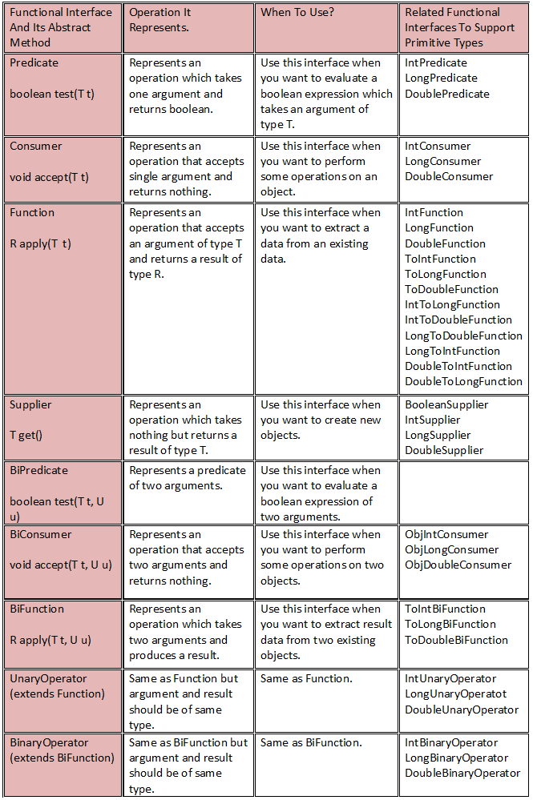

# Java 8 Functional Interfaces – When & How To Use Them?

Functional interfaces, lambda expressions and Stream API – these three features of Java 8 has turned Java programming into new style of programming called functional-style programming. Java is still an object-oriented programming language, but from Java 8, with the introduction of new features, most of the programming is done keeping functions in mind rather than objects. 

In this example, we will see Java 8 functional interfaces, `@FunctionalInterface` annotation, `java.util.function` package and how to use new Java 8 functional interfaces to compose lambda expressions with some simple examples.

## Java 8 Functional Interfaces

### 1) Definition

Functional interfaces are the interfaces which has exactly one abstract method. They may have any number of default methods but must have only one abstract method. Functional interfaces provide only one functionality to implement.

There were functional interfaces exist before Java 8. It is not like that they are the whole new concept introduced only in Java 8. Runnable, ActionListener, Callable and Comaprator are some old functional interfaces which exist even before Java 8.

The new set of functional interfaces are introduced in Java 8 to make programmer’s job easy while writing lambda expressions. Your lambda expression must implement any one of these functional interfaces. These new functional interfaces are organised under java.util.function package.

### 2) @FunctionalInterface Annotation

`@FunctionalInterface` annotation is introduced in Java 8 to represent functional interfaces. Although, it is not compulsory to write functional interface using this annotation. But, if you are using @FunctionalInterface annotation then your interface should contain only one abstract method. If you try to write more than one abstract method, compiler will show the error.


### 3) java.util.function package

All Java 8 functional interfaces are organised in `java.util.function` package. Each functional interface in this package represents an operation that can be performed by the lambda expression.

Below table shows the list of all Java 8 functional interfaces along with their abstract method, which operation they represent and when to use them?

### 4) How To Use Java 8 Functional Interfaces In Real Time?
Let’s define Student class like below. We will be using this class in the subsequent examples.
```java
class Student
{
    int id;
     
    String name;
     
    double percentage;
     
    String specialization;
     
    public Student(int id, String name, double percentage, String specialization) 
    {
        this.id = id;
         
        this.name = name;
         
        this.percentage = percentage;
         
        this.specialization = specialization;
    }
     
    public int getId() {
        return id;
    }
 
    public String getName() {
        return name;
    }
 
    public double getPercentage() {
        return percentage;
    }
 
    public String getSpecialization() {
        return specialization;
    }
 
    @Override
    public String toString()
    {
        return id+"-"+name+"-"+percentage+"-"+specialization;
    }
}
```
Let listOfStudents be the list of 10 students.
```java
List<Student> listOfStudents = new ArrayList<Student>();
         
listOfStudents.add(new Student(111, "John", 81.0, "Mathematics"));         
listOfStudents.add(new Student(222, "Harsha", 79.5, "History"));         
listOfStudents.add(new Student(333, "Ruth", 87.2, "Computers"));         
listOfStudents.add(new Student(444, "Aroma", 63.2, "Mathematics"));         
listOfStudents.add(new Student(555, "Zade", 83.5, "Computers"));         
listOfStudents.add(new Student(666, "Xing", 58.5, "Geography"));         
listOfStudents.add(new Student(777, "Richards", 72.6, "Banking"));         
listOfStudents.add(new Student(888, "Sunil", 86.7, "History"));         
listOfStudents.add(new Student(999, "Jordan", 58.6, "Finance"));         
listOfStudents.add(new Student(101010, "Chris", 89.8, "Computers"));
```
Let’s see how to use 4 important functional interfaces – Predicate, Consumer, Function and Supplier using above listOfStudents.

### a) Predicate – Tests an object

Predicate represents an operation which takes an argument T and returns a boolean. Use this functional interface, if you want to define a lambda expression which performs some test on an argument and returns true or false depending upon outcome of the test.

For example,

Imagine an operation where you want only a list of “Mathematics” students from the above listOfStudents. Let’s see how to do it using Predicate.

Lambda expression implementing Predicate : Checking specialization of a Student
```java
Predicate<Student> mathematicsPredicate = (Student student) -> student.getSpecialization().equals("Mathematics");
         
List<Student> mathematicsStudents = new ArrayList<Student>();
         
for (Student student : listOfStudents) 
{
    if (mathematicsPredicate.test(student)) 
    {
        mathematicsStudents.add(student);
    }
}
```

### Real Time Example

- 1)  Without Lambda:

```java
import java.util.Collections;
import java.util.List;

public class PredicateDemo implements Predicate<Integer> {

	@Override
	public Boolean test(Integer t) {
		if(t % 2 ==0){
	            return true;
		}else{
	            return false;
		}
       };

       public static void main(String[] args) {
	 Predicate<Integer> predicate= new PredicateDemo()
	 System.out.println(predicate.test(8));
       }
}
```
- 2) With Lambda: 
```java
import java.util.Collections;
import java.util.List;

public class PredicateDemo {

       public static void main(String[] args) {

	 Predicate<Integer> predicate= t-> t % 2 ==0;
	 System.out.println(predicate.test(8));
       }
}
```
- 3) stream().filter internaly using Predicate functional interface.
```java
import java.util.Arrays;
import java.util.List;

public class PredicateDemo {

	public static void main(String[] args) {

		List<Integer> list1 = Arrays.asList(1, 2, 3, 4, 5);

		list1.stream().filter(t -> t % 2 == 0).forEach(t -> System.out.println("print  Even: " + t));
	}
}
```
### b) Consumer – Consumes an object

Consumer represents an operation which takes an argument and returns nothing. Use this functional interface If you want to compose a lambda expression which performs some operations on an object.

For example, displaying all students with their percentage.

Lambda expression implementing Consumer : Displaying all students with their percentage
```java
Consumer<Student> percentageConsumer = (Student student) -> {
        System.out.println(student.getName()+" : "+student.getPercentage());
    };
         
for (Student student : listOfStudents) 
{
    percentageConsumer.accept(student);
}
```
Example 2:

```java
import java.util.Arrays;
import java.util.List;
import java.util.function.Consumer;

public class ConsumerDemo {

	public static void main(String[] args) {
		
		Consumer<Integer> consumer = t -> System.out.println("Printing  : " + t);
		 
		consumer.accept(10);

	}
}
```

Example 3: stream().forEach internaly using Consumer functional interface.

```java
import java.util.Arrays;
import java.util.List;
import java.util.function.Consumer;

public class ConsumerDemo {

	public static void main(String[] args) {

		List<Integer> list1 = Arrays.asList(1, 2, 3, 4, 5);

		list1.stream().forEach(t -> System.out.println("print  : " + t));
	}
}
```
### c) Function – Applies to an object

Function represents an operation which takes an argument of type T and returns a result of type R. Use this functional interface if you want to extract some data from an existing data.

For example, extracting only the names from listOfStudents.

Lambda expression implementing Function : Extracting only the names of all students
```java
Function<Student, String> nameFunction = (Student Student) -> Student.getName();
         
List<String> studentNames = new ArrayList<String>();
         
for (Student student : listOfStudents) 
{
    studentNames.add(nameFunction.apply(student));
}
```
### d) Supplier – Supplies the objects

Supplier represents an operation which takes no argument and returns the results of type R. Use this functional interface when you want to create new objects.

1) Without Lambda:
   
```java
import java.util.Arrays;
import java.util.List;
import java.util.function.Supplier;

public class SupplierDemo implements Supplier<String>{

	@Override
	public String get(){
            return "Hello World";
	}

	public static void main(String[] args) {

		Supplier<String> supplier = new SupplierDemo();

		System.out.println(supplier.get());
	}
}
```
2) With Lambda:
   
```java
import java.util.Arrays;
import java.util.List;
import java.util.function.Supplier;

public class SupplierDemo {

	public static void main(String[] args) {

		Supplier<String> supplier = t -> "Hello World";

		System.out.println(supplier.get());
	}
}
```
3) With Lambda:
   
```java
import java.util.Arrays;
import java.util.List;
import java.util.function.Supplier;

public class SupplierDemo {

	public static void main(String[] args) {

		//Supplier<String> supplier = t -> "Hello World";
		List<String> list1 = Arrays.asList();
		//System.out.println(list1.stream().findAny().orElseGet(() -> supplier));
		System.out.println(list1.stream().findAny().orElseGet(() -> "Hello World"));
	}
}
```

### Lambda expression implementing Supplier : Creating a new Student

```java
Supplier<Student> studentSupplier = () -> new Student(111111, "New Student", 92.9, "Java 8");
         
listOfStudents.add(studentSupplier.get());
```
### 5) Functional Interfaces Supporting Primitive Type

Java 8 has also introduced functional interfaces which support primitive types. 

For example IntPredicate, DoublePredicate, LongConsumer etc… (See above table).

If an input or output is a primitive type then using these functional interfaces will enhance the performance of your code. 

For example, if input to a Predicate is primitive type int then using intPredicate instead of Predicate will remove unnecessary boxing of input.



| Functional interface  | Function descriptor | Primitive specializations |
|-----------------------|---------------------|--------------------------------------------------------| 
| Predicate<T> 	| T -> boolean 	| <p>IntPredicate, </p><p>LongPredicate,</p><p> DoublePredicate</p> | 
| Consumer<T> | T -> void | <p>IntConsumer, </p><p>LongConsumer,</p><p> DoubleConsumer</p>| 
| Function<T, R> | T -> R | <p>IntFunction<R>,</p><p> IntToDoubleFunction, </p><p>IntToLongFunction,</p><p>LongFunction<R>,</p><p>  LongToDoubleFunction, </p><p> LongToIntFunction,</p><p>DoubleFunction<R>, </p><p> ToIntFunction<T>, </p><p> ToDoubleFunction<T>,</p><p>ToLongFunction<T> </p>|
| Supplier<T>| () -> T | <p>BooleanSupplier,</p><p>IntSupplier,</p><p> LongSupplier,</p><p>DoubleSupplier</p> | 
| UnaryOperator<T>| T -> T | <p>IntUnaryOperator,</p><p>LongUnaryOperator,</p><p> DoubleUnaryOperator</p> | 
| BinaryOperator<T>| (T, T) -> T | <p>IntBinaryOperator,</p><p>LongBinaryOperator,</p><p> DoubleBinaryOperator</p>|
| BiPredicate<L, R> | (L, R) -> boolean | |
| BiConsumer<T, U> | (T, U) -> void | <p>ObjIntConsumer<T>,</p><p>ObjLongConsumer<T>,</p><p> ObjDoubleConsumer<T> </p>| 
| BiFunction<T, U, R> 	| (T, U) -> R | <p>ToIntBiFunction<T, U>,</p><p>ToLongBiFunction<T, U>, </p><p>ToDoubleBiFunction<T, U> </p><p>IntToLongFunction</p><p>IntToDoubleFunction</p><p>LongToDoubleFunction</p><p>LongTolIntFunction</p><p>DoubleToIntFunction</p><p>DoubleToLongFunction</p>|
| :- | :- | :- | :- | :- |
|Supplier <p>T get()</p>|Represents an operation that returns a result of type T. Use this interface when you want to create a new object.|<p>BooleanSupplier</p><p>IntSupplier</p><p>LongSupplier</p><p>DoubleSupplier</p>|
|BiPredicate <p>boolean test(T t, U u)</p>|Represents a predicate with two arguments. Use this interface when you want to evaluate an expression with two arguments.||
|BiConsumer <p>void accept(T t, U u)</p>|Represents an operation that accepts two arguments and does some operation on them. Use this interface when you want to perform operations on two objects.||
|BiFunction <p>R apply(T t, U u)</p>|Represents an operation with two arguments that produces a result. Use this interface when you want to extract a result from two existing objects.|<p>ToIntBiFunction</p><p>ToLongBiFunction</p><p>ToDoubleBiFunction</p>|
|UnaryOperator (extends Function)|Same as Function but the argument and result are of the same type.|<p>IntUnaryOperator<p><p>LongUnaryOperator</p><p>DoubleUnaryOperator<p>|
|BinaryOperator (extends BiFunction) |Same as BiFunction but the argument and result are of the same type.|<p>IntBinaryOperator</p><p>LongBinaryOperator</p><p> DoubleBinaryOperator</p>|


Functional interfaces in Java are interfaces that have exactly one abstract method. These interfaces are commonly used in lambda expressions and method references. Each functional interface has a corresponding functional descriptor, which describes the type of the abstract method in the interface. Additionally, some functional interfaces have primitive specializations, which are interfaces that work with primitive data types instead of object types.

Examples:

Functional interface  | Function descriptor | Primitive specializations |
-----------------------|---------------------|--------------------------------------------------------| 
Predicate| T -> boolean |<p>IntPredicate</p><p>LongPredicate</p><p>DoublePredicate</p>|
Consumer|T -> void| <p>IntConsumer</p><p>LongConsumer</p><p>DoubleConsumer</p>|
Function<T, R>|T -> R|<p>IntFunction</p><p>IntToDoubleFunction</p><p>IntToLongFunction</p><p>LongFunction</p> <p>LongToDoubleFunction</p><p>LongToIntFunction</p><p>DoubleFunction</p><p>ToIntFunction</p><p>ToDoubleFunction</p><p>ToLongFunction</p>|
Supplier| () -> T|<p>BooleanSupplier</p><p>IntSupplier</p><p>LongSupplier</p><p>DoubleSupplier</p>|
UnaryOperator| T -> T|<p>IntUnaryOperator</p><p>LongUnaryOperator</p><p>DoubleUnaryOperator</p>|
BinaryOperator| (T, T) -> T|<p>IntBinaryOperator</p><p>LongBinaryOperator</p><p>DoubleBinaryOperator</p>|
BiPredicate| (L, R) -> boolean||
BiConsumer| (T, U) -> void||
BiFunction<T, U, R>| (T, U) -> R|<p>ToIntBiFunction</p><p>ToLongBiFunction</p><p>ToDoubleBiFunction</p>|

Certainly! Here’s a comprehensive set of examples for each of the functional interfaces and their primitive specializations in Java:

### **1. Predicate and Primitive Specializations**

- **`Predicate<T>`**
  - **Description:** Tests if a condition holds true for an input of type `T`.
  - **Example:**

    ```java
    import java.util.function.Predicate;

    public class PredicateExample {
        public static void main(String[] args) {
            Predicate<String> isNonEmpty = s -> !s.isEmpty();
            System.out.println(isNonEmpty.test("Hello")); // true
            System.out.println(isNonEmpty.test(""));      // false
        }
    }
    ```

- **Primitive Specializations**

  - **`IntPredicate`**
    - **Description:** Tests if a condition holds true for an `int` value.
    - **Example:**

      ```java
      import java.util.function.IntPredicate;

      public class IntPredicateExample {
          public static void main(String[] args) {
              IntPredicate isEven = n -> n % 2 == 0;
              System.out.println(isEven.test(4)); // true
              System.out.println(isEven.test(5)); // false
          }
      }
      ```

  - **`LongPredicate`**
    - **Description:** Tests if a condition holds true for a `long` value.
    - **Example:**

      ```java
      import java.util.function.LongPredicate;

      public class LongPredicateExample {
          public static void main(String[] args) {
              LongPredicate isPositive = l -> l > 0;
              System.out.println(isPositive.test(100L)); // true
              System.out.println(isPositive.test(-100L)); // false
          }
      }
      ```

  - **`DoublePredicate`**
    - **Description:** Tests if a condition holds true for a `double` value.
    - **Example:**

      ```java
      import java.util.function.DoublePredicate;

      public class DoublePredicateExample {
          public static void main(String[] args) {
              DoublePredicate isGreaterThanFive = d -> d > 5.0;
              System.out.println(isGreaterThanFive.test(6.0)); // true
              System.out.println(isGreaterThanFive.test(4.0)); // false
          }
      }
      ```

### **2. BiPredicate**

- **`BiPredicate<L, R>`**
  - **Description:** Tests if a condition holds true for two arguments of types `L` and `R`.
  - **Example:**

    ```java
    import java.util.function.BiPredicate;

    public class BiPredicateExample {
        public static void main(String[] args) {
            BiPredicate<String, Integer> lengthGreaterThan = (s, len) -> s.length() > len;
            System.out.println(lengthGreaterThan.test("Hello", 3)); // true
            System.out.println(lengthGreaterThan.test("Hi", 3));    // false
        }
    }
    ```

### **3. Consumer and Primitive Specializations**

- **`Consumer<T>`**
  - **Description:** Performs an action on an input of type `T` without returning a result.
  - **Example:**

    ```java
    import java.util.function.Consumer;

    public class ConsumerExample {
        public static void main(String[] args) {
            Consumer<String> printUppercase = s -> System.out.println(s.toUpperCase());
            printUppercase.accept("hello"); // HELLO
        }
    }
    ```

- **Primitive Specializations**

  - **`IntConsumer`**
    - **Description:** Performs an action on an `int` value.
    - **Example:**

      ```java
      import java.util.function.IntConsumer;

      public class IntConsumerExample {
          public static void main(String[] args) {
              IntConsumer printSquare = n -> System.out.println(n * n);
              printSquare.accept(4); // 16
          }
      }
      ```

  - **`LongConsumer`**
    - **Description:** Performs an action on a `long` value.
    - **Example:**

      ```java
      import java.util.function.LongConsumer;

      public class LongConsumerExample {
          public static void main(String[] args) {
              LongConsumer printLong = l -> System.out.println(l);
              printLong.accept(123456789L); // 123456789
          }
      }
      ```

  - **`DoubleConsumer`**
    - **Description:** Performs an action on a `double` value.
    - **Example:**

      ```java
      import java.util.function.DoubleConsumer;

      public class DoubleConsumerExample {
          public static void main(String[] args) {
              DoubleConsumer printDouble = d -> System.out.println(d);
              printDouble.accept(4.5); // 4.5
          }
      }
      ```

### **4. BiConsumer**

- **`BiConsumer<T, U>`**
  - **Description:** Performs an action on two arguments of types `T` and `U` without returning a result.
  - **Example:**

    ```java
    import java.util.function.BiConsumer;

    public class BiConsumerExample {
        public static void main(String[] args) {
            BiConsumer<String, Integer> printNameAndAge = (name, age) ->
                System.out.println(name + " is " + age + " years old.");
            printNameAndAge.accept("Alice", 30); // Alice is 30 years old.
        }
    }
    ```

### **5. Function and Primitive Specializations**

- **`Function<T, R>`**
  - **Description:** Takes an input of type `T` and returns a result of type `R`.
  - **Example:**

    ```java
    import java.util.function.Function;

    public class FunctionExample {
        public static void main(String[] args) {
            Function<String, Integer> stringLength = s -> s.length();
            System.out.println(stringLength.apply("Hello")); // 5
        }
    }
    ```

- **Primitive Specializations**

  - **`IntFunction<R>`**
    - **Description:** Takes an `int` and returns a result of type `R`.
    - **Example:**

      ```java
      import java.util.function.IntFunction;

      public class IntFunctionExample {
          public static void main(String[] args) {
              IntFunction<String> intToString = i -> "Number: " + i;
              System.out.println(intToString.apply(10)); // Number: 10
          }
      }
      ```

  - **`IntToDoubleFunction`**
    - **Description:** Takes an `int` and returns a `double`.
    - **Example:**

      ```java
      import java.util.function.IntToDoubleFunction;

      public class IntToDoubleFunctionExample {
          public static void main(String[] args) {
              IntToDoubleFunction intToDouble = i -> i / 2.0;
              System.out.println(intToDouble.applyAsDouble(5)); // 2.5
          }
      }
      ```

  - **`IntToLongFunction`**
    - **Description:** Takes an `int` and returns a `long`.
    - **Example:**

      ```java
      import java.util.function.IntToLongFunction;

      public class IntToLongFunctionExample {
          public static void main(String[] args) {
              IntToLongFunction intToLong = i -> i * 1000L;
              System.out.println(intToLong.applyAsLong(5)); // 5000
          }
      }
      ```

  - **`LongFunction<R>`**
    - **Description:** Takes a `long` and returns a result of type `R`.
    - **Example:**

      ```java
      import java.util.function.LongFunction;

      public class LongFunctionExample {
          public static void main(String[] args) {
              LongFunction<String> longToString = l -> "Long: " + l;
              System.out.println(longToString.apply(123456789L)); // Long: 123456789
          }
      }
      ```

  - **`LongToDoubleFunction`**
    - **Description:** Takes a `long` and returns a `double`.
    - **Example:**

      ```java
      import java.util.function.LongToDoubleFunction;

      public class LongToDoubleFunctionExample {
          public static void main(String[] args) {
              LongToDoubleFunction longToDouble = l -> l / 2.0;
              System.out.println(longToDouble.applyAsDouble(10L)); // 5.0
          }
      }
      ```

  - **`LongToIntFunction`**
    - **Description:** Takes a `long` and returns an `int`.
    - **Example:**

      ```java
      import java.util.function.LongToIntFunction;

      public class LongToIntFunctionExample {
          public static void main(String[] args) {
              LongToIntFunction longToInt = l -> (int) (l % 100);
              System.out.println(longToInt.applyAsInt(123456789L)); // 89
          }
      }
      ```

  - **`DoubleFunction<R>`**
    - **Description:** Takes a `double` and returns a result of type `R`.
    - **Example:**

      ```java
      import java.util.function.DoubleFunction;

      public class DoubleFunctionExample {
          public static void main(String[] args) {
              DoubleFunction<String> doubleToString = d -> "Double: " + d;
              System.out.println(doubleToString.apply(3.14)); // Double: 3.14
          }
      }
      ```

  - **`ToIntFunction<T>`**
   

 - **Description:** Takes an input of type `T` and returns an `int`.
    - **Example:**

      ```java
      import java.util.function.ToIntFunction;

      public class ToIntFunctionExample {
          public static void main(String[] args) {
              ToIntFunction<String> stringLength = s -> s.length();
              System.out.println(stringLength.applyAsInt("Hello")); // 5
          }
      }
      ```

  - **`ToDoubleFunction<T>`**
    - **Description:** Takes an input of type `T` and returns a `double`.
    - **Example:**

      ```java
      import java.util.function.ToDoubleFunction;

      public class ToDoubleFunctionExample {
          public static void main(String[] args) {
              ToDoubleFunction<String> stringLengthToDouble = s -> s.length() * 1.0;
              System.out.println(stringLengthToDouble.applyAsDouble("Hello")); // 5.0
          }
      }
      ```

  - **`ToLongFunction<T>`**
    - **Description:** Takes an input of type `T` and returns a `long`.
    - **Example:**

      ```java
      import java.util.function.ToLongFunction;

      public class ToLongFunctionExample {
          public static void main(String[] args) {
              ToLongFunction<String> stringLengthToLong = s -> s.length();
              System.out.println(stringLengthToLong.applyAsLong("Hello")); // 5
          }
      }
      ```

### **6. BiFunction and Its Primitive Specializations**

- **`BiFunction<T, U, R>`**
  - **Description:** Takes two arguments and produces a result.
  - **Example:**

    ```java
    import java.util.function.BiFunction;

    public class BiFunctionExample {
        public static void main(String[] args) {
            BiFunction<Integer, Integer, Integer> add = (a, b) -> a + b;
            System.out.println(add.apply(5, 10)); // 15
        }
    }
    ```

- **Primitive Specializations**

  - **`ToIntBiFunction<T, U>`**
    - **Description:** Takes two arguments and produces an `int`.
    - **Example:**

      ```java
      import java.util.function.ToIntBiFunction;

      public class ToIntBiFunctionExample {
          public static void main(String[] args) {
              ToIntBiFunction<String, String> stringLengthSum = (a, b) -> a.length() + b.length();
              System.out.println(stringLengthSum.applyAsInt("Hello", "World")); // 10
          }
      }
      ```

  - **`ToLongBiFunction<T, U>`**
    - **Description:** Takes two arguments and produces a `long`.
    - **Example:**

      ```java
      import java.util.function.ToLongBiFunction;

      public class ToLongBiFunctionExample {
          public static void main(String[] args) {
              ToLongBiFunction<Integer, Integer> multiply = (a, b) -> (long) a * b;
              System.out.println(multiply.applyAsLong(5, 10)); // 50
          }
      }
      ```

  - **`ToDoubleBiFunction<T, U>`**
    - **Description:** Takes two arguments and produces a `double`.
    - **Example:**

      ```java
      import java.util.function.ToDoubleBiFunction;

      public class ToDoubleBiFunctionExample {
          public static void main(String[] args) {
              ToDoubleBiFunction<Integer, Integer> average = (a, b) -> (a + b) / 2.0;
              System.out.println(average.applyAsDouble(5, 10)); // 7.5
          }
      }
      ```

### **7. Supplier and Its Primitive Specializations**

- **`Supplier<T>`**
  - **Description:** Supplies a result of type `T` without taking any arguments.
  - **Example:**

    ```java
    import java.util.function.Supplier;

    public class SupplierExample {
        public static void main(String[] args) {
            Supplier<String> stringSupplier = () -> "Hello World";
            System.out.println(stringSupplier.get()); // Hello World
        }
    }
    ```

- **Primitive Specializations**

  - **`BooleanSupplier`**
    - **Description:** Supplies a `boolean` value.
    - **Example:**

      ```java
      import java.util.function.BooleanSupplier;

      public class BooleanSupplierExample {
          public static void main(String[] args) {
              BooleanSupplier randomBoolean = () -> Math.random() > 0.5;
              System.out.println(randomBoolean.getAsBoolean()); // true or false
          }
      }
      ```

  - **`IntSupplier`**
    - **Description:** Supplies an `int` value.
    - **Example:**

      ```java
      import java.util.function.IntSupplier;

      public class IntSupplierExample {
          public static void main(String[] args) {
              IntSupplier randomInt = () -> (int) (Math.random() * 100);
              System.out.println(randomInt.getAsInt()); // Random integer between 0 and 99
          }
      }
      ```

  - **`LongSupplier`**
    - **Description:** Supplies a `long` value.
    - **Example:**

      ```java
      import java.util.function.LongSupplier;

      public class LongSupplierExample {
          public static void main(String[] args) {
              LongSupplier randomLong = () -> (long) (Math.random() * 1000000);
              System.out.println(randomLong.getAsLong()); // Random long value
          }
      }
      ```

  - **`DoubleSupplier`**
    - **Description:** Supplies a `double` value.
    - **Example:**

      ```java
      import java.util.function.DoubleSupplier;

      public class DoubleSupplierExample {
          public static void main(String[] args) {
              DoubleSupplier randomDouble = () -> Math.random() * 100;
              System.out.println(randomDouble.getAsDouble()); // Random double value between 0 and 100
          }
      }
      ```

### **8. UnaryOperator and Its Primitive Specializations**

- **`UnaryOperator<T>`**
  - **Description:** Applies a function to an input of type `T` and returns a result of the same type.
  - **Example:**

    ```java
    import java.util.function.UnaryOperator;

    public class UnaryOperatorExample {
        public static void main(String[] args) {
            UnaryOperator<String> toUpperCase = s -> s.toUpperCase();
            System.out.println(toUpperCase.apply("hello")); // HELLO
        }
    }
    ```

- **Primitive Specializations**

  - **`IntUnaryOperator`**
    - **Description:** Applies a function to an `int` and returns an `int`.
    - **Example:**

      ```java
      import java.util.function.IntUnaryOperator;

      public class IntUnaryOperatorExample {
          public static void main(String[] args) {
              IntUnaryOperator square = n -> n * n;
              System.out.println(square.applyAsInt(5)); // 25
          }
      }
      ```

  - **`LongUnaryOperator`**
    - **Description:** Applies a function to a `long` and returns a `long`.
    - **Example:**

      ```java
      import java.util.function.LongUnaryOperator;

      public class LongUnaryOperatorExample {
          public static void main(String[] args) {
              LongUnaryOperator multiplyByTwo = l -> l * 2;
              System.out.println(multiplyByTwo.applyAsLong(10L)); // 20
          }
      }
      ```

  - **`DoubleUnaryOperator`**
    - **Description:** Applies a function to a `double` and returns a `double`.
    - **Example:**

      ```java
      import java.util.function.DoubleUnaryOperator;

      public class DoubleUnaryOperatorExample {
          public static void main(String[] args) {
              DoubleUnaryOperator half = d -> d / 2;
              System.out.println(half.applyAsDouble(10.0)); // 5.0
          }
      }
      ```

### **9. BinaryOperator and Its Primitive Specializations**

- **`BinaryOperator<T>`**
  - **Description:** Applies a function to two arguments of type `T` and returns a result of the same type.
  - **Example:**

    ```java
    import java.util.function.BinaryOperator;

    public class BinaryOperatorExample {
        public static void main(String[] args) {
            BinaryOperator<Integer> add = (a, b) -> a + b;
            System.out.println(add.apply(5, 10)); // 15
        }
    }
    ```

- **Primitive Specializations**

  - **`IntBinaryOperator`**
    - **Description:** Applies a function to two `int` values and returns an `int`.
    - **Example:**

      ```java
      import java.util.function.IntBinaryOperator;

      public class IntBinaryOperatorExample {
          public static void main(String[] args) {
              IntBinaryOperator multiply = (a, b) -> a * b;
              System.out.println(multiply.applyAsInt(4, 5)); // 20
          }
      }
      ```

  - **`LongBinaryOperator`**
    - **Description:** Applies a function to two `long` values and returns a `long`.
    - **Example:**

      ```java
      import java.util.function.LongBinaryOperator;

      public class LongBinaryOperatorExample {
          public static void main(String[] args) {
              LongBinaryOperator subtract = (a, b) -> a - b;
              System.out.println(sub

tract.applyAsLong(100L, 50L)); // 50
          }
      }
      ```

  - **`DoubleBinaryOperator`**
    - **Description:** Applies a function to two `double` values and returns a `double`.
    - **Example:**

      ```java
      import java.util.function.DoubleBinaryOperator;

      public class DoubleBinaryOperatorExample {
          public static void main(String[] args) {
              DoubleBinaryOperator divide = (a, b) -> a / b;
              System.out.println(divide.applyAsDouble(10.0, 2.0)); // 5.0
          }
      }
      ```

These examples cover the key functional interfaces and their primitive specializations in Java. They demonstrate how each interface can be used in practice for different types of data and operations.
# Using functional interfaces:
A functional interface specifies exactly one abstract method.
Functional interfaces are useful because the signature of the abstract method can describe the signature of a lambda expression. 
The signature of the abstract method of a functional interface is called a function descriptor. 
So in order to use different lambda expressions, you need a set of functional interfaces that can describe common function descriptors. 
There are several functional interfaces already available in the Java API such as Comparable, Runnable, and Callable, ActionaListner.

The Java library designers for Java 8 have helped you by introducing several new functional interfaces inside the `java.util.function` package. 
We describe the interfaces Predicate, Consumer, and Function.

# Predicate
The `java.util.function.Predicate<T>` interface defines an abstract method named test that accepts an object of generic type T and returns a boolean. 

It’s exactly the same one that you created earlier, but is available out of the box! You might want to use this interface when you need to represent a boolean expression that uses an object of type T. 

For example, you can define a lambda that accepts String objects, as shown in the following listing.

### Working with a Predicate
```java
@FunctionalInterface
public interface Predicate<T>{
	boolean test(T t);
}
public static <T> List<T> filter(List<T> list, Predicate<T> p) {
	List<T> results = new ArrayList<>();
	for(T s: list){
		if(p.test(s)){
			results.add(s);
		}
	}
	return results;
}

Predicate<String> nonEmptyStringPredicate = (String s) -> !s.isEmpty();

List<String> nonEmpty = filter(listOfStrings, nonEmptyStringPredicate);
```
If you look up the Javadoc specification of the Predicate interface, you may notice additional methods such as and and or.

### What about @FunctionalInterface?

If you explore the new Java API, you’ll notice that functional interfaces are annotated with `@FunctionalInterface` This annotation is used to indicate that the interface is intended to be a functional interface. The compiler will return a meaningful error if you define an interface using the `@FunctionalInterface` annotation and it isn’t a functional interface. 

For example, an error message could be “Multiple non-overriding abstract methods found in interface Foo” to indicate that more than one abstract method is available. 

Note that the `@FunctionalInterface` annotation isn’t mandatory, but it’s good practice to use it when an interface is designed for that purpose.

You can think of it like the `@Override` notation to indicate that a method is overridden.

# Consumer

The `java.util.function.Consumer<T>` interface defines an abstract method named accept that takes an object of generic type T and returns no result (void). 
You might use this interface when you need to access an object of type T and perform some operations on it. 

For example, you can use it to create a method forEach, which takes a list of Integers and applies an operation on each element of that list. 
In the following listing you use this forEach method combined with a lambda to print all the elements of the list.

### Working with a Consumer
```java
@FunctionalInterface
public interface Consumer<T>{
	void accept(T t);
}
public static <T> void forEach(List<T> list, Consumer<T> c) {
	for(T i: list){
		c.accept(i);
	}
}
forEach(Arrays.asList(1,2,3,4,5), (Integer i) -> System.out.println(i));
```
# Function
The java.util.function.Function<T, R> interface defines an abstract method named apply that takes an object of generic type T as input and returns an object of generic type R. 

You might use this interface when you need to define a lambda that maps information from an input object to an output (for example, extracting the weight of an apple or mapping a string to its length). 

In the listing that follows we show how you can use it to create a method map to transform a list of Strings into a list of Integers containing the length of each String.

### Working with a Function
```java
@FunctionalInterface
public interface Function<T, R>{
	R apply(T t);
}
public static <T, R> List<R> map(List<T> list, Function<T, R> f) {
	List<R> results = new ArrayList<>();
	for(T s: list){
		results.add(f.apply(s));
	}
	return results;
}

List<Integer> l = map(Arrays.asList("lambdas","in","action"), (String s) -> s.length());
```

### 1. What is a Functional Interface?
### 1.1. Only one abstract method is allowed
Functional interfaces are new additions in Java 8. As a rule, a functional interface can contain exactly one abstract method. These functional interfaces are also called Single Abstract Method interfaces (SAM Interfaces).

Apart from one abstract method, a functional interface can also have the following methods that do not count for defining it as a functional interface.

- [Default methods](#java-default-methods)
- [Static methods](#java-static-methods)
  
Public methods inherited from the Object class
### 1.2. Implemented by Lambda Expressions
In Java, lambda expressions can be used to represent an instance of a functional interface. For example, Comparator interface is a functional interface.

@FunctionalInterface
public interface Comparator<T> {
	int compare(T o1, T o2);
	boolean equals(Object obj);

	//and multiple default methods...
}

Comparator interface has only two abstract methods compare() and equals(). But equals() has been inherited from the Object class, so it is not counted. Other than these two methods, all other methods are default methods. So Comparator is qualified to be declared as a functional interface.

Java program to implement Comparator using a lambda expression.
```java
//Compare by Id
Comparator<Employee> compareById = Comparator.comparing(e -> e.getId());

Comparator<Employee> compareByFirstName = Comparator.comparing(e -> e.getFirstName());
```
### 2. @FunctionalInterface Annotation
Java 8 introduced the annotation `@FunctionalInterface` to mark an interface as a functional interface. The primary use of this annotation is for compiler-level errors when the interface violates the contracts of precisely one abstract method.

Note that using the annotation @FunctionalInterface is optional.

If the interface has one abstract method and does not have @FunctionalInterface annotation, the interface is still a functional interface, and it can be the target type for lambda expressions.

The presence of the annotation protects us from inadvertently changing a functional interface into a non-functional interface, as the compiler will catch it.

Let’s build our first functional interface. Note that methods in an interface are, by default, abstract.
```java
@FunctionalInterface
public interface MyFirstFunctionalInterface 
{
    public void firstWork();
}
```
Let’s try to add another abstract method:
```java
@FunctionalInterface
public interface MyFirstFunctionalInterface 
{
    public void firstWork();
    public void doSomeMoreWork();   //error
}
```
The above code will result in a compiler error:

Unexpected `@FunctionalInterface` annotation
`@FunctionalInterface` ^ MyFirstFunctionalInterface is not a functional interface
multiple non-overriding abstract methods found in interface MyFirstFunctionalInterface
Functional-Interface-Error
Read More : Generic Functional Interfaces

### 3. Functional Interfaces in JDK
The following is a list of Java’s most commonly used functional interfaces.

- Runnable: contains only the run() method.
- Comparable: contains only the compareTo() method.
- ActionListener: contains only the actionPerformed() method.
- Callable: contains only the call() method.
- Predicate: a boolean-valued function that takes an argument and returns true or false.
- BiPredicate: a predicate with two arguments.
- Consumer: an operation that takes an argument, operates on it, and returns no result.
- BiConsumer: a consumer with two arguments.
- Supplier: a supplier that returns a value.
- Function<T, R>:  takes an argument of type T and returns a result of type R.
- BiFunction<T, U, R>: takes two arguments of types T and U and returns a result of type R.
  
### 4. Demo
Let’s see a quick example of creating and using functional interfaces in Java.

We are using a functional interface Function to create the formula for mathematical squares.
```java
Function<Integer, Integer> square = x -> x * x;
```
The Function interface has one abstract method apply() that we have implemented above. we can execute the above method as follows:
```java
System.out.println( square.apply(5) );  //Prints 25
```
### 5. Conclusion
In this tutorial, we learned to create and manage functional interfaces in Java. We learned that a functional interface has only one abstract method and they can be implemented by the lambda expressions.

We also saw the JDK provided existing functional interfaces, and finally how to create an use a functional interface.

### Java Default Methods

Let’s move on the discussion and talk about another related feature i.e. default methods. Well, this is truly revolutionary for java developers. Till java 7, we have learned a lot of things about interfaces and all those things have been in our mind whenever we wrote code or designed the applications. Some of these concepts are going to change drastically from java 8, after introduction of default methods.

I will discuss following points in this post:

- What are default methods in java 8?
- Why default methods were needed in java 8?
- How conflicts are resolved while calling default methods?

### What are default methods in java 8?

Default methods enable you to add new functionality to the interfaces of your libraries and ensure binary compatibility with code written for older versions of those interfaces.

As name implies, default methods in java 8 are simply default. If you do not override them, they are the methods which will be invoked by caller classes. They are defined in interfaces.

Let’s understand with an example:
```java
public interface Moveable {
    default void move(){
        System.out.println("I am moving");
    }
}
```
Moveable interface defines a method move(); and provided a default implementation as well. If any class implements this interface then it need not to implement it’s own version of move() method. It can directly call instance.move();
```java
public class Animal implements Moveable{
    public static void main(String[] args){
        Animal tiger = new Animal();
        tiger.move();
    }
}
```
Output: I am moving

And if class willingly wants to customize the behavior then it can provide it’s own custom implementation and override the method. Now it’s own custom method will be called.
```java
public class Animal implements Moveable{
    
    public void move(){
        System.out.println("I am running");
    }
    
    public static void main(String[] args){
        Animal tiger = new Animal();
        tiger.move();
    }
}
```
Output: I am running
This is not all done here. Best part comes as following benefits:

**Static default methods**: You can define static default methods in interface which will be available to all instances of class which implement this interface. This makes it easier for you to organize helper methods in your libraries; you can keep static methods specific to an interface in the same interface rather than in a separate class. This enables you to define methods out of your class and yet share with all child classes.

They provide you an highly desired capability of adding a capability to number of classes without even touching their code. Simply add a default method in interface which they all implement.

### Why default methods were needed in java 8?

This is a good candidate for your next interview question. Simplest answer is to enable the functionality of lambda expression in java. Lambda expression are essentially of type of functional interface. To support lambda expressions seamlessly, all core classes have to be modified. But these core classes like java.util.List are implemented not only in JDK classes, but also in thousands of client code as well. Any incompatible change in core classes will back fire for sure and will not be accepted at all.

Default methods break this deadlock and allow adding support for functional interface in core classes. Let’s see an example. Below is a method which has been added to java.lang.Iterable.
```java
default void forEach(Consumer<? super T> action) {
	Objects.requireNonNull(action);
	for (T t : this) {
		action.accept(t);
	}
}
```
Before java 8, if you had to iterate on a java collection then your would get an iterator instance and call it’s next method until hasNext() returns false. This is common code and have been used thousands of time in day to day programming by us. Syntax is also always same. So can we make it compact so that it takes only single line of code and still do the job for us as before. Above function does that.

Now to iterate and perform some simple operation on every item in list, all you need to do is:
```java
import java.util.ArrayList;
import java.util.List;

public class Animal implements Moveable{
    public static void main(String[] args){
        List<Animal> list = new ArrayList();
        list.add(new Animal());
        list.add(new Animal());
        list.add(new Animal());
        
        //Iterator code reduced to one line
        list.forEach((Moveable p) -> p.move());
    }
}
```
So here, an additional method has been added to List without breaking any custom implementations of it. It has been very desired feature in java since long. Now it’s with us.

### How conflicts are resolved while calling default methods?

So far so good. We have got all basics well. Now move to complicated things. In java, a class can implement N number of interface. Additionally, a interface can also extend another interface as well. An if any default method is declared in two such interfaces which are implemented by single class. then obviously class will get confused which method to call.

Rules for this conflict resolution are as follows:

1) Most preferred are the overridden methods in classes. They will be matched and called if found before matching anything.

2) The method with the same signature in the “most specific default-providing interface” is selected. This means if class Animal implements two interfaces i.e. Moveable and Walkable such that Walkable extends Moveable. Then Walkable is here most specific interface and default method will be chosen from here if method signature is matched.

3) If Moveable and Walkable are independent interfaces then a serious conflict condition happen, and compiler will complain then it is unable to decide. The you have to help compiler by providing extra info that from which interface the default method should be called. e.g.

```java
	Walkable.super.move();
	//or 
	Moveable.super.move();
```
## Java Static Methods

### Java Static – Variable, Method, Block, Class and Import Statement

Static keyword in java can be applied on variables, methods, blocks, import and inner classes. In this tutorial, we will learn the effect of using static keyword in these places with examples.

Table of Contents

- [1. Static Variable](#1-static-variable)
- [2. Static Method](#2-static-method)
- [3. Static Import Statement](#3-static-import)
- [4. Static Block](#4-static-block)
- [5. Static Class](#5-static-class)
- [6. Summary](#6-summary)

### 1. Static Variable
To declare a variable static, use static keyword in variable declaration. static variable syntax is:

ACCESS_MODIFER static DATA_TYPE VARNAME;
For example, a public static variable of Integer type is declared in this way.

public static Integer staticVar;
The most important thing about static variables is that they belong to class level. What it means is that there can be only one copy of variable in runtime.

When you define a static variable in class definition, each instance of class will have access to that single copy. Separate instances of class will not have their own local copy, like they have for non-static variables.

```java
public class JavaStaticExample 
{
  public static void main(String[] args) 
  {
    DataObject objOne = new DataObject();
    objOne.staticVar = 10;
    objOne.nonStaticVar = 20;
     
    DataObject objTwo = new DataObject();
     
    System.out.println(objTwo.staticVar);   //10
    System.out.println(objTwo.nonStaticVar);  //null
     
    DataObject.staticVar = 30;  //Direct Access
     
    System.out.println(objOne.staticVar);   //30
    System.out.println(objTwo.staticVar);   //30
  }
}
 
class DataObject {
  public static Integer staticVar;
  public Integer nonStaticVar;
}
``` 
> Output:
 
10
null
30
30
Notice how we changed the value to 30, and both objects now see the updated value which is 30.

Another thing you should have noticed that how we are able to access static variable with its classname i.e. DataObject.staticVar. We don’t need to create any instance to access static variables. It clearly shows that static variables belong to class scope.

### 2. Static Method
To declare a static method, use static keyword in method declaration. Static method syntax is:

`ACCESS_MODIFER static RETURN_TYPE METHOD_NAME;`
For example, a public static variable of Integer type is declared in this way.
```java
public static Integer staticVar;
 
public static Integer getStaticVar(){
 
  return staticVar;
}
```
Few things to remember.

You can access only static variables inside static methods. If you try to access any non-static variable, the compiler error will be generated with message “Cannot make a static reference to the non-static field nonStaticVar“.

Static methods can be accessed via it’s class reference, and there is no need to create an instance of class. Though you can access using instance reference as well but it will have not any difference in comparison to access via class reference.
Static methods also belong to class level scope.

```java
public class JavaStaticExample 
{
  public static void main(String[] args) 
  {
    DataObject.staticVar = 30;  //Direct Access
     
    Integer value1 = DataObject.getStaticVar(); //access with class reference
 
    DataObject objOne = new DataObject();
    Integer value2 = objOne.getStaticVar();   //access with instance reference
     
    System.out.println(value1);
    System.out.println(value2);
  }
}
 
class DataObject 
{
  public Integer nonStaticVar;
  public static Integer staticVar;  //static variable
   
  public static Integer getStaticVar(){
    return staticVar;
  }
}
``` 
> Output:
 
30
30

### 3. Static Import Statement
The normal import declaration imports classes from packages, so that they can be used without package reference. Similarly the static import declaration imports static members from classes and allowing them to be used without class reference.

A static import statement also comes in two flavors: single-static import and static-import-on-demand. A single-static import declaration imports one static member from a type. A static-import-on-demand declaration imports all static members of a type.

```java

//Single-static-import declaration:
  
import static <<package name>>.<<type name>>.<<static member name>>;
  
//Static-import-on-demand declaration:
  
import static <<package name>>.<<type name>>.*;

For example, System.out is

//Static import statement
import static java.lang.System.out;

public class JavaStaticExample 
{
  public static void main(String[] args) 
  {
    DataObject.staticVar = 30;  
 
    out.println(DataObject.staticVar);  //Static import statement example
  }
}
class DataObject 
{
  public static Integer staticVar;  //static variable
}
``` 
> Output:
 
30
Read More: Static Import Statements in Java


### 4. Static Block
Static blocks are portion of class initialization code, which are wrapped with static keyword.
```java
public class Main {
      
    //static initializer
    static {
        System.out.println("Inside static initializer");
    }   
}
```
Static blocks are executed when the class is loaded in the memory. A class can have multiple static blocks and these will be executed in the same sequence in which they appear in class definition.
```java
import static java.lang.System.out;
 
class DataObject 
{
  public Integer nonStaticVar;
  public static Integer staticVar;  //static variable
   
  //It will be executed first
  static {
    staticVar = 40;
    //nonStaticVar = 20;  //Not possible to access non-static members
  }
   
  //It will be executed second
  static {
    out.println(staticVar);
  }
}
``` 
> Output:
 
40

### 5. Static Class
In Java, you can have a static class as inner class. Just like other static members, nested classed belong with class scope so the inner static class can be accessed without having an object of outer class.
```java
public class JavaStaticExample 
{
  public static void main(String[] args) 
  {
    //Static inner class example
    System.out.println( DataObject.StaticInnerClas.innerStaticVar );
  }
}
class DataObject 
{
  public Integer nonStaticVar;
  public static Integer staticVar;  //static variable
   
  static class StaticInnerClas {
    Integer innerNonStaticVar = 60; 
    static Integer innerStaticVar = 70;   //static variable inside inner class
  }
}
```
Please note that an static inner class cannot access the non-static members of outer class. It can access only static members from outer class.
```java
public class JavaStaticExample 
{
  public static void main(String[] args) 
  {
    //Static inner class example
    DataObject.StaticInnerClas.accessOuterClass();
  }
}
class DataObject 
{
  public Integer nonStaticVar;
  public static Integer staticVar;  //static variable
     
  static {
    staticVar = 40;
    //nonStaticVar = 20;  //Not possible to access non-static members
  }
 
  public static Integer getStaticVar(){
    return staticVar;
  }
   
  static class StaticInnerClas 
  { 
    public static void accessOuterClass()
    {
      System.out.println(DataObject.staticVar);   //static variable of outer class
      System.out.println(DataObject.getStaticVar());  //static method of outer class
    }
  }
}
``` 
> Output:
 
40

### 6. Summary
Let’s summarize everything about static keyword usage in Java.

Static members belong to class. No need to create class instance to access static members.

Static members (variables and methods) can be accessed inside static methods and static blocks only.

Non-static members cannot be accessed inside static methods, blocks and inner classes.

A class can have multiple static blocks and they will be executed in order they appear in class definition.

A class can be static only if its declared as inner class inside outer class.

Static imports can be used to import all static members from a class. These members can be referred without any class reference.
