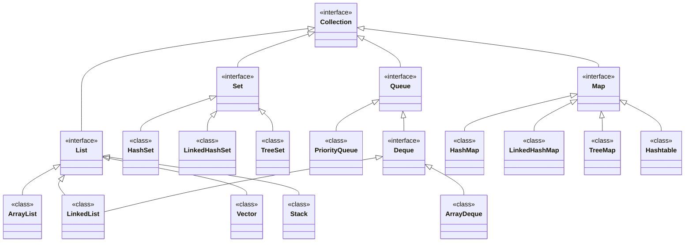

2. Collection hierarchy in java ( Part 1: Interfaces )

Collection hierarchy in java

Collection hierarchy in java refers to the relationship between different classes and interfaces in a collection framework. The Java Collections Framework provides a set of interfaces and classes that define various types of collections and their behaviors. The collection hierarchy in Java is based on a few key interfaces and their respective implementing classes.

At the top of the hierarchy is the Collection interface, which represents a group of objects. This interface provides basic operations for manipulating and querying collections, such as adding, removing, and checking the presence of elements. The Collection interface is extended by two main sub interfaces: List and Set.

Interfaces Of Collection In java:

1. Iterable Interface :
The Iterable interface in Java is a fundamental interface in the Java Collections Framework. It serves as the foundation for classes that represent a group of elements and enables them to be iterated over using an enhanced for loop or through the use of iterators.

Here are some key characteristics and features of the Iterable interface:

Iteration Capability: The primary purpose of the Iterable interface is to provide the ability to iterate over a collection of elements. It achieves this by defining a single method, iterator(), which returns an Iterator object.
Enhanced for Loop Support: By implementing the Iterable interface, a class enables the use of the enhanced for loop, also known as the for-each loop, which simplifies the process of iterating over elements in a collection.
Iterator Support: The iterator() method of the Iterable interface returns an Iterator object, which allows sequential access to the elements in the collection. The Iterator provides methods such as hasNext(), next(), and remove(), which facilitate iteration and element manipulation.
Multiple Iterations: The Iterable interface allows multiple iterations over the elements of a collection. Each call to iterator() returns a new Iterator, allowing independent traversal of the elements.
Usage with Custom Classes: Implementing the Iterable interface is useful when creating custom classes that represent collections of objects. By doing so, instances of those classes can be used with the enhanced for loop and other APIs that accept Iterable objects.
Integration with Java APIs: Many core Java classes and APIs, such as the Java Collections Framework, rely on the Iterable interface. This enables seamless integration and compatibility with various Java libraries and utilities.
By implementing the Iterable interface, classes gain the ability to provide a way for their elements to be iterated over, making them compatible with enhanced for loops and other iteration-based operations in Java. It facilitates a standardized approach to working with collections, enhancing code readability and promoting code reusability.

2. Collection Interface :
The Iterable interface of Collection hierarchy in java is a fundamental interface in the Java Collections Framework. It serves as the foundation for classes that represent a group of elements and enables them to be iterated over using an enhanced for loop or through the use of iterators.

Here are some key characteristics and features of the Iterable interface:

Iteration Capability: The primary purpose of the Iterable interface is to provide the ability to iterate over a collection of elements. It achieves this by defining a single method, iterator(), which returns an Iterator object.
Enhanced for Loop Support: By implementing the Iterable interface, a class enables the use of the enhanced for loop, also known as the for-each loop, which simplifies the process of iterating over elements in a collection.
Iterator Support: The iterator() method of the Iterable interface returns an Iterator object, which allows sequential access to the elements in the collection. The Iterator provides methods such as hasNext(), next(), and remove(), which facilitate iteration and element manipulation.
Multiple Iterations: The Iterable interface allows multiple iterations over the elements of a collection. Each call to iterator() returns a new Iterator, allowing independent traversal of the elements.
Usage with Custom Classes: Implementing the Iterable interface is useful when creating custom classes that represent collections of objects. By doing so, instances of those classes can be used with the enhanced for loop and other APIs that accept Iterable objects.
Integration with Java APIs: Many core Java classes and APIs, such as the Java Collections Framework, rely on the Iterable interface. This enables seamless integration and compatibility with various Java libraries and utilities.
By implementing the Iterable interface, classes gain the ability to provide a way for their elements to be iterated over, making them compatible with enhanced for loops and other iteration-based operations in Java. It facilitates a standardized approach to working with collections, enhancing code readability and promoting code reusability.

3. List Interface :
The List interface of Collection hierarchy in java is a part of the Java Collections Framework and provides an ordered collection of elements that allows duplicates. It is designed to represent a sequence of objects in which each element has an index associated with it.

Here are some key characteristics and features of the List interface:

Ordered Collection: Elements in a List are ordered based on their index position, which means they maintain the insertion order. The first element is at index 0, the second element at index 1, and so on.
Duplicates Allowed: Unlike some other collection types, List allows duplicate elements. This means you can store multiple elements with the same value in a List.
Access by Index: List provides methods to access elements based on their index. You can retrieve an element by its index using the get(int index) method.
Dynamic Size: Lists in Java automatically resize themselves to accommodate new elements. You can add elements to a List using the add(E element) method, which appends the element to the end of the List.
Modifiable: List allows you to modify elements by their index. You can change the value of an element at a specific index using the set(int index, E element) method.
Iteration: Lists can be easily iterated over using the enhanced for loop or by utilizing an Iterator or ListIterator. These iterators provide methods for traversing and manipulating the elements of a List.
Implementations: Java provides several classes that implement the List interface, such as ArrayList, LinkedList, and Vector. Each implementation has its own characteristics in terms of performance, memory usage, and specific use cases.
The List interface provides a flexible and powerful way to work with ordered collections of elements in Java, allowing you to perform various operations such as adding, removing, searching, and sorting elements based on their index.

4. Queue Interface :
The Queue interface of Collection hierarchy in java is a part of the Java Collections Framework and represents a collection that orders elements in a specific manner for processing. It follows the First-In-First-Out (FIFO) principle, where elements are added at the end of the queue and removed from the front.

Here are some key characteristics and features of the Queue interface:

Ordering: The Queue interface maintains the order of elements based on the FIFO principle. The element that has been in the queue the longest is the first one to be removed.
Addition and Removal: Elements are added to the end of the queue using the add(E element) or offer(E element) method. To remove an element from the front of the queue, you can use the remove() or poll() method. These methods also return the removed element.
Retrieval: The Queue interface provides methods to retrieve the element at the front of the queue without removing it. The peek() method returns the element, or null if the queue is empty. The element() method is similar to peek() but throws an exception if the queue is empty.
Size and Empty Check: The size() method returns the number of elements in the queue, while the isEmpty() method checks if the queue is empty.
Implementation Choices: Java offers various classes that implement the Queue interface, such as LinkedList, PriorityQueue, and ArrayDeque. Each implementation has its own characteristics and performance trade-offs.
Blocking Queues: Java also provides specialized implementations of the Queue interface called BlockingQueue. These implementations support thread-safety and blocking operations, allowing threads to wait until the queue becomes non-empty or non-full.
Iteration: The Queue interface does not provide direct iteration over its elements. To iterate through the elements, you can convert the Queue to an array or use an Iterator or ListIterator provided by the specific implementation class.
The Queue interface is useful in scenarios where you need to process elements based on their arrival order. It is commonly used in tasks such as event handling, task scheduling, and implementing algorithms like breadth-first search. By following the FIFO principle, the Queue interface provides a simple and efficient way to manage and process elements in a specific order.

5. Set Interface :
The Set interface of Collection hierarchy in java is a part of the Java Collections Framework and represents a collection of unique elements, where duplicates are not allowed. It provides a mathematical set abstraction and offers various methods for adding, removing, and manipulating elements.

Here are some key characteristics and features of the Set interface:

Uniqueness of Elements: The Set interface ensures that each element in the collection is unique. It does not allow duplicates, meaning that if you attempt to add an element that is already present, it will not be added again.
No Defined Ordering: Unlike some other collection types, such as List, Set does not guarantee a specific order of elements. The elements are stored in an internal structure that optimizes for efficient membership operations.
Add and Remove Operations: Elements can be added to a Set using the add(E element) method. If the element is successfully added, the method returns true; otherwise, if the element already exists, it returns false. The remove(Object element) method removes a specific element from the Set.
Membership Testing: The Set interface provides methods to test if a given element is present in the Set. The contains(Object element) method returns true if the Set contains the specified element; otherwise, it returns false. The isEmpty() method checks if the Set is empty.
Set Operations: The Set interface supports various set operations, such as union, intersection, and difference. For example, you can perform these operations between two sets using methods like addAll(Collection<? extends E> c), retainAll(Collection<?> c), and removeAll(Collection<?> c).
Iteration: The elements of a Set can be iterated over using an enhanced for loop or by utilizing an Iterator. The Set interface provides the iterator() method, which returns an Iterator object for traversing the elements.
Implementation Choices: Java provides several classes that implement the Set interface, such as HashSet, TreeSet, and LinkedHashSet. Each implementation has its own characteristics in terms of performance, ordering, and specific use cases.
The Set interface in Java is a powerful tool for managing collections of unique elements. It ensures that each element appears only once within the Set and provides methods for adding, removing, and testing membership. The lack of a defined order makes Sets ideal for scenarios where uniqueness is a priority, and the efficient lookup of elements is required.

6. Deque Interface :
The Deque interface of Collection hierarchy in java is a part of the Java Collections Framework and represents a double-ended queue, which allows insertion and removal of elements from both ends. “Deque” stands for “double-ended queue.”

Here are some key characteristics and features of the Deque interface:

Double-Ended Operations: The Deque interface supports operations to insert and remove elements from both the front and the back of the queue. This flexibility allows for efficient insertion and removal at both ends.
Queue and Stack Functionality: The Deque interface provides methods to add elements to the end of the deque (addLast(E e) or offerLast(E e)) and retrieve and remove elements from the front of the deque (removeFirst() or pollFirst()). These methods enable the Deque to function as both a queue and a stack.
Stack-Like Operations: The Deque interface also supports stack-like operations, such as pushing elements to the front of the deque (addFirst(E e) or offerFirst(E e)) and popping elements from the front of the deque (removeFirst() or pollFirst()). These methods allow the Deque to be used as a stack, following the Last-In-First-Out (LIFO) principle.
Random Access: The Deque interface provides methods to access elements at specific positions within the deque, such as getFirst() and getLast(), which return the first and last elements, respectively.
Size and Empty Check: The size() method returns the number of elements in the deque, while the isEmpty() method checks if the deque is empty.
Iteration: The Deque interface allows iteration over its elements using an enhanced for loop or by utilizing an Iterator or ListIterator. These iterators provide methods for traversing and manipulating the elements of the deque.
Implementation Choices: Java provides several classes that implement the Deque interface, such as ArrayDeque and LinkedList. Each implementation has its own characteristics in terms of performance, memory usage, and specific use cases.
The Deque interface offers a flexible and efficient way to manage and manipulate collections of elements, allowing for insertion and removal at both ends. Its versatility enables it to be used as both a queue and a stack, making it suitable for various scenarios where elements need to be accessed from either end.

7. SortedSet Interface :
The SortedSet interface of Collection hierarchy in java is a subinterface of the Set interface, which extends it to provide a sorted collection of unique elements. It maintains the elements in a sorted order according to their natural ordering or a custom comparator.

Here are some key characteristics and features of the SortedSet interface:

Ordering of Elements: The SortedSet interface guarantees that the elements are stored in a sorted order. The exact order is determined by either the natural ordering of the elements (if they implement the Comparable interface) or a custom comparator provided during the SortedSet instantiation.
Unique Elements: Like the Set interface, the SortedSet interface does not allow duplicate elements. Each element in the SortedSet must be unique according to the comparison logic defined by the natural ordering or the custom comparator.
Sorted Operations: The SortedSet interface provides additional methods specifically related to sorted operations. For example, methods like first() and last() return the first and last elements in the sorted set, respectively. Methods like headSet(E toElement) and tailSet(E fromElement) return views of the sorted set that are restricted to elements less than or equal to the specified element or greater than or equal to the specified element, respectively.
Range Operations: The SortedSet interface allows performing range-based operations on the sorted set. Methods like subSet(E fromElement, E toElement) and subSet(E fromElement, boolean fromInclusive, E toElement, boolean toInclusive) return views of the sorted set that include elements within the specified range. The inclusiveness of the range boundaries can be controlled through the method parameters.
Comparator Control: The SortedSet interface provides methods like comparator() and subSet() to obtain and modify the comparator used for ordering the elements. If the natural ordering is used, the comparator() method returns null.
Implementation Choices: Java provides several classes that implement the SortedSet interface, such as TreeSet and ConcurrentSkipListSet. Each implementation has its own characteristics in terms of performance, concurrency support, and specific use cases.
The SortedSet interface in Java offers a powerful way to work with collections of elements in a sorted manner. It provides a range of methods for accessing, manipulating, and iterating over the sorted set. By enforcing a sorted order, the SortedSet interface allows for efficient search, retrieval, and range-based operations on the elements.

8. Map Interface :
The Map interface of Collection hierarchy in java is a part of the Java Collections Framework and represents a collection of key-value pairs, where each key is unique. It allows for efficient lookup and retrieval of values based on their associated keys.

Here are some key characteristics and features of the Map interface:

Key-Value Pairs: The Map interface represents a collection of key-value pairs, where each key is associated with a corresponding value. Both keys and values can be of any object type.
Unique Keys: The keys in a Map must be unique. If an attempt is made to add a duplicate key, it will replace the existing key-value pair with the new one.
Efficient Lookup: The primary purpose of a Map is to provide efficient lookup and retrieval of values based on their associated keys. You can retrieve the value associated with a key using the get(Object key) method.
Key-Value Manipulation: The Map interface provides methods to add, remove, and modify key-value pairs. The put(K key, V value) method adds a key-value pair to the Map, remove(Object key) removes a specific key-value pair, and replace(K key, V value) modifies the value associated with a given key.
Iteration: The elements of a Map can be iterated over using methods like keySet(), values(), and entrySet(). The keySet() method returns a Set containing all the keys in the Map, values() returns a Collection containing all the values, and entrySet() returns a Set containing all the key-value pairs as Map.Entry objects.
Implementation Choices: Java provides several classes that implement the Map interface, such as HashMap, TreeMap, and LinkedHashMap. Each implementation has its own characteristics in terms of performance, ordering, memory usage, and specific use cases.
Null Keys and Values: Most Map implementations allow null values, and some also allow null keys (such as HashMap and LinkedHashMap). However, TreeMap does not allow null keys.
The Map interface in Java provides a powerful way to store, access, and manipulate key-value pairs. It is widely used in various applications and algorithms where efficient data retrieval based on keys is crucial. By enforcing unique keys and providing efficient lookup methods, the Map interface enables developers to work with associative data structures efficiently.

9. SortedMap Interface :
The SortedMap interface of Collection hierarchy in java is a subinterface of the Map interface, which extends it to provide a sorted collection of key-value pairs. It maintains the elements in a sorted order based on the natural ordering of the keys or a custom comparator.

Here are some key characteristics and features of the SortedMap interface:

Ordering of Keys: The SortedMap interface guarantees that the keys are stored in a sorted order. The exact order is determined by either the natural ordering of the keys (if they implement the Comparable interface) or a custom comparator provided during the SortedMap instantiation.
Unique Keys: Like the Map interface, the SortedMap interface does not allow duplicate keys. Each key in the SortedMap must be unique according to the comparison logic defined by the natural ordering or the custom comparator.
Sorted Operations: The SortedMap interface provides additional methods specifically related to sorted operations. For example, methods like firstKey() and lastKey() return the first and last keys in the sorted map, respectively. Methods like headMap(K toKey) and tailMap(K fromKey) return views of the sorted map that are restricted to keys less than or equal to the specified key or greater than or equal to the specified key, respectively.
Range Operations: The SortedMap interface allows performing range-based operations on the sorted map. Methods like subMap(K fromKey, K toKey) and subMap(K fromKey, boolean fromInclusive, K toKey, boolean toInclusive) return views of the sorted map that include key-value pairs within the specified range. The inclusiveness of the range boundaries can be controlled through the method parameters.
Comparator Control: The SortedMap interface provides methods like comparator() and subMap() to obtain and modify the comparator used for ordering the keys. If the natural ordering is used, the comparator() method returns null.
Implementation Choices: Java provides several classes that implement the SortedMap interface, such as TreeMap and ConcurrentSkipListMap. Each implementation has its own characteristics in terms of performance, concurrency support, memory usage, and specific use cases.
The SortedMap interface in Java offers a powerful way to work with key-value pairs in a sorted manner. It provides a range of methods for accessing, manipulating, and iterating over the sorted map. By enforcing a sorted order based on the keys, the SortedMap interface allows for efficient search, retrieval, and range-based operations on the key-value pairs.

Table of Contents
Collection hierarchy in java.
Interfaces Of Collection In java:
1. Iterable Interface :
2. Collection Interface :
3. List Interface :
4. Queue Interface :
5. Set Interface :
6. Deque Interface :
7. SortedSet Interface :
8. Map Interface :
9. SortedMap Interface :
Collection hierarchy in java part 2.
Other Related Assignments:

3. Collection hierarchy in java ( Part 2: Classes )
Ram Chadarby Ram Chadar18/06/2023
FacebookTwitterEmailShare
Collection hierarchy in java.
Collection hierarchy in java
Collection hierarchy in java
The Java Collections Framework provides a rich set of classes that form a hierarchy for organizing and manipulating collections of objects. Here are the key classes in the collection hierarchy

ArrayList Class :
In Java, an ArrayList is a class that is part of the java.util package and provides a dynamic array-like data structure. It is a popular choice for storing and manipulating collections of objects. Unlike regular arrays, ArrayList automatically resizes itself as elements are added or removed.

Here are some key features and characteristics of ArrayList in Java:

Dynamic Size: ArrayList can grow or shrink dynamically as elements are added or removed. You don’t need to specify the size of an ArrayList upfront, unlike regular arrays.
Ordered Elements: ArrayList maintains the order of elements as they are added. The position of each element is determined by the order of insertion.
Random Access: ArrayList provides efficient random access to elements using an index. You can retrieve or modify elements based on their index position.
Generics: ArrayList supports the use of generics, allowing you to specify the type of objects it will store. This provides type safety and helps avoid runtime errors.
Object Storage: ArrayList can store objects of any class or type, including primitive wrapper classes (e.g., Integer, Boolean) by autoboxing.
Dynamic Operations: ArrayList provides various methods to add, remove, search, and manipulate elements. Some common methods include add(), remove(), get(), size(), contains(), and more.
Auto-Expansion: When the ArrayList reaches its current capacity, it automatically expands itself by allocating more memory. This process is handled internally, and you don’t need to worry about managing the capacity manually.
Here’s an example of creating and using an ArrayList in Java:

import java.util.ArrayList;

public class Main{
    public static void main(String[] args) {
        // Creating an ArrayList of Strings
        ArrayList<String> fruits = new ArrayList<>();

        // Adding elements to the ArrayList
        fruits.add("Apple");
        fruits.add("Banana");
        fruits.add("Orange");

        // Accessing elements using index
        System.out.println(fruits.get(0));  // Output: "Apple"

        // Iterating over the ArrayList
        for (String fruit : fruits) {
            System.out.println(fruit);
        }

        // Removing an element
        fruits.remove("Banana");

        // Checking if an element exists
        System.out.println(fruits.contains("Orange"));  // Output: true

        // Size of the ArrayList
        System.out.println(fruits.size());  // Output: 2
    }
}

The ArrayList class in Java provides a variety of methods to manipulate and retrieve elements from the list. Here are some commonly used methods of ArrayList:

add(E element): Adds the specified element to the end of the list.
add(int index, E element): Inserts the specified element at the specified index in the list. Shifts the subsequent elements to the right.
addAll(Collection<? extends E> c): Adds all the elements from the specified collection to the end of the list.
addAll(int index, Collection<? extends E> c): Inserts all the elements from the specified collection into the list, starting at the specified index. Shifts the subsequent elements to the right.
remove(Object obj): Removes the first occurrence of the specified element from the list, if present.
remove(int index): Removes the element at the specified index from the list.
clear(): Removes all elements from the list.
get(int index): Returns the element at the specified index in the list.
set(int index, E element): Replaces the element at the specified index in the list with the specified element.
contains(Object obj): Returns true if the list contains the specified element; otherwise, returns false.
isEmpty(): Returns true if the list is empty; otherwise, returns false.
size(): Returns the number of elements in the list.
indexOf(Object obj): Returns the index of the first occurrence of the specified element in the list, or -1 if the element is not found.
lastIndexOf(Object obj): Returns the index of the last occurrence of the specified element in the list, or -1 if the element is not found.
subList(int fromIndex, int toIndex): Returns a new ArrayList containing elements from the specified fromIndex (inclusive) to the specified toIndex (exclusive).
These are just a few examples of the methods available in the ArrayList class. There are additional methods and utility methods you can explore in the Java documentation for the ArrayList class.

LinkedList Class :
In Java, the LinkedList class is another implementation of the List interface provided by the java.util package. It implements a doubly-linked list data structure, where each element is stored in a node that contains references to the previous and next nodes in the list.

Here are some key features and characteristics of the LinkedList class:

Doubly-Linked Structure: Each element in a LinkedList is stored in a node that contains references to the previous and next nodes. This structure allows for efficient insertion and deletion of elements at both ends and in the middle of the list.
Dynamic Size: Similar to ArrayList, LinkedList also dynamically resizes itself as elements are added or removed. You don’t need to specify the size of a LinkedList upfront.
Sequential Access: LinkedList provides sequential access to elements, starting from the first or last node in the list. However, random access to elements by index is less efficient compared to ArrayList because it requires traversing the list from the beginning or end.
No Random Access: Unlike ArrayList, LinkedList does not provide efficient random access to elements by index. Accessing an element at a specific index requires traversing the list from the beginning or end until reaching the desired position.
Efficient Insertion and Deletion: LinkedList excels at insertion and deletion operations, especially at the beginning or end of the list. These operations involve updating references in the neighboring nodes, which is faster compared to shifting elements in an ArrayList.
Additional Operations: LinkedList provides additional operations such as addFirst(), addLast(), removeFirst(), removeLast(), getFirst(), and getLast() to manipulate elements at the beginning or end of the list.
Implements Deque Interface: LinkedList implements the Deque interface, which means it can be used as a double-ended queue, allowing efficient insertion and deletion at both ends.
Here’s an example of using the LinkedList class in Java:

import java.util.LinkedList;

public class Main{
    public static void main(String[] args) {
        // Creating a LinkedList of Strings
        LinkedList<String> colors = new LinkedList<>();

        // Adding elements to the LinkedList
        colors.add("Red");
        colors.add("Green");
        colors.add("Blue");

        // Accessing elements
        System.out.println(colors.getFirst());  // Output: "Red"
        System.out.println(colors.getLast());   // Output: "Blue"

        // Removing elements
        colors.removeFirst();
        colors.removeLast();

        // Adding elements at the beginning and end
        colors.addFirst("Yellow");
        colors.addLast("Purple");

        // Iterating over the LinkedList
        for (String color : colors) {
            System.out.println(color);
        }

        // Size of the LinkedList
        System.out.println(colors.size());  // Output: 2
    }
}

Here is a list of some commonly used methods provided by the LinkedList class in Java:

add(E element): Adds the specified element to the end of the list.
add(int index, E element): Inserts the specified element at the specified index in the list. Shifts the subsequent elements to the right.
addAll(Collection<? extends E> c): Adds all the elements from the specified collection to the end of the list.
addAll(int index, Collection<? extends E> c): Inserts all the elements from the specified collection into the list, starting at the specified index. Shifts the subsequent elements to the right.
remove(Object obj): Removes the first occurrence of the specified element from the list, if present.
remove(int index): Removes the element at the specified index from the list.
clear(): Removes all elements from the list.
get(int index): Returns the element at the specified index in the list.
set(int index, E element): Replaces the element at the specified index in the list with the specified element.
contains(Object obj): Returns true if the list contains the specified element; otherwise, returns false.
isEmpty(): Returns true if the list is empty; otherwise, returns false.
size(): Returns the number of elements in the list.
indexOf(Object obj): Returns the index of the first occurrence of the specified element in the list, or -1 if the element is not found.
lastIndexOf(Object obj): Returns the index of the last occurrence of the specified element in the list, or -1 if the element is not found.
peek(): Retrieves, but does not remove, the first element of the list (equivalent to getFirst()).
poll(): Retrieves and removes the first element of the list (equivalent to removeFirst()).
offer(E element): Adds the specified element as the last element of the list (equivalent to addLast()).
push(E element): Pushes an element onto the stack represented by the list (equivalent to addFirst()).
pop(): Pops an element from the stack represented by the list (equivalent to removeFirst()).
subList(int fromIndex, int toIndex): Returns a new LinkedList containing elements from the specified fromIndex (inclusive) to the specified toIndex (exclusive).
These are just a few examples of the methods available in the LinkedList class. There are additional methods and utility methods you can explore in the Java documentation for the LinkedList class.

Vector Class :
In Java, the Vector class is a legacy class that provides a dynamic array-like data structure. It is part of the java.util package and is similar to the ArrayList class. The Vector class was introduced in the early versions of Java and is synchronized, meaning it is thread-safe and can be used in concurrent environments.

Here are some key features and characteristics of the Vector class:

Dynamic Size: Like ArrayList, Vector can dynamically resize itself as elements are added or removed. You don’t need to specify the size of a Vector upfront.
Ordered Elements: Vector maintains the order of elements as they are added. The position of each element is determined by the order of insertion.
Random Access: Vector provides efficient random access to elements using an index. You can retrieve or modify elements based on their index position.
Synchronization: Unlike ArrayList, Vector is synchronized, which means it is thread-safe. Multiple threads can safely access and modify a Vector object concurrently without external synchronization.
Legacy Class: The Vector class is considered a legacy class because it predates the collections framework introduced in Java 1.2. As a result, it lacks some of the newer features and enhancements available in the ArrayList and other collections classes.
Enumeration Support: Vector provides enumeration support through the elements() method, allowing you to iterate over the elements of a Vector using an enumeration.
Compatibility: Vector maintains compatibility with older Java code that relies on its specific features or behavior.
Despite being a legacy class, Vector can still be used in certain scenarios, such as when thread safety is a requirement or when working with older codebases that use Vector.

Here’s an example of using the Vector class in Java:

import java.util.Vector;

public class Main{
    public static void main(String[] args) {
        // Creating a Vector of Strings
        Vector<String> names = new Vector<>();

        // Adding elements to the Vector
        names.add("Alice");
        names.add("Bob");
        names.add("Charlie");

        // Accessing elements using index
        System.out.println(names.get(0));  // Output: "Alice"

        // Iterating over the Vector using enumeration
        Enumeration<String> enumeration = names.elements();
        while (enumeration.hasMoreElements()) {
            String name = enumeration.nextElement();
            System.out.println(name);
        }

        // Removing an element
        names.remove("Bob");

        // Checking if an element exists
        System.out.println(names.contains("Charlie"));  // Output: true

        // Size of the Vector
        System.out.println(names.size());  // Output: 2
    }
}

Here is a list of some commonly used methods provided by the Vector class in Java:

add(E element): Adds the specified element to the end of the vector.
add(int index, E element): Inserts the specified element at the specified index in the vector. Shifts the subsequent elements to the right.
addAll(Collection<? extends E> c): Adds all the elements from the specified collection to the end of the vector.
addAll(int index, Collection<? extends E> c): Inserts all the elements from the specified collection into the vector, starting at the specified index. Shifts the subsequent elements to the right.
remove(Object obj): Removes the first occurrence of the specified element from the vector, if present.
remove(int index): Removes the element at the specified index from the vector.
clear(): Removes all elements from the vector.
get(int index): Returns the element at the specified index in the vector.
set(int index, E element): Replaces the element at the specified index in the vector with the specified element.
contains(Object obj): Returns true if the vector contains the specified element; otherwise, returns false.
isEmpty(): Returns true if the vector is empty; otherwise, returns false.
size(): Returns the number of elements in the vector.
indexOf(Object obj): Returns the index of the first occurrence of the specified element in the vector, or -1 if the element is not found.
lastIndexOf(Object obj): Returns the index of the last occurrence of the specified element in the vector, or -1 if the element is not found.
elements(): Returns an enumeration of the elements in the vector.
subList(int fromIndex, int toIndex): Returns a new Vector containing elements from the specified fromIndex (inclusive) to the specified toIndex (exclusive).
firstElement(): Returns the first element in the vector.
lastElement(): Returns the last element in the vector.
insertElementAt(E element, int index): Inserts the specified element at the specified index in the vector, shifting the subsequent elements to the right.
removeElement(Object obj): Removes the first occurrence of the specified element from the vector, if present.
removeElementAt(int index): Removes the element at the specified index from the vector.
These are just a few examples of the methods available in the Vector class. There are additional methods and utility methods you can explore in the Java documentation for the Vector class.

# Java Collections Framework Class Diagram

The following diagram illustrates the class hierarchy of the Java Collections Framework:

The Collection in Java is a framework that provides an architecture to store and manipulate a group of objects.
 
All the operations that you perform on data such as searching, sorting, insertion, manipulation, deletion, etc. can be achieved by Java Collections.
 
Collection Framework defines several classes and interfaces to represent a group of objects as a single unit. Collections are used to store, retrieve, manipulate, and communicate aggregate data. 
Java Collections Framework - Full 3Hr Course

What is a Collections Framework?
A collections framework is a unified architecture for representing and manipulating collections.
All collections frameworks contain the following:
Interfaces: These are abstract data types that represent collections. Interfaces allow collections to be manipulated independently of the details of their representation. In object-oriented languages, interfaces generally form a hierarchy.
Implementations: These are the concrete implementations of the collection interfaces. In essence, they are reusable data structures.
Algorithms: These are the methods that perform useful computations, such as searching and sorting, on objects that implement collection interfaces. The algorithms are said to be polymorphic: that is, the same method can be used on many different implementations of the appropriate collection interface. In essence, algorithms are reusable functionality.
Benefits of the Java Collections Framework
The Java Collections Framework provides the following benefits:
Reduces programming effort by providing data structures and algorithms so you don't have to write them yourself.
Increases performance by providing high-performance implementations of data structures and algorithms. Because the various implementations of each interface are interchangeable, programs can be tuned by switching implementations.
Provides interoperability between unrelated APIs by establishing a common language to pass collections back and forth.
Reduces the effort required to learn APIs by requiring you to learn multiple ad hoc collection APIs.
Reduces the effort required to design and implement APIs by not requiring you to produce ad hoc collections APIs.
Fosters software reuse by providing a standard interface for collections and algorithms with which to manipulate them.
Hierarchy of Collection Framework
Let us see the hierarchy of the Collection framework. The java.util package contains all the classes and interfaces for the Collection framework.

The collection interfaces are divided into two groups:

The most basic interface, java.util.Collection.

 The other collection interfaces are based on java.util.Map and are not true collections:

Collection Interfaces
The collection interfaces are divided into two groups. The most basic interface, java.util.Collection, has the following descendants:
java.util.Collection
java.util.List
java.util.Set
java.util.SortedSet
java.util.NavigableSet
java.util.Queue
java.util.concurrent.BlockingQueue
java.util.concurrent.TransferQueue
java.util.Deque
java.util.concurrent.BlockingDeque 
The other collection interfaces are based on java.util.Map and are not true collections. However, these interfaces contain collection-view operations, which enable them to be manipulated as collections. 
Interfaces related to Map:
java.util.Map
java.util.SortedMap
java.util.NavigableMap
java.util.concurrent.ConcurrentMap
java.util.concurrent.ConcurrentNavigableMap
Collection Implementations
The general-purpose collection interface implementations are summarized in the following table:

The AbstractCollection, AbstractSet, AbstractList, AbstractSequentialList and AbstractMapclasses provide basic implementations of the core collection interfaces, to minimize the effort required to implement them. 

The API documentation for these classes describes precisely how each method is implemented so the implementer knows which methods must be overridden, given the performance of the basic operations of a specific implementation.
Commonly used implementations
The Java Collections Framework provides several general-purpose implementations of the core interfaces:
For the Set interface, HashSet is the most commonly used implementation.
For the List interface, ArrayList is the most commonly used implementation.
For the Map interface, HashMap is the most commonly used implementation.
For the Queue interface, LinkedList is the most commonly used implementation.
For the Deque interface, ArrayDeque is the most commonly used implementation.
Interfaces
Collections Framework - The Collection Interface
Collections Framework - The Set Interface 
Collections Framework - The SortedSet Interface 
Collections Framework - The List Interface
Collections Framework - The Queue Interface
Collections Framework - The Deque Interface
Collections Framework - The Map Interface 
Collections Framework - The SortedMap Interface
List Implementations
General-Purpose List Implementations:
Collections Framework - ArrayList Class
Collections Framework - LinkedList Class
Special-Purpose List Implementations:
Collections Framework - CopyOnWriteArrayList
Set Implementations
General-Purpose Set Implementations:
Collections Framework - HashSet Class
Collections Framework - LinkedHashSet Class
Collections Framework - TreeSet Class
Special-Purpose Set Implementations:
Collections Framework - CopyOnWriteArraySet
Collections Framework - EnumSet
Map Implementations
General-purpose Map Implementations:
Collections Framework - HashMap Class
Collections Framework - LinkedHashMap Class
Collections Framework - TreeMap class
Special-Purpose Map Implementations:
Collections Framework - EnumMap
Collections Framework - WeakHashMap
Collections Framework - IdentityHashMap
Sorting
Guide to Algorithms used in Java Library
Guide to Comparable Interface
Guide to Comparator Interface
Sorting in Collections with Examples
Aggregate Operations(Streams)
Collections Aggregate Operations
Stream Reduction Operations
Collections Helper/Utility Classes
java.util.Collections Class API Guide(Development)
          - Sorting
          - Shuffling
          - Routine Data Manipulation
          - Searching
          - Composition
          - Finding Extreme Values
18 Useful Collections Utility Methods (Development)
Java CollectionUtils Class(Development)
Convert Collections Examples
Conversion Between Array and Set in Java
Conversion Between Array and List in Java
Java Convert Map to Set Example
Java Convert Map to List Example
Java Convert Map to Array Example
Convert a Map to an Array, List, and Set in Java
Java 8 Convert List to Map Example
Java 8 - Merging Two Maps Example
Java Convert Array to String [Snippet]
Collections Examples
Different Ways to Iterate over List, Set, and Map in Java
Java Comparator Interface Example
Java Comparable Interface Example
Java IdentityHashMap Example
Java WeakHashMap Example
Java EnumMap Example
Java CopyOnWriteArraySet Example
Java EnumSet Class Example
Guide to Java 8 forEach Method
Different Ways to Iterate over a List in Java [Snippet]
Different Ways to Iterate over a Set in Java [Snippet]
Different Ways to Iterate over a Map in Java [Snippet]
Iterate over TreeSet in Java Example
Iterate over LinkedHashSet in Java Example
Remove First and Last Elements of LinkedList in Java
Iterate over LinkedList using an Iterator in Java
Search an Element in an ArrayList in Java
Iterate over ArrayList using Iterator in Java
Remove Element from HashSet in Java
Iterating over a HashSet using Iterator
Collections Differences
Collections vs Streams in Java
Difference between Array vs ArrayList in Java
Difference between LinkedList vs ArrayList in Java
Difference between List and Set in Java Collection
Difference between Stack and Queue Data Structure in Java
Difference between HashMap and HashSet in Java
Difference between TreeSet, LinkedHashSet, and HashSet in Java with Example
Difference between EnumMap and HashMap in Java
Difference between HashMap and HashSet in Java
Difference between ArrayList and Vector in Java
Difference between HashMap, LinkedHashMap, and TreeMap in Java
Difference between PriorityQueue and TreeSet in Java?
What is the difference between Enumeration and Iterator in Java?
What is the difference between HashMap and Hashtable in Java?
Difference between fail-fast Iterator vs fail-safe Iterator in Java 
YouTube Video Series - Java Collections Framework in Depth Series
Java Collections Framework in Depth - 1 - Need for Collections Framework
Java Collections Framework in Depth - 2 - Collections Framework Hierarchy
Java Collections Framework in Depth - 3 - Collection Interface with Coding Example
Java Collections Framework in Depth - 4 - List Interface with Coding Example
Java Collections Framework in Depth - 5 - ArrayList Class Overview
Java Collections Framework in Depth - 6 - Creating an ArrayList and Adding New Elements to It
Java Collections Framework in Depth - 7 - Creating ArrayList from Another Collection
Java Collections Framework in Depth - 8 - Accessing Elements from an ArrayList
Java Collections Framework in Depth - 9 - Removing Elements from an ArrayList
Java Collections Framework in Depth - 10 - Iterating Over an ArrayList (6 Ways)
Java Collections Framework in Depth - 11 - ListIterator Interface with Coding Example
Java Collections Framework in Depth - 12 - CopyOnWriteArrayList Class with Coding Example
Java Collections Framework in Depth - 13 - LinkedList Overview | ArrayList vs LinkedList
Java Collections Framework in Depth - 14 - Create LinkedList Example | add(), addFirst and addLast()
Java Collections Framework in Depth - 15 - Retrieving Elements from a LinkedList
Java Collections Framework in Depth - 16 - Removing Elements from a LinkedList
Java Collections Framework in Depth - 18 - HashSet Class Overview | Key Points to Note
The complete youtube playlist at https://youtube.com/playlist?list=PLGRDMO4rOGcNpAJPtuuCOPXvI39Elxa-c
Best Practices and Interviews
Java Collection Framework Best Practice  (Best Practice)
Difference between Array vs ArrayList in Java (interview)
How does the Size of the ArrayList Increases Dynamically? (interview)
How To Remove Duplicate Elements From ArrayList In Java? (interview)
