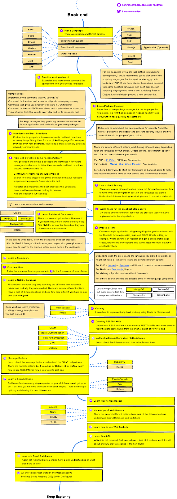
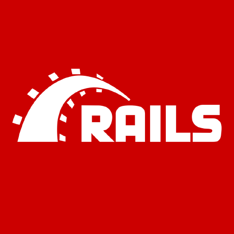

## The 2024 Frontend and Backend Developer RoadMap [UPDATED]

Hello Guys, if one of your goals is to learn to code or to become a Web Developer in 2024, then I have something significant to share with you, the Complete 2024 Web Developer RoadMap. This is an excellent illustration of how to become a web developer in 2024 and guide you on how you can learn and master Web Development in 2024. It's a collection of different paths to learning front-end, back-end, and all other things a Web developer should know.  You will not just know about web development but about essential programming stuff which is necessary for all kinds of programmers.
PlayUnmute
Fullscreen

This Roadmap is also divided into 3 sections, the first section is about essential skills which every web developer should know, while the second and third section is about front-end and back-end development, two main areas of web development.

You can either learn Front-end or Back-end or both, depending upon your choice. If you want to become a FullStack Web developer, then you have to learn both front-end and back-end; there is no escaping there.

In Frontend also you can choose to learn the framework you want like React, Angular, or Vue.js; you don't need to learn them all but learn the one you like. If you ask for my recommendation, Vue.js is a better choice in 2024 than the other two, but again those are more used than Vue.js yet.

Btw, you might have seen this RoadMap before. This excellent visual guide to becoming a web developer was created by Kamranahmedse and posted on his GitHub repository here. It's one of my favorite places, and I have bookmarked it for a repeated visit.

Last year, while doing some internet surfing, I stumble upon this excellent page. I first found the DevOps RoadMap there and become an instant fan of Kamranahmedse. In fact, I have these RoadMap printed and stuck to my Desk for regular reference.

Btw, the Roadmap tells you what to learn but doesn't tell you how to learn and where you can learn those skills. I have tried to supplement that part by providing links to some useful courses and books you can take to learn the technologies, programming languages, frameworks, and libraries required to become a web developer and mentioned in this RoadMap.

## How to Become a Web Developer in 2024
Anyway, Here’s where you'll start. As I have said before, you can choose either the Front-end or Backend path below, depending upon your interest. Regardless, there are eight recommendations in yellow that you must learn for either path, these are the everyday things every programmer should know.

## The 2021  Web Developer RoadMap

## Recommended learning for either path
Here are some of the core technologies and tools you need to learn for both the frontend and backend developer path.
### 1. Git
One of the most popular version control system. It's just not possible to live without Git anymore. You can check out The Git Complete Guide on Udemy to start with.

### 2. SSH
It allows you to remove login to another host, another popular networking concept which every web developer should know. You can also join these free command-line courses to learn more about SSH and SCP commands,.

### 3. HTTP / HTTPS
The HTTP protocol is the backbone of the web, and a good knowledge of both HTTP and HTTPS is mandatory for a web developer

### 4. Basic Terminal Usage Linux Command line Basics
Not just a web developer but for any programmer, the Linux command line is very, very important, and I strongly recommend you to spend some time learning them. You can use these Free Linux courses to start learning Linux.

### 5. Data Structures and Algorithms
These are the building blocks of any program, and better knowledge of Algorithms and Data Structure is vital for your next job or doing well on your current job. If you are interested in learning algorithms and data structure, you can use this list of free algorithms courses to start with.

### 7. Character Encodings
If you are creating global applications that show information in many different languages across the world, then you should have a good knowledge of character encodings. It basically tells your browser how to show your data.

### 8. GitHub
There is no doubt that every programmer should know Git and Github as they are the standard in terms of version control and code repository. If you want to learn and master Git and Github, you can check these free Git courses.

## The 2024 Frontend Developer RoadMap
If you want to become a front-end developer in 2024, then you should follow the below Front-end Developer RoadMap. You should focus on yellow boxes that highlight important things to learn and follow from there. Below the RoadMap, you will find additional resources like books and courses to aid your learning.

The 2021 Frontend Developer RoadMap

### 1. Web Development Basics
It's pretty apparent that if you want to become a Web Developer, then you should know the basics of the internet, web applications, protocols like HTTP, and web development in general. Thankfully there are a lot of courses where you can not only learn these but much more than that.

I recommend the following resources for all programmers who want to learn Web Development:
The Web Developer BootCamp by Colt Steel
The 2024 Complete Web Developer Bootcamp by Angela Yu
The Advanced Web Developer Bootcamp

### 2. HTML and CSS
HTML and CSS are the backbones of any website. HTML provides the structure while CSS provides the style and helps them to look better and more visually appealing. If you want to become a serious front-end developer, then you must master these two, and to start with, you can check these free HTML and CSS courses to learn online.

### 3. JavaScript
Just like the four pillars of object-oriented programming, I mean Abstraction, Encapsulation, Polymorphism, and Inheritance, there are three main pillars of web development, namely - HTML, CSS, and JavaScript.

The first two provide structure and style, but it's the JavaScript that makes them alive by adding interactiveness. A modern Java developer must learn JavaScript, and thankfully there are many courses which you can look to learn both beginner and advanced JavaScript, here are some recommendations:
The Complete JavaScript Course 2024
A Beginner's Guide to Advanced JavaScript and ES6

### 4. TypeScript
Just like we have C and C++, TypeScript can be considered as JavaScript++ though it's not as popular as C++. The good part of TypeScript is that it adds type-safety in JavaScript code, which means you can catch nasty JavaScript type-related errors in the development phase.

It also makes developing object-oriented code easy for JavaScript. If you want to learn TypeScript, here is a list of some free TypeScript courses to start with.

### 5. Angular
Gone are the days when people build websites using plain HTML, CSS, and JavaScript. Nowadays, most of the work is done by a framework like Angular, React JS, or Vue.js.

They not only provide a structure for storing your code but also makes it easy to develop a web application in a quick time.

Angular is backed by Google, hence learning Angular is an excellent choice for any modern Web Developer. If you want to learn Angular, there is no better course than Max's Angular - The Complete Guide on Udemy.

### 7. React JS
Similar to Angular, React is also a popular library for developing web applications. It allows you to write reusable components that you can then use to create modern-looking interactive web pages. Like Angular is backed by Google, React is backed by Facebook and hence quite popular.

If you want to learn, React then you either join Stephen Grider's Modern React with Redux or Max's React - The Complete Guide on Udemy. Both are excellent courses to learn to React online.

Here are the links:
Modern React with Redux
React - The Complete Guide

### 8. Vue.js
The Vue or Vue JS had really picked up speed last year, and more and more people are recommending and using Vue.js. I am still a beginner on Vue and probably take some time to learn and migrate into Vue based applications. But, if you have already made a decision, you can start with the Vue.js Essentials course on Udemy.

## The 2024 Backend Developer RoadMap
If you want to become a back-end developer in 2024, then you can follow this Back-end Developer RoadMap. Again, you can start with yellow boxes that highlight vital technologies you need to learn and then grow from there. After this RoadMap, you will find some supplementary material and links to courses and books to aid your learning.

The 2021 Backend Developer RoadMap

### 1. Node.js
There are many choices to develop your web application's backend like you can use Java and Spring or maybe Python + Django, but in recent years Node.js has come up as the preferred option. The best thing about Node is that it allows you to develop a complete web application using just one programming language - JavaScript. 

If you want to go the Node route, then The Complete Node.js Developer course by Rob Percival and Andrew Mead is best to start with.

### 2. Java
I am primarily a Java developer who has learned Web Development and other programming languages, hence when it comes to developing backend, my preferred choice is Java. You can either use Core Java or Java + Spring Boot to write a cutting-edge, high-performance backend. If you want to go to Java and Spring route, here are a couple of courses you can join to get up-to-speed.
The Complete Java Masterclass
Spring Framework 5: Beginner to Guru

### 3. Python
Python is another impressive language, full of robust frameworks and libraries. If you want to develop the backend using Python, then you can use Django, a full-stack web development framework for Python programmers. To start with, here are a couple of courses to learn Python and Django:
The Complete Python Bootcamp
Python and Django Full Stack Web Developer Bootcamp

### 4. Ruby
Ruby is another powerful language perfect for web development. It has got a great framework called Rails, which makes creating Web applications really easy and fast. If you want to start with Ruby, you can check out these free Ruby and Rails courses.

best Ruby and Rails courses

### 5. PHP and MySQL
Forget about whatever negative things people say about PHP. It is still the easiest way to write server-side code, and many, almost 50% of the internet runs on PHP and MySQL stacks. If you are interested in learning PHP, you can check out my list of free PHP and MySQL courses to start with.

### 6. ASP .NET
Not many people will tell you but ASP .NET is a popular technology after Java for building backend and server side application. It's supported by Microsoft and there are many job openings for people who are expert in ASP .NET and building web application using this framework.  

If you are interested in learning ASP .NET for building web application and need resources, then you can also check out these best ASP .NET online courses to start with. 

